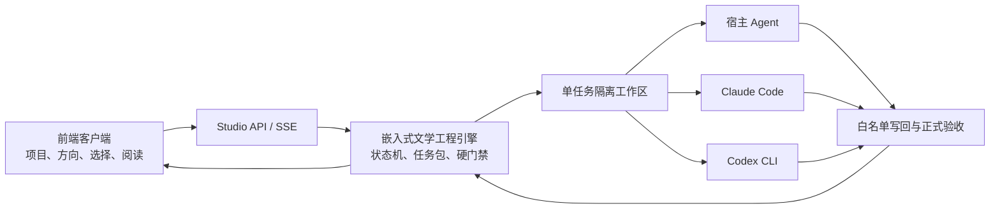

# 文学工程 Agent Studio

> 把 AI 关进可检查、可恢复、不可跳步的长篇创作流水线。

文学工程 Agent Studio 是一套独立运行的长篇小说、剧本与伪记录作品开发平台。它把人物、世界观、情节、场景、文风、字数预算、审查证据和最终正文当作同一个工程项目持续维护，并让 Agent 只能通过正式任务包推进作品。

普通 AI 写作工具擅长“写一段”，却容易在几十章后遗忘人物、压缩篇幅、跳过推演与审查。Studio 解决的正是这个断层：**文学工程引擎决定流程和门禁，已登录的宿主 Agent、Claude Code 或 Codex CLI 提供创作智能，前端负责完整的项目管理与人机协作。**

当前版本为 **v0.2.0 独立工程版**。引擎、任务协议、项目模板、Prompt 资产、审查、Canon、状态演化与导出能力均已嵌入本仓库，运行时不依赖另一个 Skill 或源码仓库。

## 界面预览

### 项目中心与创作总控

用户从作品名称、目标字数与创作方向开始，不需要理解目录和 JSON。系统会建立完整项目，并把流程门禁、正文进度和下一步翻译成可行动的中文。


### Agent 工作台

当前任务、允许读取的资料、预期产物、运行时、执行过程和验收结果会被集中展示。遇到分支、文风、Canon 写回或发布节点时，系统暂停并等待用户选择。


## 核心能力

- **独立项目管理**：在前端创建、打开和切换作品，项目、Agent、档案、文风与导出始终绑定同一作品。
- **CLI 持续状态机**：正式工作遵循 `task-next -> task-open -> task-submit -> task-complete -> route-audit`，Agent 不能把手写文件伪装成完成。
- **受控 Agent Worker**：每项任务进入独立工作区，只提供任务允许读取的资料，只接收声明过的预期产物。
- **双类智能运行时**：支持当前宿主 Agent，以及本机已登录的 Claude Code / Codex CLI；Studio 不保存模型 API Key，也不直接调用模型供应商接口。
- **长篇工程内核**：覆盖字数预算、场景推演、分支选择、正文生成、AgentReview、Style Lint、修订、晋升、人物状态、Canon 候选、节奏衔接和导出门禁。
- **作品档案**：正文、人物、世界观、场景、分支、文风、审查、预算与写回候选经过前端包装后展示，保留信息而不暴露原始 JSON 噪声。
- **人类决策面板**：把分支选择、文风挂载、Canon 审批、修订方向、扩纲方向和发布审批呈现为明确的选择卡。
- **实时观察**：项目总控、作品档案和 Worker 状态优先通过 SSE 更新，连接不可用时自动降级为轮询。
- **完整作品交付**：可汇编正式正文并导出 DOCX，同时过滤场景编号、工作流痕迹、Canon 注释和审查标记。

## 工作方式



Studio 自带规则和流程，但不内置另一条 LLM API 路线。模型能力来自用户已经登录并授权的 Agent 平台；项目只负责给它当前任务、必要上下文和可写边界。

## 快速开始

### 1. 安装

需要 Python 3.10 或更高版本。

```powershell
git clone https://github.com/o-1717986918/literary-engineering-studio.git
cd literary-engineering-studio
python -m pip install -e ".[api,test]"
python -m literary_engineering_studio config-init
python -m literary_engineering_studio doctor
```

`doctor` 会检查嵌入引擎和本机 Agent CLI。Studio 配置拒绝模型密钥和模型 Provider 字段。

### 2. 启动客户端

```powershell
python -m literary_engineering_studio serve --port 8791
```

打开 `http://127.0.0.1:8791/`：

1. 在“项目中心”创建新作品，或打开包含 `project.yaml` 的已有项目。
2. 在“创作总控”持续补充创作方向。
3. 在“Agent 工作台”选择正式路线与 Agent 运行时并执行下一步。
4. 在“作品档案”阅读正文、检查人物与世界观、查看分支和审查证据。
5. 在人工决策卡出现时做方向性选择，CLI 会把选择落实到正式流程。

### 3. 可选命令行操作

前端是主要客户端，`les` 命令只用于安装诊断、自动化或故障恢复。若系统未把 Python Scripts 目录加入 `PATH`，使用下面的模块形式即可：

```powershell
python -m literary_engineering_studio project-list
python -m literary_engineering_studio task-prepare C:\path\to\work-project --route scene-development --runtime host-agent
python -m literary_engineering_studio agent-worker-once C:\path\to\work-project --route scene-development --runtime claude-code
```

嵌入引擎的低级命令不是用户操作面。正式任务应由前端或 Studio Worker 领取和执行。

## Agent 运行时

| 运行时 | 状态 | 使用方式 |
| --- | --- | --- |
| 当前宿主 Agent | 可用 | Studio 准备任务包，由正在监督项目的 Codex、Claude 等平台 Agent 执行 |
| Claude Code CLI | 已接入 | 复用本机登录状态，在隔离工作区内执行当前任务 |
| Codex CLI | 已接入 | 使用临时会话与 `workspace-write` 权限执行当前任务 |
| ACP / OpenHands | 规划中 | 后续作为协议化运行时适配，不改变文学工程内核 |

## 安全边界

- 服务默认只监听 `127.0.0.1`，不应直接暴露到公网。
- Studio 不读取、保存或转发 Claude、Codex 的账号凭据。
- Studio 配置不接受模型 API Key；嵌入引擎桥拒绝本地 provider、director-chat 和旧 API 服务命令。
- Agent 只能在单任务隔离目录内工作，越出 `expected_outputs` 的修改会被拒绝。
- 覆盖既有产物前会保留备份；运行时回复文本不能直接成为正式作品。
- Canon 应用、关键写回和发布节点必须等待人工审批。
- 正文必须由当前主 Agent 完成，子 Agent 仅能承担检索、统计、格式检查等机械任务。

## 当前成熟度

已经适合本地创建和管理文学项目、观察正式任务、运行单项 Agent 工作、阅读项目档案，并验证完整门禁链路。当前仍不建议无人值守并发生成数十万字作品，也不建议在缺少人工抽检时直接发布成稿。

下一阶段重点是持久化任务队列、任务锁、停止/重试/恢复、运行时工具事件流、写回前差异预览，以及大规模端到端创作回归测试。

## 开发验证

```powershell
python -m unittest discover -s tests -v
python -m compileall -q src
node --check src/literary_engineering_studio/frontend/app.js
python -m literary_engineering_studio_engine prompt-registry-validate --json
```

进一步阅读：

- [嵌入引擎审查](docs/architecture/current-core-review.md)
- [独立 Studio 架构](docs/architecture/new-studio-architecture.md)
- [后续实施路线](docs/roadmap/implementation-route.md)

原有 Skill 项目仍可独立供 Codex、Claude 等工具层平台安装，但它不是 Studio 的运行依赖。两个项目可以分别安装、分别演进。
