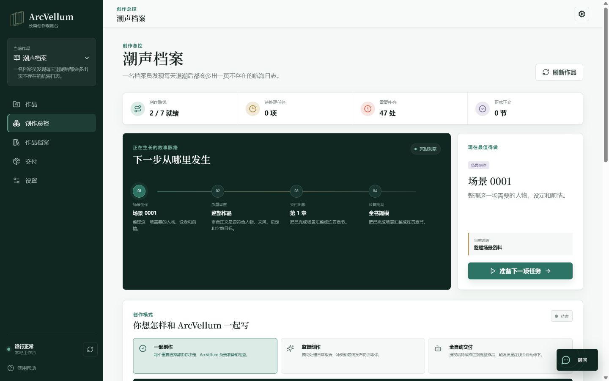
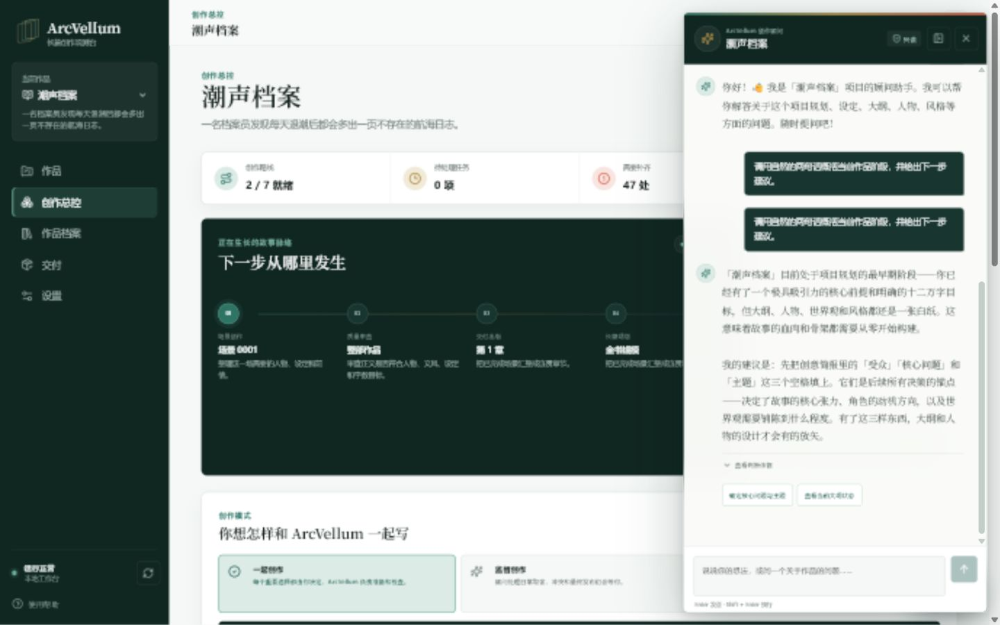
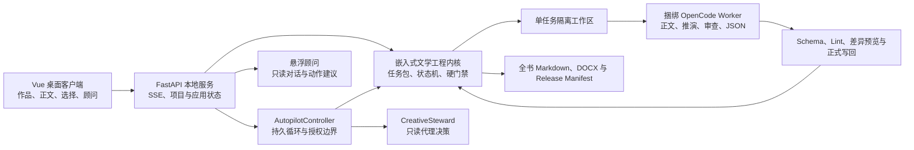

# ArcVellum

> 把长篇文学创作从“一次生成”变成可持续维护、可审查、可恢复的完整工程。

ArcVellum 是面向小说、剧本与伪记录作品的本地桌面创作平台。它把人物、世界观、情节、场景、文风、字数预算、审查证据和正式正文放进同一条受控生产线，并把 Agent 限制在一次一个任务、只读指定资料、只写声明产物的工作区内。

普通 AI 写作工具容易在几十章后遗忘人物、压缩篇幅、跳过推演，或让“审查”变成自己给自己通过。ArcVellum 的核心做法更直接：**文学工程内核签发任务并执行硬门禁，Agent 负责创作判断，Studio 负责调度、隔离、恢复、用户选择和最终交付。**

当前版本：**v0.5.0 自主创作 Beta**。



## 它解决什么

- **长篇不会被压成短篇摘要**：目标字数先映射到卷、章、场景与剧情库存，正文生成和审查都读取场景预算。
- **场景不是孤岛**：角色推演、分支比较、叙事节奏、前后场衔接、读者问题与 Promise/Payoff 进入正式链路。
- **设定不会靠模型记忆硬撑**：Canon、人物背景、状态变化和新角色候选分文件维护，写回必须留下证据。
- **文风不是最后打分项**：500–2500 个中文内容字符的可挂载文风 Prompt 在生成前进入最高优先级约束，并在审查时复核。
- **Review 不能被跳过**：Style Lint、AgentReview、修订、晋升和导出都有 exact-candidate 门禁；调试绕过指令不进入正式模式。
- **正文不会混入工程痕迹**：最终 Markdown 与 DOCX 只汇总正式正文，过滤 Scene ID、Agent 任务、Canon 注释、状态补丁和审查记录。

## 产品体验

### 一眼看见作品正在发生什么

作品总览把当前阶段、正在执行的工作、等待决定的节点、正文进度和故事脉络放在同一屏。界面使用创作者语言；任务 ID、Schema、沙箱路径和原始事件只在高级诊断中出现。

### 随时讨论，不让顾问偷偷改文件

全局悬浮顾问可以自然讨论人物、结构、文风和下一步，保留会话摘要与用户固定偏好。它基于只读项目快照回答，证据可展开追溯；建议操作必须经过白名单 API，顾问本身没有项目写权限、Shell 或子 Agent 权限。



### 从协作创作到受控全自动

ArcVellum 提供三种推进方式：

| 模式 | 谁做决定 | 适合场景 |
| --- | --- | --- |
| 协作创作 | 关键选择都由用户确认 | 初期构思、重要章节、作者强控制 |
| 监督自动 | CreativeSteward 处理已授权的常规选择 | 批量场景开发与审查 |
| 全自动交付 | 在明确预算和边界内持续推进 | 已稳定的项目与可复验工作流 |

AutopilotController 只是确定性调度器，不写文学内容；CreativeSteward 是独立只读决策 Agent，不冒充用户；正式正文仍由主 Worker Agent 完成。费用、运行时间、任务数、连续修订和重复失败达到上限时，系统暂停而不是绕门禁。

## 架构



Studio 内嵌文学工程内核，不依赖另一个 Skill 仓库。OpenCode Runner 随安装包交付；Claude Code 与宿主 Agent 适配器保留为高级兼容方式，但普通用户无需另装 Agent 平台。

## 快速开始

### 普通用户

1. 从 [GitHub Releases](https://github.com/o-1717986918/literary-engineering-studio/releases) 下载 ArcVellum Windows x64 安装程序。
2. 启动后用系统文件夹窗口创建或打开作品。
3. 在“设置 > 连接与模型”连接模型服务并选择默认模型。
4. 在作品总览写下创作方向，选择协作或自动模式。
5. 在“正文”阅读正式内容，在“交付”下载完整 Markdown 或 DOCX。

安装包包含本地服务、文学工程内核与 OpenCode Runner，不要求预装 Python、Node.js、Rust、OpenCode 或浏览器。模型推理仍需要网络与用户选择的有效模型来源；密钥交给 OpenCode 本地认证存储，不进入作品、任务包、普通日志或 Studio 配置。

### 开发者

```powershell
git clone https://github.com/o-1717986918/literary-engineering-studio.git
cd literary-engineering-studio
python -m pip install -e ".[api,test]"
npm ci
python -m literary_engineering_studio serve --port 8791
```

浏览器开发模式访问 `http://127.0.0.1:8791/`。Vue 热更新开发可另开终端运行：

```powershell
npm run client:dev
```

## 开发验证

```powershell
python -m unittest discover -s tests -v
python -m compileall -q src
python -m literary_engineering_studio_engine prompt-registry-validate --json
python -m literary_engineering_studio prompt-eval
npm run client:test
npm run client:build
cd desktop/src-tauri
cargo check --locked
```

完整 Windows 候选构建：

```powershell
powershell -NoProfile -ExecutionPolicy Bypass -File packaging/build_desktop.ps1 -SkipPythonInstall -SkipNodeInstall
```

签名发布说明见 [RELEASING.md](docs/releases/RELEASING.md)。

## 安全边界

- 本地服务默认只监听 `127.0.0.1`，桌面会话使用一次性引导令牌交换 HttpOnly Cookie。
- Agent 只在任务沙箱中运行，越出 `expected_outputs` 的文件不会写回项目。
- 顾问与 CreativeSteward 都使用只读快照，并在调用前后校验项目哈希。
- 用户选择、代理决定、审批、写回、失败、费用和发布身份均持久化审计。
- 正式模式不调用 `unreview`、debug waiver 或任何 `allow-unapproved` 类绕过开关。
- 数据库迁移前自动备份；诊断报告过滤凭证、正文全文和完整项目路径。

## 项目状态

v0.5.0 已具备安装、项目管理、模型连接、受控 Agent Worker、Vue 客户端、悬浮顾问、持久 Autopilot、代理决策、正文阅读和全书交付能力。它仍是 Beta：进入 v1.0 前还会继续积累多类型三章以上真实样例、长时间恢复测试、Windows 10/11 干净虚拟机安装与签名更新验证。

进一步阅读：

- [v0.5.0 产品与自主创作计划](docs/roadmap/arcvellum-v0.4-v0.5-product-experience-and-autonomy-plan.md)
- [当前内核审查](docs/architecture/current-core-review.md)
- [独立 Studio 架构](docs/architecture/new-studio-architecture.md)
- [v0.5.0 发行说明](docs/releases/v0.5.0.md)

License: MIT
