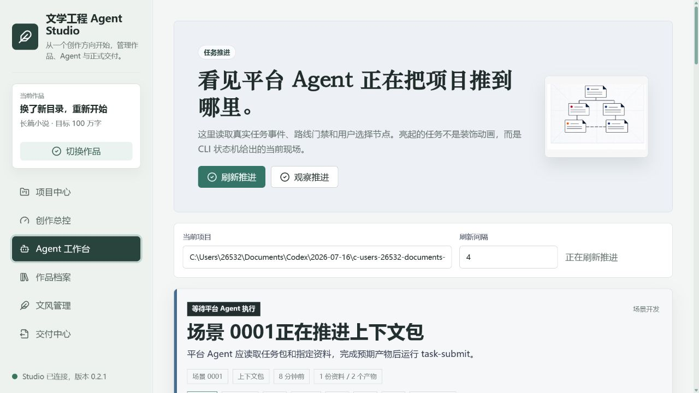
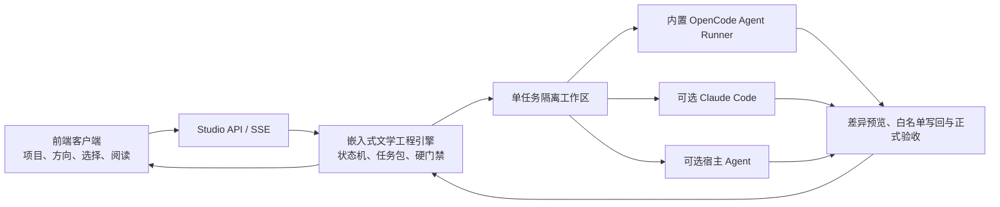

# 文学工程 Agent Studio

> 把 AI 关进可检查、可恢复、不可跳步的长篇创作流水线。

文学工程 Agent Studio 是一套独立运行的长篇小说、剧本与伪记录作品开发平台。它把人物、世界观、情节、场景、文风、字数预算、审查证据和最终正文当作同一个工程项目持续维护，并让 Agent 只能通过正式任务包推进作品。

普通 AI 写作工具擅长“写一段”，却容易在几十章后遗忘人物、压缩篇幅、跳过推演与审查。Studio 解决的正是这个断层：**文学工程引擎决定流程和门禁，内置 OpenCode Agent Runner 提供智能执行能力，前端负责完整的项目管理与人机协作。** Claude Code 与宿主 Agent 仍可作为兼容运行时，但不再是普通用户的必需环境。

当前版本为 **v0.3.0 桌面工程版**。引擎、任务协议、项目模板、Prompt 资产、审查、Canon、状态演化、导出能力与 OpenCode 1.18.3 均可随 Windows 安装包交付，运行时不依赖原 Skill、Python、Node.js、浏览器窗口或另一个 Agent 平台。

## 界面预览

### 项目中心与创作总控

用户从作品名称、目标字数与创作方向开始，不需要理解目录和 JSON。系统会建立完整项目，并把流程门禁、正文进度和下一步翻译成可行动的中文。


### Agent 工作台

当前任务、允许读取的资料、预期产物、运行时、执行过程和验收结果会被集中展示。遇到分支、文风、Canon 写回或发布节点时，系统暂停并等待用户选择。



## 核心能力

- **独立项目管理**：在前端创建、打开和切换作品，项目、Agent、档案、文风与导出始终绑定同一作品。
- **CLI 持续状态机**：正式工作遵循 `task-next -> task-open -> task-submit -> task-complete -> route-audit`，Agent 不能把手写文件伪装成完成。
- **受控 Agent Worker**：每项任务进入独立工作区，只提供任务允许读取的资料，只接收声明过的预期产物；确定性 CLI 任务只由内核执行，创作与审查任务才交给 Agent；高影响写回先展示逐文件差异，批准后才进入正式项目。
- **内置智能运行时**：固定版本 OpenCode 随桌面产品交付，支持前端选择 Provider、模型和一次性提交凭证；密钥交给 OpenCode Auth 管理，不进入作品、任务包、事件或普通 Studio 配置。
- **可恢复任务系统**：SQLite WAL、租约、项目路线锁、幂等键、停止、重试、运行时切换、SSE 游标续传和应用重启恢复共同维护长任务。
- **长篇工程内核**：覆盖字数预算、场景推演、分支选择、正文生成、AgentReview、Style Lint、修订、晋升、人物状态、Canon 候选、节奏衔接和导出门禁。
- **作品档案**：正文、人物、世界观、场景、分支、文风、审查、预算与写回候选经过前端包装后展示，保留信息而不暴露原始 JSON 噪声。
- **人类决策面板**：把分支选择、文风挂载、Canon 审批、修订方向、扩纲方向和发布审批呈现为明确的选择卡。
- **实时观察**：项目总控、作品档案和 Worker 状态优先通过 SSE 更新，连接不可用时自动降级为轮询。
- **只读项目顾问**：基于不可变项目快照回答人物、世界观、场景、审查和预算问题，区分事实、推断与未知，并给出文件证据；技术权限上禁止编辑、Shell、子 Agent 和外部目录。
- **完整作品交付**：可汇编正式正文并导出 DOCX，同时过滤场景编号、工作流痕迹、Canon 注释和审查标记。
- **交付中心**：在前端查看导出路线门禁、正式文件历史并下载 DOCX、PDF、HTML、Markdown 或发布包。

## 工作方式



Studio 内置的是 Agent Runner，不是某一家模型服务。用户可以使用 OpenCode 提供的起步模型，也可以在“连接与模型”中接入受支持的 Provider。文学引擎本身不直接调用模型 API，所有智能调用都经过受控 Runner、任务沙箱和写回门禁。

## 快速开始

### 1. 普通用户安装

运行 Release 中的 `文学工程 Agent Studio_0.3.0_x64-setup.exe`。安装包已经包含应用服务、文学工程内核和 OpenCode，不要求预装 Python、Node.js 或 OpenCode。首次启动后，在“连接与模型”选择可用模型并执行真实连接测试。

当前构建尚未进行商业代码签名，Windows 可能显示来源确认；正式分发前应接入签名证书。

### 2. 开发者启动

需要 Python 3.10 或更高版本。

```powershell
git clone https://github.com/o-1717986918/literary-engineering-studio.git
cd literary-engineering-studio
python -m pip install -e ".[api,test]"
python -m literary_engineering_studio doctor
```

`doctor` 会检查嵌入引擎、Agent Runners 与 Model Connections。普通 Studio 配置拒绝模型密钥；前端提交的凭证由 OpenCode 自身的认证存储管理。

### 3. 启动浏览器开发模式

```powershell
python -m literary_engineering_studio serve --port 8791
```

打开 `http://127.0.0.1:8791/`：

1. 在“项目中心”创建新作品，或打开包含 `project.yaml` 的已有项目。
2. 在“创作总控”持续补充创作方向。
3. 在“Agent 工作台”选择正式路线与 Agent 运行时并执行下一步。
4. 在“作品档案”阅读正文、检查人物与世界观、查看分支和审查证据。
5. 在人工决策卡出现时做方向性选择，CLI 会把选择落实到正式流程。

### 4. 可选命令行操作

前端是主要客户端，`les` 命令只用于安装诊断、自动化或故障恢复。若系统未把 Python Scripts 目录加入 `PATH`，使用下面的模块形式即可：

```powershell
python -m literary_engineering_studio project-list
python -m literary_engineering_studio task-prepare C:\path\to\work-project --route scene-development --runtime host-agent
python -m literary_engineering_studio agent-worker-once C:\path\to\work-project --route scene-development --runtime claude-code
```

嵌入引擎的低级命令不是用户操作面。正式任务应由前端或 Studio Worker 领取和执行。

## Agent 运行时

| 运行时 | 状态 | 使用方式 |
| --- | --- | --- |
| 内置 OpenCode | 默认可用 | 随桌面安装包交付，在隔离工作区执行任务；模型与 Provider 在前端管理 |
| Claude Code CLI | 可选兼容 | 复用本机登录状态，需显式选择模型并通过真实探测 |
| 当前宿主 Agent | 高级互操作 | Studio 输出受控任务包，由正在监督项目的 Codex、Claude 等平台 Agent 执行 |
| Codex CLI | 实验兼容 | 保留适配器，不作为 v0.3 普通用户主路线 |

## 安全边界

- 服务默认只监听 `127.0.0.1`，不应直接暴露到公网。
- 桌面服务每次启动使用随机端口和随机引导令牌，交换为 HttpOnly、SameSite 本机会话；未授权的本地请求返回 401。
- Studio 普通配置不接受模型 API Key；Provider 凭证仅一次性提交给 OpenCode Auth，嵌入引擎桥仍拒绝 direct-provider、director-chat 和旧 API 服务命令。
- Agent 只能在单任务隔离目录内工作，越出 `expected_outputs` 的修改会被拒绝。
- 覆盖既有产物前会保留备份；运行时回复文本不能直接成为正式作品。
- Canon 应用、关键写回和发布节点必须等待人工审批。
- 正文必须由当前主 Agent 完成，子 Agent 仅能承担检索、统计、格式检查等机械任务。

## 当前成熟度

v0.3 已形成可安装的单机桌面产品：可以创建和管理项目、连接或断开模型、执行正式 Agent 任务、停止与重试、预览写回、回答只读项目问题、阅读正文并导出作品。53 项 Studio 测试、25 项 Prompt Registry 资产、17 个高风险 Prompt 用例、Rust 检查与冻结态 OpenCode 真实推理均已通过；真实长篇规划样例也已完成“确定性预算 -> OpenCode 扩纲 -> 写回预览 -> 正式门禁验收”的闭环。

仍保留两项务实边界：云模型需要网络与有效的模型来源；数十万字无人值守批量创作仍应设置阶段性人工抽检。Windows 安装包目前未签名，发布渠道应补代码签名和干净虚拟机安装测试。

## 开发验证

```powershell
python -m unittest discover -s tests -v
python -m compileall -q src
node --check src/literary_engineering_studio/frontend/app.js
python -m literary_engineering_studio_engine prompt-registry-validate --json
python -m literary_engineering_studio prompt-eval
powershell -NoProfile -ExecutionPolicy Bypass -File packaging/build_desktop.ps1
```

进一步阅读：

- [嵌入引擎审查](docs/architecture/current-core-review.md)
- [独立 Studio 架构](docs/architecture/new-studio-architecture.md)
- [后续实施路线](docs/roadmap/implementation-route.md)
- [v0.3.0 交付说明](docs/releases/v0.3.0.md)

原有 Skill 项目仍可独立供 Codex、Claude 等工具层平台安装，但它不是 Studio 的运行依赖。两个项目可以分别安装、分别演进。
