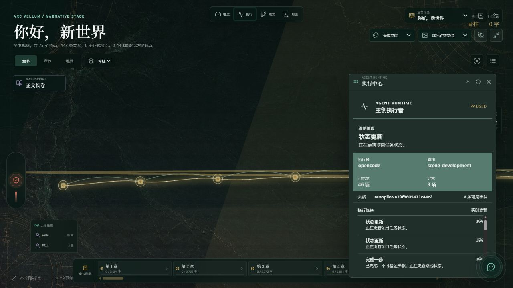
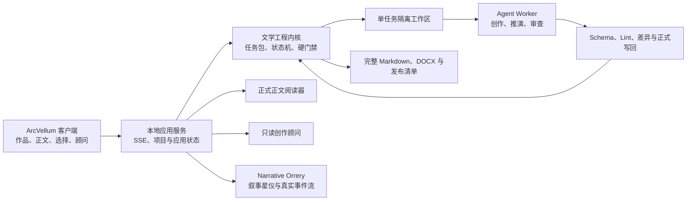

# ArcVellum

> 让百万字长篇像软件工程一样可维护，也像一本真正的书一样可阅读。

ArcVellum 是面向小说、剧本与伪记录作品的本地 Agent 创作平台。它把人物、世界观、情节、场景、文风、字数预算、审查证据和正式正文放进一条可恢复、可追溯的生产线；Agent 负责创作判断，文学工程内核负责签发任务、验证产物和阻止跳步。

当前版本：**v0.9.4 Bounded Pseudo-3D View Update**。


## 为什么需要它

普通 AI 写作工具擅长写一段，却很难维护几十万字：人物会漂移、篇幅会坍缩、分支推演会被省略，审查也容易变成模型给自己放行。ArcVellum 不靠一条更长的 Prompt 解决这些问题，而是把创作拆成可验证的正式任务：

- **长篇规模有预算**：目标字数映射到卷、章、场景和剧情库存，生成与审查共同读取场景目标。
- **正文生成有前置推演**：角色扮演、分支比较、节奏、衔接、读者问题和 Promise/Payoff 进入正式链路。
- **设定演化有证据**：Canon、人物背景、状态变化和新角色候选独立维护，写回必须通过门禁。
- **文风约束进入生成层**：可挂载文风 Prompt 在正文生成前生效，并由确定性 Style Lint 与 AgentReview 复核。
- **Review 不能被跳过**：候选稿、审查、受限修订、晋升和导出使用同一份内容指纹。
- **最终作品保持干净**：Markdown 与 DOCX 过滤任务标记、Scene ID、Canon 注释、状态补丁和审查记录。

## v0.9 新体验

### 叙事星仪进入可工作的空间场域

Narrative Orrery 现在是一块可平移、缩放和聚焦的 2.5D 叙事场域：真实作品资料被编排为章节长卷、人物轨迹、候选分支、审查债务、Canon 锚点和当前任务。场景形成、分支出现、正文增长与设定写回会触发有语义的生长、分叉、锚定与潮汐，而不是装饰性特效。它保留阅读顺序作为单向主脉络，并用正式 `timeline_order` 拉开故事时间跨度；闪回和时间重叠会被压缩而不会让长卷倒退。大型作品在全书视图按章节聚合，场景细节按需展开，并保留键盘列表和 WebGL 降级模式。

星仪提供工作台与全视口沉浸两种模式。沉浸模式不是功能缩水的屏保：项目生命体征、当前任务、自动推进、人工决策、创作规则与叙事节奏、正式正文和路线健康度都保留在四侧原生仪表中。仪器窗可以多开、折叠、拖动、调整尺寸、置顶和复位，并使用紧凑的深矿物玻璃与独立滚动区。苔夜星仪、靛紫航图、黑曜黄铜、书柜暖调和冷峻现代五套主题拥有独立环境、互补语义色与半透明材质；用户还可切换场景动效、伪 3D 纵深和渲染质量。所有节点和动效仍来自项目真实状态，背景不承载虚假数据。

### 创作规则由用户掌握

Creative Quality Profile 把标点、破折号、逗号链、碎句、显性转折、比喻依赖和项目禁用表达包装成普通用户能理解的规则页。每条规则可设为关闭、提醒或阻断，也可登记有理由的场景范围例外。Compose、Generate、Review、Revise、Promote 与 Release 使用同一份版本摘要，修改规则不会悄悄改判旧稿。

### 一本会随创作生长的书

正式正文阅读器按作品顺序自动拼接已晋升内容，支持分章或连续阅读、目录、全文搜索、书签、阅读位置恢复、字号、行距、日夜主题和全屏。正文按需加载，50 万字作品不会被摘要截断；创作继续推进时，新正文会温和提示，不会把读者从当前位置拽走。


### 一位有边界的创作顾问

悬浮顾问支持五种内置人格和自定义人格。它既能自然讨论人物、结构、节奏与下一步，也能作为受控的自然语言项目控制台：理解“继续创作”“暂停”“恢复”“记录这条方向”“准备下一项任务”或“打开正文”等明确意图，并生成可确认的白名单动作。顾问只读取项目投影，不拥有文件、Shell 或正式写回权限；全自动授权、发布和 Canon 正式写回仍必须经过专门确认与工程门禁。

顾问会话在应用生命周期内复用独立的只读 Agent 服务，回答支持安全 Markdown；正文 Worker 与自动审批则使用各自隔离的服务和模型槽，互不共享权限或上下文。



### 帮助、详情和责任边界不再藏在开发文档里

侧栏可直接进入使用帮助与作品/应用详情；协议页说明本地数据、第三方模型、OpenCode Runner、素材权利和公开发布责任。启动异常可以重新检查或导出过滤凭证与正文的诊断报告。

### 安装后即可开始

- Windows 默认作品库为 `Documents/ArcVellum/Works`，也可在设置中更改。
- 桌面启动使用单文档过渡，后台进程在 Windows 下隐藏运行。
- 模型目录只在进入“连接与模型”或主动刷新时加载。
- Provider 列表在固定高度内滚动，不再拉长整个设置页。
- 安装包包含本地服务、文学工程内核和 OpenCode Runner，不要求预装 Python、Node.js、Rust 或浏览器。

## 工作方式



ArcVellum 内嵌文学工程内核，不依赖另一个 Skill 仓库。OpenCode 随安装包交付；Claude Code 与宿主 Agent 适配器保留为高级兼容方式。模型推理仍需要网络以及用户选择的有效模型服务。

## 快速开始

### 普通用户

1. 从 [GitHub Releases](https://github.com/o-1717986918/arcvellum/releases) 下载 Windows x64 安装程序。
2. 启动 ArcVellum，在默认作品库新建作品，或打开现有工程目录。
3. 进入“设置 > 连接与模型”，连接模型并选择默认模型。
4. 在项目总控写下创作方向，选择协作、监督自动或全自动模式。
5. 在“正文”边推进边阅读，在“交付”导出完整 Markdown 或 DOCX。

密钥由本地 Agent Runner 的认证机制管理，不进入作品、任务包、普通日志或 Studio 配置。

### 开发者

```powershell
git clone https://github.com/o-1717986918/arcvellum.git
cd arcvellum
python -m pip install -e ".[api,test]"
npm ci
python -m literary_engineering_studio serve --port 8791
```

浏览器开发模式访问 `http://127.0.0.1:8791/`。Vue 热更新开发可运行：

```powershell
npm run client:dev
```

## 开发验证

```powershell
python -m unittest discover -s tests -v
python -m compileall -q src
python -m literary_engineering_studio_engine prompt-registry-validate --json
npm run client:test
npm run client:build
cd desktop/src-tauri
cargo check --locked
```

Windows 候选构建：

```powershell
powershell -NoProfile -ExecutionPolicy Bypass -File packaging/build_desktop.ps1 -SkipPythonInstall -SkipNodeInstall
```

## 安全边界

- 本地服务默认只监听 `127.0.0.1`，桌面通过启动令牌建立受认证会话。
- Agent 只在任务沙箱中运行，越出 `expected_outputs` 的文件不会写回项目。
- 顾问与 CreativeSteward 使用只读投影，并在调用前后校验项目哈希。
- 用户选择、代理决定、审批、写回、失败、费用和发布身份均持久化审计。
- 正式模式不调用 `unreview`、debug waiver 或 `allow-unapproved` 类绕过开关。
- 数据库迁移前自动备份；诊断报告过滤凭证、正文全文和完整项目路径。

## 项目状态

当前源码与 Windows 候选安装包为 **v0.9.4**。本轮重新冻结了本地 Python sidecar，并完成 NSIS 安装程序、updater 签名与更新清单构建；同时补上了伪 3D 叙事星仪的中键视角旋转、章节聚焦枢轴保持和一键复位能力。

这仍是 Beta：核心文学工程状态机、空间星仪、阅读器、Agent 执行观测和安装版链路已可用；进入 v1.0 前仍需积累更多题材的长期项目样本、无人值守恢复证据、Windows 10/11 干净虚拟机的首次安装/覆盖升级矩阵，以及商业代码签名验证。

进一步阅读：

- [v0.7.0 阅读、顾问与叙事观测计划](docs/roadmap/arcvellum-v0.5.1-v0.7-reader-advisor-observatory-plan.md)
- [v0.7.0 发行说明](docs/releases/v0.7.0.md)
- [v0.7.1-v0.8 创作控制与叙事星仪计划](docs/roadmap/arcvellum-v0.7.1-v0.8-creative-control-and-narrative-orrery-plan.md)
- [v0.7.1 安装版连接热修](docs/releases/v0.7.1.md)
- [v0.8.0 发行说明](docs/releases/v0.8.0.md)
- [v0.8 Agent Runtime 与沉浸星仪执行计划](docs/roadmap/arcvellum-v0.8-agent-runtime-and-immersive-orrery-execution-plan.md)
- [v0.9.0 发行说明](docs/releases/v0.9.0.md)
- [v0.9.1 发行说明](docs/releases/v0.9.1.md)
- [v0.9.4 发行说明](docs/releases/v0.9.4.md)
- [v0.9.3 发行说明](docs/releases/v0.9.3.md)
- [v0.9.2 发行说明](docs/releases/v0.9.2.md)
- [v0.9 空间星仪实施计划](docs/roadmap/arcvellum-v0.9-implementation-execution-plan.md)
- [当前内核审查](docs/architecture/current-core-review.md)
- [发布与签名说明](docs/releases/RELEASING.md)

License: MIT
