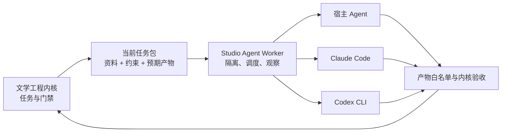

# 文学工程 Agent Studio

> 让 Agent 写长篇，不再依赖它“自觉记得流程”。

文学工程 Agent Studio 是一个面向长篇小说、剧本与伪记录作品的本地 Agent 执行工作台。它不重新发明写作模型，而是把已登录的宿主 Agent、Claude Code 或 Codex CLI 接入受控任务循环，让每一次推演、写作、审查、修订与写回都经过明确的状态和门禁。

它解决的是一个很具体的问题：AI 能写出一段看似不错的文字，却很容易在几十章后遗忘人物、压缩字数、跳过推演和审查，甚至直接手写流程文件假装完成。Studio 把 Agent 放进任务工作区，让它只能读取当前任务允许的资料、写入预期产物，再交给文学工程内核验收。

项目当前为 **工程化 MVP（v0.1.0）**：核心链路、隔离执行、前端观察和三类运行时适配已经可运行，适合本地试用与架构验证；长期无人值守运行、进程恢复和完整 Codex Windows 适配仍在继续建设。

## 界面预览

### 项目总控

把状态机、审查门禁、正文进度和下一步任务翻译成普通创作者能理解的中文，而不是直接铺开 JSON 和日志。


### Agent 执行中心

选择正式路线和 Agent 运行时，观察任务领取、隔离执行、产物提交与门禁验收过程。遇到 Canon 写回、发布等高风险节点时自动停下等待确认。


## 它如何工作

Studio 与 [Literary Engineering Project Skill](https://github.com/o-1717986918/literary-engineering-project-skill) 分工明确：

- **文学工程内核**负责任务顺序、提示词包、项目契约、字数预算、审查、Canon、状态演化、导出和正式门禁。
- **Studio** 负责领取任务、建立隔离工作区、调度 Agent、限制读写范围、提交产物并展示实时进度。
- **Agent 运行时**提供真正的语言理解、创作和判断能力，可以来自当前宿主平台、Claude Code 或 Codex CLI。



## 已实现能力

- 复用正式任务循环：`task-next -> task-open -> task-submit -> task-complete -> route-audit`。
- 校验 `agent-task/v1` 任务包，拒绝越出文学项目目录的路径。
- 为每个任务创建独立工作区，只放入必读资料、任务源文件和预期产物。
- 在写回正式项目之前拒绝任何超出 `expected_outputs` 的修改。
- 覆盖旧文件前保留备份，Agent 输出不能直接伪装成正式完成。
- 提供 `host-agent`、`claude-code` 和 `codex-cli` 三种运行时适配器。
- 复用原有项目总控、作品档案、正文阅读、活动流、人工选择和文风挂载能力。
- 通过 SSE 展示 Worker 任务状态和项目变化。
- 不保存模型 API Key，也不在 Studio 内维护另一套模型 Provider。

## 快速开始

### 1. 准备环境

- Python 3.10 或更高版本
- 本地克隆的文学工程内核仓库
- 至少一种可用 Agent：当前宿主 Agent、已登录的 Claude Code，或已登录的 Codex CLI

建议把两个仓库放在同一父目录下，Studio 会自动发现内核：

```powershell
git clone https://github.com/o-1717986918/literary-engineering-project-skill.git
git clone https://github.com/o-1717986918/literary-engineering-studio.git
cd literary-engineering-studio
```

如果内核位于其他目录，可以设置 `LEW_CORE_REPO` 指向它。

### 2. 安装并自检

```powershell
python -m pip install -e ".[api,test]"
les config-init
les doctor
```

`doctor` 会检查内核和本机 Agent CLI 是否可用。Studio 配置中不应出现模型密钥。

### 3. 启动前端

```powershell
les serve --port 8791
```

浏览器打开 `http://127.0.0.1:8791/`，在“当前项目”中填入一个文学工程作品目录。

### 4. 执行任务

在前端“Agent 执行”中选择正式路线与运行时，或者使用命令行：

```powershell
# 为当前宿主 Agent 准备隔离任务
les task-prepare C:\path\to\work-project --route scene-development --runtime host-agent

# 让本机已登录的 Claude Code 执行下一项正式任务
les agent-worker-once C:\path\to\work-project --route scene-development --runtime claude-code

# 使用 Codex CLI 执行一项正式任务
les task-run C:\path\to\work-project --route scene-development --runtime codex-cli
```

## 运行时支持

| 运行时 | 当前状态 | 说明 |
| --- | --- | --- |
| 当前宿主 Agent | 可用 | Studio 准备任务包，由当前 Codex、Claude 等工具层 Agent 执行 |
| Claude Code CLI | 已接入 | 复用本机登录状态，在隔离工作区内使用受限文件工具 |
| Codex CLI | 已接入，Windows 适配待完善 | 使用 `workspace-write`、临时会话和 JSON 事件输出 |
| OpenHands / ACP | 规划中 | 未来作为统一外部 Agent 协议适配层 |

## 安全边界

- Studio 只监听本机 `127.0.0.1`，当前版本不适合直接暴露到公网。
- Agent 运行在单任务隔离目录中，不能直接把任意修改写回正式作品。
- 人工审批、Canon 应用和发布类任务会暂停，不会自动越过。
- 运行时输出不等于任务完成；只有预期文件通过内核校验后，任务才会进入完成状态。
- Studio 不接管模型账号，不读取或保存 Claude、Codex 的账户凭据。

## 当前成熟度

已经适合：

- 在本机观察文学工程项目的真实状态；
- 为宿主 Agent 创建可执行的隔离任务；
- 验证 Claude Code / Codex CLI 的受控接入方案；
- 开发和测试 Agent Worker、前端以及任务协议。

尚不建议：

- 无人值守连续生成数十万字作品；
- 多 Worker 并发修改同一项目；
- 把当前本地服务直接部署为公网多用户产品；
- 在没有人工抽检的情况下发布 Agent 生成的最终作品。

下一阶段重点是持久化任务队列、任务锁、停止/重试/恢复、真实工具事件流，以及完整的端到端创作回归测试。

## 开发与验证

```powershell
python -m unittest discover -s tests -v
python -m compileall -q src
node --check frontend/app.js
```

进一步阅读：

- [当前内核审查](docs/architecture/current-core-review.md)
- [Studio 架构](docs/architecture/new-studio-architecture.md)
- [实施路线](docs/roadmap/implementation-route.md)

## 仓库关系

这个仓库是面向最终使用者的 Agent 执行平台；核心流程与大型 Skill 仍独立维护在 [literary-engineering-project-skill](https://github.com/o-1717986918/literary-engineering-project-skill)。两者分离，可以让 Skill 保持轻量、可安装，也让 Studio 自由发展进程管理、沙箱、前端和多 Agent 适配能力。
