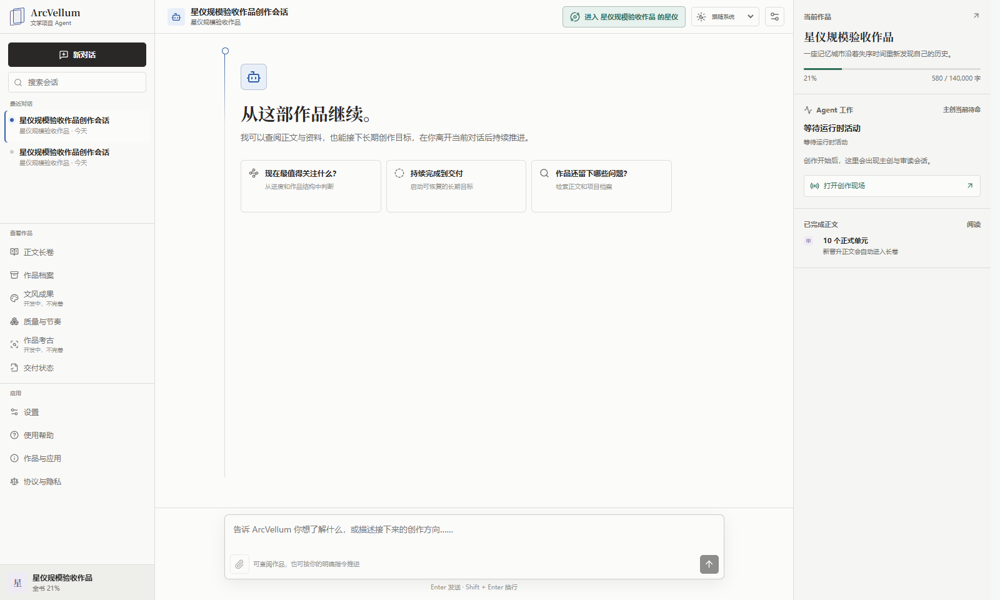
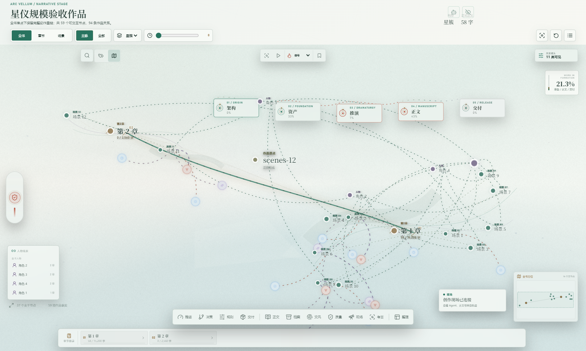
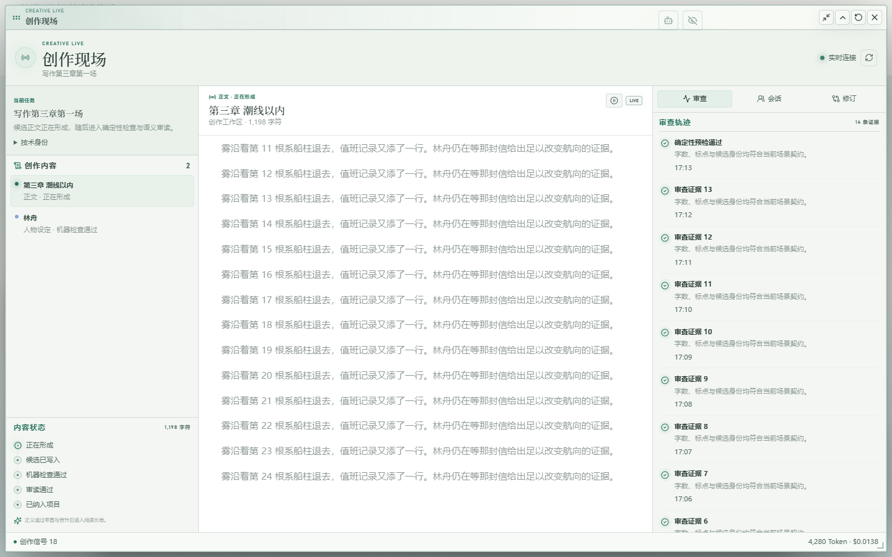
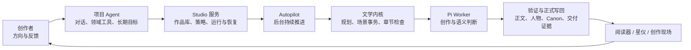

# ArcVellum

> 给长篇文学创作一个能持续工作、记住作品、交付成书的本地工作室。

[](https://github.com/o-1717986918/arcvellum/releases/latest)
[](LICENSE)
[](https://github.com/o-1717986918/arcvellum/releases/latest)
[](https://github.com/o-1717986918/arcvellum/releases/latest)

ArcVellum 面向小说及其他长篇虚构作品。你可以与项目 Agent 讨论方向，也可以交给它一个长期目标，例如“创建一部三章的悬疑小说，写到可交付”。它负责建立项目、调用创作流程、观察后台进度，并在完成或遇到阻断后回到同一段对话汇报。你仍能随时阅读已完成正文，查看人物与世界设定、创作现场和交付文件。

长篇创作的困难往往出现在第一段精彩文本之后：人物前后矛盾，情节库存撑不起目标篇幅，文风漂移，审查意见没有落实，最终文件混入工作记录。ArcVellum 把这些问题放进同一个可恢复的文学项目，而不只放进模型的聊天上下文。

**当前版本：v0.99.8 Beta。** [下载 Windows 安装包](https://github.com/o-1717986918/arcvellum/releases/tag/v0.99.8) · [阅读发行说明](docs/releases/v0.99.8.md) · [查看验证记录](docs/releases/v0.99.8-verification.md)

### 界面实拍

以下画面取自 v0.99.7 的界面，使用隔离的合成演示项目，不含用户作品或私人对话。







## 从一句话开始

1. 安装 Windows x64 版本并打开 ArcVellum。安装包已包含应用服务、文学内核和 Pi Worker，不要求另外安装 Python、Node.js、OpenCode 或浏览器。
2. 先在 **设置 → 连接与模型** 配置自己的模型服务与凭证。ArcVellum 不附赠模型额度；连接云端服务时，任务所需的作品资料会发送给你选定的服务商。
3. 在项目 Agent 中新建对话并选择作品，描述创作方向。每段对话归属一部作品；Agent 能讨论人物、结构与文风，也能接下可恢复的长期目标。
4. 从当前作品的对话进入叙事星仪；在对话桌面阅读正文、查看档案和创作现场。右侧直接显示作品状态与 Agent 工作，无需另开观测页。

新安装或空作品库会提供随包的只读演示项目，便于先了解界面。个人作品默认位于 `Documents/ArcVellum/Works`，可以在应用中更改作品库位置。

### 写作时能看到什么

| 工作区 | 用途 |
| --- | --- |
| **项目 Agent** | 按作品组织对话、建立作品、记录方向、调整规则、交付长期目标，以及在目标结束后复核结果。 |
| **叙事星仪** | 在可平移、缩放的空间视图里观察章节、场景和作品关系；它是作品状态的另一种入口。 |
| **正文长卷** | 只阅读已正式提交的正文；目录、搜索与阅读位置服务于持续阅读。 |
| **创作现场 / Agent 工作** | 对话右栏显示 Agent 状态；进行中的创作可从对话卡片打开现场，查看候选文本、审查与修订事件。候选预览不等于正式正文。 |
| **作品档案 / 文风工作台** | 查看和管理人物、世界、项目资料、语料、文风版本与挂载。 |
| **交付中心** | 检查正式交付状态，取得过滤了流程痕迹的 Markdown 和 DOCX。 |

工作区是对同一文学项目的不同查看方式，不要求作者学习内部文件路径或逐条操作 CLI。

## 它如何持续完成一部作品


```mermaid
flowchart LR
    U["创作者<br/>方向与反馈"] --> A["项目 Agent<br/>对话、领域工具、长期目标"]
    A --> S["Studio 服务<br/>作品库、策略、运行与恢复"]
    S --> P["Autopilot<br/>后台持续推进"]
    P --> E["文学内核<br/>规划、场景事务、章节检查"]
    E --> W["Pi Worker<br/>创作与语义判断"]
    W --> V["验证与正式写回<br/>正文、人物、Canon、交付证据"]
    V --> R["阅读器 / 星仪 / 创作现场"]
    R --> U
```

### 项目 Agent：对话和管理作品

项目 Agent 使用内置 Pi Runtime 与模型对话。它可以搜索作品库、读取进度、诊断停滞，并通过有类型的领域工具创建作品、记录方向、更新质量和节奏设置、挂载文风、处理决策或启动长期目标。它不能凭一句话直接改写任意项目文件；真正的创作、审查、晋升与发布仍由对应服务完成。

长期目标交给后台后，**同一轮对话保持可观察**：界面显示有意义的进度变化，而等待期间不占用一个空闲的模型推理进程。目标完成、暂停或失败时，项目 Agent 会继续这一轮对话，读取真实证据，能在既有权限内修复时尝试恢复，然后报告结果。关闭对话观察不会暗中取消后台创作。

### Pi Worker：负责文学内容

内置 Pi Worker 承担正文、规划候选与语义审查等需要模型判断的工作。系统给它当前任务所需的作品资料、约束和产物边界；Python 服务负责进程、工作区、验证与写回。普通安装版不依赖 OpenCode，外部 Agent 适配能力保留为扩展接口。

### 文学内核：保留事实，减少手续

ArcVellum 当前同时维护两种场景路径：

- **`lean-v2`** 将单个场景作为创作事务，集中完成生成、必要的验证与语义审查、修订和提交；章节检查点处理跨场景问题。项目 Agent 启动的长期目标使用这条路径，目前它仍是预览能力，需要继续积累同模型盲评与多题材长篇证据。
- **`strict-v1`** 保留原有细粒度任务协议与历史项目兼容。一般新建项目的初始内核仍由兼容清单决定；当前清单尚未将 `lean-v2` 设为所有项目的默认值。

两个路径都保留正式事实写回、来源记录和交付检查。Lean v2 减少了创作过程中的重复产物与模型往返，同时保留不可逆写回边界。关于取舍与迁移，见 [Lean v2 设计](docs/architecture/arcvellum-lean-literary-kernel-v2-design.md)。

## 长篇文学工程具体管理什么

- **作品记忆：** 人物背景、关系、世界规则、场景事实与 Canon 在项目中持续保存，供后续创作读取。
- **篇幅与结构：** 字数目标、章节和场景库存用于判断剧情量是否足以支撑目标篇幅；场景软预算与章节检查点共同管理详略。
- **文学判断：** 场景功能、叙事节奏、前后衔接、读者问题与承诺、人物选择和文风进入生成及审读环节，复杂程度随路径与风险而变化。
- **正文身份：** 候选、修订、正式提交和导出各有不同状态。阅读器与正式交付只取已经提交的内容。
- **可恢复运行：** 后台任务、事件与提交回执记录实际进度；停顿时可以定位到作品和任务，不必把整部作品重新交给模型。

这些机制是辅助创作的工具。它们不能保证一部作品的文学价值，也不能代替作者对主题、素材权利和最终发表的判断。

## 当前验证与边界

v0.99.8 的 Windows 生产构建与签名更新包、macOS Apple Silicon 和 Intel **未签名预览包**由同一标签工作流生成。macOS 包尚未经过 Developer ID 签名和 Apple notarization，暂不按普通用户稳定版介绍。

真实端到端样本中，项目 Agent 曾驱动一个 `full_auto`、`lean-v2` 项目从创作目标推进到一场正文正式提交和整书 Markdown/DOCX 交付；该样本完成 91 项后台任务，最终无失败和待处理决策。[验收证据](docs/verification/arcvellum-project-agent-e2e-2026-09-15.md)记录了运行、场景提交与发布清单。这是**单场景链路证明**，还不能代表多题材、几十万字作品都已稳定完成。

发布验证涵盖 Python、Vue、Pi Worker、Prompt Registry、提示词评估、架构审计与版本同步检查。[详细结果](docs/releases/v0.99.8-verification.md)。

目前仍需积累的证据包括：长期无人值守恢复、不同模型与题材的文学质量、完整 Windows 安装/升级矩阵，以及正式签名的 macOS 发行流程。项目处于 Beta，重要作品建议自行保留备份并定期检查正式交付文件。

## 技术结构

| 层 | 主要技术 | 所有权 |
| --- | --- | --- |
| 桌面应用 | Tauri 2、Rust | 窗口、打包、自动更新、桌面进程生命周期。 |
| 产品界面 | Vue 3、TypeScript、Vite、PixiJS | 项目 Agent 工作区、叙事星仪、阅读器、档案与创作现场。 |
| 本地服务 | Python、FastAPI、SSE、SQLite | 作品库、领域工具、后台运行、事件流与持久化。 |
| 文学内核 | `literary_engineering_studio_engine` | 项目契约、场景事务、兼容路线、验证、审计与交付规则。 |
| Agent Runtime | 内置 Pi Worker | 模型交互与受控文学任务执行。 |

仓库中的独立 Skill 不是 ArcVellum 的运行依赖；文学内核已随 Studio 一起打包。开发定位可先看 [模块目录](docs/architecture/module-catalog.md) 和 [故障定位索引](docs/architecture/troubleshooting-module-index.md)，再进入对应模块。历史架构文档保留了方案形成过程，应以当前源码、兼容清单和发行验证作为版本事实。

## 本地开发

需要 Python 3.10+、Node.js/npm、Rust/Tauri 所需的系统构建工具。安装源码依赖：

```powershell
git clone https://github.com/o-1717986918/arcvellum.git
cd arcvellum
python -m pip install -e ".[api,test]"
npm ci
npm run pi-worker:install
npm run pi-worker:build
```

启动经过 checkout 与版本校验的本地 API 和前端热更新：

```powershell
npm run dev
```

这个入口固定使用当前 checkout 的 `.venv`，确认 API 健康后才启动前端。若默认端口已被其他实例占用，它会明确失败且不会结束未知进程。可用
`powershell -NoProfile -ExecutionPolicy Bypass -File scripts/start_dev.ps1 -ApiPort 8792 -ClientPort 5174`
启动隔离开发板。

开发页面位于 `http://127.0.0.1:5173/ui/`。本地构建、发布签名及平台要求见 [发布指南](docs/releases/RELEASING.md)。

常用验证：

```powershell
./scripts/run_tests.ps1 -v
python scripts/architecture_audit.py
python scripts/generate_module_map.py --check
npm run client:test
npm run pi-worker:check
npm run client:build
```

## 数据、模型与责任

作品文件与运行记录优先保存在本机；本地服务默认监听 `127.0.0.1`。接入云端模型时，完成任务所需的提示词和作品上下文仍会发送给该服务商，具体处理方式取决于其条款。凭证不应写进作品项目或提交到 Git。使用第三方文本、作者文风和生成作品时，请确认相应权利与发表责任。

贡献前请阅读 [贡献指南](CONTRIBUTING.md)；报告安全问题请使用 [安全策略](SECURITY.md)。项目采用 [MIT License](LICENSE)。
