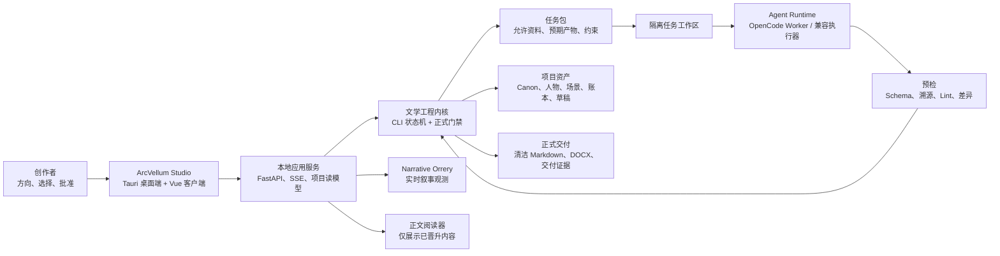

# ArcVellum

> A literary engineering studio for long-form fiction: let agents create, let the system remember, and let people stay in command.

[](https://github.com/o-1717986918/arcvellum/releases)
[](LICENSE)
[](https://github.com/o-1717986918/arcvellum/releases)

ArcVellum 是一款面向小说、剧本与伪记录作品的本地 Agent 创作平台。它不把长篇创作当成一段越滚越长的聊天记录，而是把人物、世界观、场景、文风、字数预算、审查证据和正式正文维护成一个可持续推进的文学项目。

它要解决的不是“让 AI 多写一点”，而是“让几十万字之后的作品，仍然记得自己为什么这样写”。


## 写作者能得到什么

### 写一部作品，而不是攒一堆生成结果

多数 AI 写作工具能写出一段不错的场景；真正困难的是写到十章、五十章甚至数百个场景之后，人物还能不能自洽，伏笔还能不能兑现，篇幅会不会坍缩，模型会不会偷偷跳过本该发生的推演与审查。

ArcVellum 为个人创作者提供了一张长期创作的工作台：

- **作品会记得。** 世界规则、人物履历、秘密、关系、地点、场景状态与背景故事都是正式资料，而不是散落在聊天记录里的“上下文”。
- **故事有形状。** 字数预算、场景功能、叙事节奏、读者问题、承诺与兑现、场景衔接都会进入规划、生成与审查。
- **流程不靠自觉。** 角色推演、分支比较、编剧态、审查、修订、晋升、状态演化是有证据的正式环节，而不是一段 Prompt 里的可选建议。
- **正文可以随时阅读。** 已晋升正文会自动汇集成一部可搜索、可书签、可连续阅读的作品；推进创作与读小说不再是两件割裂的事。
- **控制不必像写代码。** 你可以在可视化界面、自然语言顾问和决策卡之间切换。你负责方向、判断与品味，系统负责记忆、任务和约束。

ArcVellum 适合在意连续性、人物后果、文风、节奏，以及“这真的是同一部作品吗”这一问题的创作者。

## 一眼看见作品正在长成什么

### 叙事星仪 Narrative Orrery

ArcVellum 的中心不是普通仪表盘，而是一片可平移、缩放、聚焦的 2.5D 叙事场域。章节锚点、场景簇、人物联系、候选分支、Canon 压力、审查债务、字数增长与当前任务，都会由真实项目状态投影为可阅读的故事脉络。

星仪可在工作台与全视口沉浸模式之间切换。推进、决策、规则、节奏、项目健康度和正文等仪器窗围绕场域工作，支持多开、拖动、缩放、折叠与复位。主题、动效强度、伪 3D 纵深与渲染质量都由用户掌控；它不是装饰性星空，而是作品结构的可视化观察面。

### 一本会随创作生长的书

通过门禁的场景会自动进入正式正文阅读器。阅读器支持连续/分章模式、全文搜索、目录、书签、阅读位置恢复、字号、行距、日夜主题与全屏。创作继续推进时，新晋升的正文会温和提示，不会把读者从当前页强行拽走。


### 一位有边界的创作顾问

悬浮顾问可以用自然语言讨论人物、结构、节奏、文风和下一步，并把“继续创作”“暂停”“记录这个方向”“打开正文”等明确意图翻译为可确认的 Studio 动作。

它不是拥有隐藏文件权限的万能进程：顾问只读取项目投影，只能提出白名单动作，不能绕过审查、正文晋升、Canon 写回或交付门禁。创作判断仍然可以自由，项目权限必须保持克制。

## ArcVellum 与普通 AI 写作工具的差别

| 常见做法 | ArcVellum 的做法 |
| --- | --- |
| 一条超长 Prompt 加一段持续聊天 | 维护一套有明确事实来源的文学项目资产 |
| 模型自己判断哪些步骤值得做 | CLI 状态机签发下一项允许执行的任务 |
| 同一个模型写完又自己说“没问题” | 确定性 Lint、证据校验、审查任务与正文晋升门禁共同把关 |
| 决策和产物埋在不可追溯的聊天里 | 分支、选择、状态变化、审查和失败都有可查证记录 |
| 单场景成功却可能毁掉整本书 | Canon、人物状态、读者承诺、节奏与字数预算一起检查 |
| 工具一多，普通作者无从下手 | 桌面端把复杂状态包装成可读的项目面板、选择和正文 |

## 核心架构：让 Agent 创作，让系统守住作品

ArcVellum 将**创作智能**与**项目权力**分开。模型可以推演、写作、审查与提出建议；它不能静默改写项目事实、伪造流程产物，或自行跨越创作路线。


```mermaid
flowchart LR
    Writer["创作者\n方向、选择、批准"] --> Studio["ArcVellum Studio\nTauri 桌面端 + Vue 客户端"]
    Studio --> API["本地应用服务\nFastAPI、SSE、项目读模型"]
    API --> Engine["文学工程内核\nCLI 状态机 + 正式门禁"]

    Engine --> Package["任务包\n允许资料、预期产物、约束"]
    Package --> Sandbox["隔离任务工作区"]
    Sandbox --> Runtime["Agent Runtime\nOpenCode Worker / 兼容执行器"]
    Runtime --> Preflight["预检\nSchema、溯源、Lint、差异"]
    Preflight --> Engine

    Engine --> Project["项目资产\nCanon、人物、场景、账本、草稿"]
    API --> Orrery["Narrative Orrery\n实时叙事观测"]
    API --> Reader["正文阅读器\n仅展示已晋升内容"]
    Engine --> Delivery["正式交付\n清洁 Markdown、DOCX、交付证据"]
```

### 四条架构原则

1. **CLI 是唯一权威。** 正式路线不是一份待办清单，而是状态机。它决定下一项可执行任务，并验证推进所需证据。
2. **Agent 只能在任务范围内工作。** 每个任务包都声明允许读取的资料和允许产出的文件。Agent 在沙箱里工作，只有通过预检的结果才能写回正式项目。
3. **创作候选与项目事实必须分层。** 正文候选、Canon 提案、人物状态补丁与已晋升正文不是同一种东西，各自拥有不同的来源、审查和写回规则。
4. **界面只展示真实状态。** 星仪、决策中心、阅读器、任务面板与进度条都投影自同一份受内核验证的项目状态，而不是演示数据。

这使 ArcVellum 能同时保留文学创作的自由度与大型项目应有的约束力。

从 v0.96.2 开始，场景任务还可以携带受 Schema 约束的创作策略：推演深度、分支数量、叙事距离、字数目标、修订方式和回退策略都能随作品需要调整；强制门禁仍由系统注入，Agent 可以改变创作路径，不能删除文学工程底线。策略变化通过带版本与指纹的计划补丁进入任务图，便于复查、失效检测和后续恢复。

## 一条可复查的创作路线

具体任务会随项目而变，但单个场景的正式开发遵循一条稳定的契约：


```mermaid
flowchart LR
    A["规划\n大纲、场景库存、字数预算"] --> B["上下文\nCanon、人物状态、读者契约"]
    B --> C["推演\n角色扮演与世界后果"]
    C --> D["决策\n比较分支并记录选择"]
    D --> E["编剧态\n功能、节奏、衔接与正文约束"]
    E --> F["草稿\nAgent 生成正文候选"]
    F --> G["审查 + Lint\n文风、Canon、连续性、读者效果"]
    G --> H["修订或晋升\n内容指纹保护"]
    H --> I["演化\n状态、Canon 候选、连续性账本"]
    I --> J["审计与交付\n章节、长篇、导出检查"]
```

### 创作过程中会实际检查什么

- **篇幅与剧情库存：** 汉字目标会从全书映射到卷、章和场景。短篇幅的大纲不能靠硬拉长句子来伪装成一部长篇。
- **叙事节奏：** 场景功能、速度、密度、转向、叙述距离、前场压力、后场钩子和读者效果会进入编剧态与 Review。
- **连续性：** Canon 规则、禁止变化、人物的 belief/desire/fear/background story、关系与状态变化保持显式。
- **读者体验：** 问题、承诺、暂扣、兑现、张力和章节结尾策略会被记录，避免场景像互不相干的短视频。
- **文风与反 AI 腔：** 已挂载文风在生成前就进入约束。确定性 Style Lint 与语义审查共同检查机械对照、标点误用和其他项目规则。
- **证据链：** 候选稿、Review、修订、晋升和交付由内容指纹关联，避免“审查的是 A，最后发布的是 B”。

## 技术路线

ArcVellum 是一套本地优先、可打包、可测试的桌面应用与文学工程内核。

| 层级 | 技术 | 职责 |
| --- | --- | --- |
| 桌面壳 | Tauri + Rust | Windows 安装包、自动更新、本地进程生命周期、安全桥接 |
| 产品界面 | Vue 3 + TypeScript + Vite | 星仪、阅读器、决策、设置与流式项目视图 |
| 应用服务 | FastAPI + SSE | 本地认证 API、实时读模型、事件流与项目控制 |
| 文学工程内核 | Python CLI | 路线状态机、任务包、Schema、门禁、审计与交付准备 |
| Agent Runtime | 内置 Pi Worker + OpenCode Runner | 受控文学任务执行、权限隔离、独立主创与审查 Profile |
| 模型连接 | Runner Provider Catalog | 常用厂商预设、按角色选模、OpenAI 兼容自定义端点 |
| 项目格式 | 人类可读文件 + 账本 | Canon、人物、场景、Review 和交付物的长期保存 |
| 交付 | Markdown/DOCX 管线 | 过滤流程痕迹后的完整作品输出 |

### 模型连接不锁定厂商

内置 Runner 提供 DeepSeek、智谱 AI、阿里云百炼、Moonshot、MiniMax、SiliconFlow、OpenAI、Anthropic、Google、OpenRouter、Groq 等常用预设，也支持自定义 OpenAI-compatible 接口。

模型选择按角色持久保存。切换模型时，未来的空闲 Worker 会更新为新选择，正在运行的任务不会被粗暴中断。凭证由 Runner 的认证机制管理，不进入项目文件、任务包、普通日志或 Studio 常规配置。

## 安装后即可开始

### Windows 桌面端

1. 下载 [ArcVellum v0.98.0 Windows x64 安装程序](https://github.com/o-1717986918/arcvellum/releases/download/v0.98.0/ArcVellum_0.98.0_x64-setup.exe)，或前往 [Releases](https://github.com/o-1717986918/arcvellum/releases) 查看全部版本。
2. 启动 ArcVellum。默认作品库为 `Documents/ArcVellum/Works`，也可在设置中调整。
3. 打开 **设置 -> 连接与模型**，连接模型服务并为不同角色选择模型。
4. 新建作品，写下创作大方向与约束，再选择协作、监督自动或全自动推进方式。
5. 通过星仪理解项目，通过阅读器阅读已晋升正文，通过“交付”导出完整作品。

安装包包含本地应用服务、文学工程内核、Pi Worker 及其固定运行时和 OpenCode Runner；无需预先安装 Python、Node.js、Rust、浏览器或其他 Agent 平台。模型推理仍需要用户自行选择并授权的模型服务或本地端点。

### 自动更新

ArcVellum 的 Windows Release 包含安装包、Tauri 更新验签文件、校验和以及 `latest.json` 更新清单。已安装版本可通过应用内检查更新完成正常升级。当前正式版本为 **v0.98.0**。

## 开发者入口

```powershell
git clone https://github.com/o-1717986918/arcvellum.git
cd arcvellum
python -m pip install -e ".[api,test]"
npm ci
python -m literary_engineering_studio serve --port 8791
```

Vue 热更新开发：

```powershell
npm run client:dev
```

### 仓库地图

| 路径 | 用途 |
| --- | --- |
| `src/literary_engineering_studio/` | 应用服务、Runtime、CLI 集成与产品模块 |
| `client/` | Vue 客户端与叙事星仪渲染器 |
| `desktop/` | Tauri 桌面壳、更新器与安全桌面桥接 |
| `protocol/` | 正式工作流共享的任务与项目契约 |
| `tests/` | 内核、API、Runtime、预检与集成测试 |
| `docs/architecture/` | 内核审查、双工作区与模块边界说明 |
| `docs/roadmap/` | 当前开发目标、长期产品路线与执行指导 |
| `docs/releases/` | 版本记录与签名发布流程 |
| `packaging/` | Windows 打包与更新清单脚本 |

长期目标与分阶段实施方案见
[ArcVellum v0.96 - v1.0 长期产品与 Runtime 路线图](docs/roadmap/arcvellum-post-v0.95.3-long-horizon-product-and-runtime-roadmap.md)。

### 验证命令

```powershell
python -m unittest discover -s tests -v
python -m compileall -q src
python -m literary_engineering_studio_engine prompt-registry-validate --json
npm run client:test
npm run client:build
cd desktop/src-tauri
cargo check --locked
```

本地构建 Windows 候选包：

```powershell
powershell -NoProfile -ExecutionPolicy Bypass -File packaging/build_desktop.ps1 -SkipPythonInstall -SkipNodeInstall
```

## 安全、边界与责任

- 本地服务默认只监听 `127.0.0.1`；桌面端通过启动令牌建立已认证会话。
- Agent Runner 按能力隔离并在任务沙箱中执行，越出 `expected_outputs` 的文件不能晋升到正式项目。
- 顾问与自动创作管家只通过只读项目投影工作；人工选择、策略、审批、写回、失败和发布身份都可审计。
- 凭证与项目资产隔离。诊断报告会过滤凭证、正文全文与完整本地路径。
- ArcVellum 不会授予用户对输入素材、模仿对象或最终发布的权利。创作者应自行遵守素材权利、模型服务条款与发布责任。

## 项目状态与 v1.0 方向

ArcVellum 目前处于 **Beta**：Windows 桌面端、带验签的自动更新、本地 Agent Runtime、正式文学工作流门禁、受约束的场景策略计划、2.5D 叙事星仪、正文阅读与清洁导出均已可用。v0.98.0 将 Pi 专用文学 Worker 正式内置进安装包，并以同一作品连续完成第一场正文晋升、人物状态、Canon、连续性写回和下一场领取；同时完成 Prompt 分层与架构收敛，减少重复上下文和确定性预检空转。

走向 v1.0 的重点不是继续堆功能，而是积累证据：更多题材的长期项目样本、无人值守恢复验证、Windows 10/11 干净环境下的安装/覆盖升级矩阵、更强的模型连接诊断，以及在真实稿件上的创作质量评估。

推荐阅读：

- [当前内核审查](docs/architecture/current-core-review.md)
- [双工作区 Agent Runtime](docs/architecture/dual-workspace-agent-runtime.md)
- [模块目录](docs/architecture/module-catalog.md)
- [Agent 面向接口开发标准](docs/architecture/agent-interface-development-standard.md)
- [模块边界](docs/architecture/module-boundaries.md)
- [发布与签名指南](docs/releases/RELEASING.md)
- [v0.98.0 发行说明](docs/releases/v0.98.0.md)
- [v0.97.4 发行说明](docs/releases/v0.97.4.md)
- [v0.97.2 发行说明](docs/releases/v0.97.2.md)
- [v0.97.1 发行说明](docs/releases/v0.97.1.md)
- [v0.97.0 发行说明](docs/releases/v0.97.0.md)
- [v0.96.4 发行说明](docs/releases/v0.96.4.md)
- [v0.96.3 发行说明](docs/releases/v0.96.3.md)
- [v0.96.2 发行说明](docs/releases/v0.96.2.md)
- [v0.96.1 发行说明](docs/releases/v0.96.1.md)
- [v0.96.0 发行说明](docs/releases/v0.96.0.md)
- [贡献指南](CONTRIBUTING.md)
- [安全策略](SECURITY.md)

## License

[MIT](LICENSE)
