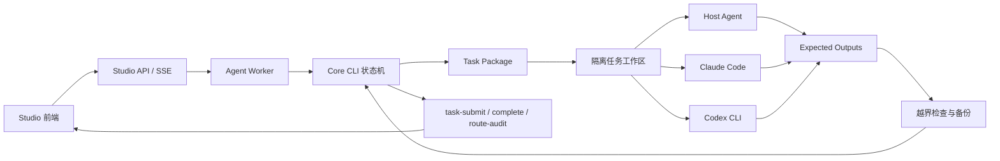

# New Studio Architecture

## Product Definition

Literary Engineering Studio is an Agent execution platform, not another literature workflow engine and not an LLM API client.

## Layer Responsibilities

### Core Kernel

The existing Skill repository remains authoritative for creative workflow semantics. Studio never marks a task complete by its own judgment.

### Core Bridge

The bridge invokes the existing CLI without `shell=True`, removes maintainer mode from the environment, and blocks known bypass flags. It also exposes reused core read models to the new API.

### Task Contract Consumer

The consumer validates task schema and every project-relative path before staging. Absolute paths, drive prefixes, and `..` segments are rejected.

### Agent Worker

The Worker is the project-owned agent loop:

1. issue or select a task;
2. open the executable package;
3. pause at human gates;
4. run a trusted deterministic core command when present;
5. stage the task workspace;
6. invoke a selected Agent runtime;
7. reject unexpected writes;
8. back up and import expected outputs;
9. submit and complete through the core;
10. publish route-audit evidence.

It owns action and persistence but does not own a model provider.

### Runtime Adapters

- `host-agent`: prepares a task for the Codex/Claude environment already supervising the project.
- `claude-code`: invokes Claude Code in non-interactive JSON-stream mode with file tools and no Bash.
- `codex-cli`: invokes `codex exec` non-interactively with an ephemeral session and workspace-write sandbox.

OpenHands/ACP and OpenCode can be added behind the same adapter contract without changing the Worker.

### Sandbox And Writeback

Each run has a private workspace and immutable run record outside the literature work project. Only declared expected outputs can return. Existing targets are backed up before replacement. Runtime chat text, hidden session data, and unrelated edits never become formal artifacts.

### API And Frontend

The new API combines two surfaces:

- reused core read models for project state, literature content, user choices, and style mounting;
- Studio-owned runtime detection, Worker jobs, execution results, and SSE observation.

There is no model or API-key configuration surface.

## Trust Model

- Core task packages are trusted policy input.
- Agent runtime output is untrusted until whitelist checks and core validation pass.
- The connected user is the authority for human gates.
- External CLI login and model policy remain owned by that CLI.
- Studio never receives or persists provider API keys.

## Repository Relationship

The repositories should evolve independently but with a versioned contract:

- Core publishes task schema and compatible CLI behavior.
- Studio declares the minimum core version it supports.
- Schema snapshots in Studio are compatibility fixtures, not a second authority.
- Integration tests should run Studio against a real core checkout on every release.

