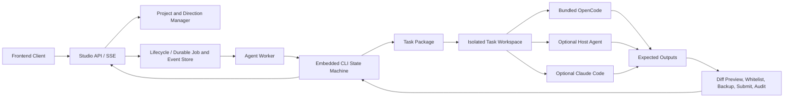

# Standalone Studio Architecture

## Product Definition

Literary Engineering Studio is a standalone literary project client and controlled Agent execution platform. It embeds the literary workflow engine and a pinned OpenCode Agent Runner, while deliberately keeping model connections separate from the literary engine.

## Layer Responsibilities

### Embedded Literary Engine

`literary_engineering_studio_engine` is packaged with Studio. It owns routes, task packages, project templates, prompt assets, schemas, deterministic lint, review and promotion gates, canon and character candidates, word budgets, state evolution, DOCX export, and release readiness.

The engine is policy, not creative intelligence. Historical model-provider modules may remain as migration source code, but Studio does not expose or call them. The bridge rejects provider configuration, direct agent-provider calls, the legacy director, Dify/LangGraph runners, and the legacy API server.

### Studio Project Layer

The project manager creates and opens self-contained work projects, keeps a local recent-project registry, and records user creative directions. A direction digest is added to every isolated task so users can steer the work without editing YAML or JSON.

### Agent Worker

The Worker is the controlled execution loop:

1. issue or select the current formal task;
2. open and validate its package;
3. pause at human gates;
4. stage only authorized reading, source paths, and declared outputs;
5. run any trusted deterministic engine command inside that sandbox;
6. skip the Agent runtime for pure `deterministic-cli` tasks, or invoke the selected Agent runtime for creative/review tasks;
7. reject unexpected writes;
8. back up and import declared outputs;
9. submit and complete through the embedded state machine;
10. publish route-audit evidence to the client.

### Runtime Adapters

- `opencode` is the default built-in Runner. Studio starts a pinned local OpenCode server with application-owned profiles, denies unneeded tools, and binds it to one task sandbox.
- `host-agent` prepares a task for a Codex or Claude environment already supervising the project.
- `claude-code` is an optional locally authenticated compatibility Runner with explicit model selection and normalized stream-json events.
- `codex-cli` remains an experimental compatibility adapter, not an ordinary-user dependency.

Runner identity and model connection are separate contracts. The frontend may submit a provider credential once to OpenCode Auth and choose a model, but neither the secret nor provider protocol enters the literary engine, work project, task package, ordinary Studio configuration, or event log.

### Application Lifecycle

`ApplicationLifecycleManager` owns the SQLite WAL job store, process manager, Worker supervisor, Runner sidecars, migrations, health projection and shutdown. Jobs use leases, heartbeats, idempotency keys and per-project route locks. Events are persisted before SSE projection and can be replayed after a reconnect cursor.

The desktop shell starts the frozen application-service sidecar on a random localhost port with a per-launch token. The token is exchanged for an HttpOnly local session and is never rendered as project content. A parent-process monitor terminates the frozen Python child even when the desktop process is forcibly killed. The native shell also enforces a single application instance and persists window position and size.

### Frontend Client

The frontend is the complete user operation surface:

- **项目中心** creates, opens, and switches projects.
- **创作总控** records creative direction, shows formal progress, completed prose, gates, and next actions.
- **Agent 工作台** selects a route and runtime, executes a task, follows SSE events, and displays human choices.
- **作品档案** renders prose, characters, world rules, scenes, branches, reviews, budgets, rhythm, and canon candidates as readable views.
- **文风管理** manages author projects and mounts accepted style constraints.
- **项目顾问** answers from an immutable, curated project snapshot and cannot write to the work project.
- **连接与模型** separates Runner readiness, provider connection, model selection and real inference testing.

Raw JSON and Markdown remain available as evidence but are not the primary presentation. Structured decisions must be expressed as choice cards and written back through state-machine operations.

## Trust Model

- Embedded task packages are trusted policy input.
- Agent runtime output is untrusted until path whitelisting and engine validation pass.
- The connected user is authoritative for human gates.
- OpenCode or an optional external CLI owns provider authentication and protocol behavior.
- Studio ordinary configuration rejects model credentials; the dedicated credential endpoint forwards secrets only to OpenCode Auth.
- A separate Skill repository is neither discovered nor imported at runtime.

## Distribution Boundary

Studio and the original installable Skill can evolve independently. Studio contains its own engine snapshot and updates it deliberately through reviewed source changes. There is no filesystem discovery, environment-variable link, Git submodule, package dependency, or runtime network dependency between the two products.
