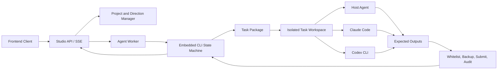

# Standalone Studio Architecture

## Product Definition

Literary Engineering Studio is a standalone literary project client and controlled Agent execution platform. It embeds the literary workflow engine but deliberately does not embed an LLM provider.

## Layer Responsibilities

### Embedded Literary Engine

`literary_engineering_studio_engine` is packaged with Studio. It owns routes, task packages, project templates, prompt assets, schemas, deterministic lint, review and promotion gates, canon and character candidates, word budgets, state evolution, DOCX export, and release readiness.

The engine is policy, not creative intelligence. Historical model-provider modules may remain as migration source code, but Studio does not expose or call them. The bridge rejects provider configuration, direct agent-provider calls, the legacy director, Dify/LangGraph runners, and the legacy API server.

### Studio Project Layer

The project manager creates and opens self-contained work projects, keeps a local recent-project registry, and records user creative directions. A direction digest is added to every isolated task so users can steer the work without editing YAML or JSON.

### Agent Worker

The Worker is the controlled execution loop:

1. issue or select the current formal task;
2. open and validate its package;
3. pause at human gates;
4. run a trusted deterministic engine command when the task declares one;
5. stage only authorized reading and source paths;
6. invoke the selected Agent runtime;
7. reject unexpected writes;
8. back up and import declared outputs;
9. submit and complete through the embedded state machine;
10. publish route-audit evidence to the client.

### Runtime Adapters

- `host-agent` prepares a task for the Codex or Claude environment already supervising the project.
- `claude-code` invokes the locally authenticated Claude Code CLI in a single-task workspace.
- `codex-cli` invokes `codex exec` with an ephemeral session and workspace-write sandbox.

Runtime login, model choice, subscription, and credentials belong to the runtime itself. Studio receives none of them.

### Frontend Client

The frontend is the complete user operation surface:

- **项目中心** creates, opens, and switches projects.
- **创作总控** records creative direction, shows formal progress, completed prose, gates, and next actions.
- **Agent 工作台** selects a route and runtime, executes a task, follows SSE events, and displays human choices.
- **作品档案** renders prose, characters, world rules, scenes, branches, reviews, budgets, rhythm, and canon candidates as readable views.
- **文风管理** manages author projects and mounts accepted style constraints.

Raw JSON and Markdown remain available as evidence but are not the primary presentation. Structured decisions must be expressed as choice cards and written back through state-machine operations.

## Trust Model

- Embedded task packages are trusted policy input.
- Agent runtime output is untrusted until path whitelisting and engine validation pass.
- The connected user is authoritative for human gates.
- External CLI authentication remains owned by that CLI.
- Studio configuration rejects model credentials and provider settings.
- A separate Skill repository is neither discovered nor imported at runtime.

## Distribution Boundary

Studio and the original installable Skill can evolve independently. Studio contains its own engine snapshot and updates it deliberately through reviewed source changes. There is no filesystem discovery, environment-variable link, Git submodule, package dependency, or runtime network dependency between the two products.
