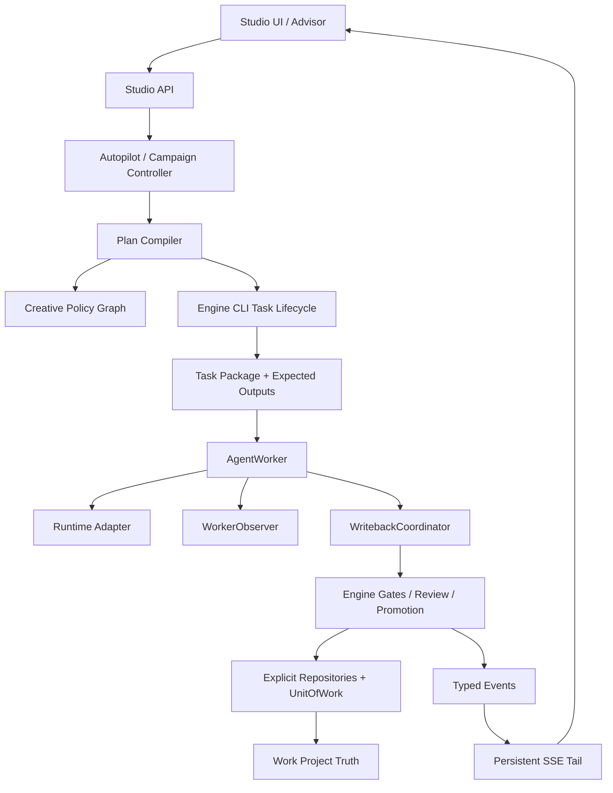

# ArcVellum W6 后分层代码、架构与文学逻辑审查及统一修正计划

> 审查日期：2026-08-08  
> 审查对象：`literary-engineering-studio` 当前 `release/v0.97.0` 工作树  
> 基准提交：`944bfb9`  
> 文档性质：事实审查、修正路线与验收合同；本文件不代表所列改造已经完成

## 1. 目的与边界

本轮审查不再只回答“哪些文件过大”，而是从七层检查当前工程：

1. 包边界和依赖方向是否清晰；
2. 类、值对象、继承、Mixin 与 Protocol 是否被正确使用；
3. 是否存在重复类型、重复算法或只有名称差异的多余类；
4. 关键状态机、运行时、时间与身份逻辑是否存在确定性缺陷；
5. W6 新增能力是合同、影子能力还是生产能力；
6. 固定文学流程与自适应编排是否既可靠又保留创作空间；
7. 测试与架构门禁能否阻止相同问题回归。

本文件是以下既有文档的“质量修正增量”，不替代它们：

- `docs/architecture/module-boundaries.md`
- `docs/roadmap/arcvellum-large-file-modularization-execution-plan.md`
- `docs/roadmap/arcvellum-v0.96-v1.0-integrated-engineering-implementation-plan.md`
- `docs/roadmap/arcvellum-adaptive-creative-orchestration-implementation-plan.md`
- `docs/architecture/reviews/w6-5b-active-plan-production-closure-review.md`
- `docs/architecture/reviews/w6-8-exit-audit.md`
- `docs/architecture/reviews/w6-10-v1-final-acceptance.md`

## 2. 审查依据与证据

本轮实际读取并交叉检查了：

- Studio 与 Engine 的目录、入口、模块边界和打包配置；
- CLI、正式任务生命周期、工作流状态、route audit 与 scene gate；
- Agent Worker、Autopilot、JobStore、任务包、沙箱与写回链路；
- AO-5 至 AO-8 的章节规划、Bundle、Session、Checkpoint、Campaign 和前端投影；
- SceneFacts、分支推演、Composition、Review、Promotion、状态与 Canon 写回；
- 当前 Architecture Audit、W6 验收文件和全量测试基线。

当前可复核基线：

| 项目 | 当前结果 | 解释 |
| --- | ---: | --- |
| Python 测试 | 830 passed，1 skipped | 回归面较完整，但不等于所有 W6 合同均已生产接线 |
| 前端测试 | 158 passed | 组件与投影测试较充分 |
| Architecture Audit | 0 cycle / 0 dependency violation / 0 duplicate route | 宏观边界健康 |
| 结构债务 | 34 个超大文件 / 220 个超预算函数 | 被基线容忍，尚未形成持续下降的 ratchet |
| 工作树起点 | clean | 本文创建前无未提交改动 |

## 3. 总体结论

### 3.1 结论摘要

ArcVellum 不是“架构失控”的项目。它的 Engine/Studio 边界、CLI 正式权威、任务包、沙箱、Review/Promotion Gate 与测试体系已经形成可靠骨架。当前主要问题是四类：

1. **局部重复与错误抽象**：相同的 `SceneFacts`、大量同构 Violation，以及仅服务一个宿主类的 Mixin，增加了维护成本。
2. **合同完成度高于生产接线度**：AO-5 至 AO-8 的部分能力已具备 schema、lint 和测试，却没有进入真实执行循环。
3. **少数确定性边界缺陷**：预算相等边界、时间比较、checkpoint 周期、bundle 身份等逻辑会在长跑中产生错误。
4. **文学流程可靠但偏模板化**：正式 Gate 很强，然而固定分支原型和固定五拍 Composition 可能把不同作品压成相似的创作路径。

### 3.2 分层成熟度

| 层 | 评价 | 成熟度 | 主要风险 |
| --- | --- | --- | --- |
| 包边界 | Engine/Studio 方向清晰，无循环依赖 | 高 | 旧兼容入口仍扩大打包面 |
| 正式任务生命周期 | CLI、task package、preflight、writeback 权威明确 | 高 | 大函数和静默异常增加定位成本 |
| 固定 scene-development | Gate 完整，正文晋升证据链扎实 | 高 | 流程复杂，错误诊断仍可能散落 |
| 自适应编排 | 计划、策略、风险和合同层完整 | 中 | 更像策略覆盖层，不是完整执行 DAG |
| W6 资源/长跑能力 | 合同和测试充分 | 中低 | Bundle、Session pool、Campaign 尚未全部生产接线 |
| 文学质量控制 | Canon、节奏、衔接、读者体验、文风、字数均入 Gate | 中高 | 分支和节拍生成过于确定性、易同质化 |
| 前端 AO-8 | 组件和只读投影已有 | 中低 | 路由隐藏，SSE 仍偏有限重放而非持续尾随 |
| 可维护性 | 测试多、规则清晰 | 中 | 34 个大文件、220 个复杂函数、Mixin 隐式依赖 |

## 4. 类、继承与值对象专项审查

### 4.1 不是“类越少越好”

当前工程中的大量 dataclass、Pydantic request 和 Protocol，多数承担明确的边界契约。仅因为字段相同就建立继承树，反而会制造错误的 `is-a` 关系。统一原则如下：

- 同一领域概念、同一加载规则、同一失败语义：合并为共享值对象；
- 只有字段形状相同、语义不同：保留独立类型，最多共享 Protocol；
- 只有一个宿主使用、靠宿主私有属性工作的 Mixin：优先组合；
- 需要稳定捕获边界的异常：保留继承；
- 仅为 OpenAPI 名称存在的空子类：明确其接口价值，否则删除或别名化。

### 4.2 类与类型决策矩阵

| 现状 | 判定 | 修正方式 | 原因 |
| --- | --- | --- | --- |
| `branching/lab.py::SceneFacts` 与 `composition/composer.py::SceneFacts` 完全重复 | 必须合并 | 新建 `literary/scene/facts.py`，只保留一个冻结值对象和一个加载器 | 属于同一概念，当前双实现会产生语义漂移 |
| 两处 `_parse_scene`、`_scalar`、`_list_value` 正则 YAML 解析 | 必须替换 | 使用 `ruamel.yaml` 结构化解析并做 schema 校验 | 正则会误读引号、逗号、嵌套列表，直接污染文学推演事实 |
| 14 个仅含 `code/message` 的 `*Violation` | 有条件收敛 | 引入 `ContractViolation`；公开名称有价值时用 alias 或薄包装 | 不值得建立 14 层继承，也不应继续复制 |
| `LiteraryPolicyViolation`、`WriterPolicyViolation` 同为 `code/message/related` | 合并共享合同 | 使用统一 `PlanPolicyViolation`，或直接复用 `PlanIssue` | 两者属于计划编译期问题，已有更完整问题模型 |
| `AIStyleIssue` 与 `PunctuationIssue` 同为 `rule/severity/message/sample` | 共享值合同 | 引入 `TextStyleIssue`，规则命名空间保持分离 | 检测器不同，但输出证据同构 |
| `ReplanDecision` 与 `RepairDecision` 字段相同 | 保留 | 可共享只读 Protocol，不合并实体 | “是否重规划”和“是否修复”语义及未来字段不同 |
| Studio 与 Engine 各自的 `StyleCompileRequest` / `StyleMountRequest` | 保留并消歧 | 保持传输边界独立；必要时改成 `StudioStyle...` 与 `EngineStyle...` | 跨边界 DTO 字段不同，强行继承会耦合 API |
| `ArchiveStructuredContentRequest(ArchiveAssetContentRequest): pass` | 复核后删除或别名 | 若无独立 OpenAPI schema 需求，直接使用基类 | 当前为空子类，没有行为差异 |
| `ArchiveAssetCreateCommitRequest` 继承 Preview 并增加 digest | 保留 | 无需修改 | 真实的“提交请求是预览请求的扩展”关系 |
| `StyleVersionConflictError` 等冲突异常子类 | 保留 | 无需修改 | 调用方需要稳定捕获冲突边界 |
| `KnowledgeStoreBackend` 只有单实现 | 暂缓 | 第二实现确定前不继续扩展抽象 | Protocol 目前收益有限，但删除需考虑外部兼容 |
| `SceneGenerationProvider` 与旧 HTTP provider | 隔离 | 迁移至 legacy/compat 表面，禁止进入 Studio runtime | 与当前受控 Agent Worker 路线形成第二模型通道 |

### 4.3 `SceneFacts` 是最高优先级重复

当前两个 `SceneFacts` 拥有相同字段：

- `scene_id`、`chapter_id`、`location`、`participants`；
- `canon_refs`、`active_foreshadowing`；
- `scene_goal`、`external_conflict`、`internal_conflict`；
- `style_constraints`、`next_hooks`。

它们分别被分支推演和编剧模块解析，意味着同一份场景 YAML 可能被两套正则解释成不同事实。修正目标不是抽一个父类，而是建立单一事实入口：

```text
scenes/scene_*.yaml
  -> load_scene_facts()
  -> SceneFacts
  -> branch simulation
  -> composition
  -> review evidence
```

加载器必须：

1. 使用结构化 YAML API；
2. 保留中文标点、引号、列表和多行文本；
3. 明确缺失字段与空字段的区别；
4. 返回规范化路径和来源 digest；
5. 对未知字段保留向前兼容策略；
6. 通过复杂 YAML fixture 与往返测试。

### 4.4 Mixin 不是本项目的最佳拆分手段

`JobStore` 当前继承九个 Mixin。各 Mixin 依赖宿主的 `_write_lock`、`_connection` 和兄弟模块私有事务函数，仅有 `JobStore` 一个实际使用者。这降低了单文件行数，却没有真正拆开责任。

目标结构应逐步改为组合：

```text
JobStore                         # 向后兼容门面
  -> SqliteUnitOfWork            # 连接、事务、迁移边界
  -> JobRepository
  -> SessionRepository
  -> AutopilotRepository
  -> CreativePlanRepository
  -> AssetRepository
  -> ContextLedgerRepository
```

迁移要求：

- 保留 `JobStore` 公共 API，内部逐个委托；
- 每批只迁移一个 repository；
- 事务由 `SqliteUnitOfWork` 统一拥有，repository 不自行提交；
- 禁止 repository 读取其他 repository 的私有函数；
- 先做 characterization tests，再迁移；
- 数据库 schema 与 migration 仍保持单一所有者。

`AgentWorker(WorkerWritebackMixin, WorkerObservabilityMixin)` 同样应逐步替换为：

```text
AgentWorker
  -> WorkerObserver
  -> WritebackCoordinator
  -> RuntimeAdapter
  -> SandboxExecutor
```

这不是为了“消灭继承”，而是让依赖显式、构造可测试、失败边界可观察。

## 5. 模块与架构质量审查

### 5.1 健康部分

- Engine 不反向导入 Studio；
- Studio 负责运行时、生命周期、沙箱、进程和 UI；
- Engine 负责文学状态机、schema、Gate、Review、Promotion、Canon 与导出；
- CLI 任务生命周期是正式权威，前端和 Worker 没有建立另一套 truth；
- route audit、preflight 和 promotion 会重新验证证据，不只相信 Agent 声明；
- 当前未发现 import cycle、依赖越界或重复路由。

这些边界必须保持，不应为了减少文件数把 Engine 与 Studio 重新揉合。

### 5.2 复杂度热点

当前 Architecture Audit 报告 34 个超大文件、220 个超预算函数。最危险的不是最长文件，而是同时承担解析、决策、写回和错误呈现的高复杂函数：

| 符号 | 当前复杂度特征 | 建议边界 |
| --- | --- | --- |
| `command_line/commands/formal.py::handle` | complexity 83，约 309 行 | 参数解析、任务派发、结果呈现分开 |
| `candidate.py::candidate_review_gate` | complexity 76，约 201 行 | 证据加载、确定性 lint、AgentReview、决策汇总分开 |
| `command_line/commands/scene.py::handle` | complexity 74，约 322 行 | 子命令 handler 注册表 |
| `candidate.py::candidate_generation_gate` | complexity 68 | 各合同 validator 组合化 |
| `tasking/package_contract.py::render_task_markdown` | complexity 67 | section renderer + schema 驱动 |
| `automation/controller.py::_run_claimed` | complexity 64，约 237 行 | 执行循环、重试、授权、失败分类分开 |
| `workflow/state.py::build_workflow_state` | complexity 61 | route projector 分离 |
| `workflow/audit/scene.py::_add_scene_development_gates` | complexity 51，约 417 行 | 每类 gate 形成纯函数并保留统一顺序 |

处理顺序应按“故障半径 × 变化频率 × 复杂度”排序，而非单纯按行数。`create_app` 一类虽长但复杂度低的装配文件，不应先于上述执行核心重构。

### 5.3 重复函数的处理原则

已发现的重复包括：

- 多份 canonical JSON digest；
- `_approval_record_for_run`；
- `_canon_change_value`；
- DAG `_ancestors`；
- 多份 `_to_int`、`_unique`、`_read_optional_json`。

统一策略：

| 类型 | 是否共享 | 目标位置 |
| --- | --- | --- |
| Canonical JSON 与 digest | 是 | `foundation/canonical.py` |
| DAG ancestry/topology | 是 | `orchestration/graph_algorithms.py` |
| 审批记录解析 | 是 | `tasking/evidence/approval.py` |
| Canon change 取值 | 是 | Canon 领域模块 |
| 路由公共数值规范化 | 仅同语义共享 | `routes/common/coercion.py` |
| 任意 `_read_json` | 否，默认不共享 | 读取失败、缺失与 strictness 语义经常不同 |

不要创建一个无边界的 `utils.py`。共享代码必须有明确领域所有者。

### 5.4 兼容门面与打包表面

Engine 根目录存在大量通过 `sys.modules[__name__] = import_module(...)` 实现的兼容 shim。兼容本身不是错误，但当前缺少：

- shim 的外部调用者；
- 引入版本；
- 计划退役版本；
- canonical import；
- 是否仍进入生产包。

修正方式：建立 `compatibility-manifest.yaml`，逐项记录 owner、consumer、canonical target、deprecation window。先迁移内部与测试引用，再经过至少一个发行窗口删除零消费者 shim。禁止一次性清理，避免破坏现有 skill、CLI 或第三方脚本。

旧 `HttpChatProvider`、`DryRunProvider` 和 Engine legacy API 应做生产表面审计。它们不能成为绕开 Studio Agent Runtime、任务包和沙箱的第二执行链。若必须保留兼容，则迁入明确的 `legacy/` 命名空间并从默认入口隐藏。

## 6. 已确认的代码逻辑问题

### P0-1 Session Lease 边界错误

位置：`runtime/session_lease.py::session_reusable`

当前在已使用预算 `>` 上限时才拒绝复用，因此“恰好耗尽”仍被认为可复用。对 token、时间和失败次数应统一定义：

```text
used >= limit  -> 不可复用
```

同时明确 `limit == 0` 是禁用复用还是无限制，不能依赖偶然比较结果。

### P0-2 Checkpoint 时间使用字符串比较

位置：`orchestration/checkpoint.py`

ISO 字符串在时区偏移或格式不一致时不能可靠表示先后。必须：

- 解析为 timezone-aware datetime；
- 统一转 UTC；
- 拒绝无效或无时区时间；
- 序列化时使用固定格式。

### P0-3 Campaign Checkpoint 会重复到期

位置：`orchestration/campaign.py::checkpoint_due`

当前没有正确使用 `last_checkpoint_step`。当完成步数等于上次 checkpoint 步数时，可能持续返回 due。应按增量判断下一阈值，并覆盖重启、回退和步数跳跃。

### P0-4 Bundle 身份不包含版本与上下文

位置：`orchestration/bundles.py`

当前 `bundle_id` 主要由 plan、template、scope 和节点 ID 构造，没有纳入 plan revision、base fingerprint 或 context snapshot。相同节点在新版本和新上下文下可能碰撞。

Bundle 身份至少包含：

- `plan_id` 与 `plan_revision`；
- 编译后 graph digest；
- context snapshot digest；
- scope 与 ordered node ids；
- compiler contract version。

### P0-5 `stop_before` 仅被编译，没有生产执行者

`ExecutionBundle.stop_before` 已进入合同与测试，但尚无生产 executor 强制执行。它目前是“声明”，不是“门禁”。在 Bundle Executor 接线前，UI 和文档不得把它描述为已生效的并发安全能力。

### P0-6 Chapter Planning Facts 过度 fail-open

位置：章节事实加载和 `chapter_facts_violations`

当前可能允许以下数据形成“通过”的 horizon：

- `base_project_revision` 为空；
- chapter word target 缺失或为零；
- rhythm hash 为空；
- obligations 为空且无解释。

生产模式必须要求事实完整；shadow 模式可以降级为 warning，但要在结果中标记 `incomplete_evidence`，不能产生与正式计划同等级的“通过”。

### P0-7 控制路径中的静默异常

在 automation、projection、runtime 清理路径存在若干宽泛 `except Exception`。有些属于合理的清理边界，但控制循环中的静默吞错会表现为“Agent 空转”或“流程卡住”。

修正要求：

- 先分类 cleanup boundary 与 control boundary；
- control boundary 必须产生 typed failure event；
- cleanup boundary 可以 best-effort，但要有 debug trace/counter；
- 禁止全局机械替换所有 broad catch。

## 7. W6 合同与生产接线审查

### 7.1 需要使用四级成熟度标记

以后每项能力必须标注：

1. `contract_only`：只有 schema、纯函数和单元测试；
2. `shadow_validated`：读取真实项目，但不影响正式 truth；
3. `production_wired`：进入正式执行链并受 Gate 约束；
4. `user_visible`：前端可操作、可观察、有恢复路径。

当前部分 W6 文档把“完成”用于合同完成，容易被理解成产品完成。建议对能力注册表和前端状态统一展示上述成熟度。

### 7.2 当前生产接线缺口

| 能力 | 当前状态 | 缺口 |
| --- | --- | --- |
| Chapter Horizon | 合同/影子能力 | 正式 planner 消费、失败降级、来源证据 |
| Execution Bundle | 合同能力 | 生产 executor、读写集锁、`stop_before` 强制 |
| Session Lease | 合同能力 | runtime session pool 调用、耗尽回收、断线恢复 |
| Campaign/Checkpoint/Recovery | 合同能力 | 持久执行循环、恢复阶梯、进度证明、防空转 |
| Strategy typed SSE | 有限事件投影 | 持续 tail、重连 cursor、背压和关闭语义 |
| Strategy/Observatory 页面 | 组件存在 | 正式路由和用户可见状态；应等生产接线后开放 |

### 7.3 `CompiledTaskGraph` 的命名与边界

当前图主要覆盖创造性策略节点，并把机械正式状态交还固定生命周期。它并不是覆盖所有 task/Gate/writeback 的完整工作流 DAG。

建议：

- 在代码文档中定义为 `Creative Policy Graph` 或 `Strategy Overlay Graph`；
- 若保留类名，必须在 docstring 和 UI 明示其范围；
- 不要让 Campaign/Bundle 直接把它当完整执行图；
- 由 Plan Compiler 把策略覆盖层映射到正式 CLI task lifecycle，正式 Gate 仍由 Engine 拥有。

## 8. 文学逻辑审查

### 8.1 已经可靠的部分

当前 scene-development 并非只靠提示词。正式链路实际检查：

- Context packet 与 trace；
- RP task 与完成回执；
- Branch manifest、正式选择和来源；
- Composition 任务、文风和创作品质 digest；
- 字数预算、读者体验、叙事节奏与 Scene Bridge；
- 正文 provenance、Style Lint 与精确候选 AgentReview；
- Promotion manifest 与 promoted draft；
- 静态审查、人物状态、Canon patch、Continuity ledger；
- 修订后 exact-source 复核。

因此下一阶段不应再造第二套 Canon、节奏或 Review 系统。重点应是减少重复解析、增强诊断、提高文学策略多样性。

### 8.2 分支候选过于模板化

`literary/scene/branching/lab.py::_build_candidates` 使用固定顺序的候选原型，例如人物必然性、外部压力、伏笔回收、道德代价、安静余波，再按 `branch_count` 截取。

优点：结果稳定、容易比较、不会空白。  
风险：不同题材、场景功能和叙事传统可能长期生成同构分支，只是替换人物与名词。

修正方向：

1. 固定原型降级为 fallback seed，不作为正式候选全集；
2. 平台主创 Agent 基于 SceneFacts、BDI、Canon、节奏和读者问题生成 2-5 个场景特定候选；
3. 每个候选必须声明 `causal_premise`、`action_chain`、`cost`、`reader_effect`、`state_writeback`；
4. 确定性层做 schema、因果、Canon、重复度和分支距离检查；
5. 分支差异不能只是换措辞或换结果，必须改变行动机制或代价结构；
6. 当 Agent 失败时才回退到当前固定原型。

### 8.3 固定五拍 Composition 可能压平场景

当前 Composition 的固定 beat scaffold 有利于防止摘要式正文，但若被 Agent 当成必须逐项展开的结构，会让过场、冲突、余波、群像和意识流场景共享同一骨架。

建议改为“固定文学义务 + 可变节拍”：

- 机器强制：scene goal、scene turn、incoming bridge、outgoing hook、代价与字数目标；
- Agent 决定：beat 数量、顺序、长短、叙事距离和信息释放方式；
- 过场可以 2-3 beats，高潮可以 5-8 beats；
- Review 检查功能和因果，不检查是否恰好五拍；
- 保留现有五拍模板作为失败回退和新手模式。

### 8.4 自适应编排的文学闭环

当前固定路线能够阻止 Agent 跳过 Gate；未来开放编排自由时，应区分：

- Agent 可增加、重排或并行分析任务；
- Agent 可选择 RP 深度、分支数和修订策略；
- Agent 不可删除 promotion、state、canon、continuity、review 和 word budget 义务；
- 机械节点可以由 Compiler 隐式插入，但必须出现在执行证明中；
- 每轮重规划必须增加可验证作品状态，防止无限分析。

建议扩展 `literary_policy`：不仅检查 prose 前驱和 review 后继，还明确声明正式闭环节点由固定生命周期托管。这样未来 Campaign 和 Bundle 不会把“策略图中没有某节点”误认为“可以省略该 Gate”。

### 8.5 文学质量验收不能只看 JSON 合法

新增一组跨题材黄金语料，不追求唯一答案，而检验结构性质：

- 历史叙事、悬疑、现实主义、群像、喜剧、意识流、剧本场景；
- 同一 SceneFacts 多次生成时，分支因果机制具有实质差异；
- 过场与高潮产生不同 beat 密度和叙事距离；
- Canon、人物 BDI、承诺/兑现、字数与节奏仍全部通过；
- Review 能区分“风格需要的修辞”与机械 AI 句式；
- 修订不以另一种生硬转折替代已检出问题。

## 9. 测试与质量门禁审查

### 9.1 当前优势

- 单元与集成测试数量充足；
- route gate、task package、preflight、autopilot 均有大量失败路径；
- Architecture Audit 已能发现循环、边界和复杂度债务；
- W6 各阶段保留了 review/exit audit 证据。

### 9.2 当前盲区

- Architecture Audit 对既有 34/220 债务仍返回成功，没有强制下降；
- 缺少 Session Lease 相等边界测试；
- 缺少不同时区 checkpoint 比较测试；
- 缺少 checkpoint 重复到期测试；
- 缺少跨 plan revision/context 的 bundle identity 测试；
- 缺少 chapter facts 生产 strict/shadow permissive 的差异测试；
- 缺少复杂 YAML 对 SceneFacts 的属性/模糊测试；
- W6 合同测试多，生产调用证据测试不足；
- 若干测试文件自身已接近或超过千行，定位和 fixture 复用成本升高。

### 9.3 新的 Ratchet

不要立刻要求 34/220 清零。建议：

1. 新增文件不得超过预算；
2. 被修改的高风险函数复杂度不得上升；
3. P0 执行链函数先全部降到 complexity <= 50；
4. 每个版本至少消减一个被列名的 P0/P1 hotspot；
5. 架构报告同时输出 `new_debt`、`resolved_debt` 和 `remaining_debt`；
6. 生产能力必须有“真实调用路径”测试，不能只证明纯函数存在。

## 10. 统一目标架构



不可破坏的方向：

- UI 不成为正式 truth；
- Worker 不直接绕过 CLI 生成正式产物；
- Adaptive plan 不取代 Engine Gate；
- Studio 不引入另一套文学状态机；
- Engine 不反向依赖 Studio runtime；
- 组合式 repository/worker collaborator 不复制现有业务逻辑。

## 11. 统一修正实施计划

### Phase Q0：修复确定性合同错误

**目标**：先修会导致长跑错误、身份碰撞或虚假“通过”的问题。

任务：

1. 修复 Session Lease `>=` 边界并定义 zero-limit；
2. Checkpoint 时间改为 timezone-aware UTC；
3. 修复 checkpoint 增量到期算法；
4. Bundle ID 纳入 revision、graph/context digest；
5. chapter facts 增加 production strict 与 shadow warning；
6. 控制路径 broad catch 输出 typed failure event；
7. 能力注册表增加四级 maturity。

必须增加的测试：

- 每种 lease 预算的 `<`、`==`、`>`；
- UTC/Z/正负 offset、无效和 naive timestamp；
- checkpoint 0/首次/重复/跨间隔/恢复；
- 相同节点不同 revision/context 不同 bundle ID；
- production 缺字数、节奏、obligation、revision 时 fail closed；
- shadow 只给 warning 且不能冒充正式计划。

退出条件：

- 所有 P0 缺陷有失败先行测试；
- 全量后端、前端和 architecture audit 通过；
- 无 schema 静默变更；
- 形成独立 Git commit，便于回滚。

### Phase Q1：建立单一语义事实与问题模型

**目标**：消除会造成行为漂移的重复，不做泛化式工具箱。

任务：

1. 建立共享 `SceneFacts` 与 `load_scene_facts()`；
2. 分支、Composition、Review 统一消费该事实；
3. 建立 canonical JSON/digest 单一实现；
4. 建立共享 DAG algorithms；
5. 将同构 Violation 迁移到共享值合同；
6. 路由审批证据与 Canon change helper 归位；
7. 保留语义不同的 Decision、API DTO 和异常类型。

迁移顺序：

```text
characterization tests
  -> shared implementation
  -> one consumer migration
  -> compare old/new output
  -> second consumer migration
  -> remove duplicate
```

退出条件：

- 项目内只有一个 `SceneFacts` 定义和 YAML 解析器；
- 复杂中文 YAML fixture 无信息截断；
- public serialization 不变或有明确 migration；
- 不新增无边界 `utils.py`。

### Phase Q2：用组合替代隐式 Mixin 耦合

**目标**：让 Store 与 Worker 的依赖可见、可独立测试。

任务批次：

1. 引入 `SqliteUnitOfWork`，不改公共 API；
2. 先迁移 Session/Autopilot repository；
3. 再迁移 CreativePlan/Asset/ContextLedger；
4. `JobStore` 保持 facade 并委托；
5. 提取 `WorkerObserver`；
6. 提取 `WritebackCoordinator`；
7. 最后删除不再使用的 Mixin。

禁止：

- 同一批重写 schema、事务和 API；
- repository 自行提交事务；
- 新 facade 再复制一份 SQL；
- 为每张表创建无行为 class。

退出条件：

- repository 可用内存/临时 SQLite 独立测试；
- `AgentWorker` 不再依赖 Mixin 注入的私有属性；
- 任务恢复、幂等写回、并发锁语义不变；
- 关键 facade 保持兼容。

### Phase Q3：拆解执行核心，而不是机械拆文件

**目标**：降低最危险的决策复杂度。

优先顺序：

1. `candidate_review_gate` 与 `candidate_generation_gate`；
2. `AutopilotService._run_claimed`；
3. scene/formal CLI handlers；
4. task package renderer；
5. scene audit gate builder；
6. workflow-state projectors。

每个拆分必须满足：

- 提取的是可命名业务阶段；
- 输入输出是显式值对象；
- 错误类型不丢失；
- 原入口只负责编排；
- 先用 characterization test 锁定行为；
- 与大文件拆分计划使用同一模块归属。

退出条件：

- 上述生产关键函数 complexity 均不超过 50；
- 每次提交只重构一个边界；
- 不增加第二套任务生命周期；
- architecture debt 呈净下降。

### Phase Q4：提升文学策略多样性

**目标**：在不削弱 Gate 的前提下，让 Agent 决定创作路径，而非让确定性代码替它写文学。

任务：

1. 新增 scene-specific branch proposal schema；
2. 固定五类分支降级为 fallback；
3. 增加分支因果差异、代价差异、状态写回差异检查；
4. Composition 改成 variable beats；
5. 固定义务仍包括 goal/turn/bridge/cost/reader effect/word target；
6. 将 RP 深度、分支数、修订策略交给 Creative Policy Graph；
7. 建立跨题材文学 fixtures 和盲评量表。

评价指标：

- 分支间行动机制差异，而非词面差异；
- 不同 scene function 的 beat 数量和节奏分布显著不同；
- Canon、BDI、节奏、字数、Reader Experience 通过率不下降；
- 失败时可确定性回退到现有模板；
- 正文仍只能由主创 Agent 完成。

### Phase Q5：把 W6 合同逐层接入生产

**目标**：一次只接一层，避免“合同全部存在但运行时难以判断实际生效”。

顺序：

1. Chapter Facts/Horizon 正式输入；
2. Bundle Executor，先串行执行并强制 `stop_before`；
3. Resource Gate 与读写集锁；
4. Session pool 与 lease 回收；
5. 只并发机械分析/Review，不并发正文主创；
6. Checkpoint/Recovery；
7. Campaign 长跑和防空转证明；
8. 真正持续的 typed SSE。

每层启用要求：

- feature flag 默认关闭；
- shadow 与 production 指标可比较；
- 有固定路线 fallback；
- 有真实调用路径测试；
- 有异常恢复与 kill switch；
- 不因吞吐优化削弱 Review/Promotion/Canon Gate。

### Phase Q6：前端开放与兼容表面收敛

**目标**：只展示真实能力，减少旧入口和误导。

任务：

1. 生产策略链稳定后再开放 Strategy/Observatory 路由；
2. SSE 支持 cursor、断线续传、背压和 terminal event；
3. UI 显示能力 maturity，不把合同能力写成“正在执行”；
4. 建立 compatibility manifest；
5. 内部 import 迁移到 canonical modules；
6. 至少一个发行窗口后删除零消费者 shim；
7. 审计 wheel/installer，确保 legacy provider 不成为默认运行入口。

## 12. 提交、验证与回滚纪律

每个 Phase 必须按以下闭环执行：

```text
读取本文件与对应专项计划
  -> 确认当前 Git 基线
  -> 写失败先行测试/characterization test
  -> 最小实现
  -> 定向测试
  -> 全量测试
  -> architecture audit + diff check
  -> 更新 review 证据
  -> 单一职责 commit
```

推荐提交粒度：

- `fix(contract): ...`
- `refactor(scene-facts): ...`
- `refactor(store): ...`
- `refactor(worker): ...`
- `feat(literary-policy): ...`
- `feat(runtime): wire ... behind feature flag`
- `docs(architecture): ...`

任何阶段失败时优先回滚本批 commit，不回滚用户数据或无关改动。

## 13. 统一验收标准

### 13.1 架构

- 0 import cycle；
- 0 Engine -> Studio 依赖；
- 0 新重复 route；
- 0 第二任务生命周期；
- 0 默认 legacy HTTP provider 路径；
- 高风险函数复杂度持续下降；
- Architecture Audit 报告新增/消减债务，而非只接受历史基线。

### 13.2 类型与代码

- 只有一个 SceneFacts 和一个结构化加载器；
- 不再新增同构 Violation dataclass；
- JobStore/AgentWorker 的核心依赖通过构造或显式 collaborator 表达；
- 时间、预算边界和 identity 均有边界测试；
- 控制路径异常可观察，不静默空转。

### 13.3 运行时

- Bundle `stop_before` 在生产执行者中真正生效；
- Session lease 用于实际会话复用与回收；
- Campaign 可证明每轮状态推进，无法推进时产生明确 terminal/decision 状态；
- SSE 是持续事件流，不只是有限历史列表重放；
- 固定正式路线始终可以回退。

### 13.4 文学

- 固定 Gate 完整保留；
- 分支候选具有场景特定因果与代价；
- beat 结构服从 scene function 和 rhythm，而非固定五拍；
- 字数、Canon、BDI、Reader Experience、Bridge、Style、Review 全部保持强约束；
- 跨题材测试表明结构多样性提高，事实错误率不升高；
- 主创 Agent 独占正文创作，subagent 只执行机械或审查工作。

## 14. 明确不做的事

- 不因字段相同建立庞大继承树；
- 不为减少行数创建更多空壳类；
- 不把所有 helper 集中到 `utils.py`；
- 不一次性删除兼容 shim；
- 不把 AO-5 至 AO-8 的合同完成误报为生产完成；
- 不以并发或 token 优化绕过文学 Gate；
- 不让确定性算法替代 Agent 的创意判断；
- 不重建 Canon、节奏、Reader Experience 或 Review 的平行系统；
- 不在同一提交中同时改事务、schema、API 和文学行为。

## 15. 建议执行优先级

```text
Q0 确定性正确性
  -> Q1 SceneFacts 与共享语义
  -> Q2 Store/Worker 组合化
  -> Q3 高风险复杂函数拆解
  -> Q4 文学策略多样性
  -> Q5 W6 生产接线
  -> Q6 UI 开放与兼容清理
```

其中 Q0、Q1 是稳定性前置；Q2、Q3 是可维护性前置；Q4 是文学质量增益；Q5 决定 W6 是否从“合同系统”成为“生产系统”；Q6 必须建立在真实后端能力之上。

## 16. 最终评价

ArcVellum 当前最值得保留的是正式文学 Gate、CLI 任务权威、Engine/Studio 边界和证据化测试。最需要修正的不是“再加更多类”，而是让少数重复概念回到单一事实源，让隐式 Mixin 依赖变为显式组合，让 W6 合同如实进入生产链，并把文学创意从固定候选模板中释放出来。

按本计划执行后，目标不是把代码压缩到最少，而是实现：

> **每个概念只有一个可信实现，每个运行能力都有真实调用证据，每个文学 Gate 都不可绕过，而创作策略本身仍保有足够自由。**

## 17. 阶段执行记录

### 2026-08-08：Q0-A 确定性合同修复

状态：完成，待独立提交。

已完成：

- Session Lease 在 token、时间或失败预算恰好耗尽时拒绝复用；
- 三类复用上限必须大于零，消除零值歧义；
- Checkpoint 使用 timezone-aware UTC instant 比较，拒绝无效和无时区时间；
- Campaign 按“距上次 checkpoint 的新增步数”判断到期，不再重复发放同一 checkpoint；
- Campaign 拒绝 `last_checkpoint_step > completed_steps`；
- Bundle ID 升级为 v2，纳入 plan revision、project fingerprint、graph digest 与 context snapshot；
- Chapter Facts loader 写入真实 planning fingerprint；
- Chapter Facts 增加 structural/production 两种验证模式；
- production 模式要求章节/场景字数、节奏合同、显式义务合同、场景功能与 pace；
- 义务列表为空不再等同于义务合同缺失。

验证证据：

- 定向失败先行测试先确认 7 failures + 1 import error；
- 修复后 50 个定向测试通过；
- `tests/orchestration`：181 tests passed；
- `tests/runtime`：17 tests passed；
- `git diff --check`：通过。

审查修正：初始测试曾把“缺少 plot 文件”错误解释为“缺少 scene function”；实际场景 YAML 已提供该事实，因此修正测试而未降低生产验证标准。

### 2026-08-08：Q1-A SceneFacts 单一事实入口

状态：完成，待独立提交。

已完成：

- 新增 `literary/scene/facts.py`，成为唯一 `SceneFacts` 定义；
- 分支推演与 Composition 统一调用 `load_scene_facts()`；
- 删除两份重复 dataclass、两份 `_scene_facts` 和两组正则 `_scalar/_list_value`；
- 使用 `ruamel.yaml` 读取正式嵌套结构；
- Canon refs、active foreshadowing、冲突和 next hooks 按模板真实路径解析；
- 保留旧顶层字段回退，避免破坏既有项目；
- 新增中文逗号、引号、折叠多行、嵌套列表、旧格式和非法 YAML 测试。

验证证据：

- 失败先行测试先以缺少共享模块失败；
- `tests.test_scene_facts`：3 tests passed；
- 分支、Composition、场景合同相关回归：8 tests passed；
- `python -m compileall -q src`：通过。

架构判断：这里采用单一值对象而非父类/子类，因为两处代码描述的是完全相同的文学事实；继承只会保留双解析与语义漂移。

### 2026-08-08：Q1-B 共享 Violation 与图算法

状态：完成，待独立提交。

已完成：

- 新增 `ContractViolation(code, message)`；
- 14 个完全同构的领域 Violation 改为兼容别名，不再保留空壳类；
- 新增 `RelatedContractViolation`，仅为确实携带 `related` 证据的计划策略问题扩展字段；
- `LiteraryPolicyViolation` 与 `WriterPolicyViolation` 统一到该扩展值对象；
- 新增共享 `graph_ancestors`、`graph_descendants`、`nodes_are_ordered`；
- Compiler、Simulator、Literary Policy 与 Writer Policy 删除四份重复传递遍历；
- 图算法在意外循环输入下终止，并且不把起点误算成自己的祖先。

保留决策：

- `SceneStrategyViolation` 仍保留，因为它携带 `node_ids`，不是两字段重复类；
- Replan/Repair decision 继续分离；
- Studio/Engine API DTO 继续保持传输边界隔离。

验证证据：

- 新增 6 个共享合同/图算法测试；
- 相关策略、Compiler、Simulator、Runtime 定向回归共 62 tests passed；
- `tests/orchestration`：185 tests passed。
