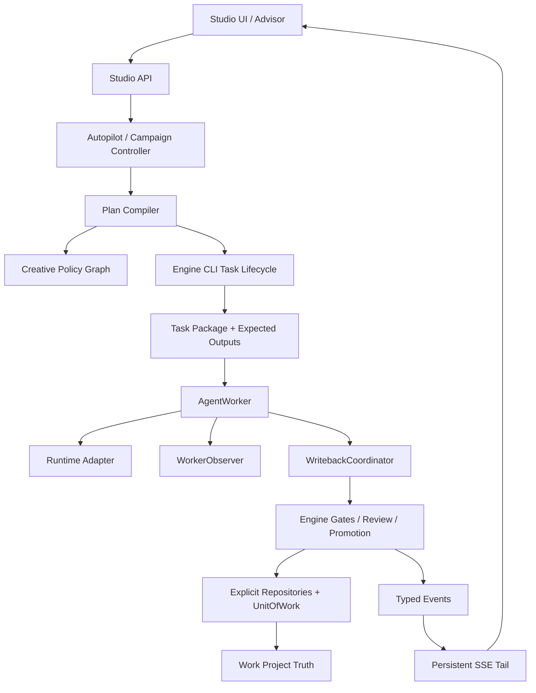

# ArcVellum W6 后分层代码、架构与文学逻辑审查及统一修正计划

> 审查日期：2026-08-08  
> 审查对象：`literary-engineering-studio` 当前 `release/v0.97.0` 工作树  
> 基准提交：`944bfb9`  
> 文档性质：事实审查、修正路线与验收合同；本文件不代表所列改造已经完成

## 1. 目的与边界

本轮审查不再只回答“哪些文件过大”，而是从七层检查当前工程：

1. 包边界和依赖方向是否清晰；
2. 类、值对象、继承、Mixin 与 Protocol 是否被正确使用；
3. 是否存在重复类型、重复算法或只有名称差异的多余类；
4. 关键状态机、运行时、时间与身份逻辑是否存在确定性缺陷；
5. W6 新增能力是合同、影子能力还是生产能力；
6. 固定文学流程与自适应编排是否既可靠又保留创作空间；
7. 测试与架构门禁能否阻止相同问题回归。

本文件是以下既有文档的“质量修正增量”，不替代它们：

- `docs/architecture/module-boundaries.md`
- `docs/roadmap/arcvellum-large-file-modularization-execution-plan.md`
- `docs/roadmap/arcvellum-v0.96-v1.0-integrated-engineering-implementation-plan.md`
- `docs/roadmap/arcvellum-adaptive-creative-orchestration-implementation-plan.md`
- `docs/architecture/reviews/w6-5b-active-plan-production-closure-review.md`
- `docs/architecture/reviews/w6-8-exit-audit.md`
- `docs/architecture/reviews/w6-10-v1-final-acceptance.md`

## 2. 审查依据与证据

本轮实际读取并交叉检查了：

- Studio 与 Engine 的目录、入口、模块边界和打包配置；
- CLI、正式任务生命周期、工作流状态、route audit 与 scene gate；
- Agent Worker、Autopilot、JobStore、任务包、沙箱与写回链路；
- AO-5 至 AO-8 的章节规划、Bundle、Session、Checkpoint、Campaign 和前端投影；
- SceneFacts、分支推演、Composition、Review、Promotion、状态与 Canon 写回；
- 当前 Architecture Audit、W6 验收文件和全量测试基线。

当前可复核基线：

| 项目 | 当前结果 | 解释 |
| --- | ---: | --- |
| Python 测试 | 830 passed，1 skipped | 回归面较完整，但不等于所有 W6 合同均已生产接线 |
| 前端测试 | 158 passed | 组件与投影测试较充分 |
| Architecture Audit | 0 cycle / 0 dependency violation / 0 duplicate route | 宏观边界健康 |
| 结构债务 | 34 个超大文件 / 220 个超预算函数 | 被基线容忍，尚未形成持续下降的 ratchet |
| 工作树起点 | clean | 本文创建前无未提交改动 |

## 3. 总体结论

### 3.1 结论摘要

ArcVellum 不是“架构失控”的项目。它的 Engine/Studio 边界、CLI 正式权威、任务包、沙箱、Review/Promotion Gate 与测试体系已经形成可靠骨架。当前主要问题是四类：

1. **局部重复与错误抽象**：相同的 `SceneFacts`、大量同构 Violation，以及仅服务一个宿主类的 Mixin，增加了维护成本。
2. **合同完成度高于生产接线度**：AO-5 至 AO-8 的部分能力已具备 schema、lint 和测试，却没有进入真实执行循环。
3. **少数确定性边界缺陷**：预算相等边界、时间比较、checkpoint 周期、bundle 身份等逻辑会在长跑中产生错误。
4. **文学流程可靠但偏模板化**：正式 Gate 很强，然而固定分支原型和固定五拍 Composition 可能把不同作品压成相似的创作路径。

### 3.2 分层成熟度

| 层 | 评价 | 成熟度 | 主要风险 |
| --- | --- | --- | --- |
| 包边界 | Engine/Studio 方向清晰，无循环依赖 | 高 | 旧兼容入口仍扩大打包面 |
| 正式任务生命周期 | CLI、task package、preflight、writeback 权威明确 | 高 | 大函数和静默异常增加定位成本 |
| 固定 scene-development | Gate 完整，正文晋升证据链扎实 | 高 | 流程复杂，错误诊断仍可能散落 |
| 自适应编排 | 计划、策略、风险和合同层完整 | 中 | 更像策略覆盖层，不是完整执行 DAG |
| W6 资源/长跑能力 | 合同和测试充分 | 中低 | Bundle、Session pool、Campaign 尚未全部生产接线 |
| 文学质量控制 | Canon、节奏、衔接、读者体验、文风、字数均入 Gate | 中高 | 分支和节拍生成过于确定性、易同质化 |
| 前端 AO-8 | 组件和只读投影已有 | 中低 | 路由隐藏，SSE 仍偏有限重放而非持续尾随 |
| 可维护性 | 测试多、规则清晰 | 中 | 34 个大文件、220 个复杂函数、Mixin 隐式依赖 |

## 4. 类、继承与值对象专项审查

### 4.1 不是“类越少越好”

当前工程中的大量 dataclass、Pydantic request 和 Protocol，多数承担明确的边界契约。仅因为字段相同就建立继承树，反而会制造错误的 `is-a` 关系。统一原则如下：

- 同一领域概念、同一加载规则、同一失败语义：合并为共享值对象；
- 只有字段形状相同、语义不同：保留独立类型，最多共享 Protocol；
- 只有一个宿主使用、靠宿主私有属性工作的 Mixin：优先组合；
- 需要稳定捕获边界的异常：保留继承；
- 仅为 OpenAPI 名称存在的空子类：明确其接口价值，否则删除或别名化。

### 4.2 类与类型决策矩阵

| 现状 | 判定 | 修正方式 | 原因 |
| --- | --- | --- | --- |
| `branching/lab.py::SceneFacts` 与 `composition/composer.py::SceneFacts` 完全重复 | 必须合并 | 新建 `literary/scene/facts.py`，只保留一个冻结值对象和一个加载器 | 属于同一概念，当前双实现会产生语义漂移 |
| 两处 `_parse_scene`、`_scalar`、`_list_value` 正则 YAML 解析 | 必须替换 | 使用 `ruamel.yaml` 结构化解析并做 schema 校验 | 正则会误读引号、逗号、嵌套列表，直接污染文学推演事实 |
| 14 个仅含 `code/message` 的 `*Violation` | 有条件收敛 | 引入 `ContractViolation`；公开名称有价值时用 alias 或薄包装 | 不值得建立 14 层继承，也不应继续复制 |
| `LiteraryPolicyViolation`、`WriterPolicyViolation` 同为 `code/message/related` | 合并共享合同 | 使用统一 `PlanPolicyViolation`，或直接复用 `PlanIssue` | 两者属于计划编译期问题，已有更完整问题模型 |
| `AIStyleIssue` 与 `PunctuationIssue` 同为 `rule/severity/message/sample` | 共享值合同 | 引入 `TextStyleIssue`，规则命名空间保持分离 | 检测器不同，但输出证据同构 |
| `ReplanDecision` 与 `RepairDecision` 字段相同 | 保留 | 可共享只读 Protocol，不合并实体 | “是否重规划”和“是否修复”语义及未来字段不同 |
| Studio 与 Engine 各自的 `StyleCompileRequest` / `StyleMountRequest` | 保留并消歧 | 保持传输边界独立；必要时改成 `StudioStyle...` 与 `EngineStyle...` | 跨边界 DTO 字段不同，强行继承会耦合 API |
| `ArchiveStructuredContentRequest(ArchiveAssetContentRequest): pass` | 复核后删除或别名 | 若无独立 OpenAPI schema 需求，直接使用基类 | 当前为空子类，没有行为差异 |
| `ArchiveAssetCreateCommitRequest` 继承 Preview 并增加 digest | 保留 | 无需修改 | 真实的“提交请求是预览请求的扩展”关系 |
| `StyleVersionConflictError` 等冲突异常子类 | 保留 | 无需修改 | 调用方需要稳定捕获冲突边界 |
| `KnowledgeStoreBackend` 只有单实现 | 暂缓 | 第二实现确定前不继续扩展抽象 | Protocol 目前收益有限，但删除需考虑外部兼容 |
| `SceneGenerationProvider` 与旧 HTTP provider | 隔离 | 迁移至 legacy/compat 表面，禁止进入 Studio runtime | 与当前受控 Agent Worker 路线形成第二模型通道 |

### 4.3 `SceneFacts` 是最高优先级重复

当前两个 `SceneFacts` 拥有相同字段：

- `scene_id`、`chapter_id`、`location`、`participants`；
- `canon_refs`、`active_foreshadowing`；
- `scene_goal`、`external_conflict`、`internal_conflict`；
- `style_constraints`、`next_hooks`。

它们分别被分支推演和编剧模块解析，意味着同一份场景 YAML 可能被两套正则解释成不同事实。修正目标不是抽一个父类，而是建立单一事实入口：

```text
scenes/scene_*.yaml
  -> load_scene_facts()
  -> SceneFacts
  -> branch simulation
  -> composition
  -> review evidence
```

加载器必须：

1. 使用结构化 YAML API；
2. 保留中文标点、引号、列表和多行文本；
3. 明确缺失字段与空字段的区别；
4. 返回规范化路径和来源 digest；
5. 对未知字段保留向前兼容策略；
6. 通过复杂 YAML fixture 与往返测试。

### 4.4 Mixin 不是本项目的最佳拆分手段

`JobStore` 当前继承九个 Mixin。各 Mixin 依赖宿主的 `_write_lock`、`_connection` 和兄弟模块私有事务函数，仅有 `JobStore` 一个实际使用者。这降低了单文件行数，却没有真正拆开责任。

目标结构应逐步改为组合：

```text
JobStore                         # 向后兼容门面
  -> SqliteUnitOfWork            # 连接、事务、迁移边界
  -> JobRepository
  -> SessionRepository
  -> AutopilotRepository
  -> CreativePlanRepository
  -> AssetRepository
  -> ContextLedgerRepository
```

迁移要求：

- 保留 `JobStore` 公共 API，内部逐个委托；
- 每批只迁移一个 repository；
- 事务由 `SqliteUnitOfWork` 统一拥有，repository 不自行提交；
- 禁止 repository 读取其他 repository 的私有函数；
- 先做 characterization tests，再迁移；
- 数据库 schema 与 migration 仍保持单一所有者。

`AgentWorker(WorkerWritebackMixin, WorkerObservabilityMixin)` 同样应逐步替换为：

```text
AgentWorker
  -> WorkerObserver
  -> WritebackCoordinator
  -> RuntimeAdapter
  -> SandboxExecutor
```

这不是为了“消灭继承”，而是让依赖显式、构造可测试、失败边界可观察。

## 5. 模块与架构质量审查

### 5.1 健康部分

- Engine 不反向导入 Studio；
- Studio 负责运行时、生命周期、沙箱、进程和 UI；
- Engine 负责文学状态机、schema、Gate、Review、Promotion、Canon 与导出；
- CLI 任务生命周期是正式权威，前端和 Worker 没有建立另一套 truth；
- route audit、preflight 和 promotion 会重新验证证据，不只相信 Agent 声明；
- 当前未发现 import cycle、依赖越界或重复路由。

这些边界必须保持，不应为了减少文件数把 Engine 与 Studio 重新揉合。

### 5.2 复杂度热点

当前 Architecture Audit 报告 34 个超大文件、220 个超预算函数。最危险的不是最长文件，而是同时承担解析、决策、写回和错误呈现的高复杂函数：

| 符号 | 当前复杂度特征 | 建议边界 |
| --- | --- | --- |
| `command_line/commands/formal.py::handle` | complexity 83，约 309 行 | 参数解析、任务派发、结果呈现分开 |
| `candidate.py::candidate_review_gate` | complexity 76，约 201 行 | 证据加载、确定性 lint、AgentReview、决策汇总分开 |
| `command_line/commands/scene.py::handle` | complexity 74，约 322 行 | 子命令 handler 注册表 |
| `candidate.py::candidate_generation_gate` | complexity 68 | 各合同 validator 组合化 |
| `tasking/package_contract.py::render_task_markdown` | complexity 67 | section renderer + schema 驱动 |
| `automation/controller.py::_run_claimed` | complexity 64，约 237 行 | 执行循环、重试、授权、失败分类分开 |
| `workflow/state.py::build_workflow_state` | complexity 61 | route projector 分离 |
| `workflow/audit/scene.py::_add_scene_development_gates` | complexity 51，约 417 行 | 每类 gate 形成纯函数并保留统一顺序 |

处理顺序应按“故障半径 × 变化频率 × 复杂度”排序，而非单纯按行数。`create_app` 一类虽长但复杂度低的装配文件，不应先于上述执行核心重构。

### 5.3 重复函数的处理原则

已发现的重复包括：

- 多份 canonical JSON digest；
- `_approval_record_for_run`；
- `_canon_change_value`；
- DAG `_ancestors`；
- 多份 `_to_int`、`_unique`、`_read_optional_json`。

统一策略：

| 类型 | 是否共享 | 目标位置 |
| --- | --- | --- |
| Canonical JSON 与 digest | 是 | `foundation/canonical.py` |
| DAG ancestry/topology | 是 | `orchestration/graph_algorithms.py` |
| 审批记录解析 | 是 | `tasking/evidence/approval.py` |
| Canon change 取值 | 是 | Canon 领域模块 |
| 路由公共数值规范化 | 仅同语义共享 | `routes/common/coercion.py` |
| 任意 `_read_json` | 否，默认不共享 | 读取失败、缺失与 strictness 语义经常不同 |

不要创建一个无边界的 `utils.py`。共享代码必须有明确领域所有者。

### 5.4 兼容门面与打包表面

Engine 根目录存在大量通过 `sys.modules[__name__] = import_module(...)` 实现的兼容 shim。兼容本身不是错误，但当前缺少：

- shim 的外部调用者；
- 引入版本；
- 计划退役版本；
- canonical import；
- 是否仍进入生产包。

修正方式：建立 `compatibility-manifest.yaml`，逐项记录 owner、consumer、canonical target、deprecation window。先迁移内部与测试引用，再经过至少一个发行窗口删除零消费者 shim。禁止一次性清理，避免破坏现有 skill、CLI 或第三方脚本。

旧 `HttpChatProvider`、`DryRunProvider` 和 Engine legacy API 应做生产表面审计。它们不能成为绕开 Studio Agent Runtime、任务包和沙箱的第二执行链。若必须保留兼容，则迁入明确的 `legacy/` 命名空间并从默认入口隐藏。

## 6. 已确认的代码逻辑问题

### P0-1 Session Lease 边界错误

位置：`runtime/session_lease.py::session_reusable`

当前在已使用预算 `>` 上限时才拒绝复用，因此“恰好耗尽”仍被认为可复用。对 token、时间和失败次数应统一定义：

```text
used >= limit  -> 不可复用
```

同时明确 `limit == 0` 是禁用复用还是无限制，不能依赖偶然比较结果。

### P0-2 Checkpoint 时间使用字符串比较

位置：`orchestration/checkpoint.py`

ISO 字符串在时区偏移或格式不一致时不能可靠表示先后。必须：

- 解析为 timezone-aware datetime；
- 统一转 UTC；
- 拒绝无效或无时区时间；
- 序列化时使用固定格式。

### P0-3 Campaign Checkpoint 会重复到期

位置：`orchestration/campaign.py::checkpoint_due`

当前没有正确使用 `last_checkpoint_step`。当完成步数等于上次 checkpoint 步数时，可能持续返回 due。应按增量判断下一阈值，并覆盖重启、回退和步数跳跃。

### P0-4 Bundle 身份不包含版本与上下文

位置：`orchestration/bundles.py`

当前 `bundle_id` 主要由 plan、template、scope 和节点 ID 构造，没有纳入 plan revision、base fingerprint 或 context snapshot。相同节点在新版本和新上下文下可能碰撞。

Bundle 身份至少包含：

- `plan_id` 与 `plan_revision`；
- 编译后 graph digest；
- context snapshot digest；
- scope 与 ordered node ids；
- compiler contract version。

### P0-5 `stop_before` 仅被编译，没有生产执行者

`ExecutionBundle.stop_before` 已进入合同与测试，但尚无生产 executor 强制执行。它目前是“声明”，不是“门禁”。在 Bundle Executor 接线前，UI 和文档不得把它描述为已生效的并发安全能力。

### P0-6 Chapter Planning Facts 过度 fail-open

位置：章节事实加载和 `chapter_facts_violations`

当前可能允许以下数据形成“通过”的 horizon：

- `base_project_revision` 为空；
- chapter word target 缺失或为零；
- rhythm hash 为空；
- obligations 为空且无解释。

生产模式必须要求事实完整；shadow 模式可以降级为 warning，但要在结果中标记 `incomplete_evidence`，不能产生与正式计划同等级的“通过”。

### P0-7 控制路径中的静默异常

在 automation、projection、runtime 清理路径存在若干宽泛 `except Exception`。有些属于合理的清理边界，但控制循环中的静默吞错会表现为“Agent 空转”或“流程卡住”。

修正要求：

- 先分类 cleanup boundary 与 control boundary；
- control boundary 必须产生 typed failure event；
- cleanup boundary 可以 best-effort，但要有 debug trace/counter；
- 禁止全局机械替换所有 broad catch。

## 7. W6 合同与生产接线审查

### 7.1 需要使用四级成熟度标记

以后每项能力必须标注：

1. `contract_only`：只有 schema、纯函数和单元测试；
2. `shadow_validated`：读取真实项目，但不影响正式 truth；
3. `production_wired`：进入正式执行链并受 Gate 约束；
4. `user_visible`：前端可操作、可观察、有恢复路径。

当前部分 W6 文档把“完成”用于合同完成，容易被理解成产品完成。建议对能力注册表和前端状态统一展示上述成熟度。

### 7.2 当前生产接线缺口

| 能力 | 当前状态 | 缺口 |
| --- | --- | --- |
| Chapter Horizon | 合同/影子能力 | 正式 planner 消费、失败降级、来源证据 |
| Execution Bundle | 合同能力 | 生产 executor、读写集锁、`stop_before` 强制 |
| Session Lease | 合同能力 | runtime session pool 调用、耗尽回收、断线恢复 |
| Campaign/Checkpoint/Recovery | 合同能力 | 持久执行循环、恢复阶梯、进度证明、防空转 |
| Strategy typed SSE | 有限事件投影 | 持续 tail、重连 cursor、背压和关闭语义 |
| Strategy/Observatory 页面 | 组件存在 | 正式路由和用户可见状态；应等生产接线后开放 |

### 7.3 `CompiledTaskGraph` 的命名与边界

当前图主要覆盖创造性策略节点，并把机械正式状态交还固定生命周期。它并不是覆盖所有 task/Gate/writeback 的完整工作流 DAG。

建议：

- 在代码文档中定义为 `Creative Policy Graph` 或 `Strategy Overlay Graph`；
- 若保留类名，必须在 docstring 和 UI 明示其范围；
- 不要让 Campaign/Bundle 直接把它当完整执行图；
- 由 Plan Compiler 把策略覆盖层映射到正式 CLI task lifecycle，正式 Gate 仍由 Engine 拥有。

## 8. 文学逻辑审查

### 8.1 已经可靠的部分

当前 scene-development 并非只靠提示词。正式链路实际检查：

- Context packet 与 trace；
- RP task 与完成回执；
- Branch manifest、正式选择和来源；
- Composition 任务、文风和创作品质 digest；
- 字数预算、读者体验、叙事节奏与 Scene Bridge；
- 正文 provenance、Style Lint 与精确候选 AgentReview；
- Promotion manifest 与 promoted draft；
- 静态审查、人物状态、Canon patch、Continuity ledger；
- 修订后 exact-source 复核。

因此下一阶段不应再造第二套 Canon、节奏或 Review 系统。重点应是减少重复解析、增强诊断、提高文学策略多样性。

### 8.2 分支候选过于模板化

`literary/scene/branching/lab.py::_build_candidates` 使用固定顺序的候选原型，例如人物必然性、外部压力、伏笔回收、道德代价、安静余波，再按 `branch_count` 截取。

优点：结果稳定、容易比较、不会空白。  
风险：不同题材、场景功能和叙事传统可能长期生成同构分支，只是替换人物与名词。

修正方向：

1. 固定原型降级为 fallback seed，不作为正式候选全集；
2. 平台主创 Agent 基于 SceneFacts、BDI、Canon、节奏和读者问题生成 2-5 个场景特定候选；
3. 每个候选必须声明 `causal_premise`、`action_chain`、`cost`、`reader_effect`、`state_writeback`；
4. 确定性层做 schema、因果、Canon、重复度和分支距离检查；
5. 分支差异不能只是换措辞或换结果，必须改变行动机制或代价结构；
6. 当 Agent 失败时才回退到当前固定原型。

### 8.3 固定五拍 Composition 可能压平场景

当前 Composition 的固定 beat scaffold 有利于防止摘要式正文，但若被 Agent 当成必须逐项展开的结构，会让过场、冲突、余波、群像和意识流场景共享同一骨架。

建议改为“固定文学义务 + 可变节拍”：

- 机器强制：scene goal、scene turn、incoming bridge、outgoing hook、代价与字数目标；
- Agent 决定：beat 数量、顺序、长短、叙事距离和信息释放方式；
- 过场可以 2-3 beats，高潮可以 5-8 beats；
- Review 检查功能和因果，不检查是否恰好五拍；
- 保留现有五拍模板作为失败回退和新手模式。

### 8.4 自适应编排的文学闭环

当前固定路线能够阻止 Agent 跳过 Gate；未来开放编排自由时，应区分：

- Agent 可增加、重排或并行分析任务；
- Agent 可选择 RP 深度、分支数和修订策略；
- Agent 不可删除 promotion、state、canon、continuity、review 和 word budget 义务；
- 机械节点可以由 Compiler 隐式插入，但必须出现在执行证明中；
- 每轮重规划必须增加可验证作品状态，防止无限分析。

建议扩展 `literary_policy`：不仅检查 prose 前驱和 review 后继，还明确声明正式闭环节点由固定生命周期托管。这样未来 Campaign 和 Bundle 不会把“策略图中没有某节点”误认为“可以省略该 Gate”。

### 8.5 文学质量验收不能只看 JSON 合法

新增一组跨题材黄金语料，不追求唯一答案，而检验结构性质：

- 历史叙事、悬疑、现实主义、群像、喜剧、意识流、剧本场景；
- 同一 SceneFacts 多次生成时，分支因果机制具有实质差异；
- 过场与高潮产生不同 beat 密度和叙事距离；
- Canon、人物 BDI、承诺/兑现、字数与节奏仍全部通过；
- Review 能区分“风格需要的修辞”与机械 AI 句式；
- 修订不以另一种生硬转折替代已检出问题。

## 9. 测试与质量门禁审查

### 9.1 当前优势

- 单元与集成测试数量充足；
- route gate、task package、preflight、autopilot 均有大量失败路径；
- Architecture Audit 已能发现循环、边界和复杂度债务；
- W6 各阶段保留了 review/exit audit 证据。

### 9.2 当前盲区

- Architecture Audit 对既有 34/220 债务仍返回成功，没有强制下降；
- 缺少 Session Lease 相等边界测试；
- 缺少不同时区 checkpoint 比较测试；
- 缺少 checkpoint 重复到期测试；
- 缺少跨 plan revision/context 的 bundle identity 测试；
- 缺少 chapter facts 生产 strict/shadow permissive 的差异测试；
- 缺少复杂 YAML 对 SceneFacts 的属性/模糊测试；
- W6 合同测试多，生产调用证据测试不足；
- 若干测试文件自身已接近或超过千行，定位和 fixture 复用成本升高。

### 9.3 新的 Ratchet

不要立刻要求 34/220 清零。建议：

1. 新增文件不得超过预算；
2. 被修改的高风险函数复杂度不得上升；
3. P0 执行链函数先全部降到 complexity <= 50；
4. 每个版本至少消减一个被列名的 P0/P1 hotspot；
5. 架构报告同时输出 `new_debt`、`resolved_debt` 和 `remaining_debt`；
6. 生产能力必须有“真实调用路径”测试，不能只证明纯函数存在。

## 10. 统一目标架构



不可破坏的方向：

- UI 不成为正式 truth；
- Worker 不直接绕过 CLI 生成正式产物；
- Adaptive plan 不取代 Engine Gate；
- Studio 不引入另一套文学状态机；
- Engine 不反向依赖 Studio runtime；
- 组合式 repository/worker collaborator 不复制现有业务逻辑。

## 11. 统一修正实施计划

### Phase Q0：修复确定性合同错误

**目标**：先修会导致长跑错误、身份碰撞或虚假“通过”的问题。

任务：

1. 修复 Session Lease `>=` 边界并定义 zero-limit；
2. Checkpoint 时间改为 timezone-aware UTC；
3. 修复 checkpoint 增量到期算法；
4. Bundle ID 纳入 revision、graph/context digest；
5. chapter facts 增加 production strict 与 shadow warning；
6. 控制路径 broad catch 输出 typed failure event；
7. 能力注册表增加四级 maturity。

必须增加的测试：

- 每种 lease 预算的 `<`、`==`、`>`；
- UTC/Z/正负 offset、无效和 naive timestamp；
- checkpoint 0/首次/重复/跨间隔/恢复；
- 相同节点不同 revision/context 不同 bundle ID；
- production 缺字数、节奏、obligation、revision 时 fail closed；
- shadow 只给 warning 且不能冒充正式计划。

退出条件：

- 所有 P0 缺陷有失败先行测试；
- 全量后端、前端和 architecture audit 通过；
- 无 schema 静默变更；
- 形成独立 Git commit，便于回滚。

### Phase Q1：建立单一语义事实与问题模型

**目标**：消除会造成行为漂移的重复，不做泛化式工具箱。

任务：

1. 建立共享 `SceneFacts` 与 `load_scene_facts()`；
2. 分支、Composition、Review 统一消费该事实；
3. 建立 canonical JSON/digest 单一实现；
4. 建立共享 DAG algorithms；
5. 将同构 Violation 迁移到共享值合同；
6. 路由审批证据与 Canon change helper 归位；
7. 保留语义不同的 Decision、API DTO 和异常类型。

迁移顺序：

```text
characterization tests
  -> shared implementation
  -> one consumer migration
  -> compare old/new output
  -> second consumer migration
  -> remove duplicate
```

退出条件：

- 项目内只有一个 `SceneFacts` 定义和 YAML 解析器；
- 复杂中文 YAML fixture 无信息截断；
- public serialization 不变或有明确 migration；
- 不新增无边界 `utils.py`。

### Phase Q2：用组合替代隐式 Mixin 耦合

**目标**：让 Store 与 Worker 的依赖可见、可独立测试。

任务批次：

1. 引入 `SqliteUnitOfWork`，不改公共 API；
2. 先迁移 Session/Autopilot repository；
3. 再迁移 CreativePlan/Asset/ContextLedger；
4. `JobStore` 保持 facade 并委托；
5. 提取 `WorkerObserver`；
6. 提取 `WritebackCoordinator`；
7. 最后删除不再使用的 Mixin。

禁止：

- 同一批重写 schema、事务和 API；
- repository 自行提交事务；
- 新 facade 再复制一份 SQL；
- 为每张表创建无行为 class。

退出条件：

- repository 可用内存/临时 SQLite 独立测试；
- `AgentWorker` 不再依赖 Mixin 注入的私有属性；
- 任务恢复、幂等写回、并发锁语义不变；
- 关键 facade 保持兼容。

### Phase Q3：拆解执行核心，而不是机械拆文件

**目标**：降低最危险的决策复杂度。

优先顺序：

1. `candidate_review_gate` 与 `candidate_generation_gate`；
2. `AutopilotService._run_claimed`；
3. scene/formal CLI handlers；
4. task package renderer；
5. scene audit gate builder；
6. workflow-state projectors。

每个拆分必须满足：

- 提取的是可命名业务阶段；
- 输入输出是显式值对象；
- 错误类型不丢失；
- 原入口只负责编排；
- 先用 characterization test 锁定行为；
- 与大文件拆分计划使用同一模块归属。

退出条件：

- 上述生产关键函数 complexity 均不超过 50；
- 每次提交只重构一个边界；
- 不增加第二套任务生命周期；
- architecture debt 呈净下降。

### Phase Q4：提升文学策略多样性

**目标**：在不削弱 Gate 的前提下，让 Agent 决定创作路径，而非让确定性代码替它写文学。

任务：

1. 新增 scene-specific branch proposal schema；
2. 固定五类分支降级为 fallback；
3. 增加分支因果差异、代价差异、状态写回差异检查；
4. Composition 改成 variable beats；
5. 固定义务仍包括 goal/turn/bridge/cost/reader effect/word target；
6. 将 RP 深度、分支数、修订策略交给 Creative Policy Graph；
7. 建立跨题材文学 fixtures 和盲评量表。

评价指标：

- 分支间行动机制差异，而非词面差异；
- 不同 scene function 的 beat 数量和节奏分布显著不同；
- Canon、BDI、节奏、字数、Reader Experience 通过率不下降；
- 失败时可确定性回退到现有模板；
- 正文仍只能由主创 Agent 完成。

### Phase Q5：把 W6 合同逐层接入生产

**目标**：一次只接一层，避免“合同全部存在但运行时难以判断实际生效”。

顺序：

1. Chapter Facts/Horizon 正式输入；
2. Bundle Executor，先串行执行并强制 `stop_before`；
3. Resource Gate 与读写集锁；
4. Session pool 与 lease 回收；
5. 只并发机械分析/Review，不并发正文主创；
6. Checkpoint/Recovery；
7. Campaign 长跑和防空转证明；
8. 真正持续的 typed SSE。

每层启用要求：

- feature flag 默认关闭；
- shadow 与 production 指标可比较；
- 有固定路线 fallback；
- 有真实调用路径测试；
- 有异常恢复与 kill switch；
- 不因吞吐优化削弱 Review/Promotion/Canon Gate。

### Phase Q6：前端开放与兼容表面收敛

**目标**：只展示真实能力，减少旧入口和误导。

任务：

1. 生产策略链稳定后再开放 Strategy/Observatory 路由；
2. SSE 支持 cursor、断线续传、背压和 terminal event；
3. UI 显示能力 maturity，不把合同能力写成“正在执行”；
4. 建立 compatibility manifest；
5. 内部 import 迁移到 canonical modules；
6. 至少一个发行窗口后删除零消费者 shim；
7. 审计 wheel/installer，确保 legacy provider 不成为默认运行入口。

## 12. 提交、验证与回滚纪律

每个 Phase 必须按以下闭环执行：

```text
读取本文件与对应专项计划
  -> 确认当前 Git 基线
  -> 写失败先行测试/characterization test
  -> 最小实现
  -> 定向测试
  -> 全量测试
  -> architecture audit + diff check
  -> 更新 review 证据
  -> 单一职责 commit
```

推荐提交粒度：

- `fix(contract): ...`
- `refactor(scene-facts): ...`
- `refactor(store): ...`
- `refactor(worker): ...`
- `feat(literary-policy): ...`
- `feat(runtime): wire ... behind feature flag`
- `docs(architecture): ...`

任何阶段失败时优先回滚本批 commit，不回滚用户数据或无关改动。

## 13. 统一验收标准

### 13.1 架构

- 0 import cycle；
- 0 Engine -> Studio 依赖；
- 0 新重复 route；
- 0 第二任务生命周期；
- 0 默认 legacy HTTP provider 路径；
- 高风险函数复杂度持续下降；
- Architecture Audit 报告新增/消减债务，而非只接受历史基线。

### 13.2 类型与代码

- 只有一个 SceneFacts 和一个结构化加载器；
- 不再新增同构 Violation dataclass；
- JobStore/AgentWorker 的核心依赖通过构造或显式 collaborator 表达；
- 时间、预算边界和 identity 均有边界测试；
- 控制路径异常可观察，不静默空转。

### 13.3 运行时

- Bundle `stop_before` 在生产执行者中真正生效；
- Session lease 用于实际会话复用与回收；
- Campaign 可证明每轮状态推进，无法推进时产生明确 terminal/decision 状态；
- SSE 是持续事件流，不只是有限历史列表重放；
- 固定正式路线始终可以回退。

### 13.4 文学

- 固定 Gate 完整保留；
- 分支候选具有场景特定因果与代价；
- beat 结构服从 scene function 和 rhythm，而非固定五拍；
- 字数、Canon、BDI、Reader Experience、Bridge、Style、Review 全部保持强约束；
- 跨题材测试表明结构多样性提高，事实错误率不升高；
- 主创 Agent 独占正文创作，subagent 只执行机械或审查工作。

## 14. 明确不做的事

- 不因字段相同建立庞大继承树；
- 不为减少行数创建更多空壳类；
- 不把所有 helper 集中到 `utils.py`；
- 不一次性删除兼容 shim；
- 不把 AO-5 至 AO-8 的合同完成误报为生产完成；
- 不以并发或 token 优化绕过文学 Gate；
- 不让确定性算法替代 Agent 的创意判断；
- 不重建 Canon、节奏、Reader Experience 或 Review 的平行系统；
- 不在同一提交中同时改事务、schema、API 和文学行为。

## 15. 建议执行优先级

```text
Q0 确定性正确性
  -> Q1 SceneFacts 与共享语义
  -> Q2 Store/Worker 组合化
  -> Q3 高风险复杂函数拆解
  -> Q4 文学策略多样性
  -> Q5 W6 生产接线
  -> Q6 UI 开放与兼容清理
```

其中 Q0、Q1 是稳定性前置；Q2、Q3 是可维护性前置；Q4 是文学质量增益；Q5 决定 W6 是否从“合同系统”成为“生产系统”；Q6 必须建立在真实后端能力之上。

## 16. 最终评价

ArcVellum 当前最值得保留的是正式文学 Gate、CLI 任务权威、Engine/Studio 边界和证据化测试。最需要修正的不是“再加更多类”，而是让少数重复概念回到单一事实源，让隐式 Mixin 依赖变为显式组合，让 W6 合同如实进入生产链，并把文学创意从固定候选模板中释放出来。

按本计划执行后，目标不是把代码压缩到最少，而是实现：

> **每个概念只有一个可信实现，每个运行能力都有真实调用证据，每个文学 Gate 都不可绕过，而创作策略本身仍保有足够自由。**

## 17. 阶段执行记录

### 2026-08-08：Q0-A 确定性合同修复

状态：完成，待独立提交。

已完成：

- Session Lease 在 token、时间或失败预算恰好耗尽时拒绝复用；
- 三类复用上限必须大于零，消除零值歧义；
- Checkpoint 使用 timezone-aware UTC instant 比较，拒绝无效和无时区时间；
- Campaign 按“距上次 checkpoint 的新增步数”判断到期，不再重复发放同一 checkpoint；
- Campaign 拒绝 `last_checkpoint_step > completed_steps`；
- Bundle ID 升级为 v2，纳入 plan revision、project fingerprint、graph digest 与 context snapshot；
- Chapter Facts loader 写入真实 planning fingerprint；
- Chapter Facts 增加 structural/production 两种验证模式；
- production 模式要求章节/场景字数、节奏合同、显式义务合同、场景功能与 pace；
- 义务列表为空不再等同于义务合同缺失。

验证证据：

- 定向失败先行测试先确认 7 failures + 1 import error；
- 修复后 50 个定向测试通过；
- `tests/orchestration`：181 tests passed；
- `tests/runtime`：17 tests passed；
- `git diff --check`：通过。

审查修正：初始测试曾把“缺少 plot 文件”错误解释为“缺少 scene function”；实际场景 YAML 已提供该事实，因此修正测试而未降低生产验证标准。

### 2026-08-08：Q1-A SceneFacts 单一事实入口

状态：完成，待独立提交。

已完成：

- 新增 `literary/scene/facts.py`，成为唯一 `SceneFacts` 定义；
- 分支推演与 Composition 统一调用 `load_scene_facts()`；
- 删除两份重复 dataclass、两份 `_scene_facts` 和两组正则 `_scalar/_list_value`；
- 使用 `ruamel.yaml` 读取正式嵌套结构；
- Canon refs、active foreshadowing、冲突和 next hooks 按模板真实路径解析；
- 保留旧顶层字段回退，避免破坏既有项目；
- 新增中文逗号、引号、折叠多行、嵌套列表、旧格式和非法 YAML 测试。

验证证据：

- 失败先行测试先以缺少共享模块失败；
- `tests.test_scene_facts`：3 tests passed；
- 分支、Composition、场景合同相关回归：8 tests passed；
- `python -m compileall -q src`：通过。

架构判断：这里采用单一值对象而非父类/子类，因为两处代码描述的是完全相同的文学事实；继承只会保留双解析与语义漂移。

### 2026-08-08：Q1-B 共享 Violation 与图算法

状态：完成，待独立提交。

已完成：

- 新增 `ContractViolation(code, message)`；
- 14 个完全同构的领域 Violation 改为兼容别名，不再保留空壳类；
- 新增 `RelatedContractViolation`，仅为确实携带 `related` 证据的计划策略问题扩展字段；
- `LiteraryPolicyViolation` 与 `WriterPolicyViolation` 统一到该扩展值对象；
- 新增共享 `graph_ancestors`、`graph_descendants`、`nodes_are_ordered`；
- Compiler、Simulator、Literary Policy 与 Writer Policy 删除四份重复传递遍历；
- 图算法在意外循环输入下终止，并且不把起点误算成自己的祖先。

保留决策：

- `SceneStrategyViolation` 仍保留，因为它携带 `node_ids`，不是两字段重复类；
- Replan/Repair decision 继续分离；
- Studio/Engine API DTO 继续保持传输边界隔离。

验证证据：

- 新增 6 个共享合同/图算法测试；
- 相关策略、Compiler、Simulator、Runtime 定向回归共 62 tests passed；
- `tests/orchestration`：185 tests passed。

### 2026-08-08：Q1-C Canonical JSON 单一实现

状态：完成，待独立提交。

已完成：

- 新增 `protocols/canonical_json.py`；
- 统一持久计划、审计完整性、Context Ledger、Mutation Receipt、Context Rollout、Execution Context 与考古投影的完整 SHA-256 实现；
- Compiler/Lint 在 `to_primitive()` 后使用同一实现；
- 原有 `audit_integrity.canonical_json_digest` 导入表面保持兼容；
- 非 JSON 值继续 fail closed，不用 `default=str` 掩盖类型错误。

刻意保留：

- 前端投影和 observability 的 12/16/20 位短 ID；
- 使用默认 JSON 空格格式的历史 revision 摘要；
- 明确允许 `default=str` 的非正式展示摘要。

这些摘要具有不同持久化或展示语义，强行改成 canonical full digest 会造成历史身份变化。

验证证据：

- 固定中文 payload 的 canonical bytes 与已知 SHA-256 回归；
- 非 JSON dataclass 拒绝测试；
- 计划、持久化、上下文、Mutation、考古相关回归共 60 tests passed。

### 2026-08-08：Q2-A Autopilot 持久化组合化

状态：完成，准备独立提交。

已完成：

- 新增 `SqliteUnitOfWork`，集中持有 SQLite 连接参数、WAL/外键/busy timeout、事务提交回滚和进程内写锁；
- 新增显式构造注入的 `AutopilotRepository`；
- `JobStore` 不再继承 Autopilot 领域实现，而是组合 `autopilot_runs` 仓储；
- `JobStore` 保留全部历史公开方法，并以明确签名委托，避免破坏 Controller、API 和测试调用方；
- 租约抢占使用 `write(immediate=True)`，其余读写保持原有事务语义；
- `_connect/_connection` 暂时委托 Unit of Work，供尚未迁移的旧领域使用，避免一次性重写九个持久化模块；
- 删除内部 `AutopilotStoreMixin` 类型；正式兼容面是 `JobStore` 的公开方法，不提供无法兑现继承行为的虚假别名。

批判性审查：

- 没有使用 `__getattr__` 或动态绑定隐藏委托关系；
- 初稿的通用 `*args/**kwargs` 门面会损失 IDE 签名与静态检查，提交前已改为明确签名；
- 本批只迁移 Autopilot，未同时改 Session、数据库 schema 与应用服务，符合“小步替换，不把事务/API/schema 变更混在一批”的约束；
- Unit of Work 不是新增空抽象：Autopilot 已成为首个真实生产消费者，旧领域也共享其连接策略。

验证证据：

- 新增组合关系与事务回滚测试；
- `tests.test_persistence_composition`、`tests.test_modular_runtime_imports`、`tests.test_autopilot`：32 tests passed；
- 覆盖全自动三章、授权续期、租约恢复、进度防空转与重启持久化；
- `python -m compileall -q src/literary_engineering_studio/persistence`：通过；
- `git diff --check`：通过。

下一批入口：把 Session/Advisor/Reader 持久化迁到同一 Unit of Work 与显式仓储，再评估剩余七个 Store Mixin 的优先级；不直接开始数据库大改。

### 2026-08-08：Q2-B Session/Advisor/Reader 持久化组合化

状态：完成，准备独立提交。

已完成：

- `SessionRepository` 通过 `SqliteUnitOfWork` 显式获得读写事务；
- `JobStore` 不再继承 Session 领域实现，而是组合 `sessions` 仓储；
- Advisor 对话、Agent 会话、主动通知、授权策略和阅读进度的历史公开 API 保持不变；
- Advisor 消息序号分配继续使用 `BEGIN IMMEDIATE`，避免并发序号冲突；
- 删除内部 `SessionStoreMixin` 类型；正式兼容面继续由 `JobStore` 公开方法承担；
- 新增组合关系和持久化消息回读测试。

批判性审查：

- `JobStore` 因显式兼容委托增加了低复杂度代码；这是可搜索、可类型检查的迁移成本，优于 `__getattr__`、运行时方法注入或继续隐式共享私有状态；
- 该门面长度不能成为永久状态。后续核心 Job/Event/Lock 自身仓储化后，应让 `JobStore` 只负责仓储装配与兼容委托，并单独审查 API 退役策略；
- 没有借迁移修改 schema、Advisor 文案、Reader 投影或 Agent 状态语义，避免架构重构与产品行为混批。

验证证据：

- `tests.test_persistence_composition`、`tests.test_advisor`、`tests.test_advisor_inbox`、`tests.test_agent_session_tracking`、`tests.test_reader`：23 tests passed；
- 覆盖项目快照预算、会话重启恢复、通知去重、上下文账本绑定和大体量阅读缓存；
- `python -m compileall -q src/literary_engineering_studio/persistence`：通过；
- `git diff --check`：通过。

下一批入口：审计其余 Store Mixin 的领域耦合与收益，不按文件数量机械迁移；优先选择能减少跨模块私有调用的边界，然后转入 Worker 组合化。

### 2026-08-08：Q2-C Context Ledger 持久化组合化

状态：完成，准备独立提交。

已完成：

- `ContextLedgerRepository` 通过 `SqliteUnitOfWork` 显式持有事务能力；
- `JobStore` 不再继承 Context Ledger 实现，而是组合 `context_ledgers` 仓储；
- 记录、读取、列表三个历史 API 以明确签名兼容；
- 同一 ledger identity 的冲突检测继续在 `BEGIN IMMEDIATE` 事务中完成；
- Context Ledger 仍只保存元数据和摘要，不把 Agent 可见原文复制到 SQLite；
- 删除内部 `ContextLedgerStoreMixin` 类型，模块化测试改为验证新仓储注解。

验证证据：

- 组合关系测试通过；
- `tests.orchestration.test_context_ledger_runtime`：4 tests passed；
- 覆盖上下文变化摘要、同一运行重物化 identity、沙箱资料一致性及 SQLite 脱敏持久化；
- 初次测试命令误写了两个不存在的模块，实际测试未失败；按 `rg --files tests` 校正后重跑通过；
- `python -m compileall -q src/literary_engineering_studio/persistence` 与 `git diff --check`：通过。

下一批入口：将 Worker 上下文绑定和事件投影从 `WorkerObservabilityMixin` 收敛为可独立测试的 `WorkerObserver`，不改变事件名或 payload schema。

### 2026-08-08：Q2-D Worker Observer 组合化

状态：完成，准备独立提交。

已完成：

- `WorkerObserver` 独立持有 event sink、Context Ledger 投影字段和当前 Agent session identity；
- `AgentWorker` 不再继承 `WorkerObservabilityMixin`，而是构造并显式调用 `observer`；
- `WorkerWritebackMixin` 也显式依赖 `observer`，不再假设宿主拥有 `_emit` 与 `_agent_session_id` 私有成员；
- Runner、恢复、验证、写回和 Mutation Receipt 继续共享同一事件投影；
- 删除不能兑现继承兼容的旧 Mixin 别名。

批判性审查：

- 本批没有改事件名、payload schema、Context Ledger 附加条件或 Agent 会话识别规则；
- `WorkerWritebackMixin` 仍是下一步遗留：它现在的依赖更明确，但仍通过继承获得 bridge/config/observer；下一批应把它收敛为 `WritebackCoordinator`，而不是再添加更多 Worker Mixin；
- 保留 `AgentWorker.event_sink` 只为当前实例兼容，实际事件写入由 Observer 所有。

验证证据：

- Worker 集成、恢复、Mutation Receipt、Agent observability 与 Context Ledger：21 tests passed；
- OpenCode runtime 执行：7 tests passed；
- 覆盖确定性执行、host-agent 准备、乱码路径恢复、无新产物恢复拒绝、三阶段 Mutation 证据和隐藏推理保护；
- `python -m compileall -q src/literary_engineering_studio/runtime` 与 `git diff --check`：通过。

下一批入口：把写回预检、预览、审批、导入、回滚和 core gate 协调从继承关系迁入 `WritebackCoordinator`；`AgentWorker` 只负责 prepare/run/resume 编排。

### 2026-08-08：Q2-E Worker Writeback 组合化

状态：完成，准备独立提交。

已完成：

- `WritebackCoordinator` 通过构造函数显式接收 `CoreBridge` 和 `WorkerObserver`；
- `AgentWorker` 不再继承任何 Worker Mixin；
- 预检、规范化、差异预览、人工审批、正式导入、core task submit/complete、失败回滚和 Mutation Receipt 全部由协调器封装；
- `AgentWorker.approve_writeback/reject_writeback` 保持为公开兼容入口；
- Worker 内部运行和恢复路径显式调用 `writeback.validate_outputs/complete_outputs`；
- Active Plan 冻结快照测试改为针对真实协调器边界，不再 patch 已删除的 Worker 私有方法。

批判性审查：

- 协调器不是“所有写回逻辑再包一层”的空壳：它现在可以独立持有并测试全部写回状态转换，而 Worker 不需要知道回滚细节；
- `approve/reject` 兼容委托保留用户/API 合同，其他原私有方法不保留虚假兼容；
- 本批不改变 preflight 顺序、自动/人工写回策略或 core gate 行为。

验证证据：

- Worker integration/recovery、Mutation Receipt、OpenCode runtime 和 Active Plan runtime：27 tests passed；
- 覆盖同会话修复、provider 中断重试、任务快照冻结、core gate 回滚和正式场景闭环；
- `python -m compileall -q src/literary_engineering_studio/runtime` 与 `git diff --check`：通过；
- 静态扫描确认旧 `WorkerWritebackMixin`、`_complete_outputs`、`_validate_outputs` 引用清零。

Q2 小结：Autopilot、Session、Context Ledger、Worker Observer 与 Worker Writeback 已从隐式继承迁为显式组合。下一步转入 Q3 高复杂度函数拆分；其余 Store Mixin 仅在能带来清晰领域边界时迁移，不为“数量清零”制造样板代码。

### 2026-08-08：Q2-F Architecture Ratchet 修正

状态：完成，准备独立提交。

触发原因：

- Q2 显式委托把 `JobStore` 从基线 620 行推到 801 行；
- Q0 严格 Lease 边界使 `session_lease_violations` complexity 从 15 增到 16；
- 功能测试虽通过，但违反“被修改的旧债不得上升”的 Architecture Ratchet。

修正：

- 新增 `persistence/schema.py`，集中 DDL 拼接与 additive migration 入口；
- `JobStore` 只保留备份策略、初始化时机和 `initialize_schema()` 调用，降到 603 行；
- Session Lease 的 identity/counter/duration/budget limit 验证拆成四个小型纯函数；
- 未修改 architecture baseline，也未给新增债务加白名单。

审查插曲：

- `schema.py` 初版 docstring 使用了 `facades`，被审计器正确识别成兼容门面并阻止新增依赖；改为准确的 DDL/migration 职责描述后通过；
- 初次测试命令误猜不存在的 Session Lease 模块，按 `rg` 定位真实 `tests.runtime.test_context_cache_session_lease` 后重跑。

验证证据：

- Architecture Audit：passed，34 file debts、219 function debts、0 cycles；
- 函数债务相较本轮起点净减少 1；
- 持久化、Autopilot、Advisor、Reader、Session Lease 与共享 Violation：64 tests passed；
- compileall 与 `git diff --check`：通过。

下一批入口：继续 Q3 Candidate Generation/Review Gate 拆分；每笔改动后都运行 Architecture Audit，不再等阶段末才发现 Ratchet 回归。

### 2026-08-08：Q3-A Candidate Generation/Review Gate 拆分

状态：完成，准备独立提交。

已完成：

- `candidate.py` 从 926 行收敛为 341 行，仅保留 promotion 编排、正式错误提示、草稿/报告渲染与兼容导出；
- 新增 `gate_support.py`，统一候选正文、Canon 声明、路径、JSON 与挂载文风事实；
- 新增 `generation_gate.py`，按 identity、标准/修订合同、Creative Quality、Narrative Rhythm、时序新鲜度和 Reader Experience 分层验证；
- 新增 `review_gate.py`，把证据收集、审查 assessment、失败优先级和投影分离；
- 用有序 `GateCheck` 保留 schema -> task -> context -> exact source -> style -> word budget -> reader -> rhythm -> quality -> canon -> revision -> session -> human/new-character/notes 的诊断顺序；
- 正式 import 面 `candidate_generation_gate`、`candidate_review_gate`、`_review_session_independence`、`_candidate_review_content_match`、`_human_decision_notes`、`_unresolved_review_notes` 保持可用；
- promotion manifest、历史 seal、Style Lint 提示和 bypass 边界不变。

有意修复的旧逻辑漏洞：

- 旧 `passed` 总条件未显式包含 `human_decision_notes`；当人工决策只出现在不计入 unresolved 的 style evidence 中时，可能提前判 pass；
- 新有序 resolution checks 将 `human_decision_required` 置于 new-character 与 generic notes 之前；
- 新增回归证明人工 Canon/资产决策不能被普通 prose revision 吞掉。

批判性审查：

- 首轮 helper 仍有两个 complexity 17/18 的新债，Architecture Audit 拒绝后继续拆为修订合同、标准合同、节奏合同、候选新鲜度和读者合同；未申请 baseline 豁免；
- 只新增一个有真实语义的 `GateCheck` 值对象，没有为每个 validator 创建类；
- Gate 分层没有引入第二套 scene lifecycle，所有调用仍通过原 candidate promotion 入口。

验证证据：

- Promotion、Style Mount、Review Session、Revision Loop、Reader Experience、Task Preflight、Historical Promotion 与有序决策：51 tests passed；
- Architecture Audit：33 file debts、215 function debts、0 cycles；
- 相较本阶段前净消减 1 个 file debt、4 个 function debts；
- compileall 与 `git diff --check`：通过。

下一批入口：审查并拆分 `AutopilotService._run_claimed`。重点是把循环推进、授权暂停、runtime 失败分类、重试恢复和终止收尾拆成命名阶段，同时保持当前防空转与租约语义。

### 2026-08-08：Q3-B Autopilot 已领取运行循环拆分

状态：完成，准备独立提交。

已完成：

- 新增 `automation/run_loop.py`，以 `ClaimedRunLoop` 承担控制器取得 durable lease 之后的循环推进；
- `AutopilotService` 继续唯一拥有公开 API、线程启动/停止、lease 获取与续期、策略保存和 Controller 级异常收尾；
- 运行循环按授权上限、路线进入、主动决策、Worker 执行、runtime 恢复、结果分类、写回、人工决策、失败退避形成命名阶段；
- 新增 `RouteCycle` 值对象，统一一次循环中的 planned route、dependency route、route index 与项目锁 owner；
- `RunLoopHost` 只声明循环实际需要的 Controller 能力，未开放第二套 Autopilot 服务或任务状态机；
- `controller.py::_run_claimed` 从 237 行、complexity 64 收敛为 32 行、complexity 3；
- `controller.py` 从 741 行降到 572 行；新运行循环模块保持在 500 行预算内，所有新增函数均低于 complexity 15 和 80 行。

行为保持与新增证据：

- 保留路线事件、dependency route 恢复、授权暂停、项目互斥锁、runtime sandbox 恢复、自动写回、Steward 决策、空转熔断、失败次数和 release 语义；
- 保留 `literary_engineering_studio.autopilot` 历史模块别名的 patch/import 行为，包括 `next_revision_count` 公开兼容导出；
- 新增“无写回授权时绝不调用 import”和“runtime 恢复被拒后进入正式失败策略”回归；
- Autopilot 全套 26 tests passed，覆盖三章到 DOCX、跨路线推进、依赖资产让路、重启恢复、授权续期、writeback 和 no-progress；
- Architecture Audit：33 file debts、214 function debts、0 cycles；相较 Q3-A 再净减少 1 个 function debt；
- compileall 与 `git diff --check`：通过。

批判性审查：

- `ClaimedRunLoop` 是有真实生命周期与状态的协调对象，不是为减少行数新增的空壳；它拥有 route cycle 和 per-task failure window，但不拥有 API、lease 或正式项目事实；
- `RunLoopHost` 当前仍调用 Controller 的内部协调方法，这是有意的迁移边界；若未来出现第二个 Host 实现，再把这些能力提升为正式 application port，在此之前不新增抽象层；
- `_delegate_choice` 仍为 91 行、complexity 23，`controller.py` 仍超过 500 行；这是下一批可独立处理的决策物化债务，不能与本批运行循环语义混改；
- dependency route 完成时现在明确清空 `current_task_id` 并持久化原 route index，避免 UI 在返回 scene route 前继续展示已完成的资产任务。

下一批入口：进入 Q3-C，先审查并拆分 `command_line/commands/formal.py::handle` 与 `scene.py::handle` 的子命令分派；若拆分需要触碰 Agent 决策物化，则先独立收敛 `_delegate_choice`，不得把两类变更混成大提交。

### 2026-08-08：Q3-C Formal/Scene CLI 命令分组

状态：完成，准备独立提交。

已完成：

- `formal.py` 从 362 行收敛为 39 行，只保留 formal help、完整 help、debug bypass 拒绝和确定性分派；
- 新增 `formal_tasks.py`，拥有 task-next/open/replay/submit/complete/revert、task contract audit 与 workflow advance；
- 新增 `formal_workflow.py`，拥有 protocol、Agent task status、route audit、workflow state/events/dashboard/validate；
- 新增 `formal_prompts.py`，拥有 Prompt Registry list/validate/preview 及 JSON 投影；
- `formal.handle` 从 309 行、complexity 83 降为 22 行、低于 complexity 10；
- `scene.py` 从 346 行收敛为 19 行，只执行命令表分派；
- 新增 `scene_prose.py`，拥有草稿、确定性 review、平台正文生成任务、修订任务和候选晋升；
- 新增 `scene_continuity.py`，拥有人物状态与 Canon patch 的 evolve/backlog/apply；
- 新增 `scene_simulation.py`，拥有 RP、分支推演与编剧态 composition；
- `scene.handle` 从 322 行、complexity 74 降为 3 行、complexity 2；
- 把 context freshness 判定提炼为 `_generation_context`，保持 trace 缺失、过期或显式 rebuild 时重建的原语义。

设计审查：

- 分组依据是任务所有权和文学阶段，不按行数平均切文件；
- 使用静态 `HANDLERS` 字典，不使用反射、动态 import 或类层级；每个 handler 保留原 parser.error 类型和 stdout 字段；
- Formal 入口仍在执行任何低层命令前统一检查 bypass 参数，拆分没有产生绕过 formal policy 的侧门；
- Scene 入口没有新增第二套正文生成路径，平台正文任务、revision、promotion、state/canon 和 RP/branch/composition 仍调用原领域函数；
- 生成命令的内部函数 patch 点迁移到 `scene_prose`，这是私有测试接缝而非公开 CLI 合同；新增命令集合回归防止 parser 与 dispatch 漂移。

验证证据：

- Formal host surface、CoreBridge、Task Contract Transport：46 tests passed；
- Scene runtime、确定性正文晋升 E2E、Task Contract Transport、Scene Rhythm Contract：41 tests passed；
- Architecture Audit：33 file debts、212 function debts、0 cycles；相较 Q3-B 再净减少 2 个 function debts；
- 所有新命令模块低于 200 行，所有新增函数均低于 architecture 函数预算；
- compileall 与 `git diff --check`：通过。

下一批入口：继续 Q3-D，按风险顺序处理 `tasking/package_contract.py::render_task_markdown` 与 `workflow/audit/scene.py::_add_scene_development_gates`；先用输出快照和 gate 顺序测试固定合同，不把 Markdown 美化与审查语义修改混批。

### 2026-08-08：Q3-D Task Package Markdown Renderer 拆分

状态：完成，准备独立提交。

已完成：

- 新增 `tasking/markdown_renderer.py`，只负责 executable task package 的只读 Markdown 投影；
- 渲染顺序固定为 header/metadata -> required reading -> Agent sources -> command -> constraints -> outputs/receipts/protected metadata -> validation -> execution boundary；
- Agent source boundary、未暂存操作手册过滤、Expected Outputs、Studio 生命周期回执、CLI protected outputs、system-owned semantic metadata、人类决策边界分别由命名纯渲染器承担；
- `package_contract.py` 继续独占 payload enrichment、执行策略、output contract、machine-owned fields 和 fingerprint，不把合同判断移入视图；
- `package_contract.py` 从 570 行降至 343 行，`render_task_markdown` 原 153 行、complexity 67 债务清零；
- 新模块 335 行，无超预算函数，未引入 Renderer 类或模板 DSL。

安全与兼容审查：

- 以 Git 中 Q3-C 前实现动态加载旧 renderer，对一份包含 curated Agent sources/Prompt Asset/lifecycle receipt 的 Agent task 和一份 human-required task 做逐字符比较；两份结果均 exact match；
- `AGENT_OUTPUT_CONTRACT` 由 renderer 定义并被 enrichment 复用，避免 Prompt Asset 投影和 Expected Outputs 边界产生两份措辞；
- `resolve_prompt_asset` 仍由 package enrichment 使用；首轮误清理该 import 被回归测试立即发现并恢复，没有改测试规避；
- 新 `_outputs` 首轮 complexity 17，被 Architecture Ratchet 拒绝后拆为事实提取与 section 呈现，未增加 baseline 豁免。

验证证据：

- Task Contract Transport、Task Lifecycle、Task Contract Audit 与 Task Paths：41 tests passed；
- 覆盖精确 Prompt Asset 元数据、human boundary、curated sources、操作手册过滤、生命周期回执隔离、任务刷新和 machine-owned lifecycle；
- 新旧 Agent task：5532 字符逐字符一致；新旧 human task：2956 字符逐字符一致；
- Architecture Audit：32 file debts、211 function debts、0 cycles；相较 Q3-C 净减少 1 个 file debt、1 个 function debt；
- compileall 与 `git diff --check`：通过。

下一批入口：Q3-E 拆分 `workflow/audit/scene.py::_add_scene_development_gates`。必须先固定 gate 顺序、等待态与 blocking/warning 分类；不在结构重构中新增或放宽文学 Gate。

### 2026-08-08：Q3-E Scene Route Audit 投影拆分

状态：完成，准备独立提交。

已完成：

- `workflow/audit/scene.py` 从 650 行收敛为只负责场景范围、Gate 阶段顺序、waiting 投影和三段审计协调的薄模块；
- 新增 `scene_planning.py`，拥有 context、RP、branch、composition、word budget、reader experience 和 narrative rhythm 的只读审计投影；
- 新增 `scene_candidate.py`，拥有候选生成 provenance、Style Lint、字数、exact-candidate AgentReview、修订反规避、promotion 与 static review 投影；
- 新增 `scene_completion.py`，拥有人物状态、Canon 写回和挂载文风遵循投影；
- `_add_scene_development_gates` 从约 417 行、complexity 51 收敛为 13 行协调函数；
- 新增 `workflow/scene_scope.py`，统一 workflow state 与 route audit 的 started-scene 文件索引，并保留 Audit 原有的 candidate-only 场景识别；
- 删除 Audit 内未被调用的 `_promotion_candidate_path`、`_latest_scene_candidate`，没有新增类、继承层或第二套状态机。

语义边界审查：

- 正式 `routes/scene/gates.py` 继续判断“当前 task 能否提交”；`workflow/audit/*` 继续只读投影“整条路线目前处于什么状态”，没有让 Audit 成为可写执行入口；
- 两层继续复用既有 `context_trace_status`、`candidate_generation_gate`、`candidate_review_gate`、word budget、reader experience、narrative rhythm 和 canon contract；本批不搬迁或改写文学判定；
- 固化最小已启动场景的 36 项 Gate 顺序，覆盖 context -> RP -> branch -> composition/contracts -> candidate/review -> promotion/static review -> state/canon；
- 保留当前候选存在时才出现 generation completion、lint、candidate budget，修订候选才出现 anti-evasion，promotion manifest 存在时才出现 promotion-candidate-review，挂载文风时才出现 style-adherence 的条件投影；
- 保留“最早阻塞阶段仍 blocking，后续不可达 Gate 转为 waiting/info，warning 不被吞掉”的语义。

验证证据：

- Task Contract Transport、Task Paths 与 Route Local Choices：46 tests passed；
- 全部 `test_scene*.py`：43 tests passed；全部 `test_route*.py`：13 tests passed；
- Style Mount、Historical Promotion 与 Task Contract Transport 组合回归：40 tests passed；
- 新增 candidate-only started scene 回归，防止共享查询把已有候选误判为未启动计划；
- Architecture Audit：31 file debts、209 function debts、0 cycles；相较 Q3-D 净减少 1 个 file debt、2 个 function debts；
- compileall 与 `git diff --check`：通过。

批判性审查：

- 本批只消除了 Audit 聚合函数和 started-scene 查询的结构重复；正式 Gate 与 Audit 的用户消息仍有部分措辞重复。它们服务于不同输出合同，不能为了 DRY 强行合并为一套可写逻辑；未来若继续收敛，只能提取无副作用的 evidence facts；
- `scene_planning.py` 和 `scene_candidate.py` 仍较长，但函数已经按文学阶段划分且均低于 Ratchet，不继续拆成一文件一 Gate；
- `workflow/state.py::build_workflow_state` 仍是下一项列名热点；应拆 route projector，而不是把状态字段搬进 Audit 或前端。

下一批入口：Q3-F 审查并拆分 `workflow/state.py::build_workflow_state`。先固化顶层 payload schema、route 顺序、dashboard/full scope 差异和 choices 投影；只拆 route projector，不改变 task-next 或 route-audit 的正式真值。

### 2026-08-08：Q3-F Workflow State 聚合器拆分

状态：完成，准备独立提交。

实际审查结论：

- route-specific 状态早已分别位于 `state_scene.py`、`state_longform.py`、`state_source_ingest.py`、`state_style.py`、`state_assets.py`、`state_review_audit.py` 和 `state_export_release.py`；
- 因而本批没有再造 Projector 类或复制 route 模块，只拆解 facade 中剩余的选择、聚合、计数和序列化职责；
- `workflow_state.py` 兼容别名仍指向 `workflow/state.py`，历史私有导出和测试 patch 接缝保持可用。

已完成：

- `build_workflow_state` 收敛为：解析 root/route -> `_project_scenes` -> `_project_route_state` -> `_build_summary` -> `_build_payload` -> 原子写出；
- `_project_scenes` 明确区分单场景、full route、overall dashboard 与非场景 route，不扩大 dashboard 的 active-frontier 扫描；
- `_project_route_state` 只调用现有 route-specific projector，不拥有文学 Gate 或 task 生命周期；
- `_build_summary` 统一 ready、blocked 和 next-action 计数，保持 longform 单对象与其他 route 列表的既有差异；
- `STATE_RULES` 固化现有三条“状态账本只读、命令 Gate 权威、禁用 debug bypass”声明；
- `build_workflow_state` 原 complexity 61 债务清零，所有新增函数均低于 Architecture Ratchet。

兼容与验证证据：

- 对 Git 中 Q3-F 前实现和当前实现分别构造独立项目，规范化时间戳与 root 后比较完整 JSON；`scene-development/full`、`overall/dashboard`、`style-engineering/full`、`source-ingest/full` 均逐对象完全一致；
- 新增顶层 payload 13 字段与 summary 13 字段顺序回归，避免 UI、CLI Markdown 和外部消费者因重构发生静默漂移；
- Route Local Choices、Task Contract Transport、Archive Assets 与 Project Archaeology：62 tests passed，另 1 项 Windows symlink 环境跳过；
- Route Local Choices 最终 8 tests passed，覆盖 single-scene 不全扫、dashboard active-frontier 和 payload schema；
- Architecture Audit：31 file debts、208 function debts、0 cycles；相较 Q3-E 再净减少 1 个 function debt；
- compileall 与 `git diff --check`：通过。

批判性审查：

- `route_state: dict[str, object]` 是 facade 内部短生命周期聚合值，目前没有第二个消费者，不值得新增 `WorkflowProjection` 类；若未来多个输出层复用并出现字段漂移，再升级为明确值对象；
- `build_workflow_state` 仍会按请求调用各 route projector，`overall/full` 本身就是重操作；实时前端应继续使用 dashboard scope 和 read-model cache，不能把本批重构误解为全量状态可高频轮询；
- `_delegate_choice` 仍是 Q3 中剩余的列名复杂函数，但它属于人类决策物化，不应与只读状态投影混批。

下一批入口：先运行当前热点与调用关系审计。若 `_delegate_choice` 仍同时承担选择解析、动作分派和持久化，则以 Q3-G 独立收敛；否则结束 Q3，进入 Q4 分支多样性、可变 Composition 节拍与跨题材黄金语料。

### 2026-08-08：Q3-G Delegated Choice 事务收敛

状态：完成，Q3 收口。

实际审查结论：

- `_delegate_choice` 仍同时承担 policy 授权、停止信号、Steward 调用、人工升级、正式选择物化、文风挂载回执、方向写入和 delegated decision 审计；
- 这些职责共同构成一次有边界的代理决策事务，适合组合式 application service，不适合继续堆在 Autopilot Controller，也不需要建立类继承树。

已完成：

- 新增 `automation/decision_delegation.py::DecisionDelegator`，只拥有一次 policy-authorized Steward decision 的执行与审计落盘；
- `AutopilotService` 在初始化时显式注入 config、Store、StyleMountApplicationService 与 pause callback；
- `_delegate_choice` 保留原签名作为 `RunLoopHost` 和测试兼容入口，但已收敛为对 `DecisionDelegator.execute` 的薄包装；
- 物化型决策和方向型决策分别由显式常量声明；选择路径、materialized artifact、style mount receipt 与 direction digest 继续汇总到 `choice_evidence`；
- Steward 取消、stop event、policy 不授权和 requires-human 的返回值、事件和暂停语义保持不变；
- Controller 从 506 行进一步收敛到 500 行，消除一个 file debt；原 `_delegate_choice` 91 行、complexity 23 债务清零；新 service 187 行且所有函数低于 Ratchet。

验证证据：

- Autopilot 全套 26 tests passed，覆盖取消不落盘、文风挂载仅执行一次、方向进入 Worker sandbox、完整跨路线创作、授权续期、租约恢复、runtime 恢复、no-progress 熔断与 release；
- Architecture Audit：30 file debts、207 function debts、0 cycles；相较 Q3-F 净减少 1 个 file debt、1 个 function debt；
- compileall 与 `git diff --check`：通过。

批判性审查：

- `DecisionDelegator` 有清晰事务状态和外部依赖，不是为了减少行数新增的空壳；但它不拥有 route loop、task lifecycle 或项目正式事实，未来也不得演化成第二个 Controller；
- `record_choice` 仍是正式人类/代理选择物化入口，本批没有复制其 decision-type 分派；
- 当前剩余热点中还有 contract audit、longform CLI、longform audit、preflight 与前端 projection 等历史债务，但它们不属于本轮列名 Q3 执行核心。后续只在 Q4-Q6 实际触碰相应能力时按 Ratchet 收敛，不开展无边界“清零运动”。

下一批入口：进入 Q4 文学策略质量。先审查当前 branch lab、composition scaffold、prompt assets 与测试 fixture，建立“固定原型仅作 fallback、可变节拍不削弱文学义务、跨题材只检结构性质”的最小闭环，再分批实现。

### 2026-08-08：Q4-A 场景特定分支提案正式接线

状态：完成，准备独立提交。

实际审查结论：

- `branch-simulate` 虽消费 RP 证据，但 `_build_candidates` 仍只产生五个固定原型；原 `branch-agent-task` 只能改 `branch_selection.md`，没有可供 Agent 写入、CLI 验证并由 Composition 消费的正式提案产物；
- `branch-selection`、Worker preflight 和 `_load_branch_choice` 均只承认 `branch_manifest.json.branches`，因此单纯增强 Prompt 不会改变正式创作路线；
- 固定候选不能直接删除：它们仍是模型失败、旧项目和非 Agent 调试路径所需的确定性恢复面。

已完成：

- 新增 `branch_proposals.v1` 语义产物与 schema；正式 `branch-agent-task` 现在必须写 `branches/<scene>/branch_proposals.json`，再写选择，不再把机器 manifest 当作 Agent 输出；
- 每条提案必须包含场景特定因果前提、至少两步行动链、不可回避的代价、读者效果和具体状态写回，并使用不与 fallback 冲突的 `agent_branch_<slug>` 标识；
- 新增纯合同模块 `literary/scene/branching/proposals.py`，确定性拒绝重复 ID、空提案，以及在因果、行动链、代价、读者效果或写回上只是改名的候选；
- `branch_manifest.json` 在 Agent 模式下声明精确 proposal path，并保留原五类候选为 `deterministic-fallback`；历史 manifest 未声明 proposal contract 时继续兼容原选择；
- 新增 `routes/scene/branch_contract.py`，统一 manifest provenance、RP 消费、proposal 语义完整性和选择 membership；Route Gate 不再自行解释嵌套提案；
- Studio Worker preflight、正式 route gate 与 Composition 现在消费同一份已验证 proposal 集；Composition 优先查找 Agent 提案，只有明确选择 fallback ID 时才消费旧候选；
- Composition input digest 与任务 source boundary 纳入 proposal artifact，提案改变会使下游旧编排失效；
- Prompt Asset 明确固定候选是回退，不允许 Agent 对原型换名、轻量润色后伪装成场景特定分支。

架构审查：

- 没有新增路线、Controller、Provider 或第二套分支服务；Agent 判断仍在既有 `branch-agent-task`，机器 manifest 仍由 CLI 独占；
- 首轮实现使旧热点继续增肥且让 Studio 直接依赖文学子包，被 Architecture Ratchet 拒绝；最终把 proposal 读取提升到 Engine semantic contract，把 Gate 提炼成 route-owned 模块，并将 lab/Composition/Worker 收敛为薄调用；
- 不修改 `architecture/quality-baseline.json`，Architecture Audit 最终通过：30 file debts、205 function debts、0 cycles；相较 Q3-G 再净减少 2 个 function debts。

验证证据：

- 新增 schema/多样性、正式 Gate、Composition 消费和历史 fallback 回归：7 tests passed；
- Semantic Contract、Worker Preflight、Task Contract Transport 组合回归：70 tests passed；
- 额外任务合同、场景上下文、文风挂载与 route-local choices 回归：82 tests passed；
- compileall 与 `git diff --check`：通过。

下一批入口：Q4-B 可变 Composition 节拍。先把 Agent proposal 的可选 `beat_plan` 定义成结构化创作策略，并建立固定文学义务校验；只有有效 plan 才替换五拍 fallback，不能把“可变”实现为取消目标、转向、桥接、代价、读者效果或字数契约。

### 2026-08-08：Q4-B 可变 Composition 节拍与固定文学义务

状态：完成，准备独立提交。

实际审查结论：

- `CreativeExecutionPlan` 与 scene binding 已实际控制 `roleplay_depth`、`branch_count`、`revision_policy`、fallback level 和 narrative distance；这些策略无需在 Engine 再建一份配置；
- Composition 原 `_build_beats` 无条件输出“开场压力 -> 接近目标 -> 阻碍升级 -> 人物选择 -> 后果落点”五拍，即使节奏契约和 Agent 分支判断不同也无法改变；
- 正文 Prompt 已读取完整 composition JSON，因此只要把可变节拍和固定义务写入该正式产物，就能进入生成链，无需再建 Prompt HTTP 或旁路文件。

已完成：

- Agent branch proposal 现在必须携带 2-8 拍 `beat_plan`；每拍显式声明 function、visible action、causal change、pace、detail level 和所服务的文学义务；
- 确定性校验要求每个 plan 覆盖 `incoming_bridge`、`goal`、`turn`、`cost`、`reader_effect`、`outgoing_hook`，可变节拍不能借“自由编排”删除长篇因果和读者体验义务；
- Agent 提案数量必须精确匹配 manifest 中由 Creative Policy Graph 投影的 `branch_count`，防止 Worker 为节省成本少写分支，也防止无界扩张；
- 新增 `composition/beats.py`，把节拍编译和固定义务投影从大体量 composer 中分离；Agent proposal 生成可变节拍，旧项目/确定性 branch 继续生成五拍 fallback；
- 两类节拍统一携带 `source`、`pace`、`detail_level`、`serves`，正文生成和 Review 无需建立两套消费逻辑；
- Composition 新增 `composition_obligations`：目标、转向、入场压力、出场钩子、选择代价、读者效果，以及来自权威字数合同的 `word_target_hanzi` 与计数单位；Agent 的创意节拍不能自行更改字数目标；
- Composition Agent task 与 exact Prompt Asset 已明确：不因 fallback 是五拍而强迫所有作品五拍，Review 按义务完整性和场景因果判断。

批判性边界：

- 代码只验证结构完整和明显重复，不能把“节拍是否真正有文学价值”伪装成算法事实；该判断仍由正式 Composition Review Agent 完成；
- `beat_plan` 依附于场景特定 branch proposal，而不是塞进全书策略；这让宏观策略负责自由预算和推演深度，局部 Agent 负责理解本场的实际戏剧形状；
- fallback 五拍仍存在，但现在有显式 `deterministic-fallback` 来源，不能再被误认为 Agent 的场景判断。

验证证据：

- 可变 3/4 拍、五拍 fallback、义务缺失、策略分支数绑定、权威字数义务：8 tests passed；
- Semantic Contract、Composition、Style Mount、Scene Context、Task Transport 与 Worker Preflight：82 tests passed；
- Prompt Registry：54 assets、89 task prompt ids、0 error / 0 warning；
- Architecture Audit：30 file debts、205 function debts、0 cycles；新增模块无超预算函数，未把复杂度从 composer 搬到新热点；
- compileall 与 `git diff --check`：通过。

下一批入口：Q4-C 跨题材文学质量夹具。使用历史、悬疑、现实主义、群像、喜剧、意识流、剧本七类结构样本，验证“允许不同节拍形状但不遗漏固定义务”；再增加不依赖外部模型的盲审 rubric，避免测试锁死具体中文句子或某一网文风格。

### 2026-08-08：Q4-C 跨题材结构夹具与盲审量表

状态：完成，Q4 收口。

已完成：

- 新增 `tests/fixtures/literary/cross_genre_composition_cases.json`，覆盖历史、悬疑、现实主义、群像、喜剧、意识流和剧本七类场景；
- 夹具不提供“标准正文”，只提供可观察行动、因果变化、节奏、详略与义务标签，避免用字面相似度把系统训练成另一套模板；
- 七类结构分别采用 3-6 拍，测试要求至少四种不同节拍数量，并逐案验证入场承接、目标、转向、代价、读者效果和出场钩子全部覆盖；
- 新增 `docs/quality/literary-branch-composition-blind-review-rubric.md` 与同源机器量表，权重覆盖因果必然性、人物可信度、节奏适配、场景衔接、不可逆代价、读者效果、题材/媒介适配与反模板性；
- 盲审协议隐藏 model/runtime、branch origin、fixture identity 与预期拍数，要求逐维度书面依据；任一 blocking 维度低于 floor 时不能由总分抵消；
- 明确盲审只评价文学结构判断，不把 schema、字段齐全或字数达标冒充文学质量，也不让同一生成会话靠看见预期答案自证通过。

验证证据：

- Cross-genre fixture、variable/fallback beats 与 semantic proposal contracts：10 tests passed；
- Architecture Audit：30 file debts、205 function debts、0 cycles；
- compileall 与 `git diff --check`：通过。

Q4 退出结论：

- 固定五类分支只作回退；
- Agent 场景特定分支进入正式 schema/Worker/Gate/Composition 链；
- Composition 节拍数量可变但文学义务不可删；
- RP 深度、分支数和修订策略继续由 Creative Policy Graph 约束；
- 跨题材质量检查不依赖固定范文。

下一批入口：进入 Q5-Q6。重新读取本计划对应章节和当前代码，先盘点尚未完成的文档/结构/兼容项，再按最小批次执行；不得把“剩余架构债务清零”误当成目标，也不得跳过最终全量测试、生产构建和 Git 交付审计。

### 2026-08-08：Q4.5 二次分层审查入口与类谱系复核

状态：进行中。按用户要求，Q5-Q6 暂停；先重新审查类层次、重复抽象、确定性逻辑和文学逻辑，边审查边修正并阶段性提交证据。

本轮基线证据：

- 当前分支为 `release/v0.97.0`，工作树在审查开始时干净；
- Architecture Audit 通过：30 file debts、205 function debts、0 cycles；
- AST 类谱系扫描覆盖 Studio/Engine 全部 Python 源码，并以 `src/`、`tests/` 文本消费者复核低行为类；
- 字段同构扫描只发现五组，其中 `ReplanDecision`/`RepairDecision`、Studio/Engine DTO、Selection DTO 均语义不同；`AIStyleIssue`/`PunctuationIssue` 已由共享合同承载，不应再建立错误继承树；
- 精确函数体扫描显示大量 `_rel`、JSON 读取、hash、路径和 route-local projection 小函数仍有同构实现；只有在失败语义和依赖方向一致时才迁移到已有 canonical module，不创建无边界 `utils.py`。

首批类决策：

| 对象 | 二次判定 | 处置 |
| --- | --- | --- |
| `ArchiveStructuredContentRequest` | 保留 | 虽为空子类，但为结构化编辑 API 提供独立 OpenAPI 语义名称；与普通内容校验请求不是同一个传输概念 |
| `ArchiveStructuredRenderRequest` | 保留 | 在内容请求上增加 source revision 与结构化 fields，是真实扩展关系 |
| `AgentRuntime` 的 OpenCode/Claude/Codex/Host 子类 | 保留 | `build_command`、能力投影、认证、流事件和执行生命周期存在真实多态，不应用条件分派替代 |
| 领域冲突/取消/过期异常子类 | 保留 | 调用方依靠稳定异常边界决定 409、取消、回滚或重试 |
| 单实现 Protocol | 暂不机械删除 | 逐个按替换边界、测试注入和跨包依赖价值复核；“只有一个实现”本身不足以证明多余 |
| `JobStore` 六个剩余 `*StoreMixin` | 必须继续收敛 | 它们只有一个宿主，并依赖宿主私有锁/连接和兄弟 Mixin；Q2 原退出条件尚未满足 |
| `SceneGenerationProvider`/`DryRunProvider`/`HttpChatProvider` | Q6 兼容清理候选 | 当前生产代码没有调用者，仅旧回归测试和历史文档消费；不能继续作为默认模型通道 |

对既有阶段结论的纠正：

- Q2 的阶段记录证明 Autopilot、Session、ContextLedger、Worker Observer 和 Writeback 已组合化，但 `JobStore` 仍继承 Mutation Receipt、Creative Plan/Event、Recycle Bin、Asset Transaction/Revision 六个 Mixin；因此 Q2 不能视为完整退出，只能视为“关键边界已完成、Store 剩余边界待闭环”。
- 剩余 Store 迁移必须复用现有 `SqliteUnitOfWork`；`JobStore` 继续作为兼容 facade，SQL 只能存在于 repository 一侧，事务内协作通过显式 collaborator 完成。

已发现但尚未在本批修正的逻辑风险：

1. `_renew_or_reclaim_lease()` 在续租和重领两次异常时都静默吞掉原因，只留下通用 `controller_lease_lost`；这不满足控制路径可观察性，需保留原容错语义并附 typed failure evidence。
2. `generation_provider.py` 的 provider 族是第二模型调用通道，且 `generate_scene_candidate()` 无生产调用者；需要在 Q6 做兼容表面与 wheel/installer 审计，不能在本轮仓储迁移中顺手删除。
3. 精确重复扫描发现 canonical path/JSON/digest helper 的消费者迁移仍不彻底；应按依赖方向逐组处理，不能为了减少重复把不同 fail-open/fail-closed 语义合并。

文学逻辑复核清单（待逐项以实现和测试证明）：

- Agent branch proposal 是否真正进入选择、Composition、Review 和 candidate digest，而不只是 schema 存在；
- 可变 beats 是否同时约束因果、节奏、详略、桥接、代价、读者效果和权威字数，而不是把固定五拍换成任意列表；
- AgentReview 与 revision 是否能拒绝“换一种转折继续违规”、模板化分支和只有词面差异的候选；
- Chapter/longform 层是否能审计局部节拍对宏观节奏、承诺兑现、视角分配和篇幅库存的影响；
- fallback 是否只在 Agent 产物无效时恢复确定性路线，且不会被误记为 Agent 文学判断。

下一批入口：先完成剩余 Store 组合化的失败先行/characterization tests，再迁移一个 repository 边界；每批保持 `JobStore` 公共方法、SQLite schema、事务原子性和异常语义不变，Architecture Ratchet 不允许新增债务。

### 2026-08-08：Q4.5-A Mutation Receipt Repository 组合化

状态：完成，准备独立提交。

已完成：

- 将只有 `JobStore` 一个宿主的 `MutationReceiptStoreMixin` 替换为显式 `MutationReceiptRepository`；
- Repository 构造时注入既有 `SqliteUnitOfWork`，读写分别使用 `read()` 与 `write(immediate=True)`，不再依赖宿主 `_write_lock`、`_connection`；
- `JobStore` 保留原 `record/read/list_mutation_receipt(s)` 公共签名，并通过 `self.mutation_receipts` 委托；调用方和 schema 无迁移成本；
- 新增独立 Repository characterization test，覆盖 schema 初始化、重复写幂等、精确读取、按 run 筛选，以及 `JobStore.__mro__` 不再含该 Mixin；
- 测试初次使用了不存在的 `sandbox-only` writeback 状态并被正式 receipt contract 拒绝，修正为合同允许的 `pending`，未放宽生产枚举。

批判性边界：

- 本批没有把每张表包装成空 class；Mutation Receipt Repository 同时拥有规范化、身份冲突、幂等写和多维筛选，是完整持久化边界；
- 没有在 facade 复制 SQL，也没有修改 `architecture/quality-baseline.json`；
- 其余五个 Store Mixin 仍存在，Q2 尚未完全退出。

验证证据：

- Mutation Receipt、Worker rollback/three-stage evidence、Architecture Audit 和依赖方向：9 tests passed；
- Architecture Audit：30 file debts、205 function debts、0 cycles；
- `JobStore` 保持既有 file budget，没有用调高基线掩盖新增委托代码。

下一批入口：Creative Plan 与 Creative Plan Event 视为同一事务聚合迁移。事件查询进入 `CreativePlanRepository`，事务内 append helper 继续由同一 SQLite transaction 调用；不得拆成互相提交的两个 repository。

### 2026-08-08：Q4.5-B JobStore Repository Facade 收敛

状态：完成，准备独立提交。

实际问题：

- Autopilot、Session、ContextLedger 与 Mutation Receipt 虽已组合化，但 `JobStore` 为保持旧 API 手写了约 200 行纯转发函数；上一批新增三个委托后文件达到 619/620 行，继续迁移会立即突破 Ratchet；
- 改用开放式 `__getattr__` 虽能省行，却会让拼写错误和未声明方法也进入隐式分派，不符合正式 facade 的可审计要求；
- 重新建立 facade 基类或 Mixin 只会把已消除的继承耦合换一个名字。

已完成：

- 新增私有用途明确的 `RepositoryMethod` descriptor；每个公开方法在 `JobStore` 类体中以一行显式声明目标 repository；
- descriptor 不拦截未知属性，不拥有业务逻辑；实例访问返回真实 repository bound method，因此调用签名、默认值、异常和事务行为来自唯一实现；
- 将 Autopilot、Session/Advisor/Reader、ContextLedger、Mutation Receipt 四组纯 wrapper 全部替换为显式 descriptor 映射；
- 新增回归测试，证明类体公开项是 `RepositoryMethod`，而实例方法分别绑定 `store.autopilot_runs`、`store.sessions`、`store.context_ledgers`；
- `JobStore` 从 619 行降至 446 行，未改变数据库和外部调用方式。

批判性边界：

- `RepositoryMethod` 是减少真实重复的 facade 机制，不是新的 Repository、Service 或任务生命周期；
- 需要参数转换、跨 repository 事务或额外策略的方法不得使用该 descriptor；它只允许“同名、原样转发”；
- 保留 `JobStore` 自己拥有的 job/event/lock/resource 核心方法，未为了追求小文件继续机械拆解。

验证证据：

- Persistence composition、Autopilot、Jobs/migration、Mutation Receipt、Context Ledger、Architecture 与依赖方向：56 tests passed；
- Architecture Audit：29 file debts、205 function debts、0 cycles；file debt 净减少 1；
- `git diff --check`：通过。

下一批入口：迁移 Creative Plan/Event 聚合；新 Repository 复用 descriptor 暴露旧 API，并保持激活时“数据库事务 + active projection 文件回滚”的原子补偿边界。

### 2026-08-08：Q4.5-C Creative Plan/Event Repository 聚合

状态：完成，准备独立提交。

实际问题：

- `CreativePlanStoreMixin` 与 `CreativePlanEventStoreMixin` 只有 `JobStore` 一个宿主；前者还依赖宿主私有连接、写锁和后者提供的事件方法，形成顺序敏感的兄弟 Mixin 耦合；
- Plan revision 的保留、就绪、授权和激活事件必须与所属计划事务原子提交，若把 Event 机械拆成独立 Repository 并在事务外追加，会产生“计划已变但审计事件缺失”的双写风险；
- 激活流程同时更新 SQLite 活跃版本和 `active_plan_path` 文件投影，不能简单改写为普通 `UnitOfWork.write()`，否则文件写入成功、数据库提交失败时无法恢复旧投影。

已完成：

- 将两个 Mixin 收敛为 `CreativePlanRepository`：统一拥有计划、修订、授权、激活和事件查询；事务内事件追加继续接收当前 connection，不开启第二次提交；
- 普通读写改用 `SqliteUnitOfWork.read()` 与 `write(immediate=True)`；激活则显式持有同一 `write_lock`，继续执行“捕获旧文件投影 -> 数据库事务与文件写入 -> 提交失败时恢复文件并回滚数据库”的补偿协议；
- `JobStore` 仅显式组合 `self.creative_plans`，并通过 `RepositoryMethod` 保留八个既有公共入口，不复制 SQL、不暴露开放式动态分派；
- 新增独立 Repository characterization test，覆盖空计划/事件查询、facade 真实绑定以及 MRO 不再包含两个旧 Mixin；
- 原提交失败测试改为注入 `CreativePlanRepository` 的真实 `SqliteUnitOfWork.connect` 协作者，证明测试不再依赖已删除的宿主私有实现细节，同时仍验证数据库提交失败会恢复 active projection。

批判性边界：

- Event 没有被包装成独立空类，因为它是 Plan aggregate 的 append-only 审计组成，而不是独立生命周期；`read_creative_plan_events()` 保持为接受现有 transaction connection 的窄函数；
- Repository 没有继承新的 facade 基类，也没有把跨文件补偿隐藏在通用 UoW 中；这类补偿是 Creative Plan 激活的领域特例；
- 本批不顺手改动 plan schema、状态枚举或授权语义，避免把结构迁移与行为变化混在同一提交。

验证证据：

- Creative Plan persistence/events/activation/shadow service、Persistence composition、Architecture 与依赖方向：47 tests passed；
- 提交失败补偿回归包含在同一测试集内；
- Architecture Audit：29 file debts、205 function debts、0 cycles；
- `compileall` 与 `git diff --check`：通过。

下一批入口：先迁移 `RecycleBinStoreMixin` 为独立 Repository；随后把 Asset Transaction 与 Asset Revision 作为同一资产历史聚合审查和迁移，避免跨 Repository 双写。三者完成后重新判定 Q2 退出条件，而不是仅按类名数量宣布完成。

### 2026-08-08：Q4.5-D Recycle Bin Index Repository 组合化

状态：完成，准备独立提交。

边界审查：

- `RecycleBinService` 拥有正式引用阻断、快照写入、归档/恢复回执和文件系统回滚；这些是 application 层资产生命周期，不属于 SQLite index；
- 原 `RecycleBinStoreMixin` 只记录可由项目文件重建的 entry/status 索引，既不与 Asset Transaction/Revision 同事务，也不拥有文件补偿，因此可以安全迁移为独立 Repository；
- 不能仅因二者都叫 recycle bin 就合并，否则持久化层会反向依赖文件资产服务，破坏依赖方向。

已完成：

- 以 `RecycleBinRepository(SqliteUnitOfWork)` 替换单宿主 Mixin；写入使用 immediate transaction，读取使用 repository 自有 read boundary；
- `JobStore` 显式组合 `self.recycle_bin`，三个旧公开方法通过 `RepositoryMethod` 绑定到真实仓储；
- 新增独立空索引查询、facade bound-method 与 MRO 回归；既有 archive/restore service、索引幂等与 schema migration 回归保持通过；
- 未改变 active/restored 状态合同、entry identity、路径校验或恢复回执要求。

验证证据：

- Persistence composition、Archive persistence、Archive recycle-bin、Architecture 与依赖方向：20 tests passed；
- Architecture Audit：29 file debts、205 function debts、0 cycles；
- `git diff --check`：通过。

下一批入口：把 `AssetTransactionStoreMixin` 与 `AssetRevisionStoreMixin` 合并为一个 `AssetHistoryRepository`。Transaction 插入及 before/after revision 索引必须继续共享同一个 SQLite transaction；revision helper 不建立可被外部误用的独立提交入口。

### 2026-08-08：Q4.5-E Asset History 聚合与 Q2 正式退出

状态：完成，准备独立提交。

实际问题：

- `AssetTransactionStoreMixin.record_asset_transaction()` 依赖兄弟 `AssetRevisionStoreMixin._record_asset_revision_tx()`，类继承只是在替一次聚合事务提供隐式方法查找；
- 一个 owner transaction 必须同时写入 transaction 行和 before/after 两条 revision index，不能拆成三个 independently committed repository calls；
- Recycle Bin 为复用 project/asset/path 校验而反向进口两个表模块的私有 helper，暴露了持久化领域 primitive 没有明确归属的问题。

已完成：

- 新增 `AssetHistoryRepository`，以一次 `SqliteUnitOfWork.write(immediate=True)` 原子完成 transaction 与两条 revision index；同 transaction id 的幂等命中维持原返回语义；
- `asset_transactions.py` 与 `asset_revisions.py` 收敛为各自表的 normalization/query/transaction helper，不再声明单宿主 Store class；
- 新增窄域 `archive_primitives.py`，只承载 Archive project key、asset/revision key 和 index-relative-path 三项共同不变量；Recycle Bin 与两个历史表共同依赖该 canonical contract，不创建无边界 `utils.py`；
- `JobStore` 显式组合 `self.asset_history`，四个既有公开方法通过 descriptor 绑定；MRO 现为 `JobStore -> object`，不再存在任何 Store Mixin；
- 失败注入从已消失的宿主私有方法迁到真实 `AssetHistoryRepository._record_revision` 协作者；回归证明 revision 写入失败时 transaction row 与所有 revision rows 一并回滚。

批判性边界：

- `AssetRevisionService` 仍保留：它负责扫描项目回执、验证 snapshot 文件 digest 并同步 rebuildable index，和 SQLite Repository 不是重复类；
- `AssetRevisionIndex` Protocol 仍有价值：application 层只依赖四个资产历史能力，不依赖 `JobStore` 或 SQLite，实现可在测试和后续本地存储替换；
- Transaction 与 Revision 未被拆成两个 Repository；表分模块是 SQL/规范化组织，事务聚合只有一个 public owner。

验证证据：

- 首轮 Archive persistence/creation/recycle、Persistence composition、Architecture 与依赖方向：26 tests passed；
- 扩展 Archive API/assets/authoring/promotion/structured editor/archaeology 回归：52 tests passed，1 skipped；
- Architecture Audit：29 file debts、205 function debts、0 cycles；
- `compileall`、`git diff --check`：通过。

Q2 修正后的退出结论：

- Autopilot、Session、Context Ledger、Mutation Receipt、Creative Plan/Event、Recycle Bin、Asset History 均由显式 Repository 组合；
- `JobStore` 不再通过继承获得任何持久化能力，兼容 API 均显式列举且绑定到真实 repository；
- SQL、transaction ownership、application file lifecycle 三层边界已由测试证明，Q2 现在才可正式标记完成。

下一批入口：从类谱系转入确定性控制逻辑。优先修复 `_renew_or_reclaim_lease()` 的静默异常，建立不改变容错与重领策略的 typed failure evidence；随后审查控制路径 broad catch、错误分类、幂等与状态转换，不把清理路径的善意容错误改成系统失败。

### 2026-08-08：Q4.5-F Controller Lease 错误语义与心跳存活

状态：完成，准备独立提交。

实际缺陷：

1. `_renew_or_reclaim_lease()` 在 renew 与 reclaim 异常时均直接 `pass`，最终只返回 `lost`；运维层无法区分“租约被其他控制器合法持有”“SQLite 续租暂时失败后已重领”“续租和重领都异常”。
2. 重领成功之后直接写 `controller_lease_reclaimed` 事件；若仅 observability 写入短暂失败，heartbeat 线程会异常退出，但主创线程继续运行，租约随后过期，形成界面仍显示运行、实际已失去持续控制的隐性风险。
3. 失去租约后不能由旧控制器直接把 run 改为 paused/blocked；此时可能已有新控制器合法接管，旧 owner 的状态写会覆盖新 owner，因此修复必须保持 lease authority 高于 run projection。

已完成：

- 新增 `LeaseRenewalResult`，显式区分 `renewed/reclaimed/lost`，并以 typed failure evidence 保留 `stage/error_type/message`；不再静默丢失异常；
- 将 lease renewal 与 heartbeat 提取到窄模块 `automation/lease_heartbeat.py`；Controller 仍拥有线程启动、停止和 lease 生命周期，模块不拥有 Autopilot route 或正式作品状态；
- `controller_lease_reclaimed` 与 `controller_lease_lost` 事件携带 failure evidence；正常 `renew=False` 仍按 ownership refusal 处理，不伪装成异常；
- observability 事件写失败时保留有界内存 backlog，并在下一 heartbeat 周期先重试；不因事件表短暂繁忙而停止续租；若租约确实丢失且事件仍无法落盘，将 backlog 绑定到 stop event 供进程内诊断；
- 新增“renew 异常后 reclaim 成功”“双阶段异常”“事件首次写失败后重试且 heartbeat 不自停”回归。

Broad catch 分层复核：

| 类型 | 代表位置 | 判定 |
| --- | --- | --- |
| rollback 后原样重抛 | Asset creation/owner transaction/recycle、Style transaction、SQLite UoW、sandbox writeback | 保留；捕获范围必须覆盖任意中途失败，且不吞异常 |
| 不可信扩展边界结构化失败 | Capability Broker、OpenCode runtime、Worker Supervisor | 保留；异常已变成 typed result/event，不会报告成功 |
| 明确的 shadow/fixed fallback | Orchestration shadow service | 保留；正式执行仍走 fixed route，fallback reason 可审计 |
| 启动与只读投影降级 | Bootstrap、Advisor inbox、application info | 保留；不写正式项目事实，失败转为 degraded/empty projection |
| 控制路径静默吞错 | 原 lease renew/reclaim | 已修复；错误进入 typed evidence，heartbeat 不因 telemetry 故障退出 |

批判性边界：

- 没有把所有 `except Exception` 机械替换成若干猜测的异常类型；对于文件事务回滚、第三方 Agent runtime 和插件 capability，这会漏掉真正需要回滚/归一化的未知失败；
- `LeaseRenewalResult` 不是为减少条件分支新增的空类，而是跨 renew/reclaim 两阶段传递状态与证据的不可变值对象；
- 初版把修复继续写入 Controller，使 Architecture file debt 从 29 回升到 30；随后提取窄 heartbeat 模块，并将 Controller 收敛到 498 行，债务恢复到 29，未修改 baseline。

验证证据：

- Autopilot、Architecture 与依赖方向：33 tests passed；
- Architecture Audit：29 file debts、205 function debts、0 cycles；
- `compileall` 与 `git diff --check`：通过。

下一批入口：审查确定性状态转换和错误投影的跨层一致性，重点核对 task/preflight/writeback/recovery 的失败是否保持原状态、是否有“返回 complete 但未增加正式证据”或“重试造成重复 mutation”的路径；完成后进入文学逻辑复核。
