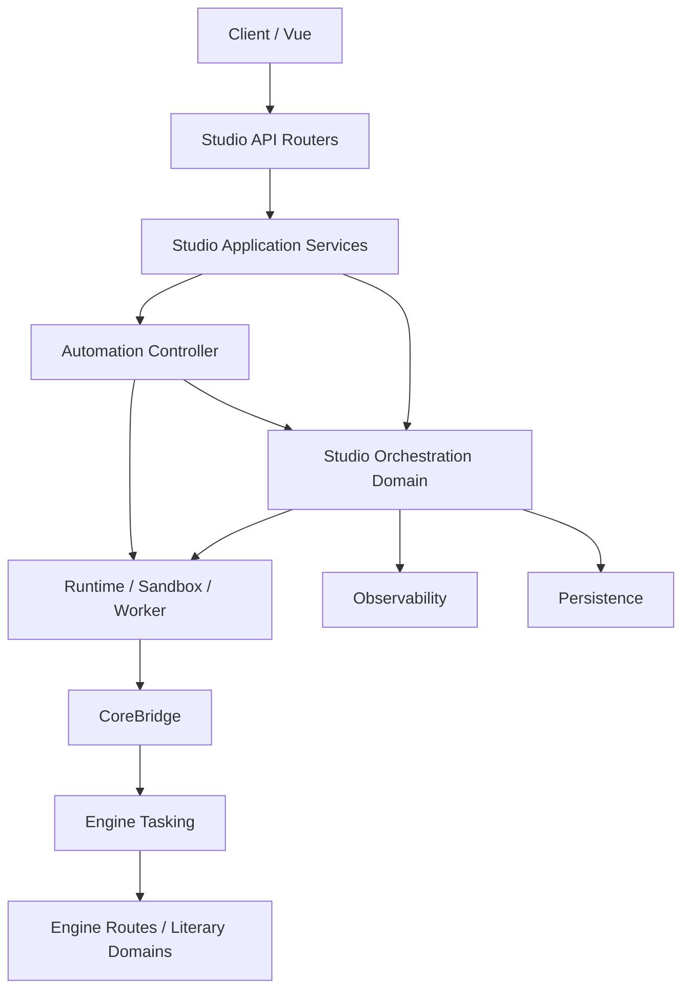

# ArcVellum 自适应创作编排系统实施方案

> 文档状态：下一阶段强指导性开发基线  
> 基线版本：ArcVellum v0.95.3  
> 更新日期：2026-07-28
> 目标：在不削弱现有 CLI 状态机、任务沙箱、确定性预检和正式 Gate 的前提下，让 Agent 根据作品理解设计、执行并动态调整创作路径  
> 非目标：允许模型生成任意命令、直接修改正式项目、删除强制 Gate，或用另一套 Agent 框架替换 Literary Engineering Engine

本文件是[v0.96 - v1.0 统一工程实施方案](arcvellum-v0.96-v1.0-integrated-engineering-implementation-plan.md)中的自适应编排子系统规格。跨模块依赖、版本集成、Archive/Style/Archaeology/Runtime/Observatory 的所有权和整体交付顺序以统一方案为准；本文件只拥有 `CreativeExecutionPlan`、Plan Compiler、Plan Lint、Plan Simulator、动态重规划和受控任务 DAG 的内部设计。

### 外部项目研究约束

Denova 及其他外部项目只提供问题意识和架构启发。本方案的所有代码、Prompt、Schema、配置、测试、文档、算法表达、视觉资源和 UI 组件均由 ArcVellum 独立设计与实现。禁止复制、改写、翻译移植或加入外部项目内部模块；外部项目许可证是否允许，不改变此约束。

## 1. 决策摘要

本阶段采用以下总原则：

> 固定不可违反的文学工程宪法，把可变的创作路径交给 Agent 规划，再由确定性编排器验证、编译和执行。

ArcVellum 当前是“固定路线上的智能执行者”：

```text
ROUTE_ORDER
  -> task-next
  -> task-open
  -> AgentWorker
  -> deterministic preflight
  -> task-submit / task-complete
  -> route-audit
```

目标形态是“受约束的自适应编排系统”：

```text
用户创作方向
  -> Context Broker 生成规划资料包
  -> 编排总监 Agent 生成计划候选
  -> Plan Normalizer 补齐机器字段
  -> Plan Lint 检查文学工程宪法
  -> Plan Compiler 编译为受控任务 DAG
  -> Plan Simulator 预演依赖、写集、成本和 Gate
  -> 编排审查 / 用户审批
  -> Scheduler 通过现有 task-next / task-open 执行
  -> Progress Contract 验证作品真实推进
  -> 触发时生成 Plan Patch 并重新编译
  -> 现有正式 Gate 验收
```

在统一路线中的集成关系：

- v0.97：AO-0 至 AO-2 以 shadow mode 建立契约、默认计划和编译验证，不改变现有 `ROUTE_ORDER`。
- v0.98：AO-3 至 AO-5 为 Style、Archaeology 和场景开发提供受控策略计划。
- v0.99：Context Ledger、Capability Manifest、Mutation Receipt 和 Agent Observatory 成为正式运行证据。
- v0.99.5：`CompiledTaskGraph` 同时承担依赖图并发；禁止另建平行 `TaskDependencyGraph`。
- v1.0：AO-7 Campaign 与现有 DelegationPolicy、恢复阶梯和章节 checkpoint 联合验收。

Agent 获得的是：

- 创意策略选择权；
- 受协议约束的任务排序、增补、深度和回退选择权；
- 在预算内提议并行分析和动态重规划的权力。

Agent 不获得的是：

- 任意 Shell 和任意项目路径写入；
- 直接写 Canon、人物状态、正式正文、发布产物的权力；
- 删除、降级或伪造 Gate 的权力；
- 把正文拆给多个 subagent 拼接的权力；
- 将“计划已经生成”冒充“作品已经推进”的权力。

## 2. 基于当前代码的事实基线

### 2.1 已有能力，禁止重复建设

| 当前能力 | 实际位置 | 本阶段处理 |
| --- | --- | --- |
| 固定正式路线 | `src/literary_engineering_studio/automation/controller.py` 的 `ROUTE_ORDER` | 保留为兼容默认计划和回滚路线 |
| 正式任务领取与生命周期 | `src/literary_engineering_studio_engine/tasking/registry.py`、`tasking/lifecycle.py` | 作为编译目标，不绕开 |
| 跨路线任务契约 | `tasking/package_contract.py`、Studio `contracts.py` | 扩展任务元数据，不另造 task package |
| 双工作区沙箱 | `runtime/sandbox.py` | 继续作为 Agent 输入/输出边界 |
| 确定性预检 | `task_preflight.py`、Engine route validators | 继续作为最终真实性判断 |
| Runtime SPI | `runtimes/base.py`、`runtimes/__init__.py` | 增加 planner/reviewer 角色，不重写 Runtime |
| OpenCode 受限 Profile | `integrations/opencode/opencode_profiles.py` | 新增只读 planner 和 reviewer profile |
| 自动创作授权 | `automation/policy.py` | 扩展为 Freedom Budget，不删除现有授权 |
| 项目单写者协调 | `runtime/execution_coordinator.py` | 第一阶段继续串行；后续升级资源锁 |
| Agent 会话与 SSE | `observability/`、`persistence/job_store.py`、前端 Store | 增加计划事件和上下文账本 |
| 主动决策代理 | `advisor/creative_steward.py` | 只负责有界选择，不直接升级为编排总监 |
| 旧平台编排蓝图 | `src/literary_engineering_studio_engine/tasking/orchestration.py` | 重命名为平台蓝图，避免与新运行时编排混淆 |

### 2.2 当前真实缺口

1. `ROUTE_ORDER` 是固定元组，无法表达作品特定策略。
2. 任务只能由当前 route state 推导，缺少跨任务依赖图。
3. `TaskPackage` 有能力与输出契约，但没有显式资源读写集、文学贡献和计划来源。
4. `ProjectExecutionCoordinator` 只提供项目级单写者锁，无法判断只读任务可否并发。
5. `DelegationPolicy` 控制路线、决策和总量，但没有“新增任务数、重规划次数、分支数、研究成本”等创作自由预算。
6. 自动推进以正式项目指纹判断进度，但没有章节义务、事件库存、审查债务和字数债务组成的计划级 Progress Contract。
7. 前端没有用于展示创作策略、计划原因、依赖、重规划和 Gate 注入的产品页面。
8. 当前 `tasking/orchestration.py` 只输出 LangGraph/Dify 等平台静态蓝图，不是可执行计划编译器。

## 3. 所有权宪法

### 3.1 三类权限

| 权限层 | Agent 能做什么 | 机器必须做什么 | 用户保留什么 |
| --- | --- | --- | --- |
| 创意决策 | 主题理解、视角、详略、场景功能、分支策略、信息释放、叙事距离 | 检查与 Canon、预算和已承诺事项的冲突 | 设定方向、否决策略、修改最高优先级约束 |
| 流程编排 | 提议任务、依赖、推演深度、修订回退、可并行分析 | 编译任务类型、注入 Gate、检查 DAG、资源冲突和预算 | 审批高影响计划与超预算变更 |
| 正式写入 | 只能在任务沙箱中产生候选输出 | 预检、写回事务、晋升、状态演化、Canon apply、发布 | 作者权威事务和最终发布权 |

### 3.2 事实源分区

必须在代码和 UI 中明确区分五种真相：

| 分区 | 内容 | 可否由计划直接修改 |
| --- | --- | --- |
| Historical Truth | 已晋升正文、正式版本、已发生任务事件 | 否 |
| Current State | 人物状态、时间线、关系、当前承诺与债务 | 否，只能通过 patch + Gate |
| Stable Knowledge | Canon、世界规则、角色背景、正式文风 | 否，只能通过资产候选/晋升 |
| Future Intent | `CreativeExecutionPlan`、场景库存、节奏与待办策略 | 可以版本化修改 |
| Evidence and Opinion | Review、Plan Review、模拟结果、Lint、研究资料 | 可以新增，不能冒充事实 |

计划永远属于 `Future Intent`。计划中的“人物将背叛”不能被 Context Broker 当成已经成立的 Canon。

## 4. 目标模块拓扑

### 4.1 新增 Studio 包

新增 `src/literary_engineering_studio/orchestration/`：

```text
orchestration/
├── __init__.py
├── contracts.py            # 计划、节点、预算、资源声明、修订 DTO 与枚举
├── constitution.py         # 不可由模型覆盖的编排宪法
├── context_builder.py      # 规划专用 Context Broker
├── planner.py              # 调用 planner Agent 生成候选计划
├── normalizer.py           # 注入机器字段、枚举归一、ID 和默认值
├── lint.py                 # Plan Lint
├── compiler.py             # 候选计划 -> CompiledTaskGraph
├── compiler_registry.py    # 抽象任务类型 -> 现有 route/task 能力
├── simulator.py            # 无模型、无写回的计划预演
├── scheduler.py            # 串行/并发调度；只调用 AgentWorker，并委托 runtime/resources 判冲突
├── bundles.py              # 白名单 Execution Bundle 编译，不拥有 task lifecycle
├── rolling_horizon.py      # 章节全局计划与 2-4 场景深度窗口
├── risk.py                 # SceneRiskProfile 与机器最低流程深度
├── progress.py             # Progress Contract 与 no-progress
├── replanner.py            # 触发器 -> Plan Patch -> 再编译
├── reviewer.py             # 独立编排审查 Agent
├── provenance.py           # 事实依据、上下文账本与决策来源
├── persistence.py          # DB 与项目审计文件双写协调
├── projection.py           # 面向前端的安全读模型
└── service.py              # API/Controller 使用的应用服务
```

### 4.2 新增 Engine 协议

新增：

```text
src/literary_engineering_studio_engine/orchestration/
├── __init__.py
├── task_catalog.py         # 正式任务能力目录，只暴露可编排元数据
├── gate_catalog.py         # 强制 Gate、顺序与适用条件
├── route_macros.py         # scene/chapter/book 宏的确定性展开规则
└── plan_compatibility.py   # 默认计划与现有固定路线等价性检查

protocol/orchestration/
├── creative-execution-plan.v1.schema.json
├── compiled-task-graph.v1.schema.json
├── plan-patch.v1.schema.json
├── plan-review.v1.schema.json
├── plan-simulation.v1.schema.json
└── constitution.v1.yaml
```

Engine 只提供：

- 支持哪些正式任务；
- 任务属于哪条 route；
- 需要哪些 Gate；
- 需要哪些前置事实；
- 允许哪些参数；
- 生成哪些正式产物。

Engine 不调用模型，也不决定作品创意策略。

### 4.3 旧文件迁移

现有 `src/literary_engineering_studio_engine/tasking/orchestration.py` 实际是“外部平台静态蓝图生成器”。为避免命名冲突：

1. 移至 `src/literary_engineering_studio_engine/platforms/orchestration_blueprint.py`。
2. 保留旧 import compatibility facade 一个版本周期。
3. CLI 原命令保持兼容，但标记为 platform blueprint，而不是运行时计划。
4. 新自适应编排代码不得 import 该旧蓝图模块。

## 5. CreativeExecutionPlan 契约

### 5.1 模型候选与正式计划分离

模型只输出 `CreativeExecutionPlanCandidate`。以下字段由机器拥有：

- `plan_id`
- `revision`
- `base_project_fingerprint`
- `constitution_version`
- `created_at`
- `compiled_graph_digest`
- `mandatory_gate_nodes`
- `approved_by`
- `lifecycle_status`

模型不得伪造这些字段；出现时 Normalizer 必须丢弃并记录 warning。

### 5.2 核心 schema

```yaml
schema: arcvellum/creative-execution-plan-candidate/v1
scope:
  kind: chapter
  volume_id: volume_01
  chapter_ids: [chapter_03]
objective: 完成第三章并强化主角对盟友的不信任

interpretation:
  dramatic_problem: 主角必须合作，但无法确认盟友是否泄密
  reader_effect: 从短暂安心转为新的怀疑
  chapter_function: 改变关系并制造下一章行动压力
  assumptions:
    - statement: 盟友仍不知道主角掌握了第二封信
      evidence_refs: [canon/timeline.yaml, scenes/scene_0018.yaml]
  uncertainties:
    - 盟友是否主动泄密尚未成为 Canon

strategy:
  scene_inventory:
    - scene_ref: scene_0021
      function: information
      pace: compressed
      roleplay_depth: light
    - scene_ref: scene_0022
      function: confrontation
      pace: slow
      roleplay_depth: full
    - scene_ref: scene_0023
      function: aftermath
      pace: restrained
      roleplay_depth: targeted
  branch_count: 4
  revision_policy: targeted_then_rewrite
  narrative_distance: close_to_medium
  promise_policy:
    resolve: [promise_0012]
    defer: [promise_0008]

task_nodes:
  - node_id: pressure-analysis
    kind: creative_analysis
    scope_refs: [chapter_03]
    depends_on: []
    requested_capabilities: [read_project_snapshot, write_expected_outputs]
    contribution:
      kind: evidence
      description: 形成角色压力与误判依据
  - node_id: branch-simulation
    kind: scene_branch_simulation
    scope_refs: [scene_0022]
    depends_on: [pressure-analysis]
    parameters:
      branch_count: 4
      roleplay_depth: full
  - node_id: prose-generation
    kind: formal_scene_prose
    scope_refs: [scene_0022]
    depends_on: [branch-simulation]
  - node_id: semantic-review
    kind: formal_scene_review
    scope_refs: [scene_0022]
    depends_on: [prose-generation]

replan_rules:
  - trigger: review_failed
    threshold: 2
    action: reconsider_branch_or_rewrite
  - trigger: new_character_detected
    action: pause_and_extend_asset_plan

freedom_request:
  max_added_tasks: 6
  max_replans: 2
  max_parallel_analysis: 3
  max_branch_count: 4
  research_allowed: false
```

### 5.3 计划节点类型必须枚举化

首版只允许：

```python
class PlanNodeKind(StrEnum):
    CREATIVE_ANALYSIS = "creative_analysis"
    CONTEXT_PREPARATION = "context_preparation"
    ASSET_CANDIDATE = "asset_candidate"
    ROLEPLAY_SIMULATION = "roleplay_simulation"
    BRANCH_SIMULATION = "scene_branch_simulation"
    BRANCH_SELECTION = "branch_selection"
    SCENE_COMPOSITION = "scene_composition"
    FORMAL_PROSE = "formal_scene_prose"
    SEMANTIC_REVIEW = "formal_scene_review"
    REVISION = "scene_revision"
    STATE_EVOLUTION = "state_evolution"
    CANON_EVOLUTION = "canon_evolution"
    CHAPTER_AUDIT = "chapter_audit"
    LONGFORM_AUDIT = "longform_audit"
    EXPORT = "formal_export"
```

不得接受：

- 任意命令字符串；
- 任意 Python 模块；
- 任意文件路径写集；
- Agent 发明的新 task kind；
- “skip_review”“force_promote”之类暗示绕过的枚举值。

Agent 可以通过 `creative_analysis` 增加新的分析目的，但该节点仍使用固定、只读、期望输出受限的执行模板。

## 6. 编排宪法

### 6.1 机器注入规则

`constitution.v1.yaml` 由仓库维护，不进入模型可编辑区：

```yaml
version: 1
rules:
  prose_single_writer:
    severity: error
    applies_to: [formal_scene_prose, scene_revision]
  prose_requires_contracts:
    severity: error
    requires:
      - canon_context
      - character_state
      - word_budget
      - scene_function
      - rhythm_contract
      - bridge_contract
      - mounted_style
  no_gate_deletion:
    severity: error
  revision_requires_fresh_review:
    severity: error
  formal_mutation_requires_patch:
    severity: error
    resources: [canon, character_state, timeline, promise_ledger]
  no_arbitrary_command:
    severity: error
  context_broker_mandatory_sources:
    severity: error
  resource_conflict_check:
    severity: error
  longform_inventory_consistency:
    severity: error
```

模型输出里的 `mandatory_gates` 只能作为解释，不能作为事实。Compiler 必须根据任务目录和宪法重新注入 Gate。

### 6.2 RP 深度允许自适应，但不能消失

定义：

- `light`：低风险过场，至少验证参与角色目标、直接后果和下一场接力。
- `targeted`：只对冲突核心角色做完整 BDI，其余角色做后果检查。
- `full`：完整角色提案、世界后果、多分支、Director 评分和 Canon Auditor。

Compiler 依据风险升级：

- 新角色、新地点、新规则、重大关系改变、死亡、背叛、时间跳跃：强制 `full`。
- 普通过场可用 `light`。
- Agent 可主动升级，不能把机器判定的 `full` 降级。

### 6.3 正文所有权

每个 `formal_scene_prose` 和 `scene_revision` 节点必须满足：

- `agent_role=main-creative-agent`；
- 同一 scene revision 只有一个写者；
- subagent 只能产生资料、分析、校对清单，不得写正文候选；
- 计划中的并发不能让两个 Agent 同时修改同一正文；
- 修订必须以明确 base revision 为输入；
- 修订后的候选必须经过新的 exact-candidate review。

## 7. Plan Compiler

### 7.1 编译阶段

`PlanCompiler.compile()` 分为九步：

1. **Normalize**：枚举、ID、scope、参数边界和默认值。
2. **Bind Revision**：绑定项目指纹、计划上下文摘要和用户方向版本。
3. **Expand Macros**：把场景/章节宏展开为任务节点。
4. **Inject Gates**：根据 Engine task catalog 和 constitution 注入必需节点。
5. **Resolve Tasks**：把抽象节点映射到现有 route/task type。
6. **Declare Resources**：补全读取、候选写入和正式写入资源。
7. **Order and Serialize**：根据依赖和资源冲突加入机器边。
8. **Attach Progress Contracts**：为每个节点声明可验证贡献。
9. **Seal**：生成 graph digest 和不可变编译结果。

### 7.2 Compiler Registry

```python
@dataclass(frozen=True)
class TaskBinding:
    node_kind: PlanNodeKind
    route: str
    allowed_task_types: tuple[str, ...]
    required_gate_ids: tuple[str, ...]
    parameter_schema: str
    resource_resolver: str
    progress_kind: str

class CompilerRegistry:
    def resolve(self, node: PlanNode) -> TaskBinding: ...
    def catalog_projection(self) -> list[dict[str, object]]: ...
```

Registry 不直接保存命令。Scheduler 在节点可运行时：

1. 调用现有 `task-next(route, scene)`；
2. 打开返回的正式 task package；
3. 检查 task type 是否属于 binding；
4. 检查 task package 与 compiled node 的 scope 和 base revision；
5. 交给 `AgentWorker.run_once(task_id=...)`。

如果当前正式状态返回了与计划不同的 task：

- 计划不能强行跳过；
- Scheduler 将节点标记为 `blocked_by_formal_state`；
- Replanner 根据正式状态生成 Plan Patch；
- 必须重新 lint 和 simulate。

### 7.3 默认兼容计划

先实现 `DefaultPlanFactory`：

```python
DEFAULT_ROUTE_ORDER = (
    "source-ingest",
    "longform-planning",
    "style-engineering",
    "character-and-world-assets",
    "scene-development",
    "review-and-audit",
    "export-and-release",
)
```

它生成与现有 `AutopilotService` 行为等价的计划。首个强制验收是：

> 关闭自适应功能时行为完全不变；开启 shadow mode 时编译结果不得改变现有 task-next 顺序。

## 8. Plan Lint

### 8.1 结构规则

- schema 和枚举合法；
- DAG 无环；
- 无孤立节点；
- 依赖目标存在；
- scope 引用可解析；
- 计划 base revision 未过期；
- 计划节点数和深度不超过预算；
- 所有 Agent 节点都有输入契约、输出契约和完成条件。

### 8.2 文学工程规则

- 正文前存在字数、场景功能、节奏、衔接、文风和 Canon 契约；
- 事件库存支持目标字数，不以单场冗长填补结构不足；
- 场景不能只有设定说明而没有可验证功能；
- 章节义务、承诺和读者问题有明确处理；
- 高风险变化使用完整推演；
- Review 独立于被审正文 revision；
- 修订后重新审查；
- State、Canon、时间线和 Promise 变化形成显式 patch；
- 发布前存在长篇审计和交付 Gate。

### 8.3 资源与安全规则

- 不允许任意命令；
- 不允许项目外路径；
- 不允许 Agent 直接声明正式写回；
- 写集不冲突；
- Canon、状态、晋升、发布节点串行；
- 同一 scene prose 单写者；
- Context Broker 强制资料未被模型排除；
- 研究或 Web 权限必须来自项目策略，不来自计划文本。

### 8.4 质量等级

```python
class PlanIssueSeverity(StrEnum):
    ERROR = "error"      # 阻止编译或激活
    WARNING = "warning"  # 允许审查，但必须展示
    NOTE = "note"        # 解释与建议
```

错误示例：

- 漏 Review；
- 正文前无 word target；
- 同一 scene 两个 prose writer；
- 计划含 shell command；
- Agent 删除 mandatory gate；
- 重规划次数超过授权。

警告示例：

- 分支数量与场景风险不匹配；
- 分析任务过多；
- 章节场景纹理重复；
- 计划成本接近预算。

## 9. Plan Simulator

Simulator 不调用模型、不写项目，只回答“这份计划能否走通”：

```python
@dataclass(frozen=True)
class PlanSimulationResult:
    status: str
    resolved_nodes: tuple[SimulatedNode, ...]
    injected_nodes: tuple[str, ...]
    blocking_issues: tuple[PlanIssue, ...]
    resource_conflicts: tuple[ResourceConflict, ...]
    expected_artifacts: tuple[str, ...]
    stale_invalidations: tuple[str, ...]
    estimated_model_calls: int
    estimated_cost_range: tuple[float, float]
    estimated_runtime_range_seconds: tuple[int, int]
```

模拟必须覆盖：

- 每个节点在当前 Engine 状态下能否获得对应 task；
- 所有 expected outputs 是否会被下游消费；
- 哪些现有 sidecar 或 completion 会因计划改变失效；
- 并发提示是否存在读写冲突；
- 是否存在“完成很多分析但没有正式作品增量”的空转路径；
- 高影响变化是否需要用户/编排审查；
- 失败回退是否有合法目标。

Simulator 不给文学质量打分；文学策略由 Orchestration Review 评估。

## 10. Freedom Budget

### 10.1 与 DelegationPolicy 的关系

现有 `DelegationPolicy` 继续负责：

- 用户是否允许自动执行某 route；
- 哪些选择可由 Creative Steward 代决；
- 时间、任务、成本、修订和失败上限；
- 是否允许自动发布。

新增 `FreedomBudget` 负责：

```yaml
max_added_tasks: 8
max_replans_per_scope: 2
max_parallel_read_tasks: 3
max_branch_count: 5
max_research_tasks: 2
max_research_cost: 5.0
max_analysis_to_production_ratio: 0.35
max_plan_depth: 32
max_plan_stall_cycles: 2
```

模型可以请求更高预算，但不能自行批准。

### 10.2 防止“把流程优化成最快完成”

必须同时限制两种倾向：

1. 过度简化：减少场景、降级推演、跳过 Review、压缩字数。
2. 过度分析：无限新增研究、角色推演和重规划，不形成正文或正式资产。

`max_analysis_to_production_ratio` 以已完成任务计数和成本双重计算。规划、研究、分析不计入正式作品进度。

## 11. Progress Contract

每个计划和节点必须声明可验证增量：

```yaml
progress_contract:
  formal_artifact_delta:
    - drafts/scenes/scene_0022.md@promoted
  obligation_delta:
    fulfilled: [chapter_03.relationship_shift]
    deferred: [promise_0008]
  word_budget_delta:
    target_hanzi: 3200
    tolerance: 0.08
  review_debt:
    maximum_open_notes: 0
  state_delta:
    expected_patch: characters/state_patches/scene_0022_state_patch.json
```

`ProgressEvaluator` 使用正式项目状态计算，不接受 Agent 自报：

- 正式产物 hash 是否变化；
- task lifecycle 是否完成；
- route gate 是否通过；
- 字数是否来自纯正文；
- obligation/ledger 是否更新；
- Review 和 revision 是否精确绑定当前候选。

若连续两轮只产生计划、分析或重复候选而无正式增量：

- 暂停自动重规划；
- 生成 no-progress 诊断；
- 回退到默认固定计划或等待用户。

## 12. 动态重规划

### 12.1 允许的触发器

```python
class ReplanTrigger(StrEnum):
    REVIEW_FAILED = "review_failed"
    PROSE_FAILED_TWICE = "prose_failed_twice"
    NEW_CHARACTER_DETECTED = "new_character_detected"
    CANON_CONFLICT = "canon_conflict"
    BRANCH_AMBIGUOUS = "branch_scores_are_close"
    WORD_BUDGET_DRIFT = "word_budget_drift"
    SCENE_INVENTORY_INSUFFICIENT = "scene_inventory_insufficient"
    PROVIDER_UNAVAILABLE = "provider_unavailable"
    FORMAL_STATE_CHANGED = "formal_state_changed"
    USER_DIRECTION_CHANGED = "user_direction_changed"
```

禁止自由文本触发器直接执行。

### 12.2 Plan Patch

重规划产生新 revision，不改原计划：

```json
{
  "schema": "arcvellum/creative-execution-plan-patch/v1",
  "plan_id": "plan-...",
  "base_revision": 3,
  "trigger": "review_failed",
  "reason": "场景行为逻辑两次失败，问题来自已选分支而非句面",
  "operations": [
    {"op": "replace_strategy", "path": "/strategy/revision_policy", "value": "return_to_branch"},
    {"op": "add_node", "node": {"node_id": "branch-reconsideration", "kind": "scene_branch_simulation"}},
    {"op": "replace_dependency", "node_id": "prose-generation", "depends_on": ["branch-reconsideration"]}
  ],
  "affected_outputs": ["branches/scene_0022/*", "drafts/scenes/scene_0022.md"]
}
```

Patch 必须重新经历：

- Normalize；
- Plan Lint；
- Plan Simulation；
- 高影响判断；
- 编排审查或用户批准；
- 原 plan revision 的 optimistic concurrency 检查。

禁止在写回事务中途重规划。

## 13. 上下文与 Plan Provenance

### 13.1 规划 Context Broker

新增 `OrchestrationContextBuilder`，不能让 planner 自己搜索整个项目。输出：

- 用户方向和最高优先级约束；
- 当前 scope 的 Canon、人物状态、时间线；
- 场景/章节义务、字数预算、节奏曲线；
- Reader Question、Promise/Payoff 和未偿债务；
- 当前 formal workflow state；
- 可用任务能力目录；
- Freedom Budget；
- 上一次计划、执行结果和触发原因。

资料包必须有两层：

- Agent 可见资料；
- 机器强制事实摘要与 digest。

### 13.2 Context Ledger

记录每个模型可见片段：

```json
{
  "source": "canon/world_rules.yaml",
  "purpose": "不可违反的世界规则",
  "bytes": 4210,
  "characters": 3802,
  "sha256": "...",
  "included": true,
  "truncated": false,
  "preview": "..."
}
```

不复制完整敏感内容进数据库，只保存摘要、尺寸、hash、截断和用途。

### 13.3 Provenance

计划中的每个关键判断必须引用：

- 项目相对路径；
- 事实 hash；
- 推断或不确定性标记；
- 用户方向版本；
- 生成该判断的 session/run。

前端只展示“依据、推断、不确定”，不展示模型隐藏思维链。

## 14. Agent Runtime 与能力模型

### 14.1 新角色

新增：

- `orchestration-planner`：只读项目资料，只写计划候选。
- `orchestration-reviewer`：只读候选计划、模拟报告和资料摘要，只写 plan review。
- `creative-analysis-agent`：只读 scope 快照，只写分析产物。

保留：

- `main-creative-agent`
- `main-review-agent`
- `creative-steward`
- `advisor`

### 14.2 OpenCode Profiles

扩展 `opencode_profiles.py`：

```python
def planner_profile(model: str) -> dict[str, Any]:
    # read/glob/grep/list only
    # expected plan candidate is the only writable output
    # no shell/web/subagent/external_directory

def orchestration_reviewer_profile(model: str) -> dict[str, Any]:
    # no project writes
    # only plan-review.json and user-facing review.md
```

`write_profile()` 必须使用角色枚举，不再用 `else -> worker` 静默回退。未知角色直接报错。

### 14.3 Capability Manifest

在 `runtime/capabilities/contracts.py` 与 `runtime/resources/claims.py` 定义机器所有的能力和资源契约，并由 `TaskExecutionContract` 引用：

```python
@dataclass(frozen=True)
class ResourceClaim:
    resource: str
    mode: Literal["read", "candidate_write", "formal_write"]
    base_digest: str

@dataclass(frozen=True)
class CapabilityManifest:
    tools: tuple[str, ...]
    resources: tuple[ResourceClaim, ...]
    network_policy: str
    subagent_policy: str
```

首版仍可把现有 `runtime_capabilities_required` 作为兼容字段，但新 Scheduler 只相信机器生成的 Capability Manifest。

## 15. 并发策略

### 15.1 第一阶段必须串行

先编译 DAG，但 Scheduler 仍通过现有 `ProjectExecutionCoordinator` 串行执行。这样可以验证计划正确性而不同时引入并发风险。

### 15.2 第二阶段资源锁

`ResourceLockManager` 支持：

- 多读单写；
- 以项目相对资源 ID 为粒度；
- 写任务绑定 base digest；
- 租约、心跳和崩溃回收；
- Agent 子进程完成后自动释放；
- 正式写回前再次检查 revision。

允许并发的首批任务：

- 不同角色的只读压力分析；
- 不同候选分支的只读评分；
- 文风、Canon、连续性、读者体验的独立审查；
- 不同章节的只读长篇审计。

禁止并发：

- 同一 scene 的正文写作；
- 正文与同一 scene 修订；
- State/Canon/Promise/Timeline apply；
- 同一正式资产晋升；
- 发布与任何正式写回；
- 上下游共享未冻结候选的任务。

Agent 的 `parallel: true` 只是提示，最终由资源图判定。

## 16. 持久化

### 16.1 SQLite

将 `DATABASE_SCHEMA_VERSION` 从 8 升级并增加：

```sql
CREATE TABLE creative_plans (
  plan_id TEXT PRIMARY KEY,
  project_root TEXT NOT NULL,
  scope_kind TEXT NOT NULL,
  scope_key TEXT NOT NULL,
  status TEXT NOT NULL,
  active_revision INTEGER NOT NULL,
  base_project_fingerprint TEXT NOT NULL,
  policy_json TEXT NOT NULL,
  created_at TEXT NOT NULL,
  updated_at TEXT NOT NULL
);

CREATE TABLE creative_plan_revisions (
  plan_id TEXT NOT NULL,
  revision INTEGER NOT NULL,
  candidate_json TEXT NOT NULL,
  normalized_json TEXT NOT NULL,
  compiled_json TEXT NOT NULL,
  lint_json TEXT NOT NULL,
  simulation_json TEXT NOT NULL,
  review_json TEXT NOT NULL,
  digest TEXT NOT NULL,
  created_at TEXT NOT NULL,
  PRIMARY KEY(plan_id, revision)
);

CREATE TABLE creative_plan_events (
  sequence INTEGER PRIMARY KEY AUTOINCREMENT,
  plan_id TEXT NOT NULL,
  revision INTEGER NOT NULL,
  event_type TEXT NOT NULL,
  at TEXT NOT NULL,
  data_json TEXT NOT NULL
);

CREATE TABLE creative_plan_nodes (
  plan_id TEXT NOT NULL,
  revision INTEGER NOT NULL,
  node_id TEXT NOT NULL,
  status TEXT NOT NULL,
  task_id TEXT NOT NULL DEFAULT '',
  run_id TEXT NOT NULL DEFAULT '',
  attempts INTEGER NOT NULL DEFAULT 0,
  result_json TEXT NOT NULL DEFAULT '{}',
  updated_at TEXT NOT NULL,
  PRIMARY KEY(plan_id, revision, node_id)
);
```

迁移前沿用现有数据库备份机制。

### 16.2 项目内审计文件

便携、可 Git 追踪的正式计划文件：

```text
workflow/orchestration/
├── active_plan.json
└── plans/{plan_id}/
    ├── revision_0001.plan.json
    ├── revision_0001.compiled_graph.json
    ├── revision_0001.lint.json
    ├── revision_0001.simulation.json
    ├── revision_0001.review.json
    └── provenance.json
```

规则：

- 项目文件是可移植审计事实；
- SQLite 是运行索引、租约、事件和 UI 加速层；
- 两者以 `plan_id + revision + digest` 对齐；
- 恢复时从项目审计文件重建索引；
- 运行事件只写数据库/JSONL，不频繁改计划正文。

## 17. API

新增 `api/routers/orchestration.py`：

| Endpoint | 用途 |
| --- | --- |
| `GET /orchestration/capabilities` | 展示可编排任务、Gate 和预算范围 |
| `POST /orchestration/plans` | 根据用户方向建立 planning request |
| `GET /orchestration/plans` | 当前项目计划列表 |
| `GET /orchestration/plans/{id}` | 用户安全投影 |
| `POST /orchestration/plans/{id}/generate` | 生成候选计划 |
| `POST /orchestration/plans/{id}/lint` | 确定性检查 |
| `POST /orchestration/plans/{id}/simulate` | 预演 |
| `POST /orchestration/plans/{id}/review` | 独立编排审查 |
| `POST /orchestration/plans/{id}/activate` | 激活已通过计划 |
| `POST /orchestration/plans/{id}/pause` | 暂停 |
| `POST /orchestration/plans/{id}/replan` | 以触发器创建 Patch |
| `GET /orchestration/plans/{id}/stream` | SSE 事件 |

API 要求：

- 所有项目路径使用现有 project validator；
- 所有 mutating endpoint 有 idempotency key；
- activate 检查 base revision、lint、simulation 和 review；
- 不接受前端传入 command、formal path 或 mandatory gate；
- 返回用户安全文案和 advanced diagnostics 两层投影。

## 18. Autopilot 接入

### 18.1 不直接重写 Controller

先将 `AutopilotService._run_claimed()` 中“选 route”抽象为：

```python
class ExecutionSource(Protocol):
    def next_action(self, run: AutopilotRun, project: Path) -> ScheduledAction: ...

class FixedRouteExecutionSource:
    # 当前 ROUTE_ORDER

class CompiledPlanExecutionSource:
    # 从激活的 CompiledTaskGraph 选择 ready node
```

后续共享：

- AgentWorker；
- writeback approval；
- Creative Steward；
- no-progress；
- retry/recovery；
- leases；
- Agent observability。

### 18.2 运行模式

1. `fixed`：现有行为。
2. `shadow`：生成、lint、compile、simulate，但执行仍走 fixed；比较差异。
3. `assisted`：scene/chapter 计划需用户批准。
4. `supervised_adaptive`：低风险重规划自动，高风险等待批准。
5. `full_adaptive`：在 DelegationPolicy + FreedomBudget 内无人值守。

默认从 `fixed` 开始，不可直接切到 `full_adaptive`。

### 18.3 创作吞吐优化

自适应编排不能只决定“做什么”，还应减少同一计划中无意义的 Agent 往返。吞吐优化仍由确定性编译器控制：

```text
CreativeExecutionPlan
  -> Plan Compiler
  -> CompiledTaskGraph
  -> Bundle Compiler
  -> ExecutionBundle / single task
  -> Scheduler
  -> AgentWorker
```

`Bundle Compiler` 只根据 Engine task catalog、角色、依赖、decision boundary、mandatory gates 和白名单模板合并执行轮次。Planner 的 `parallel`、`bundle` 或 `fast` 建议都不是授权。

固定边界：

- Writer 与 Reviewer 不进入同一 Bundle。
- 人类/Steward 决策前后不合并。
- semantic review、promotion、state/canon apply 和 release 不与正文生成合并。
- Bundle 内每个 step 仍有原 expected outputs 和 validator。
- Bundle 开关关闭时，CompiledTaskGraph 可退化为原单任务执行。

章节计划生成 `RollingHorizonWindow`：

- 全章 scene inventory、word budget、rhythm、bridge 和 reader obligations 保持完整。
- 只对未来 2 - 4 场景编译深度 RP/branch 任务。
- 当前场景 promotion 与 state/canon 写回后使窗口 rebase。
- 远期计划变化通过 Plan Patch，不直接改历史任务。

`SceneRiskProfile` 由确定性事实计算最低等级：

- Canon/state 变化。
- 新人物或新资产。
- 高潮与节奏权重。
- 分支接近程度。
- 连续性、Promise/Payoff 和 reader debt。
- 文风新颖度。

Planner 可请求更深流程，不能把机器最低等级降低。compact 场景也必须产生 RP、分支依据和正式 AgentReview。

吞吐状态机独立于文学状态机：

```text
measure-only
  -> cache-only
  -> session-reuse
  -> bundle-shadow
  -> bundle-execute
  -> rolling-horizon
  -> adaptive-depth
  -> parallel-review
```

这些状态只决定执行方式，不改变 task completion、route gate 或 formal writeback 的定义。

#### 18.3.1 Token 效率与上下文预算接线

本节服从统一实施方案 `11.5A 上下文与 Token 效率专项`，不另建一套 Context Broker。
实现顺序固定为：

1. `usage truth`：先把 cache-read、非缓存 input、output、reasoning、model turn、
   repair/retry 和 task/scene attribution 分开；
2. `budget shadow`：按 task kind、role 和 SceneRiskProfile 计算预算，只报告不裁剪；
3. `ExecutionContextEnvelope`：把 task package、prompt asset、Context Ledger 和
   capability contract 规范化为唯一模型输入；
4. `bounded context`：启用 must-inline、exact-on-demand、summary-reference、excluded
   四级资料策略；
5. `content cache`：按 project/canon/state/style/budget/contract hash 缓存可重建分区；
6. `bounded session lease`：只在同角色、同上下文、同短期任务族内复用，并设置
   token/time/failure reset；
7. `adaptive cost`：SceneRiskProfile 决定 compact/standard/deep 的资料深度和模型能力
   等级，不能删除正式 Gate。

Planner 只能提出资料需求和提高风险等级；最终预算、强制资料、缓存失效与会话复用由
确定性 Context Broker/Runtime 决定。跨角色共享稳定事实摘要是允许的，跨角色共享会话
历史、隐藏推理或 Writer 自我解释是禁止的。

W6-4G 只交付 usage truth、budget shadow/bounded context 和重复语义消除；真正的
ContextCacheKey、session lease、Bundle 与只读并发仍在 AO-6/W6-7 激活。

## 19. 前端“创作策略”页面

### 19.1 路由与信息架构

新增 `/strategy`，中文名“创作策略”。普通用户不看到原始 JSON。

页面包含：

- 当前目标与作品理解；
- 章节/场景策略；
- 计划阶段时间轴；
- 任务依赖与可并行提示；
- 强制 Gate；
- 自由预算；
- 预演影响；
- 当前执行位置；
- 重规划原因与前后差异；
- 依据和不确定性；
- 激活、暂停、批准、恢复固定路线。

### 19.2 组件

```text
client/src/features/strategy/
├── CreativeStrategyView.vue
├── components/
│   ├── StrategyObjectiveCard.vue
│   ├── NarrativeInterpretationPanel.vue
│   ├── PlanPhaseTimeline.vue
│   ├── PlanDependencyGraph.vue
│   ├── MandatoryGateRail.vue
│   ├── FreedomBudgetPanel.vue
│   ├── PlanSimulationPanel.vue
│   ├── PlanDiffPanel.vue
│   ├── PlanProvenancePanel.vue
│   ├── ReplanTriggerPanel.vue
│   ├── RollingHorizonPanel.vue
│   ├── SceneRiskPanel.vue
│   ├── ExecutionBundlePanel.vue
│   ├── ThroughputPanel.vue
│   └── StrategyApprovalCard.vue
├── strategyStore.ts
├── strategyProjection.ts
└── strategy.spec.ts
```

### 19.3 三种用户策略

- 稳健：完整推演，低并发，重大变化都确认。
- 平衡：低风险自适应，高风险确认。
- 探索：允许更多分支和研究，但仍不能删除 Gate。

这三个预设只改变 Freedom Budget 和审批阈值，不改变宪法。

### 19.4 星仪接入

计划节点可以作为视觉投影，但不是新的视觉主角：

- 当前计划路径映射为待执行光路；
- 注入 Gate 显示为稳定锚点；
- 重规划显示旧路径淡出、新路径生长；
- 失败回退显示回溯，但不删除历史事件；
- 点击节点打开策略窗口，不暴露原始机器 JSON。

## 20. 分阶段施工

### AO-0：命名与边界清理

- 重命名旧 `tasking/orchestration.py`。
- 建立 ADR：计划是 Future Intent，不是 Canon。
- 新增 feature flag，默认关闭。
- 建立任务目录和 Gate 目录只读投影。

验收：所有既有测试通过，旧 CLI 兼容。

### AO-1：契约与默认计划

- 实现 contracts、schema、constitution、DefaultPlanFactory。
- 把固定 `ROUTE_ORDER` 表达为正式计划。
- 建立 schema/enum/property tests。

验收：默认计划与现有路线顺序、Gate、任务选择完全等价。

### AO-2：Lint、Compiler 与 Simulator

- 实现完整编译管线。
- 先只支持固定计划和 Agent 修改少量策略字段。
- Scheduler 仍串行。
- 启用吞吐与资源冲突 measure-only，不改变实际任务执行。
- `ExecutionBundle` 与 Bundle Compiler shadow 依统一实施方案延后至 AO-6/v0.99；
  在 Context Ledger、session lease、Mutation Receipt 和 Worker 接线完成前不提前建立
  第二执行单元。

验收：漏 Gate、任意命令、循环、双写者、虚假并发均被阻止。

### AO-3：Planner 与 Orchestration Review

- 新建 planner/reviewer profile。
- 规划资料包、Context Ledger、Provenance。
- 计划候选与机器字段隔离。

验收：模型无法删除 Gate 或写正式文件；review 与 planner session 独立。

### AO-4：场景级自适应

- 开放 RP 深度、分支数量、修订策略、回退层级。
- 支持 scene scope Plan Patch。
- 接入现有 scene route。

验收：完整走通一个场景的计划、正文、审查、修订、晋升和状态演化。

### AO-5：章节级编排

- 开放场景库存建议、节奏、详略、Reader Question、Promise/Payoff。
- 加入事件库存与字数预算验证。
- 支持只读审查并行的 shadow simulation。
- 建立 Rolling Horizon，只深度编译未来 2 - 4 个场景。
- 生成 SceneRiskProfile，机器最低等级不可由 Planner 下调。

验收：章节目标字数与场景库存一致，不以单场注水补足。

### AO-6：资源锁与有限并发

- ResourceClaim、ResourceLockManager、租约、快照 digest。
- 先开放只读分析/审查并发。
- 正式写回仍串行。
- 启用 chapter-planning/scene-analysis Bundle 和同角色 session lease。
- 启用受限 output repair；语义失败仍回到正式 revision。

验收：冲突任务不会同时启动；崩溃后租约可恢复；结果绑定同一快照。

### AO-7：全书重规划与 Campaign

- 全书 scope、跨章节奏和债务管理。
- bounded replan、Progress Contract、no-progress fallback。
- full_adaptive 接入。

验收：无人值守运行可以安全推进，也会在损坏、越权和空转时诚实停止。

### AO-8：前端产品化

- 创作策略页面、SSE、计划差异、模拟、预算和审批。
- 星仪轻量投影。
- 新手引导和高级诊断。

验收：普通用户无需理解 DAG/JSON 也能知道“为什么这样写、现在做到哪、系统为何调整”。

## 21. 测试矩阵

### 21.1 单元测试

- schema round trip；
- unknown enum 拒绝；
- machine-owned field 清除；
- Gate 注入；
- DAG cycle/orphan；
- resource conflict；
- Freedom Budget；
- stale revision；
- Progress Contract；
- Plan Patch；
- task binding；
- Bundle whitelist 和 boundary split；
- SceneRiskProfile 最低等级；
- ContextCacheKey 失效；
- OutputRepairRequest 范围。

### 21.2 集成测试

- 固定计划等价；
- planner candidate -> lint -> compile -> simulate；
- scene adaptive plan -> task-next/task-open；
- review failed -> replan -> revision -> fresh review；
- new character -> asset dependency -> resume scene；
- word budget drift -> expand inventory；
- provider failure -> retry/failover，不篡改计划；
- restart -> DB/project audit recovery；
- fixed tasks 与 bundle execution 正式产物/Gate 等价；
- promotion/state writeback 后 Rolling Horizon rebase；
- preflight 局部错误只修复 invalid outputs。

### 21.3 安全回归

- Agent 输出 command 被拒绝；
- Agent 输出项目外路径被拒绝；
- Agent 移除 review 节点仍被 Compiler 注入；
- subagent prose 被拒绝；
- 两个 prose writer 被拒绝；
- Canon direct write 被拒绝；
- stale base revision 被拒绝；
- debug waiver 不进入 Studio；
- planning loop 不算正式进度。
- compact risk 不能删除 RP、branch evidence 或 AgentReview；
- Writer/Reviewer 不能进入同一 Bundle；
- 旧 Context hash 不能在 Canon/style/state 变化后命中。

### 21.4 E2E

至少准备四个夹具：

1. 单场低风险过场，使用 compact RP，但仍有分支依据和正式 AgentReview。
2. 新角色和世界规则出现，强制 full RP + asset route。
3. Review 两次失败，回退分支而不是机械改句。
4. 章节字数库存不足，扩充场景而不是注水。
5. 一个章节用 2 - 4 场景滚动窗口推进，当前场景写回后后续窗口重新编译。
6. Bundle 路线相对固定路线减少模型轮次，但交付同一正式产物集合。

每个夹具必须验证前端、API、计划文件、SQLite、任务沙箱、正式项目和 route audit 一致。

## 22. 交付门槛

不能以“页面出现”“schema 能解析”作为完成。最终必须满足：

1. 自适应关闭时，现有全自动创作行为不回归。
2. 计划无法删除任何强制 Gate。
3. 计划无法生成任意命令或正式路径写入。
4. 默认计划与固定路线等价。
5. 一个真实场景能从目标进入计划，经过正式任务完成正文晋升和状态演化。
6. Review 失败能触发受限重规划，并绑定新 revision。
7. 章节级计划能把字数目标落实到场景库存和正文任务。
8. 并发只发生在机器证明无冲突的只读任务。
9. full_adaptive 在预算耗尽、无进度和不可恢复冲突时安全暂停。
10. 前端能说明计划原因、当前节点、Gate、成本、变更和依据，不展示隐藏思维链。
11. 所有计划、修订、审查和执行都有 digest 与 provenance。
12. Python、Vue、桌面构建和既有 E2E 全部通过。
13. 吞吐提升来自会话复用、缓存、Bundle、局部 repair 和安全并发，不来自减少正式 Gate。

## 23. 防止过度设计

以下内容不应进入首版：

- 用 LangGraph/CrewAI 替换现有状态机；
- 通用 BPMN 编辑器；
- 任意代码节点；
- 任意 Agent 自定义工具；
- 正文多 Agent 拼写；
- 全项目并发写入；
- 让计划成为第二份 Canon；
- 自动接受模型自评“Gate 不适用”；
- 在前端展示复杂原始图谱代替用户可理解的创作策略。

首版成功标准不是“Agent 能编排一切”，而是：

> Agent 能在场景范围内合理选择推演深度、分支、修订和回退路径；机器仍能证明这条路径完整、可执行、可审计，并且没有绕过现有文学工程门禁。

## 24. 开发执行顺序

实施时严格按以下顺序，不横向铺开：

1. ADR、命名和 feature flag。
2. 契约、schema、constitution。
3. Engine task/gate catalog。
4. DefaultPlanFactory 等价性测试。
5. Plan Lint。
6. Plan Compiler。
7. Plan Simulator。
8. 吞吐 measure-only 和固定路线基线。
9. Token 分类、task/scene attribution 和 Context Budget shadow。
10. ExecutionContextEnvelope 与 bounded-context fixed-route A/B。
11. Persistence 与恢复。
12. Planner/Reviewer Runtime 角色。
13. Context cache 和有界 session lease。
14. Bundle Compiler shadow 与等价性测试。
15. 场景级 shadow mode。
16. 场景级 assisted mode。
17. Progress Contract 与 Replanner。
18. Rolling Horizon 和 SceneRiskProfile。
19. 受控 Bundle execution 与局部 repair。
20. 只读并发。
21. 前端策略页面。
22. supervised/full adaptive。

任一阶段未通过验收，不进入下一阶段。尤其不能在默认计划等价性和场景闭环未通过前开发全书动态重规划。

## 25. 文件级改动清单与建议接口

### 25.1 Studio 后端

| 现有文件 | 必要改动 | 禁止做法 |
| --- | --- | --- |
| `automation/controller.py` | 将固定 route 选择提取为 `ExecutionSource`；保留当前 retry、recovery、writeback、decision、lease 与 no-progress 分支 | 复制一份新的自适应 Autopilot loop |
| `automation/policy.py` | 增加 adaptive mode、Freedom Budget 归一化和高影响审批阈值 | 允许计划扩大用户授权 |
| `automation/support.py` | 保留现有项目进度指纹；增加计划级 Progress Contract 计算入口 | 把 plan/event 文件变化算作作品进度 |
| `runtime/capabilities/contracts.py`、`runtime/resources/claims.py` | 定义 `CapabilityManifest`、`ResourceClaim`；`contracts.py` 只保留 task package 的兼容解析和计划绑定元数据 | 在根 `contracts.py` 堆积跨领域实现，或用自由字符串表达能力和角色 |
| `runtime/worker.py` | 接收可选 `plan_id/revision/node_id`，把它们写入 run manifest 和事件；执行流程不改 | 让 Worker 解释计划或自行找下一任务 |
| `runtime/sandbox.py` | 在 manifest 中记录 plan binding、resource claims、context ledger 路径 | 给 planner 或 worker 开放项目根目录 |
| `runtime/context_budget.py` | 按 task kind/role/risk 计算字符与 Token 预算、输出 shadow report 和超额原因 | 静默裁剪 mandatory context，或让 Planner 自定上限 |
| `runtime/execution_context.py` | 生成唯一模型执行信封，引用现有 task package/prompt/ledger，不拥有 task lifecycle | 复制一套 task schema 或在多种 sidecar 中重复展开正文与约束 |
| `runtime/context_selection.py`、`runtime/context_materialization.py`、`runtime/prompt_context.py` | 实现四级资料选择、精确去重和 budget report；保留受限工作区与完整来源 digest | 用全局字符截断替代任务语义选择 |
| `runtime/bundle_executor.py` | 顺序执行白名单 Bundle step、维持单角色 session lease、统一失败回滚 | 自行决定跳过 task、validator 或 decision boundary |
| `runtime/context_cache.py` | 按 project/canon/state/style/budget/contract hash 缓存可重建上下文 | 把缓存当作 Canon，或在依赖变化后继续复用 |
| `runtime/output_repair.py` | 根据稳定 preflight issue ID 生成局部修复任务，只开放 invalid outputs | 用格式 repair 处理语义失败 |
| `runtime/execution_coordinator.py` | AO-0 至 AO-5 不改语义；AO-6 用 `ResourceLockManager` 包装并保留项目级独占回退 | 一开始就移除项目单写者保护 |
| `runtime/task_program.py` | 在 Agent 程序中展示“当前计划节点、允许输入、允许输出和完成贡献”，但不展示全项目路径 | 将完整 DAG 当作正文 Agent 的额外上下文 |
| `integrations/opencode/opencode_profiles.py` | 角色枚举化；新增 planner/reviewer；未知角色报错 | 继续使用 `else -> worker` 静默回退 |
| `integrations/opencode/opencode_runtime_pool.py` | 支持 planner/reviewer session key、复用、超时和独立审查会话 | 复用正文 writer 会话做 plan review |
| `observability/agent_session_tracking.py` | 记录 plan/node/context/mutation receipt 摘要 | 记录隐藏思维链 |
| `observability/throughput_metrics.py` | 聚合模型轮次、阶段耗时、非缓存输入/cache-read/cache-write、上下文字符、repair/retry、task/scene attribution 和首次通过率 | 通过减少 Gate 美化吞吐指标，或把 cache token 伪装成同价账单 |
| `persistence/job_store.py` | DDL 与 migration；把计划读写拆入 `persistence/creative_plans.py` mixin | 继续把所有 SQL 堆入 `job_store.py` |
| `api/routers/__init__.py` | 注册 orchestration router | 在旧 worker router 里塞全部计划 API |
| `application/config.py` | 增加 feature flag、默认 strategy preset 和预算范围 | 把用户项目的计划状态写进全局配置 |

建议接口：

```python
class ExecutionSource(Protocol):
    def next_action(
        self,
        *,
        run: dict[str, Any],
        project_root: Path,
        formal_state: dict[str, Any],
    ) -> "ScheduledAction": ...


@dataclass(frozen=True)
class ScheduledAction:
    kind: Literal["task", "route-ready", "replan", "wait"]
    route: str = ""
    task_id: str = ""
    plan_id: str = ""
    plan_revision: int = 0
    node_id: str = ""
    reason: str = ""
```

`AgentWorker.run_once()` 只增加审计参数：

```python
def run_once(
    self,
    project_root: Path,
    *,
    route: str,
    runtime_id: str,
    task_id: str = "",
    scene: str = "",
    plan_binding: PlanTaskBinding | None = None,
) -> WorkerRunResult:
    ...
```

它不得接收抽象 strategy，也不得在内部运行 Plan Compiler。

### 25.2 Literary Engineering Engine

| 现有文件 | 必要改动 |
| --- | --- |
| `routes/catalog.py` | 为 `RouteDefinition` 增加只读 metadata projection，或通过相邻 registry 返回，不改变 selector/builder/validator |
| `tasking/registry.py` | 提供 `task-capabilities` 内部 API；正式 issue/open/submit/complete 语义不变 |
| `tasking/package_contract.py` | 注入 machine-owned plan binding 和 resource claims；更新 contract revision |
| `tasking/workflow_contract.py` | 检查 task 的 plan binding 与 lifecycle receipt 一致；兼容无计划旧任务 |
| `tasking/gates.py` | 对外提供稳定 Gate ID，不让 Compiler 解析人类文案 |
| `tasking/semantic_contracts.py` | 为计划和 plan review 增加语义产物契约 |
| `workflow_state.py` | 输出可供 Compiler 使用的正式状态摘要，不输出可绕路命令 |
| `scene_development_route.py` 及拆分模块 | 暴露风险特征、必需契约和 task type；不把自适应策略写进 route 本身 |

建议新增目录中的关键接口：

```python
@dataclass(frozen=True)
class FormalTaskCapability:
    capability_id: str
    route: str
    task_types: tuple[str, ...]
    supported_scopes: tuple[str, ...]
    parameter_schema: str
    mandatory_gate_ids: tuple[str, ...]
    resource_template: tuple[str, ...]
    progress_kind: str


def formal_task_capabilities() -> tuple[FormalTaskCapability, ...]: ...


def mandatory_gates_for(
    *,
    node_kind: str,
    scope: dict[str, object],
    risk_features: dict[str, bool],
) -> tuple[str, ...]: ...
```

Compiler 只消费这些结构化接口，不解析 `protocol.py` 的 Markdown 文案。

### 25.3 前端

| 文件 | 改动 |
| --- | --- |
| `client/src/router.ts` | 增加 `/strategy` |
| `client/src/types/api.ts` | 增加 plan、node、lint、simulation、review、event 类型 |
| `client/src/stores/app.ts` | 不继续膨胀；新建独立 `features/strategy/strategyStore.ts` |
| `client/src/services/api.ts` | 复用现有 SSE transport，增加 plan stream reconnect 测试 |
| `components/AutopilotPanel.vue` | 展示计划模式、当前节点和重规划状态；不内嵌完整策略页面 |
| `features/orrery/SpatialWindowLayer.vue` | 只增加计划投影入口和当前路径摘要 |
| `features/settings/SettingsView.vue` | 增加 adaptive feature、策略预设和模型角色选择 |
| `features/help/HelpView.vue` | 增加“固定路线/自适应路线/为何暂停”的新手引导 |

前端 Store 接口：

```ts
interface StrategyState {
  activePlan: CreativePlanProjection | null;
  revisions: PlanRevisionSummary[];
  events: PlanEvent[];
  loading: boolean;
  error: string;
}

interface CreativePlanProjection {
  planId: string;
  revision: number;
  status: PlanLifecycleStatus;
  objective: string;
  interpretation: NarrativeInterpretation;
  phases: PlanPhaseProjection[];
  mandatoryGates: GateProjection[];
  freedomBudget: FreedomBudgetProjection;
  simulation: PlanSimulationProjection | null;
  review: PlanReviewProjection | null;
  currentNodeId: string;
}
```

### 25.4 测试文件

新增：

```text
tests/orchestration/
├── test_contracts.py
├── test_constitution.py
├── test_default_plan_equivalence.py
├── test_plan_lint.py
├── test_plan_compiler.py
├── test_plan_simulator.py
├── test_progress_contract.py
├── test_replanner.py
├── test_resource_lock.py
├── test_persistence_recovery.py
└── test_scene_adaptive_e2e.py

client/src/features/strategy/
├── strategyStore.spec.ts
├── CreativeStrategyView.spec.ts
├── PlanDiffPanel.spec.ts
└── StrategyApprovalCard.spec.ts
```

既有测试必须增加：

- `tests/test_autopilot.py`：fixed mode 完全兼容；
- `tests/test_worker.py`：plan binding 不改变 preflight/writeback；
- `tests/test_task_package.py`：新旧 contract 兼容；
- `tests/test_agent_observability.py`：plan/context/mutation 投影；
- `tests/test_opencode_runtime_pool.py`：planner/reviewer 会话隔离；
- `client/src/components/AutopilotPanel.spec.ts`：计划状态与授权暂停。

### 25.5 代码审查检查表

每个 PR 必须回答：

1. 这次改动增加了模型权力，还是只增加了模型建议能力？
2. 新字段由用户、Agent 还是机器拥有？
3. 它能否绕开 `task-next/open/submit/complete`？
4. 它能否写 expected outputs 之外的文件？
5. 它是否把未来计划误当成 Canon 或当前状态？
6. 它是否使正文出现多个 writer？
7. 它是否让 planning/review 事件冒充正式进度？
8. 它是否有 base revision、digest 和恢复路径？
9. 自适应关闭时是否完全兼容？
10. 用户能否在前端理解失败原因，而不阅读原始 JSON？

## 26. Denova 借鉴成果落地任务组

本任务组把 `docs/research/denova-comparative-architecture-review.md` 中识别出的工程问题重新建模为 ArcVellum 开发任务。它不是独立产品路线，不引入 Denova 运行时依赖，也不复制任何实现材料；每项改动都必须从 ArcVellum 现有 Studio/Engine 边界出发独立设计，并接受 ArcVellum 的确定性 Gate。

### 26.1 总体映射

| Denova 启发 | ArcVellum 目标模块 | 并入阶段 | 是否阻塞自适应编排 |
| --- | --- | --- | --- |
| Turn / Actor State / Lore / Director Plan 真相分区 | ADR、`orchestration/contracts.py`、Context Broker | AO-0 | 是 |
| Context Ledger | `orchestration/provenance.py`、`observability/` | AO-3 | 是 |
| 长会话 Compaction | `advisor/`、Planner session | AO-7 后半 | 否 |
| Tool Manifest | `contracts.py` 的 Capability Manifest | AO-1 / AO-3 | 是 |
| 读写执行 Gate | `runtime/resources/claims.py`、`runtime/resources/conflicts.py` | AO-6 | 只阻塞并发 |
| Mutation Tracker | `observability/mutation_receipts.py` | AO-3 / AO-4 | 是 |
| Director revision/hash/conflict | Plan revision、base fingerprint、Plan Patch | AO-1 / AO-5 | 是 |
| Plan stream protocol | Orchestration SSE 与前端 Store | AO-3 / AO-8 | 否 |
| Git version/diff/restore | Archive IDE Version Service | 长期路线 Archive IDE 阶段 | 否 |
| Change Review / rebase | Owner Override、资产编辑和正文编辑 | 长期路线 Archive IDE 阶段 | 否 |
| Lore/Monaco/TipTap 信息架构 | Archive IDE 前端 | 长期路线 Archive IDE 阶段 | 否 |
| UI 完整状态、i18n、无障碍 | 全客户端设计基础设施 | AO-8 及后续 | 否 |

### 26.2 DEN-01：真相分区与计划隔离

**目的**

防止 `CreativeExecutionPlan`、Planner 推断或 Director 建议被下游当成已发生事实。

**新增文件**

```text
docs/architecture/adr/
└── 00xx-truth-partitions-and-future-intent.md

src/literary_engineering_studio/orchestration/
└── truth_partition.py
```

**核心代码**

```python
class TruthPartition(StrEnum):
    HISTORICAL = "historical_truth"
    CURRENT_STATE = "current_state"
    STABLE_KNOWLEDGE = "stable_knowledge"
    FUTURE_INTENT = "future_intent"
    EVIDENCE = "evidence_and_opinion"


@dataclass(frozen=True)
class ProvenanceRef:
    path: str
    digest: str
    partition: TruthPartition
    assertion_kind: Literal["fact", "inference", "uncertainty", "proposal"]
```

**修改点**

- `orchestration/context_builder.py`：按分区构建上下文。
- `orchestration/normalizer.py`：计划中的未来事件全部标记为 proposal。
- `orchestration/compiler.py`：禁止 Future Intent 作为 formal gate 的已满足证据。
- `runtime/task_program.py`：明确显示“计划不是 Canon”。
- `projections/core_read_models.py`：前端投影保留分区标签。

**确定性规则**

- `future_intent` 不得进入 Canon/State source digest 集合。
- 只有已晋升产物和已 apply patch 可成为 Historical/Current。
- Review 结论属于 Evidence，不能直接写 Canon。
- Planner 的 assumption 必须引用事实；没有依据时标记 uncertainty。

**验收**

- 计划写“人物将在下一场背叛”时，Context Broker 不会把“已背叛”提供给正文或 Review。
- 用户修改计划不会改变人物当前状态。
- Plan Review 通过也不会自动满足 Canon Review。

### 26.3 DEN-02：Context Ledger

**目的**

让系统和用户知道每次 Planner、Writer、Reviewer、Advisor 实际看见了什么、为什么看见、是否截断，而不存储隐藏思维链。

**新增文件**

```text
src/literary_engineering_studio/observability/
├── context_ledger.py
└── context_ledger_projection.py
```

**核心代码**

```python
@dataclass(frozen=True)
class ContextLedgerEntry:
    source: str
    title: str
    purpose: str
    partition: TruthPartition
    byte_count: int
    character_count: int
    sha256: str
    included: bool
    truncated: bool
    limit: int | None
    unit: Literal["bytes", "characters", "tokens"]
    preview: str
    note: str = ""


@dataclass(frozen=True)
class ContextLedger:
    ledger_id: str
    project_root_hash: str
    session_id: str
    task_id: str
    plan_id: str
    entries: tuple[ContextLedgerEntry, ...]
    assembled_sha256: str
```

**修改点**

- `runtime/sandbox.py`：materialize 后生成 `context-ledger.json`。
- `runtime/task_program.py`：使用同一 source list，避免 prompt 与沙箱许可再次分叉。
- `orchestration/context_builder.py`：生成 Planner Ledger。
- `advisor/snapshot.py` 或实际快照服务：生成 Advisor Ledger。
- `observability/agent_session_tracking.py`：会话关联 ledger_id。
- `api/routers/observability.py`：提供用户安全投影。
- `client/src/features/orrery/SpatialWindowLayer.vue`：Agent 会话卡显示“已读资料数、截断数、更新时间”。
- `client/src/features/strategy/PlanProvenancePanel.vue`：展示计划依据。

**隐私与体积**

- 数据库只保存 metadata、hash 和短 preview。
- 完整上下文仍留在 task sandbox，并按现有保留策略清理。
- preview 经过 secret redaction。
- 不记录模型 chain-of-thought。

**验收**

- task prompt 中列出的必读资料与 Agent workspace 可读资料完全一致。
- 任一 source 被截断时前端可见。
- 同一 task 重试使用不同快照时 ledger digest 不同。
- 不再出现“模型被提示读取、沙箱却拒绝读取”的历史故障模式。

### 26.4 DEN-03：Capability Manifest 与资源执行 Gate

**目的**

把“Agent 可以做什么”从 Prompt 文案升级为机器可检查能力，把 Denova 的工具读写分类提升为 ArcVellum 的项目资源图。

**新增文件**

```text
src/literary_engineering_studio/runtime/
├── capabilities/
│   ├── contracts.py
│   ├── broker.py
│   └── audit.py
└── resources/
    ├── claims.py
    └── conflicts.py
```

**核心代码**

```python
class ResourceMode(StrEnum):
    READ = "read"
    CANDIDATE_WRITE = "candidate_write"
    FORMAL_WRITE = "formal_write"


@dataclass(frozen=True)
class ResourceClaim:
    resource_id: str
    mode: ResourceMode
    base_digest: str
    scope_key: str


@dataclass(frozen=True)
class CapabilityManifest:
    role: str
    tools: tuple[str, ...]
    resources: tuple[ResourceClaim, ...]
    network_policy: Literal["deny", "approved_research"]
    subagent_policy: Literal["deny", "analysis_only"]
```

**修改点**

- Engine `tasking/package_contract.py`：注入 machine-owned capability/resource 字段。
- Studio `contracts.py`：只负责旧 task package 的兼容解析，严格引用领域契约，不做 permissive fallback。
- `integrations/opencode/opencode_profiles.py`：根据 manifest 选择固定 profile 模板，不能由计划传权限字符串。
- `runtime/worker.py`：启动 Runtime 前检查 capabilities。
- `runtime/sandbox.py`：只有 READ 和 CANDIDATE_WRITE 资源进入 Agent view。
- `orchestration/scheduler.py`：AO-6 委托 `runtime/resources/conflicts.py` 使用同一 claims，不自行实现第二套资源 Gate。

**能力政策**

- Writer：读 task sources，写 expected outputs。
- Reviewer：读 exact candidate 与证据，写 review outputs。
- Planner：读规划快照，写 plan candidate。
- Advisor：只读。
- Steward：无工具，只返回有界决策。
- Analysis subagent：只读，写分析产物，不能写正文。
- Shell：所有正式路线永久拒绝。

**验收**

- Prompt 要求不能扩大 manifest 权限。
- 未声明工具调用在 Runtime 前被拒绝。
- 未声明资源写入在 sandbox change check 被拒绝。
- 两个只读节点可以共享资源；任何 formal write 与同资源读写均被序列化。

### 26.5 DEN-04：Mutation Receipt 与 Change Group

**目的**

把 Agent 的真实动作变成用户可理解、可追踪、可审查的事件，不再只显示“正在处理”。

**新增文件**

```text
src/literary_engineering_studio/observability/
├── mutation_receipts.py
└── change_groups.py

src/literary_engineering_studio/persistence/
└── mutation_receipts.py
```

**核心代码**

```python
@dataclass(frozen=True)
class MutationReceipt:
    receipt_id: str
    project_key: str
    plan_id: str
    plan_revision: int
    node_id: str
    task_id: str
    session_id: str
    action: Literal[
        "candidate_created",
        "candidate_modified",
        "preflight_rejected",
        "writeback_previewed",
        "writeback_applied",
        "writeback_rolled_back",
        "formal_promoted",
    ]
    target: str
    base_sha256: str
    result_sha256: str
    preflight_status: str
    writeback_status: str
    formal_effect: str
    created_at: str
```

**事件采集点**

- `runtime/sandbox.py`：候选生成与 diff。
- `task_preflight.py`：预检 pass/fail。
- `runtime/worker.py`：preview、apply、rollback。
- Engine `tasking/lifecycle.py`：submit/complete。
- promotion/state/canon/release 服务：正式效果。

**前端**

- Agent 会话卡显示 receipt 时间线。
- 策略页面按 plan node 聚合。
- Archive IDE 按 change group 显示用户、Agent、系统三类修改。
- “失败”必须显示哪一产物、哪一检查失败，而不是只显示 Runtime Error。

**验收**

- 每个写任务至少形成 candidate + preflight + writeback 三阶段 receipt。
- rollback 后 formal_effect 必须为 none。
- receipt 不可由 Agent 写入。
- receipt 与 task/run/session/plan 可双向追踪。

### 26.6 DEN-05：Planner/Advisor 长会话压缩

**目的**

参考长期会话在运行前和运行中可能需要压缩这一问题，依据 ArcVellum 的会话、Context Broker 和事实分区独立设计压缩机制。该机制只用于自由对话和规划会话；正式 task snapshot 仍保持有界、不可漂移。

**新增文件**

```text
src/literary_engineering_studio/context/
├── compaction_policy.py
├── compaction_service.py
├── compaction_checkpoint.py
└── mandatory_fact_ledger.py
```

**适用**

- Advisor；
- Orchestration Planner；
- 用户与创作策略对话。

**不适用**

- 正文 task；
- exact candidate Review；
- Canon/State apply；
- deterministic preflight。

**算法要求**

1. 计算 context window、completion reserve 和 tool reserve。
2. 保留最近若干轮原文。
3. 压缩更旧对话。
4. 单独保留用户方向、未决问题、已批准策略和禁区。
5. 摘要引用 source turn range 和 digest。
6. 摘要不覆盖项目事实，每次运行仍由 Context Broker 注入最新 Canon/State。
7. 发生 user direction 变化时使旧计划 context 失效。

**验收**

- 100+ 轮顾问会话仍能继续。
- 摘要不会把 Future Intent 写成当前事实。
- 用户最新指令优先于旧摘要。
- 压缩失败时降级为截断并明确提示，不阻塞正式项目。

### 26.7 DEN-06：计划流式事件协议

**目的**

参考“计划生成过程应转化为可观察 UI 事件”这一产品目标，独立设计 ArcVellum typed events；不能复制外部协议，也不能用自由 XML 标签驱动执行。

**新增事件**

```text
plan.context.prepared
plan.generation.started
plan.question.proposed
plan.candidate.delta
plan.candidate.completed
plan.lint.completed
plan.compiler.injected_gate
plan.simulation.completed
plan.review.completed
plan.activated
plan.node.ready
plan.node.started
plan.node.completed
plan.replan.requested
plan.replan.completed
plan.paused
plan.completed
```

**代码落点**

- `orchestration/service.py` 产生领域事件。
- `persistence/creative_plans.py` 原子持久化。
- `api/routers/orchestration.py` SSE。
- `client/src/features/strategy/strategyStore.ts` 去重、断线重连和 revision 检查。

**验收**

- 断线重连不会重复激活计划。
- 旧 revision 事件不会覆盖新 revision。
- delta 只用于视觉展示，只有 completed candidate 才进入 Lint。
- UI 关闭不影响 Planner 和 Scheduler。

### 26.8 DEN-07：Archive IDE 版本与差异服务

**目的**

吸收 Denova 的 Git snapshot、diff、restore、change review 和编辑冲突体验，同时保持 ArcVellum “候选 != 正式”的语义。

**该任务不阻塞自适应编排首版，但必须进入长期路线。**

**后端模块**

```text
src/literary_engineering_studio/versioning/
├── service.py
├── git_store.py
├── snapshot_policy.py
├── diff_service.py
├── restore_service.py
└── conflict_service.py
```

**边界**

- Git 版本记录物理文件历史。
- Engine Gate 决定语义正式性。
- restore 先进入 preview，列出将使哪些 task completion、review、plan 和 release 失效。
- 用户保存资产先形成 candidate/change set。
- 用户可通过 Owner Override 晋升，但必须通过 schema、引用、路径和版本冲突检查。

**前端模块**

```text
client/src/features/archive/
├── ArchiveIdeView.vue
├── AssetTree.vue
├── AssetEditorHost.vue
├── ChangeReviewPanel.vue
├── VersionTimeline.vue
├── DiffPanel.vue
└── RestoreImpactDialog.vue
```

**技术选型**

- Markdown/代码式资料可评估 Monaco 的 Vue 封装。
- 正文富文本可评估 TipTap Vue。
- 不因 Denova 使用 React 组件而复制、改写或翻译移植前端代码。
- 差异算法、版本存储、编辑器交互和测试必须依据 ArcVellum 契约独立实现，不存在“复制后补许可证”的实施路径。

**验收**

- 用户能看见 Agent 和人工修改差异。
- 恢复不会静默破坏正式状态。
- Git commit 不会自动晋升候选。
- 冲突可恢复且不会覆盖更新后的文件。

### 26.9 DEN-08：前端工程纪律

将 Denova `DESIGN.md` 中适合 ArcVellum 的工程纪律加入 AO-8 验收：

- 语义设计 token，不在组件散落硬编码颜色。
- loading、empty、error、stale、reconnecting、partial 状态完整。
- 面板缩放不导致内容溢出或控件遮挡。
- 键盘可达、焦点可见、动效支持 reduced motion。
- 中文为默认，同时为 i18n 留稳定 key。
- 长文本虚拟化；Agent 事件和版本列表不能无限创建 DOM。
- 星仪保持沉浸视觉，工具窗口保持稳定、高密度、长期可用。
- 动效只表达真实执行、写回、重规划和状态变化。

### 26.10 Denova 借鉴任务的实施顺序

```text
DEN-01 真相分区
  -> DEN-03 Capability Manifest 基础
  -> DEN-02 Context Ledger
  -> DEN-04 Mutation Receipt
  -> DEN-06 Plan Events
  -> 场景级 Adaptive Orchestration
  -> DEN-03 Resource Gate/并发
  -> DEN-05 Planner/Advisor Compaction
  -> DEN-07 Archive IDE
  -> DEN-08 全客户端工程纪律持续验收
```

### 26.11 合并到主阶段的强制要求

| AO 阶段 | 必须同时完成的 Denova 借鉴任务 |
| --- | --- |
| AO-0 | DEN-01 |
| AO-1 | DEN-03 的 Capability Manifest schema |
| AO-2 | Director revision/hash 冲突保护 |
| AO-3 | DEN-02、DEN-04、DEN-06 后端基础 |
| AO-4 | 每个场景计划/正文/Review 都有 ledger 与 receipt |
| AO-5 | Plan Patch 保留 revision、hash 和 diff |
| AO-6 | DEN-03 Resource Gate |
| AO-7 | DEN-05 |
| AO-8 | DEN-06 前端、DEN-08 |

只完成 Adaptive Plan 而没有 Context Ledger、Capability Manifest 和 Mutation Receipt，不能宣称“受约束自适应编排”完成。原因是：

- 没有 Ledger，无法证明 Agent 看见了什么；
- 没有 Capability Manifest，无法证明 Agent 只能做什么；
- 没有 Mutation Receipt，无法证明 Agent 实际做了什么；
- 没有 revision/hash，无法证明计划没有覆盖更新后的项目状态。

### 26.12 独立实现审计

每个 DEN 任务的 PR 必须附带独立实现声明：

```text
External reference scope:
- 仅参考的问题：
- ArcVellum 现有接入点：
- 独立设计决策：
- 与外部项目不同之处：
- 新增测试依据：

No-copy attestation:
- 未复制或改写外部代码
- 未复制 Prompt / Schema / 配置 / 测试 / 文档
- 未复制视觉资源或 UI 组件
- 未增加外部项目内部模块依赖
```

审查要求：

- 新增命名必须符合 ArcVellum 术语，不沿用外部项目特有标识。
- Schema 从 ArcVellum task、route、Gate、sandbox 和 provenance 需求推导。
- 测试从 ArcVellum 失败模式推导，不翻写外部测试。
- 算法说明使用项目自身的输入、状态和不变量。
- 发现结构性逐行对应、特有文本复现或来源不明片段时，PR 直接退回并重新实现。

## 27. Architecture Quality Gate

本节是所有 AO 与 DEN 任务的强制审计，不是开发完成后的可选重构。自适应编排增加了计划、编译、持久化、可观测性和前端工作面，若没有持续边界审计，很容易形成第二套状态机、巨型 Service、重复 Schema 和事件膨胀。任何阶段即使功能测试通过，只要本节 Gate 失败，也不得进入下一阶段。

### 27.1 质量目标

每次开发必须同时证明：

1. **高内聚**：一个模块只拥有一个可独立描述、测试和替换的领域责任。
2. **低耦合**：领域模块通过稳定 DTO/Protocol 连接，不依赖 API、UI、具体 Runtime 或对方私有 helper。
3. **单一事实源**：Route、Gate、任务状态、计划 revision、资源声明和正式项目事实均只有一个权威拥有者。
4. **最小新增面**：优先扩展现有契约和服务，不因命名相似再建一套实现。
5. **可删除性**：feature flag 关闭或模块移除后，固定路线仍完整运行。
6. **可验证性**：确定性核心可用纯数据测试，不依赖模型和真实网络。
7. **可恢复性**：持久化、租约、事件和写回事务拥有明确失败状态与恢复路径。
8. **可理解性**：新开发者可以从包名、公开接口和 ADR 判断职责，不需要追踪跨目录隐式副作用。

### 27.2 强制依赖方向



禁止反向依赖：

- Engine 不得 import Studio。
- `orchestration/` 不得 import `api/routers/`、Vue 产物或具体 FastAPI Request。
- `persistence/` 不得 import API、Runtime 或前端 projection。
- `runtime/` 不得 import Autopilot Controller 或 Planner。
- `planner.py` 不得 import Compiler 私有实现来修改编译结果。
- `compiler.py` 不得调用模型、网络、数据库或文件写回。
- `lint.py` 和 `simulator.py` 不得修改项目。
- `scheduler.py` 不得做文学创意决策。
- `worker.py` 不得解释 strategy 或自己选择下一节点。
- Client 不得复制 Gate 逻辑决定正式状态。

现有 `tests/test_module_dependency_direction.py` 与 `tests/test_modular_runtime_imports.py` 必须扩展覆盖这些边界。

### 27.3 职责所有权矩阵

| 责任 | 唯一拥有模块 | 其他模块允许做什么 |
| --- | --- | --- |
| 正式 route task 选择 | Engine Task Registry / Route Catalog | Compiler 只能声明期望能力，Scheduler 只能请求 task-next |
| 强制 Gate 定义 | Engine Gate Catalog | Plan Lint 可引用稳定 Gate ID，不可重定义 |
| 创意计划候选 | Planner | Normalizer 可清理，Compiler 不改创意解释 |
| 计划机器字段 | Normalizer/Persistence | Planner 不得生成或覆盖 |
| DAG 编译 | Plan Compiler | Scheduler 只消费 sealed graph |
| Bundle 编译 | Bundle Compiler | 只使用白名单模板，不拥有 task lifecycle |
| Bundle 执行 | Bundle Executor | 只复用会话和顺序执行，不能跳过 validator/Gate |
| 计划有效性 | Plan Lint | Reviewer 只给语义意见 |
| 文学编排审查 | Orchestration Reviewer | Lint 不做主观文学判断 |
| 任务执行 | AgentWorker | Planner/Scheduler 不直接运行 Runtime |
| 正式写回 | Sandbox/Worker transaction + Engine lifecycle | Agent 只写 candidate |
| 资源锁 | `runtime/resources/` 的 ResourceLockManager | Agent Runner Adapter 不自行发明锁 key，Scheduler 只提交 claims |
| 进度计算 | ProgressEvaluator | Agent/前端不能自报 |
| 吞吐计算 | ThroughputMetrics | Bundle/Agent 不得自行宣称性能提升 |
| 计划运行索引 | CreativePlan persistence | 项目审计文件保留便携事实 |
| 用户投影 | Orchestration Projection | Domain 不返回 UI 文案结构 |
| SSE 传输 | API adapter | Domain 只产生 typed event |

如果一个 PR 让第二个模块开始拥有同一责任，必须停止并先做 ADR。

### 27.4 文件和函数体积预算

体积指标是预警，不鼓励机械拆分。现有大型 facade 或规则表可有书面例外；新增实现默认遵守：

| 指标 | 软上限 | 硬处理要求 |
| --- | --- | --- |
| 新 Python 实现文件 | 400 行 | 超过 400 行必须提交职责分析；超过 600 行不得合并，除纯 schema/规则表 |
| 新 Vue 组件 | 350 行 | 超过后拆分状态管理、数据适配或子视图 |
| 新 TypeScript service/store | 300 行 | 超过后拆分 transport、projection、state |
| 函数/方法 | 60 行 | 超过后说明单一事务为何不可拆；复杂分支必须提取 |
| 类的直接公开方法 | 12 个 | 超过后检查是否为 God Service |
| 单 PR 新增公开 DTO | 12 个 | 检查是否可组合现有 contract |
| 单模块直接跨领域 imports | 4 个领域 | 超过即审查依赖反转 |

例外不能写“以后再拆”。必须说明：

- 为什么该文件是声明式目录、Schema 或稳定 facade；
- 为什么拆分会降低可理解性；
- 对应 characterization test；
- 下一次审查触发条件。

### 27.5 复杂度与耦合预算

新增 `scripts/architecture_quality_audit.py`，只使用 Python 标准库 AST 和文件扫描，输出：

```json
{
  "schema": "arcvellum/architecture-quality-audit/v1",
  "generated_at": "...",
  "packages": {
    "studio.orchestration": {
      "files": 14,
      "source_lines": 2380,
      "public_symbols": 31,
      "afferent_dependencies": 4,
      "efferent_dependencies": 5,
      "cycles": [],
      "oversized_files": [],
      "compatibility_facades": []
    }
  },
  "duplicate_contracts": [],
  "forbidden_imports": [],
  "expired_facades": [],
  "status": "pass"
}
```

审计至少检查：

- 包间 import graph 与循环；
- Engine -> Studio 反向依赖；
- Domain -> API/UI/Persistence 违规依赖；
- 新代码是否 import compatibility facade；
- 文件和函数体积；
- 同名 Enum/Schema/Gate ID 重复定义；
- 未登记公开 facade；
- 兼容层是否超过退出版本；
- API Router 是否包含领域算法；
- Vue 组件是否直接实现 Gate；
- SQL 是否散落在 persistence 之外；
- 事件类型是否登记；
- feature flag 是否有关闭路径测试。

保存基线：

```text
docs/architecture/audits/
├── v0.95.3-baseline.json
└── adaptive-orchestration-current.json
```

每个 AO 阶段比较差异，不以绝对行数决定好坏，但以下变化必须阻断：

- 新依赖环；
- Engine 反向依赖；
- 重复正式 Gate；
- 第二套 task lifecycle；
- 未登记正式写路径；
- 兼容 facade 数量持续增加且无退出计划。

### 27.6 Schema、枚举和事件去重

自适应编排最容易产生 Python、Engine、数据库和 TypeScript 四份近似定义。规则如下：

1. Engine 正式 task、route、Gate ID 由 Engine catalog 拥有。
2. Studio adaptive plan、resource、progress、replan 枚举由 Studio orchestration contracts 拥有。
3. API 只做序列化 DTO，不重新定义领域含义。
4. 前端类型从 OpenAPI/schema 生成，或由单一手写 projection contract 管理；禁止组件内散落字符串。
5. Event type 集中注册，Producer 和 Consumer 都引用同一常量或生成类型。
6. 数据库状态值必须由 domain enum 校验，不以裸字符串扩散。
7. 同义概念不同时出现 `status/state/phase/result` 四套取值。

新增测试：

```text
tests/orchestration/test_contract_uniqueness.py
tests/orchestration/test_event_catalog.py
tests/orchestration/test_gate_catalog_ownership.py
client/src/features/strategy/contractParity.spec.ts
```

### 27.7 防止第二套状态机

Plan lifecycle 可以管理“计划自身”，但不得复制正式任务生命周期。

允许：

```text
plan: candidate -> linted -> simulated -> approved -> active -> completed
node: pending -> ready -> running -> completed / failed / superseded
```

不允许在计划层重新实现：

```text
task: issued -> opened -> submitted -> complete
route gate validation
formal promotion
state/canon apply
release approval
```

Compiled node 只保存 `task_id/run_id/result reference`，正式状态继续从 Engine 读取。若计划节点和正式 task 状态不一致，以 Engine 为准并触发 replan/diagnostic，不能自动修改 Engine 证据。

### 27.8 避免 God Service

`orchestration/service.py` 只能是应用用例编排层，公开方法限制为：

```python
create_plan_request(...)
generate_candidate(...)
lint_plan(...)
simulate_plan(...)
review_plan(...)
activate_plan(...)
pause_plan(...)
request_replan(...)
project_plan_projection(...)
```

它不得包含：

- Schema 解析细节；
- DAG 算法；
- Prompt 拼接；
- SQL；
- SSE 循环；
- Runtime 子进程逻辑；
- Vue 文案；
- Gate 判断。

每个方法只协调小型领域服务，并在事务边界上明确输入输出。

### 27.9 兼容层债务控制

ArcVellum 已有多个顶层 facade。新增兼容层必须登记：

```yaml
facade: literary_engineering_studio_engine.tasking.orchestration
target: literary_engineering_studio_engine.platforms.orchestration_blueprint
introduced_in: v0.96
remove_after: v0.98
external_consumers:
  - legacy CLI import
characterization_tests:
  - tests/test_orchestration_blueprint_compat.py
```

规则：

- 新代码直接 import target，不 import facade。
- 一个迁移只能保留一层 facade。
- facade 不包含业务分支。
- 到期前必须删除或延长并写 ADR。
- Architecture Audit 报告 facade 数量、年龄和内部引用。

### 27.10 数据库与事件膨胀控制

计划 revision、node、ledger、receipt 和事件会快速增长。必须制定保留策略：

- `creative_plans` 保留全部正式 revision 元数据。
- 大型 candidate/simulation 可在项目审计文件保存，数据库保存索引和摘要。
- Context Ledger 只保存 metadata/hash/preview。
- 流式 delta 不永久逐 token 保存；合并为有界 chunk 或完成事件。
- Mutation Receipt 永久保留正式写回和回滚，临时候选事件按策略归档。
- UI SSE 使用 sequence/cursor，不能靠无限全量轮询。
- 每张新表必须有索引、查询路径、保留期限和清理测试。
- 清理运行数据不得删除正式项目证据。

新增负载测试：

- 1000 个 plan events 的分页和 SSE resume。
- 500 个 task/node 运行记录的 dashboard 投影。
- 100 次 plan revision 不导致启动全表扫描。
- 清理临时 run 后正式 receipt 仍可追踪。

### 27.11 性能与并发架构审计

并发不是线程越多越好。每个并发改动必须证明：

- 任务具有明确不可变输入快照；
- 资源 claims 不冲突；
- 结果包含 base digest；
- 合并顺序确定；
- 失败不会持有永久租约；
- 取消会终止子进程并释放资源；
- 并发数受到用户与 provider 限制；
- 同一 provider 的限流不会造成全部线程同步阻塞；
- 正式写回继续串行。

性能指标不得牺牲架构边界。禁止为了减少一次函数调用把 Compiler、Scheduler、Worker 和 Runtime 合并。

### 27.12 测试金字塔

每个 AO 阶段的新增测试比例应以确定性测试为主：

| 层级 | 目标 | 说明 |
| --- | --- | --- |
| 纯单元/属性测试 | 50% 以上 | Schema、DAG、Gate、资源图、progress、revision |
| 合同/集成测试 | 30% 左右 | Engine catalog、task package、sandbox、persistence、SSE |
| E2E | 少量关键闭环 | 场景晋升、replan、恢复、全自动 |
| 真实模型测试 | 不作为 CI 唯一依据 | 评估 Prompt/策略质量，不验证机器不变量 |

禁止用大量 mock 掩盖错误依赖。Compiler、Lint、Simulator 和 ProgressEvaluator 应使用真实 DTO 与临时项目夹具。

### 27.13 阶段性 Architecture Review

每个 AO 阶段完成时新增一份：

```text
docs/architecture/reviews/
└── ao-{n}-architecture-review.md
```

内容固定为：

1. 本阶段新增和删除了哪些模块。
2. 依赖图如何变化。
3. 是否增加公共 API、Schema、Enum、事件和数据库表。
4. 是否出现重复职责。
5. 是否增加 facade，何时删除。
6. 最大文件/函数为何合理。
7. feature flag 关闭路径是否通过。
8. 固定路线是否仍完全兼容。
9. 架构审计相对基线的变化。
10. 下一阶段前必须偿还的债务。

审查不能由实现作者一句“无问题”带过。至少需要确定性 Architecture Audit 和一名独立 reviewer 的结论。

### 27.14 AO 阶段架构验收

| 阶段 | 架构验收重点 |
| --- | --- |
| AO-0 | 旧 platform blueprint 与新 runtime orchestration 命名清晰；无重复包 |
| AO-1 | Contract 所有权唯一；DefaultPlanFactory 不复制 route logic |
| AO-2 | Compiler/Lint/Simulator 纯确定性、无 I/O 副作用；shadow 不改变正式执行 |
| AO-3 | Planner 与 Reviewer 通过 Protocol 接入；Prompt、Context、Persistence 分离 |
| AO-4 | 场景链只绑定现有 task lifecycle；没有第二套晋升 |
| AO-5 | 章节编排复用现有预算/节奏/义务模块；Rolling Horizon 不复制文学算法或预先冻结全部场景 |
| AO-6 | ResourceLockManager 独立于具体 Agent Runner，并由 `runtime/resources/` 统一实施；Bundle Compiler 保持单角色和 Gate 边界；无并发正式写回 |
| AO-7 | Campaign/Compaction 不污染正式 task snapshot |
| AO-8 | 前端 strategy feature 独立；Store、API、Projection、组件职责分离 |

### 27.15 最终架构交付门槛

自适应编排最终交付前必须同时满足：

- `git diff --check` 通过。
- Python 全量测试、Vue 测试、桌面生产构建通过。
- `test_module_dependency_direction.py` 通过。
- `test_modular_runtime_imports.py` 通过。
- `architecture_quality_audit.py` 无 error。
- 无新增循环依赖。
- 无 Engine -> Studio 依赖。
- 无第二套 task lifecycle、Gate 或 formal writeback。
- 无无期限 compatibility facade。
- 无新增超过硬上限且未获批准的实现文件。
- feature flag 关闭时固定路线 E2E 与基线一致。
- 新模块至少有一个失败路径测试和一个恢复路径测试。
- 删除自适应计划运行数据不会破坏正式作品。
- 独立 reviewer 确认新增复杂度与获得的能力成比例。

判断标准不是“模块越多越专业”，而是：

> 每个新增模块都消除了一类真实复杂度；移除任一模块都会让职责重新混杂，而模块之间仍能通过小而稳定的契约独立演化。
