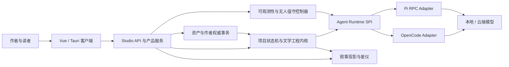

# ArcVellum v0.96 - v1.0 长期产品与 Runtime 路线图

> 文档状态：长期开发目标与实施基线  
> 基线版本：v0.95.3  
> 适用仓库：`o-1717986918/arcvellum`  
> 更新日期：2026-07-25  
> 性质：目标架构、实施顺序、验收契约；不是“已经实现”声明

## 专项实施文档

- [v0.96 - v1.0 统一工程实施方案](arcvellum-v0.96-v1.0-integrated-engineering-implementation-plan.md)：本路线图的模块级、架构级、代码级落地总入口，统一各工作流依赖、代码归属、迁移和验收。
- [自适应创作编排系统实施方案](arcvellum-adaptive-creative-orchestration-implementation-plan.md)：把固定路线升级为“Agent 提议策略、确定性编译、现有 Gate 执行”的受约束任务 DAG。
- [Denova 与 ArcVellum 架构对比审阅](../research/denova-comparative-architecture-review.md)：评估 Context Ledger、工具门禁、Mutation Receipt、版本管理和写作 IDE 等可借鉴能力及边界。

## 1. 文档目的

ArcVellum 已经拥有可运行的文学工程内核、受控 Agent Runtime、自动推进、叙事星仪、阅读器、档案投影、项目顾问、模型配置和桌面发布链路。下一阶段不应继续以零散热修方式增加功能，而应围绕三个问题进行系统收敛：

1. 叙事星仪能否完整、稳定、可理解地表现长篇作品，而不是只在数据较少时好看。
2. 用户能否以作者身份直接管理作品资产，同时不破坏状态机、引用关系和审计可靠性。
3. Agent Runtime 能否在权限可控的前提下获得更强工具能力、并发能力、本地模型能力和长期无人值守能力。

本文基于实际代码审阅修正需求边界，给出从 v0.96 到 v1.0 的完整实施方案。所有阶段都以“可验证增量”为原则，不以界面存在、命令可调用或测试桩通过代替真实闭环。

## 2. 实际审阅范围

本轮审阅覆盖以下当前实现，而不是仅依据旧规划推断：

- 叙事星仪：
  - `client/src/features/orrery/OrreryWorkbench.vue`
  - `client/src/features/orrery/NarrativeParallaxStage.vue`
  - `client/src/features/orrery/OrreryNodeOverlay.vue`
  - `client/src/features/orrery/CharacterThreadRail.vue`
  - `client/src/features/orrery/SpatialWindowLayer.vue`
  - `client/src/features/orrery/engine/parallaxRenderer.ts`
  - `client/src/features/orrery/layout/layoutEngine.ts`
  - `src/literary_engineering_studio/projections/narrative_projection.py`
- 档案与资产交互：
  - `client/src/features/library/LibraryView.vue`
  - `src/literary_engineering_studio_engine/projections/interaction/editing.py`
  - Engine 资产候选、审查、批准和晋升接口
- Agent Runtime 与并发：
  - `src/literary_engineering_studio/integrations/opencode/`
  - `src/literary_engineering_studio/runtime/`
  - `src/literary_engineering_studio/automation/`
  - `src/literary_engineering_studio/observability/`
- 文风工程：
  - Studio 的 `api/routers/style_lab.py`
  - Engine 的 `api/routers/style_lab.py`
  - 文风编译、评测、构建和挂载模块
- 已有作品反推：
  - `projects/source_ingest.py`
  - `routes/source_ingest/`
  - source-ingest Prompt Assets 和正式 Gate
- 新手引导：
  - `client/src/components/OnboardingTour.vue`

## 3. 批判性结论

### 3.1 可行，但不能一次性横向铺开

用户提出的方向整体可行，且与 ArcVellum 的长期定位一致。但它们不是同一层级：

- 星图关系恢复、整章展开、节点 LOD、正文窗口和人物栏属于 **现有功能正确性问题**，必须优先修复。
- 档案 IDE、文风工作室、整篇作品反推产品化属于 **现有内核能力的正式产品化**。
- Pi RPC、同项目多 Agent 并发、完全无人值守属于 **Runtime 架构升级**，需要先建立统一协议和资源冲突模型。
- “用户拥有审查豁免权”不能实现为删除 Gate 或任意覆写文件；应实现为可审计的作者权威事务。
- “恢复所有线条”不能实现为全量高亮，否则大项目会重新变成不可读的线团；应恢复语义可达性，并按观察尺度聚合。

### 3.2 当前不是从零开始

现有实现已经具备重要基础：

- 场景与章节投影已尝试保留全书节点，并能生成一部分人物、证据和关系边。
- 文风 Engine 已有作者项目、作品、导入、编译、评测、构建和挂载能力。
- source-ingest 已能生成源文本分块、提取任务、候选输出和审查 Gate。
- full_auto 已有委托路线、委托决策、任务/时间/成本/修订上限和授权期限。
- Agent 会话已有数据库记录、SSE 投影、状态、模型、任务、重试和健康信息。
- OpenAI-compatible 自定义模型端点已经存在，Ollama 可通过兼容地址试接。

下一阶段的核心不是重新写一套，而是消除旧 Engine 与 Studio Runtime 的断层，补齐数据契约和前端工作面。

### 3.3 必须保持的边界

1. Agent 不获得任意 Shell、任意项目写入和任意外部目录权限。
2. 正文仍由单个正式主创 Agent 对一个任务负责，不能把正文拆给不受控子 Agent 拼接。
3. 人类作者可以覆盖语义意见，但不能绕过 JSON/YAML schema、引用完整性、路径边界、版本冲突和来源记录。
4. 前端不展示模型隐藏思维链；只展示任务、输入资料清单、工具动作、证据、可见消息、产物和错误。
5. 全自动不承诺“任何故障都绝不停止”。它应消除可委托的人类等待，但遇到数据损坏、权限越界、无限重试或不可恢复矛盾时必须安全停止。
6. 星图动效必须表达真实状态，不以无意义粒子、闪光和背景动画代替信息设计。

## 4. 总体目标架构



目标不是把 ArcVellum 变成通用 IDE 或通用 Agent 平台，而是建立一个“作者可直接掌控、Agent 受状态机约束、作品状态可被空间化理解”的长篇文学工作室。

## 5. 视觉与交互路线：Living Narrative Field

### 5.1 设计定位

叙事星仪继续作为 ArcVellum 的视觉主体，但从“漂亮的节点地图”升级为 **Living Narrative Field，活叙事场**：

- 主体是作品的时间、人物、承诺、证据和因果关系。
- 远景展示结构与张力，近景展示场景与证据。
- 相同数据在不同尺度下改变表达方式，不因为镜头距离消失。
- 选择、推进、审查、Canon 写回和正文晋升都在场中留下可理解的视觉反馈。
- 周边窗口保持紧凑、半透明和工具化，不与星仪争夺视觉中心。

视觉签名不是“更多装饰”，而是一个可移动的 **语义透镜**：用户悬停、框选或聚焦时，局部关系被解束、放大并显示方向，远处关系聚合成具有节奏的光路。它既增强表现力，也解决大规模关系线可读性。

### 5.2 恢复关系、证据和伏笔线条

#### 当前问题

`parallaxRenderer.ts` 对次级证据边使用了极低透明度，并在远景降至接近不可见。这样避免了线团，却把“证据、伏笔、承诺和人物关系是否存在”一起弱化了。

#### 修正方案

建立 `RelationVisibilityProfile`，不再只以透明度决定生死：

```ts
type RelationFamily =
  | "sequence"
  | "scene_bridge"
  | "character"
  | "evidence"
  | "promise"
  | "question"
  | "branch"
  | "canon"
  | "review";

interface RelationVisibilityProfile {
  enabledFamilies: RelationFamily[];
  soloFamily?: RelationFamily;
  farMode: "bundled" | "chapter_summary";
  midMode: "priority_plus_focus";
  nearMode: "full";
  minimumSemanticPresence: number;
}
```

分尺度表达：

- 远景：不画每条细边，按章节、人物或关系族做 spline bundling；在锚点显示关系数量和类型。
- 中景：显示高强度关系、当前章节关系、当前人物关系和阻断关系。
- 近景：显示全部可用关系，并允许按关系族独显。
- 聚焦章节：主体时间线降为背景层，本章内部的场景、人物、证据、伏笔、问题、分支和审查关系全部提升。
- 聚焦人物：保留全景，不强制切成孤立人物页；整条人物路径、进入过的章节和相关证据高亮。

必须增加：

- 关系图例与计数。
- 关系族开关、独显和“恢复全部”。
- 线条悬停预览两端节点。
- 关系方向和时序提示。
- 只对当前任务或刚写回关系使用流动动画，静态关系不持续闪烁。
- 远景聚合边可点击解束，不能成为不可交互的装饰。

#### 验收

- 一个包含至少 30 章、150 场、300 条关系的项目，在远、中、近三种尺度下都能确认所有关系族存在。
- 远景没有不可读线团；近景不丢失任何正式关系。
- 选择人物、章节、证据后，所有直接和聚合关系均可追溯到原始边。
- 切换关系族不会改变后端数据，只改变投影表达。

### 5.3 修复“选择章节只展开一个场景”

#### 当前根因

后端场景投影已尝试包含聚焦章节的全部场景和子节点，但前端选择章节时仍把“第一个场景”作为单一 `focus` 传递。节点叠层又只理解一个 `focusNodeId`，其他同章场景容易被归为 distant，造成“只展开其中一个场景”的实际体验。

#### 修正方案

把单节点焦点升级为作用域：

```ts
interface NarrativeFocusScope {
  kind: "book" | "chapter" | "scene" | "character" | "relation";
  chapterId?: string;
  sceneIds: string[];
  memberNodeIds: string[];
  primaryNodeId?: string;
}
```

实现要求：

1. 章节目录点击时传入 `kind=chapter` 和 `chapterId`，不再用首场景冒充章节。
2. 场景视图仍展示全书，但同章场景组成一个可识别的簇。
3. 章节作用域下，每个场景的分支、问题、承诺、审查和证据节点都进入可见集合。
4. 用户再点某个场景时，只提高该场景权重，不移除同章兄弟场景。
5. `parent_id` 单父级模型不能表达的归属，通过 `parent_ids` 或作用域成员表补足。
6. 焦点切换保留历史，可前进、后退和返回全书。

#### 验收

准备一个章节含 3 个场景、每场各有分支/问题/审查/承诺的测试夹具：

- 点击该章后 3 个场景及全部子节点都存在。
- 点击任意场景后兄弟场景仍在同簇内，仅视觉降级。
- 底部章节目录跳转到对应章节簇，而不是首场景。
- API、Pinia 状态、WebGL/Canvas 层与 DOM 标签层使用同一焦点作用域。

### 5.4 节点不能因镜头距离丢失语义

#### 当前问题

现有 DOM Overlay 会根据可见区域、远景等级、碰撞和数量上限过滤节点。标签减量是合理的，但“标签隐藏”和“节点不存在”目前没有被清晰区分。

#### 修正方案

建立两层节点表达：

- **持续图形层**：所有节点在任何尺度都保留屏幕空间最小尺寸的 glyph；规模过大时变为聚合簇标记。
- **信息标签层**：根据碰撞、重要度和尺度显示标题、状态或详细信息。

规则：

- 当前任务、阻断、待决策、已固定和用户选中节点永不因距离隐藏。
- 普通节点远景可聚合，但聚合标记必须显示数量并可展开。
- 视野外节点以边缘 beacon 和小地图方向提示存在，不能谎称“可见”。
- 提供“显示全部标签”临时检查模式。
- 选中节点具有稳定屏幕尺寸，不随镜头远近缩成不可点击点。
- DOM 标签碰撞算法只影响标签，不影响 Canvas/WebGL glyph。

性能目标：

- 300 节点、1000 边时保持 60 FPS 目标，低端设备不低于可交互的 30 FPS。
- 1000 节点时自动进入聚合，不创建 1000 个持续活跃 DOM 元素。

### 5.5 重做正文长卷窗口

#### 当前问题

星仪正文窗口默认约 332 x 540，既像预览框又承担完整阅读，长正文容易显得被截断、层级拥挤。

#### 新交互

正文长卷提供三个状态：

1. **书签态**：窄条，只显示当前章、总字数和阅读进度。
2. **阅览态**：默认约 `min(46vw, 620px) x min(80vh, 760px)`，可拖动、调整尺寸和吸附。
3. **沉浸阅读态**：占据主视区，但保留退出和返回星仪的明确路径。

功能要求：

- 自动拼接全部已晋升正文，按卷/章/场组织目录。
- 支持全文、章节、场景定位，底部星仪目录与阅读器目录双向同步。
- 虚拟化或分段加载，避免百万字一次性创建 DOM。
- 保存每部作品的阅读位置、字体、行距、栏宽和主题。
- 可靠滚动到最后一场，不能以容器高度错误截断。
- 提供“边写边读”：新正文晋升后提示，不强制打断当前位置；用户可一键跳到新内容。
- 空项目显示创作准备说明，不显示无意义空白框。
- 拖动前后窗口尺寸与形状一致。

### 5.6 恢复人物节点和人物栏

#### 当前问题

章节和场景投影中已有按参与者名称生成角色节点的逻辑，`CharacterThreadRail` 也一直渲染。但当前依赖名称匹配，遇到别名、缺少标准 ID、未解析参与者或节点被 LOD 过滤时，用户会看到“人物不见了”。

#### 修正方案

- 场景契约增加 `participant_refs`，正式引用 Canonical Character ID。
- 迁移层把旧名称解析为 ID；无法解析时生成明确的 unresolved 记录，不静默忽略。
- 人物栏常驻左下角，提供“本章人物 / 全书人物 / 未解析”三组。
- 章节、场景视图始终保留全书人物入口；本章人物高亮。
- 每个人物节点连接其参与的全部场景，而不是只连接当前主场景。
- 点击人物时在全景中高亮人物轨迹，保留章节上下文。
- 人物栏支持搜索、固定、隐藏次要角色和查看关系变化。

### 5.7 增加交互性与表现力

优先增加有叙事意义的交互：

- 语义透镜：局部解束关系、放大节点、显示关系方向和证据摘要。
- 框选与套索：比较一组场景的节奏、人物和未兑现承诺。
- 时间游标：查看某一时点前已经成立的事实、人物状态和读者所知信息。
- 分支对照：同时预览两个分支对人物、承诺、Canon 和字数预算的影响。
- 路径回放：按章节或人物播放作品演化，支持暂停和逐步前进。
- 叙事热力层：张力、节奏、字数、审查风险和未兑现承诺作为可切换覆盖层。
- 视图书签：保存镜头、筛选器、关系族和固定节点。
- 小地图与方位提示：大项目中避免迷失。
- 键盘导航和屏幕阅读器辅助列表。

不建议：

- 让 Agent 任意决定正式节点坐标并写入作品 Canon。
- 用持续粒子爆炸、无意义光晕或永不停止的路径动画增加“华丽感”。
- 用复杂 3D 模型替代作品数据。

可预留 `LayoutHintProvider`：Agent 只能提交“语义邻近、章节分层、人物中心度、舞台/星簇偏好”等布局提示，确定性布局引擎负责约束、避碰和最终坐标。提示作为视图资产版本化，不成为作品事实。

## 6. 档案 IDE 与作者权威

### 6.1 当前边界

当前 `LibraryView.vue` 是经过包装的只读档案浏览器；正式编辑接口只允许展示标题、摘要、标签、备注和目标字数提示写入 UI override。角色、Canon、剧情、正文、审查和发布不能直接覆写。

这是安全的，但不够像作者工作台。

### 6.2 目标：Narrative Archive IDE

新档案界面采用主流 IDE 的信息架构，但不复制 VS Code 外观：

- 左侧：资产树、筛选、候选/正式/归档状态。
- 中央：多标签编辑器；结构化表单、Markdown 正文、关系视图和原始源文件视图。
- 右侧：字段说明、引用、影响范围、差异、版本和晋升状态。
- 底部：验证、审查、任务、冲突和写回日志。

视觉采用石墨黑、低饱和墨绿和语义色，强调可读性；候选、正式、冲突、人工权威和失效状态必须有独立视觉语义。

### 6.3 资产前端视觉框架

不要为每种档案手写一套完全独立页面。建立 `AssetViewRegistry`：

```ts
interface AssetViewDefinition {
  assetType: string;
  schemaVersion: string;
  sections: AssetSectionDefinition[];
  relationPanels: string[];
  editorMode: "form" | "markdown" | "hybrid";
  promotionPolicy: string;
}
```

角色、地点、组织、世界规则、场景、章节、伏笔、承诺、文风、审查等通过 schema 和 view definition 生成一致但有领域差异的界面。复杂字段可注册专用组件，不把全部内容退化成通用 JSON 表格。

### 6.4 作者最高权威的正确实现

用户是作品的最终作者，但“审查豁免”必须实现为 **Owner Override Transaction**，而不是 debug waiver：

```json
{
  "schema": "arcvellum/owner-override/v1",
  "asset_id": "character:protagonist",
  "base_revision": "sha256:...",
  "patch": [],
  "authority": "authoritative",
  "semantic_review": "waived_by_owner",
  "reason": "作者明确调整人物底线",
  "created_by": "user",
  "created_at": "...",
  "affected_artifacts": []
}
```

作者可：

- 创建、编辑、重命名、复制、归档和恢复资产。
- 手动把候选晋升为正式资产。
- 覆盖 Agent 审查意见。
- 声明某个版本为作者权威。

仍然必须通过：

- schema 与编码校验。
- ID、路径和引用完整性。
- 乐观锁与版本冲突检查。
- 影响分析和来源记录。
- 原子写入与可回滚版本。

应用作者权威事务后：

- 依赖旧资产的待处理 Context、Composition、Review 和 Promotion 标记为 stale。
- 已发布正文不被静默改写。
- 用户可选择重新审查受影响范围或保留历史。
- 所有变化进入可读审计记录。

### 6.5 文件管理

文件操作通过资产服务完成：

- 新建、重命名、移动、复制、归档、恢复。
- 删除先进入项目回收站，不直接永久删除。
- 批量操作先显示影响范围。
- 原始 JSON/YAML/Markdown 编辑只在高级模式开放。
- 原始模式保存也必须通过同一事务和验证，不可直接写磁盘绕过服务。

### 6.6 手动晋升

手动晋升流程：

1. 选择候选。
2. 显示与正式版本差异。
3. 显示引用、冲突、受影响场景和待失效产物。
4. 作者确认“以我的决定为准”。
5. 生成 Owner Override Transaction。
6. 确定性验证通过后原子晋升。
7. 更新 Read Model、星仪和任务状态。

## 7. 文风工程完整化

### 7.1 当前结论

文风模块不是空壳。Engine 已有：

- 作者项目。
- 作者作品子项目。
- 文本导入和分块。
- 文风分析任务。
- Style Skill 构建。
- 提示词评测任务。
- 项目挂载。

但正式 Studio API 目前主要暴露文风库、挂载状态和挂载操作；完整创建、导入、编译、评测仍位于 legacy Engine API，并且返回 `pending_platform_agent`。这与当前内置 Worker 架构不一致。

### 7.2 后端收敛顺序

1. 将 style-lab 领域服务从 legacy API 提取为 Studio Application Service。
2. 把 `platform-agent` sidecar 迁移为当前 `task package -> Runtime -> preflight -> submit`。
3. 为作者、作品、源文本、profile、Style Skill、评测和挂载建立稳定 schema 与版本号。
4. 源文本按 hash 去重，保留来源、授权/公版声明和导入时间。
5. 文风提示词以汉字及中文标点为计量口径，正式可挂载版本为 500 - 2500 字。
6. 每条文风约束必须包含：
   - 生成要求。
   - 正例与反例。
   - 适用条件。
   - 与作品证据的短引用位置。
   - 禁止机械照抄的边界。
   - 与通用标点、反 AI 腔规则冲突时的优先级。
7. 评测至少包含：
   - 未参与训练的保留样本。
   - 回译重构。
   - 大纲扩写。
   - 人工盲评。
   - 风格命中与内容泄漏分离。
8. Style Skill 必须经 review 后才能正式挂载。
9. 挂载记录包含 style 版本和 hash；生成、修订、审查任务都读取同一版本。
10. 更换挂载文风后，未开始的 Composition 和 Generation 失效重发；已经晋升的正文不自动重写。

### 7.3 前端：Style Atelier

文风工作室流程：

```text
作者项目
  -> 作品与语料
  -> 证据地图
  -> 文风候选
  -> 生成提示词
  -> 评测对比
  -> 人工审查
  -> 构建 Style Skill
  -> 挂载到作品
```

前端功能：

- 作者和作品管理。
- TXT/Markdown/DOCX 导入，重复检测和语料统计。
- 证据分布、句法节奏、叙述距离、意象、对白、标点和段落特征。
- 500 - 2500 字实时汉字计量。
- 候选提示词版本差异。
- 回译与扩写并排盲评。
- 一键挂载、卸载、切换版本。
- 明确显示当前作品全部生成任务实际使用的文风版本。

## 8. 整篇作品反推为项目

### 8.1 当前能力

`source-ingest` 已支持 TXT/Markdown 文件或目录，生成 raw、chunk、manifest、提取任务，以及项目简报、人物、世界观、大纲、时间线、伏笔、文风说明和审查的候选输出。正式 Gate 要求证据、completion 和 clean review。

当前不足：

- 导入格式有限。
- 分块主要按字符，缺少章节/场景语义切分。
- 角色消歧、别名合并、时间矛盾和多轮全书综合不足。
- 输出偏 Markdown 候选，不等于完整可运行项目。
- 缺少前端工作流和候选批量晋升。

### 8.2 目标：Project Archaeology

分阶段反推：

1. **源文本保全**
   - 支持 TXT、Markdown、DOCX；PDF 仅在可可靠提取文本时开放。
   - 保存不可变原文、文件 hash、编码、章节边界和权利声明。
2. **结构分割**
   - 识别卷、章、场景、时间跳跃、视角切换和伪记录类型。
   - 确定性边界与 Agent 推断边界分别记录。
3. **实体解析**
   - 人物、别名、地点、组织、物件、事件、时间和关系。
   - 同名/别名候选由用户或受托决策者合并，不能静默合并。
4. **多轮提取**
   - 分块提取。
   - 章节聚合。
   - 全书冲突审计。
   - 证据与置信度校准。
5. **项目重建**
   - 项目简报。
   - 角色文件与隐藏背景。
   - Canon、地点、组织和规则。
   - 卷章场景结构。
   - 时间线。
   - Promise/Payoff 和 Reader Question Ledger。
   - 叙事节奏、详略与字数分布。
   - 文风候选。
6. **候选审查与晋升**
   - 所有反推内容先进入候选项目。
   - 关键冲突和低置信度项集中展示。
   - 批量晋升仍逐资产记录来源与版本。

### 8.3 产品模式

入口提供四种目的：

- 续写基础。
- 改写重构。
- 剧本/媒介改编。
- 作品分析。

四种模式共享源证据，不共享未经确认的推断。完成标准不是“生成了几份说明”，而是项目能通过对应正式路线的 workflow dashboard，至少可进入 longform planning 或 scene development。

## 9. Agent 权限扩展

### 9.1 当前边界

OpenCode Worker 目前允许 sandbox 内 read/glob/grep/list/edit/write，禁止 bash、网络、skill、subagent、外部目录和 LSP。这对写作安全，但限制了研究、结构查询和复杂计算。

### 9.2 不开放任意权限，开放声明式能力

新增 `CapabilityManifest`：

```json
{
  "task_id": "route.scene-development.compose-scene...",
  "capabilities": [
    {"id": "project.query", "scope": ["staged_sources"]},
    {"id": "schema.inspect", "scope": ["expected_outputs"]},
    {"id": "text.statistics", "scope": ["staged_sources"]},
    {"id": "research.web", "scope": ["allowlisted_domains"], "max_calls": 8}
  ]
}
```

优先能力：

- `project.query`：对已暂存资料做结构化查询。
- `schema.inspect`：读取当前输出 schema 和字段说明。
- `text.statistics`：汉字、标点、句式、重复和节奏统计。
- `citation.lookup`：在 source-ingest 证据中定位来源。
- `research.web`：仅研究类任务，URL、次数和结果大小受限。
- `reference.search`：只读本地参考库。
- `asset.diff`：比较候选和正式资产。

实现 `CapabilityBroker`：

- 依据 route、task type、role 和政策发放能力。
- 每次调用记录参数摘要、结果 hash、耗时和错误。
- 外部网络结果先落研究候选，不直接写 Canon。
- 主创正文任务默认不获得 Web，避免资料漂移和提示词污染。
- 确定性 CLI 操作由内核执行，不由 Agent 获得 Shell。

## 10. 同项目多主 Agent 并发

### 10.1 当前结论

当前 WorkerSupervisor 虽有线程池，但 `ProjectExecutionCoordinator` 对同一项目只允许一个 owner；自动推进也是串行路线循环。因此当前可跨项目并发，不支持同一项目多个主任务同时正式写回。

这是保守且正确的起点。不能仅提高 `max_workers` 就声称支持并发。

### 10.2 目标：依赖图并发

以自适应编排的 `CompiledTaskGraph` 作为唯一依赖图，不再建立平行 `TaskDependencyGraph`。每个编译节点补齐资源字段：

```json
{
  "task_id": "...",
  "base_project_revision": "...",
  "reads": ["canon/**", "characters/protagonist.yaml"],
  "writes": ["reviews/scene_0012.json"],
  "depends_on": ["..."],
  "barrier": "chapter-03-review",
  "parallel_class": "independent-review"
}
```

并发条件：

- 任务前置状态一致。
- 写集合不重叠。
- A 的写集合不与 B 的读集合重叠。
- 使用同一不可变项目快照。
- 合并前重新校验 revision。

优先并发场景：

- 多个独立来源的研究摘要。
- 文风语料分块分析。
- 同一候选的多审查者评审。
- 不同候选资产的审查。
- 不写正式项目的诊断任务。

谨慎或默认串行：

- 因果连续的场景正文。
- 人物状态和 Canon 写回。
- 同章依赖前场余波的正文。
- Promotion、state-apply、canon-apply 和 release。

正文并发只在明确标记为独立分支或非连续章节时实验启用，并必须经过 Continuity Merge Gate。并发的价值首先用于提高审查和分析质量，不用于盲目批量写正文。

## 11. Pi Agent RPC 接入

### 11.1 可行性

Pi 官方提供 RPC 模式，`pi --mode rpc` 通过 stdin/stdout JSONL 接收命令并发送响应与事件，适合 IDE 和宿主程序嵌入。ArcVellum 的 Python 服务、Tauri 桌面壳和独立 Agent 进程架构适合采用子进程 RPC Adapter。

参考：

- Pi RPC：<https://pi.dev/docs/latest/rpc>
- Pi SDK：<https://pi.dev/docs/latest/sdk>
- Pi Mono：<https://github.com/badlogic/pi-mono>

### 11.2 实现方式

复用并版本化当前 `runtimes/base.py::AgentRuntime`。Pi 的会话与 RPC 细节封装在 Adapter 内部，Worker 仍使用统一的单任务执行入口：

```python
class AgentRuntime:
    def availability(self) -> RuntimeAvailability: ...
    def capabilities(self) -> AgentRunnerCapabilities: ...
    def execute(
        self,
        workspace: Path,
        prompt_path: Path,
        run_root: Path,
        *,
        timeout: int,
        event_sink: EventSink | None = None,
        cancel_event: Event | None = None,
    ) -> RuntimeResult: ...
```

适配器：

- `OpenCodeRuntime`
- `PiRpcRuntime`

Pi 接入流程：

1. Studio 创建现有隔离 task workspace。
2. 生成与 OpenCode 相同的 `AGENT_TASK.md`、source manifest 和 expected outputs。
3. 启动固定版本 Pi 子进程。
4. 通过合规 JSONL parser 收发 RPC；不得使用会错误切割 Unicode 行分隔符的简化 parser。
5. 将 Pi event 归一化为 Studio `RuntimeEvent`。
6. 只暴露 ArcVellum 自定义受控工具，不加载通用 coding tools。
7. 输出继续经过现有 deterministic preflight、submit 和 complete。
8. Runtime 切换不改变文学任务契约。

发布前必须完成：

- 许可证审计。
- 固定版本与校验和。
- Windows 打包、签名、更新体积评估。
- 进程退出、崩溃恢复和孤儿进程清理。
- OpenCode/Pi 契约一致性测试。

Pi 首先作为可选实验 Runtime，不立即替换 OpenCode。

## 12. Ollama 与本地模型

### 12.1 当前可用路径

Ollama 提供 OpenAI-compatible `/v1/chat/completions`、流式、JSON、工具和模型接口。ArcVellum 已有自定义 OpenAI-compatible provider，因此用户理论上可使用：

```text
http://127.0.0.1:11434/v1
```

参考：<https://docs.ollama.com/api/openai-compatibility>

### 12.2 产品化要求

增加一等 Ollama Provider：

- 检测本地服务。
- 列出已安装模型。
- 展示模型大小、上下文长度和可能的工具/JSON 能力。
- 测试连接与结构化输出。
- 支持模型拉取进度；首版可只提供清晰命令和状态，不必自行实现下载器。
- 为 worker、advisor、steward 分别选择模型。
- 显示“数据保留在本机”的隐私标记。
- 提供内存/显存提示。
- 支持云模型回退策略。

不能默认认为本地小模型适合全部文学任务。应建立任务适配等级：

- 机械整理、分类和局部 lint：低门槛。
- 结构化资产、审查：中等。
- 长篇正文、复杂推演和全书一致性：高门槛。

模型能力探测结果进入 Runtime Capability，不合格模型不得被静默用于强结构化或超长上下文任务。

## 13. 完全无人值守创作

### 13.1 当前能力

现有模式包含：

- `collaborative`
- `supervised_auto`
- `full_auto`

full_auto 已能委托分支、文风挂载、修订方向、扩纲、资产批准、Canon patch、状态确认和发布，并具备任务数、运行时间、修订次数、失败次数、成本和授权期限。

### 13.2 当前仍可能停下的原因

- 授权过期或额度到达。
- 决策类型不在委托表。
- 不可委托的完整性 Gate。
- 相同任务重复失败。
- Provider 断连、模型能力不足或输出预检持续失败。
- 项目状态损坏、引用冲突或无进度空转。
- 需要用户提供外部事实或权利确认。

### 13.3 目标：Unattended Campaign

用户启动时签署一次可见、可撤销的运行策略：

- 允许路线。
- 允许决策类型。
- 是否允许自动发布。
- 最大任务、时间、成本、失败和修订次数。
- 模型回退顺序。
- 质量下限和保守策略。
- 遇到未知决策时暂停还是采用保守默认。
- 通知方式。

新增恢复阶梯：

1. 同会话修订。
2. 重新暂存上下文并重试。
3. 切换同等级模型。
4. 切换 Runtime。
5. 重发任务包。
6. 回退到最近稳定 checkpoint。
7. 超过策略上限后安全停止。

新增：

- 每章 checkpoint。
- Progress Fingerprint，识别空转。
- Blocker Taxonomy，区分等待、失败、数据损坏和模型故障。
- 自动续期仅在用户预授权上限内进行。
- 断电/重启后从持久 lease 和 checkpoint 恢复。
- 用户离线时把重要事件记入通知中心。

验收不是“跑了很久”，而是：

- 在无人工操作下，从项目简报推进到至少一个完整章节闭环。
- 所有可委托决策都留下可审计依据。
- 模拟 Provider 故障后能按策略恢复或明确停止。
- 不出现重复提交、无限修订、空转和越权晋升。

### 13.4 创作吞吐：减少往返，不减少正式步骤

当前流程繁琐的主要成本来自：每个细粒度任务都重复领取、打开、暂存上下文、调用 Agent、预检和写回；同项目大部分工作串行；格式错误经常在模型完成后才被发现。OpenCode 服务复用只能减少进程成本，不能自动消除模型轮次和重复上下文。

优化采用四项机制：

1. `ExecutionBundle`：以白名单模板让同一角色在一个受控执行束中交付多份独立正式产物；Writer 与 Reviewer 永远分离。
2. `RollingHorizonWindow`：章节全局规划后，只深度推演未来 2 - 4 个场景，每个场景写回后重新基准化。
3. `SceneRiskProfile`：所有场景保留 RP、分支依据和正式 Review，只按 compact/standard/deep 调整推演与审查深度。
4. Context cache 与局部 output repair：按 Canon、人物状态、文风、预算和场景契约 hash 缓存；格式错误只修复无效产物，语义失败仍走正式 revision。

正式产物、Gate、promotion 和状态写回数量不因“快速模式”减少。Bundle 只能由确定性 Compiler 生成，遇到人类决策、角色变化、语义审查和正式写回边界必须切断。

吞吐验收记录每个晋升场景的模型轮次、阶段耗时、上下文缓存命中、首次 preflight/review 通过率、repair/retry 和 stale 浪费。只有在正式产物与 Gate 等价的前提下，速度提升才有效。

## 14. Agent 会话观测台

### 14.1 当前能力

当前后端已经投影：

- session ID。
- role、runtime、model。
- status、route、task ID。
- event/retry count。
- 最近可见消息。
- 开始、更新时间、耗时。
- Runtime service 健康、租约和重启次数。
- SSE 实时更新和 stalled 判断。

当前前端仅以紧凑会话卡展示，无法充分解释 Agent 正在读什么、为何等待、产物进展和上下文负担。

### 14.2 新增 Agent Observatory

独立面板包含：

- 会话卡：角色、模型、任务、阶段、耗时、重试、健康。
- 任务时间线：领取、暂存、模型响应、写产物、预检、修订、提交。
- 上下文清单：
  - 资料名称。
  - 暂存/实际读取状态。
  - 字符或 token 估算。
  - Prompt Asset 版本。
  - 缓存命中。
- 工具调用：
  - 能力名称。
  - 输入摘要。
  - 耗时。
  - 成功/失败。
- 产物进度：
  - expected outputs。
  - 已创建、已修改、待补充、预检失败。
- 用量：
  - Provider 可提供时显示 token、成本和上下文占用。
- 控制：
  - 停止。
  - 重试。
  - 切换 Runtime/模型。
  - 打开任务和产物。

安全边界：

- 不展示 API Key。
- 不展示绝对路径给普通用户。
- 不展示隐藏思维链。
- 不把完整正文和提示词重复塞进日志。
- 可以展示可见助手消息、动作、证据、资料清单和错误摘要。

会话可以和星仪联动：当前 Agent 正在处理的章节、场景或资产节点出现克制的活动标记，点击进入观测台。

## 15. 模块化新手引导

### 15.1 当前不足

现有 `OnboardingTour.vue` 是一次性的全局 4 - 5 步导览，能解释项目、星仪、导航、顾问和帮助，但不能覆盖文风、档案编辑、全自动、模型、阅读、交付、Agent 观测等复杂模块。

### 15.2 三层引导

1. **首次启动导览**
   - 只解释建立项目、模型连接、星仪、推进和顾问。
   - 控制在 5 步内。
2. **模块导览**
   - 第一次进入档案 IDE、文风、自动创作、Agent 观测、阅读器和交付时触发。
   - 每个模块 3 - 7 步。
3. **状态化帮助**
   - 解释为什么当前按钮不可用。
   - 展示缺失前置、下一步和风险。
   - 与真实 workflow dashboard 和 Gate 对齐。

附加能力：

- 设置中随时重播。
- 新手/进阶/专家显示密度。
- 术语词典。
- 键盘导航和 reduced motion。
- 本地记录已完成步骤，不跨项目重复骚扰。
- 选择器稳定性测试，避免界面改版后导览指向空白。
- 所有文案从用户目的出发，不暴露实现目录和内部 JSON。

## 16. 横切数据契约

实施前先定义以下稳定契约：

| 契约 | 解决问题 |
| --- | --- |
| `NarrativeFocusScope` | 整章不能只由一个首场景代表 |
| `RelationVisibilityProfile` | 关系不能靠单一透明度开关 |
| `CharacterReference` | 人物别名与名称匹配导致丢失 |
| `OwnerOverrideTransaction` | 用户权威与工程完整性冲突 |
| `AssetViewDefinition` | 档案类型快速产品化 |
| `CapabilityManifest` | Agent 权限扩展不退回任意 Shell |
| `CompiledTaskGraph` | 自适应编排与同项目并发共用的依赖图；不另建第二套 `TaskDependencyGraph` |
| `ExecutionBundle` | 在不合并角色和 Gate 的前提下减少 Agent 会话往返 |
| `RollingHorizonWindow` | 章节全局规划与近场深度推演的边界 |
| `SceneRiskProfile` | 调整推演深度但不能删除 RP、分支依据或正式 Review |
| `AgentRunnerCapabilities` | OpenCode、Pi、Ollama 能力差异；扩展现有 `runtimes/base.py` 契约 |
| `AgentSessionProjection v3` | 上下文、工具和产物进度可视化 |
| `StyleProfileVersion` | 文风编译、评测、挂载版本一致 |
| `SourceEvidenceRef` | 整篇反推的证据和不确定性 |
| `UnattendedCampaignPolicy` | 无人值守授权、恢复和停止边界 |

所有契约先写 JSON Schema / Python dataclass / TypeScript type，再改 UI。API 版本升级必须保留旧项目迁移路径。

## 17. 分阶段实施计划

### Phase A：v0.96.0 星仪正确性与可读性

目标：先解决用户明确遇到的五项视觉正确性问题。

任务：

1. 引入 `NarrativeFocusScope`。
2. 修复章节选择只展开首场景。
3. 引入关系族、远景聚合和近景全量表达。
4. 分离节点 glyph 与 label LOD。
5. 人物引用解析、人物栏和章节/场景人物节点。
6. 重做正文长卷三态窗口。
7. 增加大规模投影性能夹具。
8. 视觉回归覆盖四主题、全书/章节/场景/人物焦点。
9. 建立每个晋升场景的模型轮次、阶段耗时、重试和首次通过率基线。

退出条件：

- 用户列出的视觉 1 - 5 项全部以自动测试和实际截图验收。
- 30 章以上测试项目不丢节点、不丢关系族、不只展开首场景。

### Phase B：v0.96.5 星仪交互与表现力

任务：

1. 语义透镜。
2. 关系独显和图例。
3. 时间游标、路径回放和视图书签。
4. 叙事热力层。
5. 小地图、框选和键盘导航。
6. `LayoutHintProvider` 预留接口。

退出条件：

- 每项动效都对应真实数据变化。
- reduced motion 下功能不丢失。
- 1000 节点压力场景仍可操作。

### Phase C：v0.97.0 Narrative Archive IDE

任务：

1. `AssetViewRegistry`。
2. 资产树、标签编辑、结构化表单、Markdown 和高级原始模式。
3. Owner Override Transaction。
4. 影响分析、版本、差异和 stale propagation。
5. 候选手动晋升。
6. 回收站、恢复和冲突解决。
7. 模块新手引导第一批。

退出条件：

- 用户可从前端创建、编辑、晋升、归档和恢复主要资产。
- 人类可覆盖语义审查，但任何写入都不能破坏 schema 和引用。
- 修改关键人物后，受影响任务被准确标记 stale。

### Phase D：v0.98.0 文风与作品考古

任务：

1. 文风领域服务迁入正式 Studio Runtime。
2. 完整 Style Atelier。
3. 文风版本、评测、review 和挂载闭环。
4. source-ingest 支持 DOCX 和语义分段。
5. 实体消歧、全书聚合、冲突审计和项目重建。
6. Project Archaeology 前端。
7. 反推候选与 Archive IDE 晋升联动。
8. 依赖 hash 上下文缓存与 Rolling Horizon shadow。

退出条件：

- 文风创建到挂载不再依赖 legacy `platform-agent`。
- 整篇作品可形成证据化候选项目，并通过正式 source-ingest Gate。
- 一个反推项目可继续进入 longform planning。

### Phase E：v0.99.0 Runtime SPI、本地模型与可观测性

任务：

1. 版本化并收敛现有 `runtimes/base.py::AgentRuntime` 契约，不新建第二套 SPI。
2. 以现有 OpenCode Adapter 为基准补齐共享 contract test，不改变现有行为。
3. Ollama 一等 Provider 和模型能力探测。
4. Pi RPC 实验 Adapter。
5. Capability Broker。
6. Agent Session Projection v3。
7. Agent Observatory 前端。
8. Context cache、角色 session lease 和 Execution Bundle shadow。

退出条件：

- 同一测试任务可由 OpenCode 与 Pi 执行并经过相同 preflight。
- Ollama 可从设置中发现、测试和分配模型。
- 用户能看见任务、上下文清单、工具动作和产物进度。

### Phase F：v0.99.5 并发与无人值守

任务：

1. 以 `CompiledTaskGraph` 补齐 base revision、读写集、barrier 和 parallel class。
2. Snapshot revision 和读写集冲突检测。
3. 审查、研究和文风分析的 fan-out/fan-in。
4. Unattended Campaign Policy。
5. 恢复阶梯、Provider 回退、章节 checkpoint。
6. 空转检测、断电恢复和通知中心。
7. chapter-planning/scene-analysis Bundle、Rolling Horizon 和 SceneRiskProfile。
8. 局部格式 repair 与只读多维 Review 并发。

退出条件：

- 至少两类同项目安全任务能并发，冲突任务必定串行。
- 无人工操作完成一章全闭环。
- 故障注入下不越权、不重复提交、不无限重试。

### Phase G：v1.0 产品硬化

任务：

1. 全量数据迁移与旧项目兼容。
2. Windows 安装、更新、Pi/Ollama 可选组件和进程清理。
3. 性能、可访问性、国际化和安全审计。
4. 真实长篇项目试用。
5. 用户文档、协议、隐私和故障恢复手册。
6. Release candidate 与回滚演练。

退出条件：

- 所有 P0/P1 缺陷关闭。
- 核心 E2E、客户端、Runtime、打包、更新全部通过。
- 不需要用户安装 Python/Node/Rust；本地模型本身可作为可选外部依赖。

## 18. 具体代码组织建议

```text
client/src/features/
  orrery/
    focus/
    relations/
    lenses/
    readers/
    characters/
  archive/
    registry/
    editors/
    impact/
    history/
  style-atelier/
  archaeology/
  agent-observatory/
  onboarding/

src/literary_engineering_studio/
  application/
    assets/
    style/
    archaeology/
  orchestration/
    contracts.py
    compiler.py
    lint.py
    simulator.py
    scheduler.py
    bundles.py
    rolling_horizon.py
    risk.py
  runtime/
    capabilities/
    resources/
    bundle_executor.py
    context_cache.py
    output_repair.py
  runtimes/
    base.py
    opencode.py
    pi_rpc.py
  integrations/
    opencode/
    pi/
    providers/
  observability/
    context_ledger.py
    mutation_receipts.py
    session_projection.py
    throughput_metrics.py
  automation/
    campaign/
    recovery/

src/literary_engineering_studio_engine/
  literary/
    style/
    ingest/
```

`runtime/` 负责执行、沙箱和资源边界，`runtimes/` 负责 Agent Runner Adapter，`orchestration/` 负责编译后的创作任务图；三者不得合并。领域契约放在所属模块，不建立巨型通用 `protocol` 包。不在一次提交中大规模移动所有现有文件。先建立边界和兼容 import，再按领域迁移，避免目录整理与行为修改互相掩盖。具体文件清单以统一工程实施方案为准。

## 19. 测试与验收矩阵

### 19.1 前端

- Unit：焦点作用域、关系 LOD、聚合、人物解析、窗口状态。
- Component：Archive 编辑、Style Atelier、Agent Observatory、Onboarding。
- Visual Regression：四主题、四焦点尺度、正文窗口三态、100/300/1000 节点。
- Playwright：
  - 章节选择展示全章所有场景子节点。
  - 关系族独显。
  - 人物栏跳转。
  - 正文滚到最后。
  - 候选手动晋升。
  - 新手引导可完成和重播。
- Canvas Pixel Check：星仪非空、节点/边存在、聚焦前后构图不崩塌。

### 19.2 后端

- Contract：所有新 schema 向前兼容。
- Owner Override：版本冲突、影响分析、原子回滚。
- Style：500 - 2500 汉字计量、评测隔离、挂载 hash。
- Source ingest：章节分割、证据引用、实体冲突和候选 Gate。
- Runtime：OpenCode/Pi 一致性、取消、超时、崩溃和孤儿进程。
- Capability：未授权工具、路径和网络请求必定拒绝。
- Scheduler：读写冲突、barrier、stale snapshot 和 fan-in。
- Autopilot：授权、恢复、回退、空转和成本上限。
- Throughput：固定路线与 Bundle 路线正式产物/Gate 等价；缓存失效、局部 repair 和滚动窗口重基准化。

### 19.3 真实项目验收

至少使用三类项目：

1. 小型测试项目：快速覆盖流程。
2. “你好新世界”等现有长篇项目：视觉和兼容回归。
3. 大规模合成项目：50 章、300 场、1000 节点、3000 边。

每个正式版本必须保存：

- 桌面截图。
- 关键流程录像或 Playwright trace。
- E2E 结果。
- 性能数据。
- 安装与更新记录。

## 20. 风险登记

| 风险 | 影响 | 对策 |
| --- | --- | --- |
| 全量关系恢复导致线团 | 星仪不可读 | 分尺度聚合、关系族、语义透镜 |
| DOM 节点过多 | 掉帧、卡顿 | Canvas glyph、标签 LOD、虚拟化 |
| 作者直接编辑破坏项目 | 后续任务失真 | Owner Override Transaction、stale propagation |
| Pi 与 OpenCode 行为差异 | 预检不一致 | Runtime SPI、契约测试、固定版本 |
| 本地模型质量不足 | 正文和 JSON 失败 | 能力探测、任务适配等级、云回退 |
| 同项目并发写冲突 | 数据损坏 | 不可变快照、读写集、fan-in Gate |
| 全自动无限修订 | 成本和时间失控 | Progress Fingerprint、上限、恢复阶梯 |
| Bundle 变成跳过流程的捷径 | 正式产物或审查缺失 | 白名单模板、单角色、边界切断、等价性测试 |
| 上下文缓存过期 | 使用旧 Canon、人物状态或文风 | 依赖 hash、明确失效、Context Ledger |
| 风险分级被用来降质 | 轻量场景缺少推演或 Review | 机器最低等级、Agent 只能上调、强制 Gate |
| 会话面板泄露隐私 | 凭证或原文暴露 | 用户安全投影、路径清洗、不展示思维链 |
| 文风学习过拟合或侵权 | 内容与发布风险 | 权利声明、保留集、抽象 craft、泄漏审计 |
| 整篇反推强行确定事实 | 项目基础错误 | 证据、置信度、矛盾和候选晋升 |
| 新手引导维护失效 | 指向空元素 | 稳定 tour id、组件测试、可重播 |

## 21. 优先级与暂缓项

### 立即做

- 星图关系可见性。
- 整章焦点作用域。
- 节点 glyph/label 分层。
- 正文长卷窗口。
- 人物 ID 与人物栏。
- 建立创作吞吐基线，不先凭感觉优化。

### 下一阶段做

- Archive IDE 与 Owner Override。
- 文风 Engine 迁入正式 Runtime。
- Project Archaeology 产品化。
- Context cache、局部 repair 和 Rolling Horizon shadow。

### 建立协议后做

- Pi RPC。
- Capability Broker。
- Ollama 一等 Provider。
- Agent Observatory v3。
- Execution Bundle 白名单、角色 session lease 和吞吐投影。

### 最后做

- 同项目并发。
- 长时间无人值守 Campaign。

### 暂不做

- 给创作 Agent 任意 Shell 或项目根目录写权限。
- 让用户修改文件后跳过所有结构校验。
- 为了并发把连续正文拆给多个 Agent 拼接。
- 展示模型隐藏思维链。
- 把星仪改造成与作品无关的通用 3D 世界。

## 22. 完成定义

本路线完成后，ArcVellum 应达到以下状态：

1. 叙事星仪在大项目中不丢关系、不丢人物、不丢同章场景，且仍保持可读和流畅。
2. 用户可在美观的档案 IDE 中管理正式资产，并以作者权威覆盖语义意见，同时保留工程完整性。
3. 文风学习、评测、构建、挂载和生成消费全部进入正式 Runtime。
4. 完整作品可以证据化反推为可继续开发的候选项目。
5. OpenCode、Pi 和本地 Ollama 通过统一 Runtime 契约接入。
6. 安全任务可以并发，因果写回仍受序列化 Gate 保护。
7. 全自动模式能在预授权边界内无人值守推进，并在不可恢复风险前安全停止。
8. 用户能清晰看到每个 Agent 会话正在做什么、读了哪些资料、交付了什么，而不接触隐藏推理和敏感信息。
9. 每个复杂模块都有可重播、与真实状态绑定的新手引导。
10. Windows 用户仍能通过普通安装包使用产品，不需要配置开发环境。
11. 创作吞吐相对基线提高，且正式产物、Gate、正文所有权和独立审查没有减少。

这份路线图的核心不是让 ArcVellum 拥有更多按钮，而是让“作者权威、Agent 能力、文学工程约束和叙事可视化”成为同一个可靠系统。
