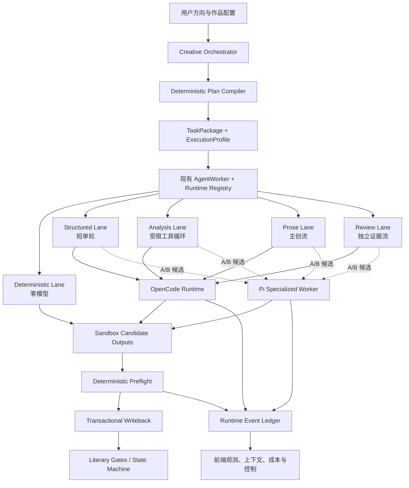

# ArcVellum 专用 Agent Runtime、Pi 评估与创作效率架构实施方案

> 状态：已按实际仓库完成实施前审计；P0 已完成，P1-P5 待实施
> 编写日期：2026-08-09  
> 审计日期：2026-08-09  
> ArcVellum 基线：产品版本 `0.97.3`；分支 `release/v0.97.0`；提交 `6f8b66b55ae8076135c31cfb2716511ed659a5f6`  
> Pi 评估基线：`earendil-works/pi` / `936aff00918de1187f085f123c2812d8f2d67745`  
> 上游跟踪 fork：<https://github.com/o-1717986918/arcvellum-pi-agent>  
> 关联规划：
> - `docs/roadmap/arcvellum-v0.96-v1.0-integrated-engineering-implementation-plan.md`
> - `docs/roadmap/arcvellum-adaptive-creative-orchestration-implementation-plan.md`
> - `docs/roadmap/arcvellum-post-v0.95.3-long-horizon-product-and-runtime-roadmap.md`
> - `docs/architecture/reviews/post-w6-layered-code-architecture-literary-quality-review-and-remediation-plan.md`

> **实施纪律**：本文中的文件名和阶段边界以本次实际代码审计后的版本为准。若后续代码与本文再次出现偏差，必须先更新“规划-实现偏差矩阵”，不得按旧假设直接新增平行模块。

## 0. 本文解决什么问题

本文不是“把 OpenCode 换成 Pi”的接入说明，而是一次运行时与创作吞吐的重新定界。它同时回答四个问题：

1. ArcVellum 是否应该构建一个面向文学工程的专用 Agent；
2. Pi 的哪些能力值得复用，哪些部分不适合进入产品；
3. 不依赖 Pi，ArcVellum 自身还能如何降低延迟、上下文、费用和失败率；
4. 如何在不削弱文学质量、正式门禁和工程质量的前提下逐步实施、量化验证并随时回滚。

本文的核心结论是：

> **ArcVellum 应先把任务执行方式从“所有智能任务都交给通用编码 Agent”升级为“按文学任务语义选择执行车道”；Pi Agent Core 是其中一个有价值的候选执行底座，而不是新的项目内核。**

Pi 是否成为默认运行时，必须由同模型、同任务快照、同门禁的 A/B 数据决定。即使 Pi 试验失败，执行车道、上下文合同、完成提交、可观测性和预算治理仍然能直接改善现有 OpenCode 路线。

---

## 1. 不可改变的架构边界

### 1.1 ArcVellum 永远拥有的权力

以下能力继续由 Python 内核和 Studio 控制，不下放给任何 Agent Runtime：

- 文学项目状态机和 `task-next` 决策；
- `TaskPackage`、`TaskExecutionContract` 和正式输出合同；
- Canon、人物状态、字数、节奏、衔接、文风和审查门禁；
- 沙箱创建、允许读取集、允许写入集和资源租约；
- 确定性 preflight、候选预览、正式写回和回滚；
- 人类决策、授权、晋升、交付和审计记录；
- Autopilot、Campaign、CreativeExecutionPlan 与任务 DAG；
- 前端项目管理和用户可见状态的权威读模型。

Agent Runtime 只能：

- 接收一个已经编译完成的任务执行包；
- 在授权上下文中进行语义判断和文学创作；
- 调用明确列出的领域工具；
- 写入 `expected_outputs` 的候选副本；
- 发回事件、用量、成本、思考片段和完成声明。

### 1.2 不用“隐藏结构”代替安全

专用 Agent 可以知道它正在处理角色、Canon、场景、文风和审查，但不能靠路径猜测或自由文件操作改变正式项目。安全来自：

- 能力白名单；
- 任务级读写合同；
- 隔离工作区；
- 确定性 preflight；
- 写回事务；
- 审计和资源冲突检测。

### 1.3 不把隐藏思维链当产品承诺

用户希望看见推理过程和上下文，产品应尽量透明，但必须精确区分：

- **可展示**：供应商真实返回的 thinking/reasoning block、工具调用、上下文清单、任务决策摘要、预算、验证结果；
- **不可伪造**：供应商没有返回的隐藏推理链；
- **必须过滤**：凭证、系统密钥、非任务文件内容、控制提示中的敏感信息。

ArcVellum 不再一概丢弃 reasoning 事件，但也不把“没有可用原始推理”包装成“完整思维链”。

---

## 2. 基于实际工程的现状审计

### 2.1 当前 ArcVellum 已经具备的可靠底座

实际代码表明，项目并不缺一套状态机：

- `src/literary_engineering_studio/contracts.py` 已定义任务、执行角色、能力和输出合同；
- `src/literary_engineering_studio/runtime/worker.py` 已组织沙箱、运行时、预检和写回；
- `src/literary_engineering_studio/runtime/sandbox.py` 已限定 Agent 可见文件；
- `src/literary_engineering_studio/runtime/worker_writeback.py` 已负责候选验证和正式提交；
- `src/literary_engineering_studio/runtime/context_budget.py` 已按任务类型定义上下文预算；
- `src/literary_engineering_studio/runtime/execution_context.py` 已区分 must-inline、exact-on-demand、summary 和 excluded；
- `src/literary_engineering_studio/runtime/prepared_context_cache.py` 已有可复用上下文缓存；
- `src/literary_engineering_studio/orchestration/` 已有 CreativeExecutionPlan、编译、lint、simulation、资源声明和章节视野；
- `src/literary_engineering_studio/observability/` 已有会话、吞吐、上下文和事件归因；
- `client/src/features/observatory/AgentObservatoryView.vue` 已有 Agent 观测入口；
- OpenCode 已采用角色级常驻服务进程，避免每项任务都重新启动二进制。

因此，重构不应另建第二套任务系统、沙箱、门禁或 Campaign。

### 2.2 当前真实慢点并非单纯“模型慢”

对 `C:/Users/26532/.literary-engineering-studio/runs/project-d9104835e8` 的实际运行记录检查显示：

- 同一 `longform-planning-longform-budget-agent-task` 在短时间内多次重试；
- 一个完整样本首个公开事件约为 `106735 ms`；
- 运行中发生 6 次工具调用、4 次文件变化；
- 运行时返回码为 0，但最终被核心门禁拒绝；
- 拒绝原因是没有写出 `reviews/word_budget/word_budget_review.md` 中的正式结论；
- 该任务 prepared context 为 18,967 字符，context mode 仍为 `shadow`，缓存为 `disabled`；
- 最终一次用量样本含 26,880 cache-read tokens，但仍在任务内部重复进行读取和修正。

这说明至少存在四层问题：

1. **模型层**：部分免费或推理模型首轮思考时间长、流式事件不稳定；
2. **上下文层**：系统已经内联资料，但通用 Agent 仍倾向重复读取；
3. **工具层**：Agent 拥有比任务所需更宽的工具心智模型，容易探索和绕行；
4. **完成语义层**：Agent 做了大量工作，却没有通过一个精确、机器可见的“提交完成”动作锁定全部产物。

只延长 timeout 会放大费用和等待，不会解决第四层问题。

### 2.3 当前上下文治理“已实现但未正式启用”

现有 A/B 文档已经证明，受限 review context 能明显降低首轮可见字符和非缓存输入 token，且没有发现质量和门禁回归。但生产配置仍是：

```text
context_budget.mode = shadow
bounded rollout = disabled
prepared_context_cache = disabled
```

所以近期最高性价比工作不是立即替换运行时，而是把已经验证的能力以可回滚 canary 方式推向正式执行。

### 2.4 当前可观测性主动丢弃 reasoning

`src/literary_engineering_studio/observability/runtime_events.py` 对 OpenCode 的 `reasoning` part 直接返回空事件；`agent_observability.py` 也以“不保存模型推理”为旧边界。结果是：

- 用户只看到“等待处理”；
- first-public-event timeout 不把真实思考活动视为存活；
- 后台可能正在推理，前端和 watchdog 却认为它没有活动；
- 无法区分模型思考慢、网络无数据、工具循环空转和门禁修复。

该边界应升级为可配置的可见性策略，而不是简单反转为“永久保存所有原始思考”。

### 2.5 规划-实现偏差矩阵

本节是开始 P0 前的强制审计结果。后续批次必须先核对本表，不能把“名称不同”误判为“能力缺失”。

| 原规划假设 | 实际代码 | 修正后的实施决策 |
|---|---|---|
| 需要新建 `task_compiler.py` 和 `agent_task_envelope.py` | `runtime/task_program.py` 已把 `TaskPackage` 编译为 `TASK_CONTEXT.json` 与 Worker Program；`execution_context.py` 已有版本化上下文信封 | 升级既有 `task-context/v0.1` 为向后兼容的 v0.2 投影；不新增第二套编译权威 |
| P1 需要让 deterministic 任务绕过 Agent | `runtime/worker.py` 已通过 `_complete_deterministic_task()` 绕过 Runtime | 只补回归测试和 profile 观测字段，不重写分支 |
| repair 仍会重放全部原始任务 | `runtime/repair_context.py`、`repair_rendering.py`、`repair_snapshots.py` 已实现 digest 绑定、定向摘录、通过产物保护和差量修复 | P2 只修复实际遗漏的完成语义和错误聚合；不新增第二套 repair 系统 |
| P2 可以立即为所有 Runtime 提供类型化提交工具 | OpenCode 当前通过受限文件写入、Studio preflight 和事务写回完成；它没有 ArcVellum 专用 tool RPC | P0-P5 保持文件兼容通道；真正的 `artifact.submit` 只属于 P6 专用 Worker |
| benchmark 工具应放在 `tools/` | 仓库没有 `tools/`；所有维护和实验入口位于 `scripts/`，并已有 `context_ab_experiment.py` 与吞吐投影 | 新工具放在 `scripts/`，复用 `observability/throughput_metrics.py` 和现有 A/B 报告，不复制指标实现 |
| Pi P5 一开始就需要 process pool | OpenCode 已有按角色常驻池、租约、健康检查和空闲回收；Pi 的价值尚未证明 | P5 先做短生命周期 RPC 适配器；只有启动成本和多任务数据支持时才设计 Pi 常驻池 |
| bounded context 与 prepared cache 需要从零实现 | 两者均已实现，但生产默认分别为 `shadow` 和 `disabled` | P4 分开做 bounded canary 与 cache canary，禁止同时开启导致归因不清 |
| reasoning 可直接加入现有观测 | `runtime_events.py` 会主动丢弃 reasoning；持久事件和前端读模型当前以“无隐藏推理”为安全合同 | P3 先增加 activity 事件与 watchdog 活性；原始片段只走有界内存流，默认不入数据库或运行文件 |
| Studio 可新增 Provider 抽象和凭证解析器 | `AGENTS.md` 与 `application/config.py` 明确禁止 Provider 抽象、API-key store 和直接 HTTP 模型调用 | P0-P5 只调用 Runner；Pi 凭证由 Pi 自身或进程环境管理，Studio 不接触秘密值 |
| 注册一个默认禁用的 Pi Runtime 不影响状态探测 | `agent_runner_status()` 会对每个注册项调用 `build_runtime()`；`enabled: false` 会抛错并使整批探测失败 | P5 先修正 Registry 的“注册、启用、探测”语义和测试，再注册 Pi |
| 本机已具备可直接调用的 Pi | Node `v24.16.0` 满足要求，但没有 `pi` 命令；fork sparse checkout 也未包含 `packages/coding-agent` | P5 增加固定 commit 构建、安装收据、RPC 冒烟和认证可用性检查；条件不足时结论必须是“证据不足” |
| 现有 golden fixtures 可直接代表五类 Runtime 任务 | `tests/fixtures/golden_projects/catalog.json` 是六个项目初始化样例，不是完整 `TaskPackage` 快照 | 新增脱敏 runtime benchmark catalog，并用嵌入式引擎初始化临时项目、领取真实任务，避免伪造任务合同 |

### 2.6 本阶段实际扩展点

P0-P5 只允许从下列真实扩展点进入：

- 任务分型：`runtime/context_budget.py` 中现有 `ContextTaskKind`；
- 任务消费投影：`runtime/task_program.py` 与 `runtime/execution_context.py`；
- 确定性执行、Agent 执行和写回：`runtime/worker.py`、`runtime/worker_writeback.py`；
- Runtime 合同与注册：`runtimes/base.py`、`runtimes/__init__.py`；
- OpenCode 事件和等待策略：`runtimes/opencode.py`、`observability/runtime_events.py`、`runtimes/opencode_wait.py`；
- 上下文实验：`runtime/context_ab*.py` 与 `scripts/context_ab_experiment.py`；
- 指标聚合：`observability/throughput_metrics.py` 及其 facts/aggregation 子模块；
- 生命周期：`application/lifecycle.py`；
- 前端实时通道：`observability/live_events.py`、现有 SSE router 和 Agent Observatory。

没有证据表明上述边界无法承担需求前，不得新增 Broker、第二套 Event Store、第二套任务 schema 或第二个应用生命周期容器。

### 2.7 实施前验证记录

本次规划修订后已完成：

- 61 项定向回归通过，覆盖 Runtime capability、生命周期、事件、Agent Observability、上下文预算、任务程序、差量 repair、prepared cache、context A/B 与 sandbox；
- `python scripts/architecture_audit.py --json` 返回 `ok: true`、`violations: []`；
- `git diff --check` 通过；
- 当前系统 Node 为 `v24.16.0`，满足 Pi 仓库 `>=22.19.0` 的声明；
- 当前系统无 `pi` 命令，fork 尚未物化 `packages/coding-agent`，已作为 P5 显式前置条件记录；
- 架构审计仍列出 `worker.py`、`opencode.py`、`sandbox.py` 等已登记大文件，所以 P0-P5 新职责必须放入小模块，不能继续向这些文件堆积复杂逻辑。

---

## 3. 对 Pi 的源码级判断

### 3.1 值得复用的部分

Pi 不是单一 CLI，而是一组可拆分包。对 ArcVellum 最有价值的是：

1. `@earendil-works/pi-agent-core`
   - 状态化 Agent loop；
   - 完整事件流；
   - `transformContext` 和 `convertToLlm`；
   - `beforeToolCall` / `afterToolCall`；
   - `shouldStopAfterTurn`；
   - thinking budget；
   - steering / follow-up；
   - 顺序或并行工具执行。

2. `@earendil-works/pi-ai`
   - 多供应商统一接口；
   - thinking、text、tool call 的统一流式事件；
   - 输入、输出、缓存、reasoning token 和成本；
   - 自定义 OpenAI-compatible provider；
   - session affinity、缓存和供应商认证扩展点。

3. Pi coding-agent RPC
   - stdin/stdout JSONL；
   - request/response id；
   - 异步事件；
   - prompt、steer、abort、model、thinking、stats、compaction；
   - 可直接用于快速做运行时对比原型。

4. `@earendil-works/pi-protocol` / `pi-server`
   - 权威 session snapshot；
   - 增量 progress；
   - attach/detach、abort、steer 和 thinking level；
   - 二进制 framing 与严格 schema。

### 3.2 不应直接采用的部分

1. **不能直接把完整 Pi coding agent 当正式专用 Agent。**
   它面向代码工程，工具、Skill、Shell、会话和项目探索能力远大于文学任务需要。

2. **不能让 Pi 成为正式项目写入者。**
   Pi 官方明确不内置文件、进程、网络或凭证权限系统；ArcVellum 必须继续用自己的沙箱和写回事务。

3. **不能把 Pi server 当新的状态机。**
   它的 session snapshot 是 Agent 会话权威状态，不是文学项目、Canon、场景或交付状态。

4. **不能因为 Pi 支持并行工具就并行正文。**
   正文主创仍必须单写者；并行只适用于无写冲突的资料整理、候选分析和独立审查。

5. **不能把 fork 变成长期大改的私有分叉。**
   ArcVellum 集成代码应位于 ArcVellum；fork 用于上游跟踪、审计、最小必要补丁和复现实验。

### 3.3 Fork 管理策略

已建立：

- GitHub：`o-1717986918/arcvellum-pi-agent`
- `origin`：ArcVellum fork
- `upstream`：`earendil-works/pi`
- 本地当前采用 sparse checkout，已包含 `agent`、`ai`、`protocol`、`server`，尚未物化 P5 必需的 `coding-agent`；
- 当前 fork 不携带 ArcVellum 业务代码。

后续规则：

- `main` 始终跟踪上游；
- 如确有上游尚不支持的窄补丁，使用 `arcvellum/patch-*` 分支；
- 每个补丁必须说明上游 issue、删除条件和兼容测试；
- 产品依赖优先使用锁定版本的 npm 包，不直接依赖 fork HEAD；
- `package-lock.json`、依赖许可证、SBOM 和 sidecar 校验值进入发布过程。

P5 开始时才扩展 sparse checkout 到 `packages/coding-agent` 及其实际 workspace 依赖。该动作属于实验环境准备，不等于把 Pi 源码复制进 ArcVellum，也不应提前修改 fork 源码。

---

## 4. 候选方案比较与最终选择

| 方案 | 开发速度 | 权限可控 | 上下文可控 | 可观测性 | 维护成本 | 建议 |
|---|---:|---:|---:|---:|---:|---|
| 继续仅用现有 OpenCode | 高 | 中，依赖外部 Agent 行为 | 中 | 中 | 低 | 保留为基线和回退 |
| 优化 ArcVellum 任务执行车道 | 中 | 高 | 高 | 高 | 中 | 必做，优先级最高 |
| Pi coding-agent RPC 直接接入 | 高 | 中低 | 中 | 高 | 中 | 仅做 benchmark adapter |
| Pi Agent Core + Pi AI 专用 Worker | 中 | 高 | 高 | 高 | 中高 | 有条件进入产品试验 |
| Pi protocol/server 全套替换 Runtime 层 | 低 | 中 | 高 | 高 | 高 | 暂不采用 |
| Studio/文学内核直接调用模型 API | 高 | 表面高、实则形成第二套凭证和 Provider 边界 | 高 | 高 | 中高 | 与现行产品边界冲突，不采用 |

最终选择：

> **先完成运行时无关的执行车道与任务合同压缩；随后用 Pi coding-agent RPC 做低成本对照；只有 Pi 数据胜出，才实现 Pi Agent Core 专用 Worker。**

这样满足新要求：项目可以为了效率、预算和鲁棒性自行改进，Pi 不享有预设胜利。

---

## 5. 目标架构



架构重点不是多一个 Runtime，而是在现有 `TaskPackage -> AgentWorker -> build_runtime()` 链路中增加一个可验证的 `TaskExecutionProfile` 策略投影。P0-P5 不新增名为 Runtime Broker 的服务或权威层。

---

## 6. 执行车道：先解决“所有任务都像编码任务”的根因

### 6.1 新增正式类型

新增 `src/literary_engineering_studio/runtime/execution_profiles.py`：

```python
class ReasoningPolicy(str, Enum):
    OFF = "off"
    MINIMAL = "minimal"
    LOW = "low"
    MEDIUM = "medium"
    HIGH = "high"

@dataclass(frozen=True)
class TaskExecutionProfile:
    task_kind: ContextTaskKind
    execution_policy: str
    reasoning: ReasoningPolicy
    max_turns: int | None
    max_tool_calls: int | None
    max_context_characters: int
    first_activity_timeout_seconds: int
    idle_timeout_seconds: int
    total_timeout_seconds: int
    repair_limit: int
    parallel_tool_calls: bool
    required_capabilities: tuple[str, ...]
    completion_mode: str
    applied_capabilities: tuple[str, ...]
    unsupported_capabilities: tuple[str, ...]
```

`ContextTaskKind` 已存在于 `runtime/context_budget.py`，覆盖 prose、review、archaeology、style、planning、creative、structured。deterministic/agent-required/human-required 继续来自 `TaskExecutionContract.execution_policy`。该对象由任务语义和 Runtime capability 确定，不由前端随意构造，也不由 Agent 自己修改。

### 6.2 车道语义

#### Deterministic execution policy

适用：

- 状态刷新；
- schema 归一化；
- 文件统计；
- 正文字数计算；
- Style Lint；
- 目录、索引、digest；
- 已有确定性 patch 的 apply；
- route audit。

规则：零模型、零自然语言 prompt、直接产出机器结果。

#### Structured task kind

适用：

- 根据明确规范生成 JSON/YAML；
- 从已给证据提取字段；
- 风格文件结构化摘要；
- 机械但需要语义的分类；
- 完成 marker 所需的短判断。

规则：

- 默认单轮；
- 无 Shell、无目录遍历；
- P0-P5 通过明确 completion checklist 和受限文件写入完成；
- P6 专用 Worker 才使用一次 `artifact.submit`，并由工具参数承载 schema；
- preflight 失败时只返回字段级错误，不重新发送全部上下文。

#### Creative/Planning/Analysis task kinds

适用：

- RP；
- 分支推演；
- 角色压力分析；
- 节奏和场景库存规划；
- Canon 候选变化分析。

规则：

- 只开放领域读取和候选提交；
- 限定回合和工具调用；
- 可并行执行无写冲突的独立分析；
- 不能直接生成或晋升正文。

#### Prose task kind

适用：正文、正文修订、最终文学文本。

规则：

- 仅 `main-creative-agent`；
- 单写者；
- 上下文必须含字数、文风、节奏、衔接、人物当前状态和精确场景合同；
- 不开放任意 Shell、网络或 subagent；
- P0-P5 正文仍写入沙箱内唯一 expected output；P6 专用 Worker 才以 `artifact.submit_prose` 一次提交；
- 不把正文再包在 JSON 字符串里；
- 允许中间保存本地候选，但只有最终提交进入 preflight。

#### Review task kind

适用：AgentReview、Canon 语义审查、状态语义审查、文风有效性审查。

规则：

- 与主创会话隔离；
- 输入只含精确候选和必要证据；
- 先接收确定性 lint，再做语义判断；
- P0-P5 使用精确 semantic output contract；P6 专用 Worker 再改为强类型 verdict 工具；
- `pass_with_notes` 必须声明可自动修订项和阻断项；
- 修订后必须使用新候选 digest 复核。

### 6.3 初始默认预算

下表是 rollout 初始值，不是永久硬编码：

| Profile/task kind | 首轮字符 | Thinking | 最大回合 | 工具调用 | 修复次数 |
|---|---:|---|---:|---:|---:|
| deterministic | 0 | off | 0 | 0 | 0 |
| structured | 8k-24k | off/minimal | 1-2 | 1-2 | 1 |
| analysis | 24k-45k | low/medium | 3 | 4 | 1 |
| prose | 45k-78k | low/medium | 2 | 2 | 1 |
| review | 35k-57k | medium/high | 2 | 2 | 1 |

规则优先级：任务强制证据完整性高于字符上限；超出时 fail closed，并要求现有 context materialization 链修正，不能静默裁剪 Canon 或精确候选。表中的最大回合和工具调用在 P1 只有 Runtime 支持时才执行，否则只采集观测数据。

---

## 7. 任务编译与 Prompt 瘦身

### 7.1 当前问题与既有实现

现有 `worker_program_template.py` 是可靠的通用防线；`task_program.py` 已将一个正式 `TaskPackage` 编译为：

- 机器消费的 `TASK_CONTEXT.json`，schema 为 `literary-engineering-studio/task-context/v0.1`；
- Agent 消费的 Worker Program；
- `execution_context.py` 提供的版本化上下文信封；
- 精确 `semantic_output_contract`、字数、文风、文学约束、Gate 和禁止捷径；
- Agent-owned、core-managed 和 completion-evidence 三类输出边界。

当前缺口不是“没有 CompiledAgentTask”，而是现有消费投影仍可更明确地告诉 Agent：哪些输出尚未满足、每个输出的机器合同是什么、完成后应停止探索。通用 Agent 仍可能：

- 重读已经内联的文件；
- 忘记多个 Agent-owned outputs 中的某一项；
- 把 pending scaffold 误认为可提交成果；
- 做完内容后继续探索，直到 timeout 或增加无效 token；
- 用聊天文本宣告完成，而没有形成可通过 preflight 的完整文件集。

### 7.2 升级既有运行时消费投影

不新增 `task_compiler.py` 或 `agent_task_envelope.py`。P2 在现有文件中完成：

```text
src/literary_engineering_studio/runtime/task_program.py
src/literary_engineering_studio/runtime/worker_program_template.py
src/literary_engineering_studio/runtime/execution_context.py
src/literary_engineering_studio/runtime/repair_context.py
src/literary_engineering_studio/preflight/common.py
```

把 `TASK_CONTEXT.json` 升级为向后兼容的 v0.2 投影，至少增加：

```json
{
  "execution_profile": {
    "task_kind": "review",
    "risk_level": "high",
    "reasoning_policy": "medium",
    "tool_policy": "bounded-file-edit",
    "repair_limit": 1
  },
  "completion_checklist": [
    {
      "output_id": "word-budget-review",
      "path": "reviews/word_budget/word_budget_review.md",
      "owner": "agent",
      "kind": "semantic-review",
      "required": true,
      "pass_condition": "contains a formal conclusion accepted by preflight"
    }
  ]
}
```

字段由既有 `TaskExecutionContract`、`output_contracts` 和 `semantic_output_contract` 确定性投影，不允许再维护一份手写合同。v0.1 读者继续可用；新增字段缺失时按旧行为运行。

### 7.3 P0-P5 的完成语义

OpenCode、Claude Code、Codex CLI 等通用运行时当前仍使用“受限文件写入 + Studio 权威 preflight + 事务写回”。P2 不宣称它们拥有并不存在的 `artifact.submit` 工具，而是：

1. Worker Program 在正文前给出短小的 Agent-owned output checklist；
2. Agent 写完后必须逐项核对，不得以聊天回复代替文件；
3. Studio 在首次 preflight 中一次聚合全部缺失、schema、枚举和语义错误；
4. repair 只收到现有 `RepairContextCoordinator` 生成的差量问题和必要摘录；
5. 同一 preflight digest 连续出现且没有输出 digest 变化时，立即以 `no-progress` 停止，不继续花费模型回合；
6. 全部通过后，由 Studio 自动生成 completion evidence 并执行正式写回。

真正的类型化工具：

```text
artifact.submit
artifact.submit_prose
review.submit_verdict
analysis.submit_plan
```

只在 P6 Pi Agent Core 专用 Worker 中实现。它们是专用 Worker 的价值假设，不是 P2 的前置事实。

### 7.4 一份上下文，两种访问方式

P0-P5 继续复用现有上下文链：

- must-inline 内容进入首轮 prepared context；
- exact-on-demand 文件只列入授权清单；
- 已内联文件重复读取会被 context ledger 记录，用于 benchmark，而不是在 P2 发明虚构的读取工具；
- 现有 bounded context、摘要引用、保护输出读取规则和 repair 摘录保持单一权威。

`context.get(id)` 只属于 P6 专用 Worker 的窄工具面。现有 `prompt_context.py`、`context_materialization.py`、`execution_context.py` 和 `context_ledger_tracking.py` 必须被复用，不新增第二套上下文选择器。

---

## 8. Pi 双阶段接入方案

### 8.1 阶段 A：官方 coding-agent RPC 对照适配器

目的：以最小开发量验证 Pi 的真实首轮延迟、工具行为、reasoning 事件、成本和预检通过率。

新增 Python 文件：

```text
src/literary_engineering_studio/runtimes/pi_rpc.py
src/literary_engineering_studio/integrations/pi_rpc/
  __init__.py
  client.py
  protocol.py
  events.py
  discovery.py
```

职责：

- 从明确配置或 P5 安装收据定位固定 commit 构建的 Pi coding-agent CLI；
- 以短生命周期子进程启动 RPC 模式；正式参数以锁定 commit 的 `--help` 和 RPC 冒烟测试为准，不在实现前猜测；
- 采用严格 LF JSONL；
- request id 与响应关联；
- 转换 Agent 事件为 ArcVellum runtime event；
- 支持 prompt、abort、get_state、get_session_stats；
- 显式关闭或拒绝不需要的 RPC 命令；
- 仍然运行在 ArcVellum 沙箱中；
- 不进入默认运行时列表，只能通过实验 feature flag 使用。

P5 明确不做 Pi process pool。每个实验任务启动独立 Pi 进程，任务结束、取消或超时后由 `ProcessManager` 回收。只有 A/B 证明进程启动在总时长中占有显著比例，且连续任务可在不污染上下文的前提下复用时，才在 P6 重新评估常驻池。

安全边界必须如实表述：ArcVellum 现有 sandbox 是“内容暂存 + 变化检测 + 受限写回”，不是操作系统级进程隔离。Pi coding-agent 又没有内建权限系统；仅把 cwd 指向 sandbox 不能证明它无法读取或修改外部路径。因此 P5：

- 只运行脱敏、合成的 benchmark 临时项目，不运行用户真实作品；
- `PiRpcRuntime.capabilities()` 必须报告 `read_control=false`、`external_directory_control=false`，除非独立 OS sandbox 证明确实成立；
- writeback 仍必须拒绝 expected outputs 之外的 sandbox 变化，但不得把它表述为防止进程修改机器其他位置；
- 不向 Pi 暴露用户主目录、真实项目路径、Studio 配置或凭证；
- 生产级最小工具权限属于 P6 专用 Worker，而不是通过 P5 的 prompt 约束伪装实现；
- 若要在 P5 试验 OS sandbox，必须单独记录平台支持、逃逸测试和回滚，不得把 Windows 上未验证的扩展当作安全前提。

P5 环境准备顺序：

1. 将 fork sparse checkout 扩展到 `packages/coding-agent` 及真实构建依赖；
2. 在 fork 内按锁文件安装并构建，不修改上游源代码；
3. 生成包含 fork URL、commit、包版本、Node 版本、命令路径、SHA-256 和许可证的本地实验收据；
4. 先运行不调用模型的 RPC hello/get-state/abort/framing 冒烟；
5. 再检查 Pi 自身认证与模型是否可用；Studio 不读取或迁移凭证；
6. 认证不可用时停止真实 A/B，并将结论标为“适配器就绪、价值证据不足”。

局限：Pi coding agent 的系统提示、工具模型和编码习惯仍然偏代码工程。此适配器只用于对照，不能因为“能跑”就晋升为正式默认。

### 8.2 阶段 B：Pi Agent Core 专用 Worker

只有阶段 A 或独立 micro-benchmark 达到晋升阈值后，才新增：

```text
agent-runtime/pi-worker/
  package.json
  package-lock.json
  tsconfig.json
  src/
    main.ts
    rpc/
      framing.ts
      messages.ts
      server.ts
    agent/
      createLiteraryAgent.ts
      executionPolicy.ts
      contextTransform.ts
      completionPolicy.ts
    tools/
      contextGet.ts
      artifactSubmit.ts
      reviewSubmitVerdict.ts
      preflightRun.ts
      textStats.ts
    providers/
      registry.ts
      modelPolicy.ts
    observability/
      eventAdapter.ts
      reasoningPolicy.ts
      usageLedger.ts
  test/
```

依赖锁定：

```json
{
  "dependencies": {
    "@earendil-works/pi-agent-core": "0.84.1",
    "@earendil-works/pi-ai": "0.84.1"
  }
}
```

版本号只作为当前评估基线。正式实施时必须重新核对上游 release、变更日志和安全公告，禁止写 `latest`。

专用 Worker 的 Provider 认证仍由 Pi Runtime 自己管理。ArcVellum 不新增 `credentials.ts`、系统凭证库封装或 API-key 迁移层。

### 8.3 为什么专用 Worker 不直接使用完整 Pi server

Pi protocol/server 目前是实验性、通用 session 协议，适合 attach、snapshot、prompt、steer、abort 和模型切换；ArcVellum 还需要：

- TaskPackage digest；
- execution lane；
- context item id；
- expected output contract；
- preflight result；
- writeback state；
- project/campaign attribution。

第一版专用 Worker 使用窄 JSONL RPC，保持 Python/Tauri 打包和调试简单：

```text
arcvellum/pi-worker-rpc/v1
```

其消息只包含：

- `hello`
- `capabilities`
- `run_task`
- `cancel`
- `steer`
- `get_snapshot`
- `shutdown`
- `event`
- `result`
- `error`

若后续需要远程、多客户端 attach 或 durable session，再评估用 Pi protocol framing 承载同一 ArcVellum payload。不能在第一阶段同时引入两套会话权威状态。

### 8.4 Pi Agent Core 的具体钩子映射

| Pi 能力 | ArcVellum 用法 |
|---|---|
| `transformContext` | 注入 `TASK_CONTEXT v0.2` 消费投影，去重旧工具结果，执行 task-kind 级压缩 |
| `convertToLlm` | 去除 UI-only、审计和不可见控制消息 |
| `beforeToolCall` | 校验 capability、路径、调用次数、资源租约和任务阶段 |
| `afterToolCall` | 截断结果、去敏、登记上下文/成本、返回 terminate hint |
| `shouldStopAfterTurn` | 达到提交、预算、回合上限或无进展条件时停止 |
| `thinkingBudgets` | 按 ExecutionProfile 映射模型思考预算 |
| `sessionId` | 供应商缓存亲和，不等同于跨任务复用完整对话 |
| `steer` | 用户在安全边界修改方向，不直接改正式文件 |
| Agent events | 前端思考、文本、工具、用量和阶段流 |

### 8.5 工具白名单

专用 Worker 第一版只允许：

1. `context.get`
2. `artifact.submit`
3. `artifact.submit_prose`
4. `review.submit_verdict`
5. `analysis.submit_plan`
6. `preflight.run`
7. `text.stats`

明确不提供：

- Shell；
- 任意文件读写；
- 目录遍历；
- Git；
- 网络；
- subagent；
- Skill 自动发现；
- task-next/task-complete；
- 正式项目路径。

研究或联网能力继续通过 Capability Broker 以单独受审任务提供，不能成为 Worker 的隐式通用工具。

---

## 9. Runner 与凭证边界

Pi AI 支持多种 Provider，但这不等于 ArcVellum 应建立第二套 Provider 平台。当前仓库的正式宪法和配置校验明确禁止 Studio 保存 API key、直接调用模型 HTTP API 或提供隐藏 fallback。

### 9.1 保持现有边界

```text
Literary Engine
  只知道能力要求、Agent 角色和文学任务合同

Studio Runtime Registry
  只知道 Runner、可公开的模型标识和能力状态

Pi / OpenCode / Claude Code / Codex Runner
  自己解析模型、认证和 Provider 配置

Runner 自有凭证存储或启动环境
  保存秘密；Studio 不读取、不复制、不记录
```

P0-P5 不新增 Runtime Broker、Credential Resolver、OS credential store 或直接模型客户端。Pi RPC 实验允许保存的配置只有：

```json
{
  "agent_runners": {
    "pi-rpc": {
      "enabled": false,
      "executable": "",
      "model": "",
      "experiment_only": true,
      "reasoning_visibility": "activity"
    }
  }
}
```

其中 `model` 只是传给 Pi 的公开选择，不包含 Provider 凭证。任何运行日志、任务包、run manifest、SSE 和 benchmark 报告都不得包含 Pi/OpenCode 的认证值。

### 9.2 模型策略的阶段边界

P1 的 `TaskExecutionProfile` 只表达 `reasoning_policy`、timeout、repair 和能力需求，不直接选择 Provider。P5 A/B 由实验参数显式固定 Runner/model；P7 才评估“按任务类型选择 Runner 或模型”的产品策略，而且仍通过各 Runner 原生配置完成。

长期策略可以表达：

- deterministic：不用模型；
- structured：偏向结构输出稳定且低延迟的 Runner/model；
- analysis：允许适度推理；
- prose：只使用经过文学样本验证的主创配置；
- review：保持独立会话，必要时使用不同模型配置；
- orchestration planner：按章节或窗口调用，不在每场重复高推理规划。

模型切换必须持久绑定到 Agent 角色或执行预设，不允许 UI 选择后被默认模型静默覆盖；但持久化的仍是公开模型标识，而不是凭证。

---

## 10. 推理、上下文和会话的可见性设计

### 10.1 可见性级别

新增 `ReasoningVisibility`：

| 模式 | 展示 | 持久化 |
|---|---|---|
| `off` | 只显示阶段 | 不保存原始 thinking |
| `activity` | 思考开始/持续/结束、token、耗时 | 保存事件摘要 |
| `summary` | Agent 明确输出的阶段摘要、依据、工具和结论 | 只保存 Agent 主动提交的公开摘要 |
| `provider_raw` | 供应商真实返回的 thinking block | P3 仅允许有界内存流；不写数据库、运行日志或项目 |

默认建议为 `activity`。用户明确选择 `provider_raw` 时，界面要说明：

- 某些模型不返回该内容；
- 内容可能不稳定、不完整；
- 不等于模型所有内部推理；
- 可能包含作品剧透；
- P3 不提供长期保留；若未来要保留，必须另行完成隐私、加密、删除和导出设计。

P3 的最小交付是 `activity`，不是 raw reasoning 阅读器。只有 Runner 确实提供 reasoning delta 时才产生 `reasoning.started/delta/completed`；其中 delta 默认只进入 `LiveEventBus`，持久事件只记录长度、耗时、token 和 digest 等摘要。

### 10.2 上下文检查器

每个任务展示：

- 文件或 context item 名称；
- tier；
- 纳入原因；
- 字符/token 估算；
- digest；
- 是否实际读过；
- 重复读取次数；
- 是否来自缓存；
- 是否被裁剪及原因。

用户点击后可以读取项目内容；Agent 不因前端查看而获得额外权限。

### 10.3 正确的活性定义

拆开以下时间：

- `process_ready_ms`
- `provider_request_started_ms`
- `first_transport_event_ms`
- `first_thinking_ms`
- `first_text_ms`
- `first_tool_ms`
- `first_output_commit_ms`
- `completed_ms`

reasoning delta、provider heartbeat、tool delta 和 text delta 都算“运行时活性”；只有 text/tool/output 才算“用户可见产物进展”。这样不会再把正在思考误判为 180 秒无活动，同时仍能识别“持续有 transport 心跳但作品没有任何进展”的空转。

### 10.4 会话复用边界

默认策略：

- 复用 Worker 进程；
- 复用 provider connection 和稳定 system prefix；
- 复用 immutable prompt/cache；
- **不默认跨任务复用完整对话上下文**；
- 同一任务的 repair 可以继续当前 session；
- 跨任务只携带显式 `TaskHandoffSummary`，不携带未经审计的历史消息；
- 必须验证 workspace binding、message cursor 和 diff cursor 后，才允许某类任务进入实验性 session reuse。

这比“每次全部冷启动”和“无限长会话”都更稳。

---

## 11. 效率、预算与鲁棒性专项优化

### 11.1 先把机械任务移出模型

逐个审计 task registry：

- 纯字段填充、digest、状态、索引、计数、枚举、固定 marker 改为 deterministic；
- 语义判断只输出自由字段，schema 外壳由程序生成；
- 完成证据由 Studio 的 `preflight/canonicalization.py` 自动生成，Agent 不手写 session id、schema、status、时间戳；
- Agent 只处理程序无法可靠确定的文学判断。

这是比换模型更稳定的降本方式。

### 11.2 Context Canary 正式启用

实施顺序：

1. 先对 `candidate-review` 从 shadow 切到 bounded canary；
2. 观察 exact evidence 完整性、首次通过率和复修率；
3. 再扩到 structured 和 analysis；
4. prose 最后启用；
5. 每类任务保留一键回到 shadow 的配置。

不得全局一次性开启。

### 11.3 Prepared Context Cache

只有满足以下条件才启用：

- 复用现有 `ContextCacheKey`，其中 project/content digest、Canon、人物状态、文风、字数、节奏、角色、任务类型和 prompt identity 任一变化都会失效；prepared context 本身与模型无关，不人为加入 model identity 降低命中率；
- Canon、人物状态、风格挂载、候选正文任一变化都会失效；
- cache hit 不跳过权限校验；
- 前端展示 hit/miss；
- A/B 证明 token 或时延真实下降。

### 11.4 修复回合最小化

该能力已由 `RepairContextCoordinator`、`repair_rendering.py` 和受保护输出快照实现。P0 先测量其命中情况，P2 只针对真实缺口增强。现有 repair prompt 只包含：

- 失败输出 digest；
- 失败字段或行；
- 确定性 preflight 错误；
- 相关的局部合同；
- 允许修改的目标文件。

不得回退到重复发送全部项目资料和完整通用 Worker Program。新增改动必须保留 repair context digest、目标文件白名单和已通过产物恢复机制。

### 11.5 No-spin 规则

每轮工具调用计算进展指纹：

```text
progress_digest = hash(
  expected_output_digests,
  preflight_error_codes,
  newly_read_context_ids,
  task_state
)
```

连续两轮 digest 不变时：

- 阻止继续相同读取或相同 preflight；
- 要求 Agent 提交、选择重写或失败退出；
- 不允许无限“检查一下再检查一下”。

### 11.6 预算控制

新增任务、场景、章节、项目四级账本：

- 输入 token；
- 非缓存输入；
- cache read/write；
- output；
- reasoning；
- provider cost；
- repair cost；
- 无效运行成本；
- 单个正式中文字的平均成本；
- 首次门禁通过成本。

提供 soft budget 和 hard budget：

- soft：提示并建议切换 execution preset；
- hard：在安全边界暂停，不在正文流中粗暴截断。

### 11.7 有限并发

可并发：

- 独立资料提取；
- 不同维度的只读审查；
- 不同候选分支分析；
- 与正文无写冲突的未来场景准备。

不可并发：

- 同一场景的两个正文主创；
- 正文与其正式审查；
- 同一 Canon/角色状态 patch 的并行写入；
- 依赖尚未晋升正文的下一场正式生成。

使用现有 resource claims 和 leases，不新建一套并发锁。

---

## 12. 文学质量不能为吞吐让路

### 12.1 质量不回退原则

以下机制不得因“短车道”被删除：

- 字数预算和剧情库存；
- 文风生成约束；
- 节奏、场景功能和 scene bridge；
- Canon、人物状态、承诺和连续性；
- RP/分支推演的最低深度；
- Style Lint + AgentReview；
- exact-candidate review；
- 修订后复核；
- promote 和 export gate。

执行车道只改变“怎样完成任务”，不改变“正式作品必须满足什么”。

### 12.2 自适应推演深度

Agent 可以根据风险选择 full / standard / light 推演，但最低要求由系统注入：

- 新角色、新 Canon、重大关系转变、高潮和不可逆后果：full；
- 普通冲突与信息场：standard；
- 低风险过场：light，但仍需场景功能、incoming/outgoing hook 和状态影响检查；
- Agent 无权把所有场景长期降级为 light。

### 12.3 独立审查

Review Lane 不继承正文会话，避免作者模型为自己辩护。Review 必须看到：

- 精确候选 digest；
- 确定性 lint；
- 必要 Canon/状态/风格/节奏合同；
- 本场字数目标和实际正文统计；
- 上一场 outgoing 与本场 incoming；
- 结构化 verdict schema。

---

## 13. 前端交互方案

### 13.1 Agent 观测台 v3

在现有 `client/src/features/observatory/AgentObservatoryView.vue` 上演进，不再另建孤立页面。

新增区域：

1. **执行时间线**
   - 进程准备；
   - 供应商连接；
   - 思考；
   - 工具；
   - 产物；
   - preflight；
   - repair；
   - 写回；
   - Gate。

2. **上下文地图**
   - must-inline / exact-on-demand / summary / excluded；
   - 点击查看包装后的内容；
   - 重复读取和 cache 命中提醒。

3. **预算仪表**
   - 本任务预计/实际 token、成本和时间；
   - 本场、章节、全书累计；
   - 费用来自创作、审查、repair 还是无效运行。

4. **Agent 会话卡**
   - runtime、provider、model、role、thinking level；
   - context 使用量；
   - 当前工具；
   - 最后活动；
   - retry/repair；
   - pause、cancel、steer。

5. **推理可见性抽屉**
   - 默认 activity；
   - 可切 summary/provider_raw；
   - raw 内容使用虚拟列表，不让长思考拖垮 DOM。

### 13.2 不展示假的百分比

任务进度来自确定性子步骤：

```text
合同已编译 -> 上下文已就绪 -> 模型已响应 -> 产物已提交
-> preflight 已通过 -> 写回已完成 -> 核心 Gate 已通过
```

Agent 正在思考时显示实时持续时间和活性，不显示凭空增长的 63%。

### 13.3 执行预设

面向普通用户提供四个预设：

- 经济：低 reasoning，短上下文，严格成本；
- 均衡：默认；
- 文学：主创和审查使用更强模型，保留完整质量门禁；
- 深审：增加独立审查和高 reasoning，不增加正文写者数量。

高级设置才展示每车道模型、token、thinking 和 timeout。

### 13.4 前端类型和 API

扩展：

- `client/src/types/api.ts`
- `client/src/types/throughput.ts`
- `src/literary_engineering_studio/api/routers/automation.py`
- `src/literary_engineering_studio/api/streaming.py`
- `src/literary_engineering_studio/observability/agent_observability.py`

新增事件 schema：

```text
arcvellum/runtime-event/v2
arcvellum/agent-observability/v3
arcvellum/context-inspection/v1
arcvellum/task-budget/v1
```

SSE 继续作为前端实时通道，不为 Pi 单独建立第二套 WebSocket。

---

## 14. 代码组织与依赖方向

### 14.1 Python 侧

P0-P5 的预期改动面收敛为：

```text
src/literary_engineering_studio/
  runtime/
    execution_profiles.py
    progress_policy.py
    task_program.py                 # 既有，升级消费投影
    execution_context.py            # 既有，不复制
    context_rollout.py              # 既有 canary
    prepared_context_cache.py       # 既有 cache
  runtimes/
    pi_rpc.py
    __init__.py                     # 修正注册/启用/探测语义
  integrations/
    pi_rpc/
      client.py
      protocol.py
      events.py
      discovery.py
  observability/
    runtime_events.py               # 既有，新增安全 activity
    live_events.py                  # 既有，有界瞬时 delta
    throughput_metrics.py           # 既有，扩充指标而非复制

scripts/
  runtime_benchmark.py

tests/fixtures/runtime_benchmarks/
  catalog.json
```

约束：

- `worker.py` 只编排，不继续膨胀；
- Runtime 适配器不解释文学规则；
- `TaskExecutionProfile` 复用 `ContextTaskKind`，不得再建同义 `ExecutionLane` 枚举；
- `TaskPackage -> TASK_CONTEXT -> Worker Program` 保持唯一编译链；
- Pi/OpenCode 的供应商事件分别适配后，统一投影为现有 ArcVellum runtime events；
- 不为每个 task kind 建 `AgentRuntime` 子类；profile 是策略，runtime 是适配器，两者正交；
- P5 不创建 Pi process pool、Provider 抽象、凭证组件或正式产品配置页；
- 若 `task_program.py` 因 v0.2 超过维护门槛，只允许拆成同一 `runtime/task_program/` 包下的纯投影函数，不能建立平行权威。

### 14.2 TypeScript sidecar（P6 条件项）

P0-P5 不创建专用 TypeScript sidecar。只有 P5 数据达到晋升阈值后，Pi Worker 才作为独立边界进入 P6；它不依赖 Vue 前端，也不导入 Python 业务代码，只消费版本化协议、运行 Agent、调用窄工具并发事件。

### 14.3 Tauri 与发布（P6/P8 条件项）

P5 的 Pi CLI 只用于开发实验，不进入安装包。新增专用 sidecar 后才执行：

- production build 生成固定平台二进制或自包含 Node sidecar；
- 资源清单包含版本、SHA-256、来源和许可证；
- 安装器在写入前验证 sidecar 存在；
- sidecar 缺失时 OpenCode 仍可回退，应用不能卡在启动页；
- updater 能分别报告 Studio 版本和 Pi Worker 版本；
- Windows 进程必须隐藏终端窗口并由 `ProcessManager` 回收。

### 14.4 实际代码与测试映射

| 阶段 | 主要生产代码 | 必须复用/扩展的现有测试 | 允许新增测试 |
|---|---|---|---|
| P0 | `scripts/runtime_benchmark.py`、`observability/throughput_*` | `test_throughput_metrics.py`、`test_context_ab*.py` | `test_runtime_benchmark.py`、fixture 重建测试 |
| P1 | `runtime/execution_profiles.py`、`context_budget.py`、`worker.py` | `test_context_budget.py`、`test_worker_integration.py`、`runtime/test_task_roles.py` | `test_execution_profiles.py` |
| P2 | `runtime/task_program.py`、`worker_program_template.py`、`progress_policy.py` | `test_task_program_context_policy.py`、`test_task_preflight.py`、`test_incremental_repair_context.py`、`runtime/test_output_repair.py` | completion checklist/no-progress 场景测试 |
| P3 | `observability/runtime_events.py`、`live_events.py`、`agent_observability.py`、`runtimes/opencode.py` | `test_runtime_events.py`、`test_agent_observability.py`、`test_opencode_idle_timeout.py` | reasoning persistence guard 与 SSE coalescing 测试 |
| P4 | `context_rollout.py`、`prepared_context_cache.py`、`context_ab*.py`、配置迁移 | `test_context_rollout_drill.py`、`runtime/test_prepared_context_cache.py`、`test_context_ab_suite.py` | canary 配置迁移和独立归因测试 |
| P5 | `runtimes/__init__.py`、`runtimes/pi_rpc.py`、`integrations/pi_rpc/*`、`ProcessManager` | `test_runtime_capability_contract.py`、`test_runtime_foundation.py`、`test_sandbox.py` | Pi RPC fixture server、取消/回收、disabled probe、实验门禁测试 |

每一阶段先跑表中定向测试，再跑 `python -m unittest discover -s tests -v`。改动前端时额外运行 `npm run client:test`；P0-P5 不改 Tauri 打包时不把 desktop build 当作每批硬前置，但 P5 若改进程发现或资源路径，必须跑 sidecar provenance 与桌面构建检查。

---

## 15. 分阶段实施路线

每批开始前必须重新阅读本文件对应章节，写批次计划；完成后更新本文状态、跑测试并创建独立 Git commit。不得将所有改动堆成一次无法回滚的大提交。

### P0：冻结基线与建立 benchmark

**目标**：没有基线，不开始替换运行时。

**实施状态（2026-08-09）**：P0 已完成。仓库已有五类脱敏 catalog；全部 case 均从空目录初始化并经权威路线领取真实 `TaskPackage`。其中 prose case 通过三项受控合成语义前置任务闭合到真正负责正文的 `candidate-generation-provenance`，没有把残余回执状态 `generation-agent-task` 误当正文任务。历史报告三次生成摘要一致；OpenCode analysis live smoke 已完成并保留脱敏报告。

实测基线：

- Runner：OpenCode `1.18.3`，模型 `opencode/deepseek-v4-flash-free`；
- 进程就绪 `1224 ms`，会话建立 `1398 ms`，prompt 提交 `1578 ms`；
- 首个 reasoning 活性 `12013 ms`，首个公开事件/工具调用 `174787 ms`，首个有效输出 `210151 ms`；
- 总耗时 `232568 ms`，最终状态 `waiting_writeback`，说明候选通过执行与预检并进入正式写回审批；
- prepared context `40303` 字符，context mode 为 `shadow`，prepared cache 为 `disabled`；
- 本次数据支持 P3：reasoning 真实存在但未计入公开活性；也支持 P4：上下文和缓存仍有明确优化空间；不支持把慢点归因于进程启动。

工作：

- 建立 5 类脱敏 benchmark case：structured、analysis、prose、review、planning；
- case 只保存初始化参数、路线、目标状态、注入文本和预期合同摘要；测试时通过嵌入式引擎初始化临时项目并领取真实 `TaskPackage`，不手写一份脱离状态机的假 JSON；
- 固定 task/context/prompt/output-contract digest、Runner、公开 model id、thinking 设置和运行配置；
- 从现有 run artifacts 生成 historical baseline，并为可用 Runner 提供 live 模式；
- 采集进程就绪、transport、thinking、text、tool、首个输出、总时长、token、cost、重复读取、repair、preflight 和文学验收；
- 复用 `build_throughput_projection()`、context ledger 和 `context_ab` 报告函数；benchmark 脚本不自行再解释事件；
- 把任务文本、候选正文和用户路径排除出公开报告，只保留 digest、计数、错误代码和脱敏标签；
- 将当前 Pi commit、package 版本和 MIT license 记入依赖审计。

新增：

```text
tests/fixtures/runtime_benchmarks/
  catalog.json
scripts/runtime_benchmark.py
docs/benchmarks/runtime-baseline-*.md
docs/benchmarks/runtime-live-smoke-*.json
```

验收：

- catalog 能从空临时目录重建所有 case，且领取到的任务通过正式 TaskPackage 校验；
- historical report 重复生成三次 digest 一致；
- 至少一个可用 OpenCode case 完成 live smoke，或明确记录当前认证/配额阻塞；
- 指标缺失必须显示 `unavailable + reason`，不能以 0 冒充；
- benchmark 单元测试不调用真实模型，live 测试显式 opt-in。

### P1：运行时无关的 ExecutionProfile

**目标**：先让现有 OpenCode 获得任务分型收益。

工作：

- 新增 `TaskExecutionProfile`，但复用既有 `ContextTaskKind` 和 `ContextRiskLevel`，不建立同义车道枚举；
- 把 `context_budget._task_kind()` 收敛为可复用的公开确定性分类函数，保证 profile 与上下文预算不会漂移；
- 从 TaskPackage、execution contract、task kind、risk 和 runtime capabilities 稳定解析 profile；
- 将既有 deterministic 绕过行为纳入 profile 回归测试，不重写 `_complete_deterministic_task()`；
- profile 表达 total timeout、first/inter-event timeout、reasoning policy、repair limit 和能力需求；只有目标 Runtime 真实支持的字段才能被执行，其余字段必须标为 `unsupported`，不能伪装生效；
- OpenCode 首批只消费其已有能力支持的 timeout/repair/role 设置；turn/tool 上限先用于观测和 no-spin，不强行注入不受支持的 CLI 参数；
- 现有 fixed route 行为保持兼容。

测试：

- profile 分类表驱动测试；
- 角色和 task kind 冲突 fail closed；
- prose 不能落到 structured；
- deterministic 不启动进程。

验收：默认配置下现有任务执行行为不变；run manifest 和 benchmark 能看见 profile 与“已执行/仅声明/不支持”的策略状态。

### P2：升级现有任务消费投影与完成语义

**目标**：解决重复读取、提示词堆叠和遗漏产物。

工作：

- 将现有 `TASK_CONTEXT.json` 升级为向后兼容的 v0.2，投影 execution profile、Agent-owned completion checklist 和精确 semantic pass condition；
- Worker Program 优先展示“目标、必须读取、必须产出、通过条件、停止条件”，避免相同边界在多段重复叙述；
- 保留现有文件写入兼容通道；P2 不引入假冒的强类型工具；
- 在首次 preflight 一次返回全部缺失输出、schema、枚举、locked value 和语义结论错误；
- 复用 `RepairContextCoordinator` 的差量上下文，不重新发送完整项目；
- 增加 progress digest：由 expected-output digests、preflight issue codes、context access digest 和 task state 组成；
- 相同 progress digest 连续两次且无文件变化时，以 `no_progress` 失败退出，不继续相同读取/修复；
- 为 `word-budget review` 等已知任务补齐明确的正式结论合同，验证“文件存在但语义未完成”能在首轮得到精确提示。

验收：

- 所有 Agent-owned outputs 缺一项时，首次 preflight 一次性返回精确错误；
- 同一文件不应因“已内联又读取”被重复发送全文；
- pending scaffold 不得被判断为完成；
- 相同错误与相同输出不允许进入第三个修复回合；
- benchmark 的平均工具调用数、重复读取量或 repair 次数至少一项下降，其他项不显著恶化。

### P3：上下文和 reasoning 可观测性

**目标**：用户看得见真实活动，watchdog 不误判。

工作：

- `runtime_events.py` 将供应商 reasoning part 归一化为 `reasoning.started/delta/completed`，只在上游真实提供时产生；
- `activity` 默认只持久化状态、长度、耗时、token 和 digest；raw delta 只进入有界 `LiveEventBus`，不进入持久 Event Store、run JSONL 或任务文件；
- 扩充 `EPHEMERAL_WORKER_EVENTS` 与 coalescing，使 raw delta 不造成无界队列或 SSE 洪泛；
- watchdog 把 reasoning/transport 计为 runtime liveness，把 text/tool/output 单独计为 productive progress；
- 区分 transport/thinking/text/tool/output 时间；
- Agent Observability v3 先提供 activity、上下文 tier/count/digest、重复读取和等待原因；
- 前端 P3 只补当前活动指示和诊断字段，不在此阶段重做完整观测台或实现 raw reasoning 历史阅读器。

验收：

- 有 thinking 的 180 秒任务不会因“无 text/tool”误报 first-event timeout；
- 只有 heartbeat/reasoning 且长期无输出时，仍会被 progress policy 识别为空转；
- 无 thinking 的模型不显示伪造内容；
- 凭证扫描通过；
- 默认配置下磁盘中无原始 reasoning 内容；
- `agent_observability.py` 仍只返回用户安全投影，不暴露 prompt、绝对路径或秘密值。

### P4：已有上下文优化正式 canary

**目标**：兑现已经验证的上下文收益。

工作：

- 先只运行 candidate-review 的 shadow/bounded A/B，使用现有 `context_ab` 和 `bounded-ready` 合同；
- bounded 达标后，才把 candidate-review 加入默认 canary allowlist；未达标则保持 shadow；
- 再分别评估 structured 和 analysis，不在 P4 自动扩到 prose；
- cache 作为第二个独立实验：在 bounded 决策冻结后才开启 prepared-context cache canary，避免无法判断收益来自哪一项；
- UI/健康读模型展示 effective mode、匹配/回退原因、cache hit/miss/bypass；
- 现有 fail-closed 语义保持：显式 bounded 且合同不 ready 时失败；shadow canary 不匹配时明确回退，不能静默少读证据。

验收：

- 非缓存输入 token 中位数至少下降 30%；
- exact evidence 零遗漏；
- 首次 preflight 通过率无显著下降；
- 文学盲评不劣化；
- cache 实验不得与 bounded 实验共用同一个变化批次，报告能独立归因。

### P5：Pi coding-agent RPC benchmark adapter

**目标**：不先造专用 Worker，先验证 Pi 的现实表现。

工作：

- 扩展 fork sparse checkout，构建锁定 commit 的 Pi coding-agent，生成本地实验收据；
- 运行不调用模型的严格 LF JSONL framing、request id、state、abort 和退出回收测试；
- 修正 Runtime Registry，使“已注册、默认禁用、仍可安全探测”成为受测试的正式语义；
- 实现短生命周期 `PiRpcRuntime`，支持 prompt、abort、get_state、stats 和 ArcVellum 事件归一化；
- 运行在同一 ArcVellum 沙箱，复用相同 Worker Program、TASK_CONTEXT、preflight 和写回；
- 默认关闭、仅实验命令可选择，不进入普通用户默认运行时；
- 先证明额外 sandbox 文件不能被写回正式项目、取消后无残留进程；同时明确记录 P5 不具备 OS 级外部读取隔离；
- A/B 分两级：优先同 Provider/同模型/同任务；若 Runner 模型目录无法对齐，只能做“同能力等级”探索性比较，并在报告中明确不能归因于 Agent loop；
- 每类真实模型测试都显式 opt-in，记录配额与成本，不使用用户作品作为 fixture。

晋升条件：

- 首个真实活动 P50 至少改善 25%，或消除现有误超时；
- 总时长/费用至少一项改善 20%，另一项不恶化超过 10%；
- preflight 首次通过率不低于 OpenCode；
- 文学盲评非劣；
- 正式项目越权写回为 0；P5 的外部读取控制能力必须诚实标为不支持，实验只使用脱敏 fixture。

证据规则：

- “协议冒烟通过”只能证明适配器可用，不能证明 Pi 有价值；
- 没有双方可用的同模型数据时，允许交付“证据不足”，但不得据此进入 P6；
- 同能力等级比较只用于发现方向，不满足默认 Runtime 晋升条件；
- P5 不打包 Pi、不建立 Pi 常驻池、不修改默认 Runtime。

未满足则停止，不进入 P6 Pi 专用 Worker。

### P6：Pi Agent Core 专用 Worker 试验

**目标**：获得最小工具面、精确完成语义和可控上下文。

工作：

- 建立 `agent-runtime/pi-worker`；
- 接入 Agent Core、Pi AI；
- 实现 7 个白名单工具；
- 实现 `beforeToolCall`、`afterToolCall`、`shouldStopAfterTurn`；
- 实现 lane thinking budget；
- Python `PiAgentRuntime`；
- sidecar 打包与完整性验证。

先只开放 structured 和 review；通过后才开放 analysis；prose 最后试验。

### P7：Runner 原生模型选择、预算和执行预设

**目标**：让普通用户控制效果、费用和隐私，不接触复杂底层。

工作：

- Runner/model 公开逻辑引用；
- 复用 Runner 自有认证和凭证存储，Studio 不接触密钥；
- economy/balanced/literary/deep-review；
- task/scene/chapter/project cost ledger；
- soft/hard budget；
- Ollama/custom endpoint 只通过支持它的 Runner 原生配置接入，不在 Studio 建 Provider SDK，也不阻塞首版。

### P8：前端完整交付与默认运行时决策

**目标**：将实验能力变成可理解产品，并基于数据决定默认值。

工作：

- Agent 观测台 v3；
- 上下文、thinking、成本、工具和产物时间线；
- pause/cancel/steer；
- runtime 对比报告；
- 选择 OpenCode optimized、Pi Agent 或按 lane 混合路由；
- 更新 README、架构、隐私、使用帮助、许可和发布说明。

---

## 16. A/B 验收矩阵

### 16.1 性能

- 进程就绪 P50/P95；
- 首个 transport/thinking/text/tool 事件；
- 首个候选产物；
- 总时长；
- 每项任务模型回合；
- 工具调用和重复读取；
- repair 和 retry；
- 进程泄漏和内存增长。

### 16.2 费用

- input/non-cached/cache-read/cache-write/output/reasoning token；
- 任务成本；
- 首次通过成本；
- 正式千字成本；
- 无效运行成本；
- repair 成本占比。

### 16.3 鲁棒性

- deterministic preflight 首次通过率；
- 核心 Gate 通过率；
- expected output 完整率；
- timeout、stream failure、provider error；
- 取消和恢复；
- 越权读写为 0；
- 同一任务三次结果结构稳定性。

### 16.4 文学质量

- Canon/人物连续性；
- 场景功能；
- 节奏和衔接；
- 字数契约；
- 文风挂载遵循；
- Style Lint；
- 独立盲评；
- revision 后质量增量；
- 摘要化、模板化和 AI 腔风险。

### 16.5 用户体验

- 等待期间是否知道“为什么慢”；
- 是否能看见 Agent 真正正在做什么；
- 是否能理解费用来自哪里；
- 取消是否立即生效；
- 切换模型/预设是否持久；
- 不懂工程的用户是否能完成一次全自动章节闭环。

---

## 17. 工程质量约束

### 17.1 防止类和子类膨胀

- execution lane 使用枚举和策略对象，不为每车道创建 Runtime 子类；
- Runtime 子类只代表外部执行器差异；
- Provider 由 Pi AI registry 或现有 Runner 管理，不为每个厂商建 Python Runtime；
- 事件转换使用注册表/小函数，不建层层继承的事件类；
- schema 使用 dataclass/TypedDict/TypeBox，不用无约束 `dict[str, Any]` 穿透全部层级。

### 17.2 依赖方向

```text
literary engine/contracts
        ^
runtime compiler/policies
        ^
runtime adapters
        ^
Pi/OpenCode/provider SDK
```

下层依赖上层合同，文学内核不能 import Pi、OpenCode 或前端代码。

### 17.3 文件规模门槛

- 新文件目标小于 350 行；
- 超过 450 行必须在批次 review 中说明不能拆分的原因；
- `worker.py`、`sandbox.py`、`opencode.py` 不继续吸收新职责；
- 每批运行 architecture audit，禁止新增循环依赖；
- 新的公共协议必须有 schema、版本和兼容测试。

### 17.4 Git 纪律

建议提交序列：

```text
docs(runtime): define specialized agent runtime decision
test(benchmark): freeze reproducible runtime baselines
feat(runtime): add task execution profiles
feat(runtime): strengthen compiled task completion semantics
feat(observability): expose governed reasoning and context events
perf(runtime): validate bounded-context and cache canaries
feat(runtime): add experimental pi rpc adapter
feat(pi-worker): add bounded literary agent sidecar
feat(ui): deliver agent observatory v3 and execution presets
docs(release): record benchmark and default-runtime decision
```

每项提交可独立测试和回滚；不能把 sidecar、Provider、前端和文学内核改动混在一个提交。

---

## 18. 失败模式与回滚

| 风险 | 防线 | 回滚 |
|---|---|---|
| Pi 上游快速变化 | 精确版本、lock、fork、兼容测试 | 固定旧版，回退 OpenCode |
| reasoning 泄露敏感内容 | visibility policy、redaction、短期保留 | 关闭 raw，仅保留 activity |
| Prompt 过度压缩伤质量 | mandatory evidence fail closed、A/B | 回到 shadow/full context |
| 模型用提交工具仍失败 | schema 参数、局部 repair | 使用现有文件写入兼容路径 |
| Sidecar 安装失败 | 完整性检测、可选组件 | 应用启动但禁用 Pi |
| 多运行时增加维护负担 | Runtime contract、统一事件、统一测试 | 淘汰未胜出的 adapter |
| 跨任务会话污染 | 默认不复用完整会话 | 新建 task-scoped session |
| Agent 以速度牺牲文学流程 | Gate 不可删除、质量非劣验收 | 固定路线回退 |
| 并发破坏状态 | resource lease、单写者 | 关闭 bundle/parallel |

---

## 19. 可进一步探索但不阻塞主线的创新

### 19.1 文学任务 DSL

把“角色压力分析”“分支推演”“场景正文”“独立审查”表达成少量稳定的领域任务，而不是大量长 prompt。DSL 只描述目标、证据、自由度、产物和 Gate，由 Task Compiler 生成 Runtime 输入。

### 19.2 语义增量上下文

每一场只传：

- 上一正式状态摘要；
- 本场必须变化的对象；
- 与本场有关的 Canon/角色片段；
- 作品级稳定前缀 digest。

完整资料保留 exact-on-demand。这样上下文增长接近“变化量”而非“项目总量”。

### 19.3 章节级预热，不批量写正文

可提前并行完成未来 2-3 场的只读 context、风险、节奏、人物压力和分支候选，但正文仍按正式状态顺序生成。这能隐藏准备延迟，又不让未来正文建立在未晋升事实上。

### 19.4 质量/成本自适应路由

根据历史数据动态调整：

- 某类结构化任务连续高通过率时降低 reasoning；
- 某类 review 常漏问题时提升模型或证据；
- prose 两次修订失败时升级模型，不无限重试同模型；
- 任务成本异常时提示是上下文、reasoning、repair 还是供应商缓存失效。

路由策略必须可解释、可冻结、可回滚。

### 19.5 可重放 Agent 运行

保存脱敏的 task envelope、context digest、事件、工具参数、提交摘要和 preflight，使开发者能复现“为什么这个任务卡住”，而不是靠截屏猜测。原始作品内容不进入公开诊断包。

### 19.6 双层用户体验

- 普通用户只见创作目标、当前阶段、预计等待、费用、可决策项和正文；
- 高级用户可打开 Agent 控制台查看 context、thinking、tool、Gate 和 replay。

透明不等于把程序内部结构强塞给所有用户。

---

## 20. 明确不做

- 不重写文学内核；
- 不复制 Pi 源码进 ArcVellum；
- 不让 Pi fork 承担 ArcVellum 业务逻辑；
- 不在第一批同时启用所有 Provider；
- 不用 raw reasoning 作为质量证明；
- 不跨任务无限复用对话；
- 不并发生成同一正式故事线的多个正文版本并自动混写；
- 不取消 Canon、状态、审查、promote 或 export Gate；
- 不以增加 timeout 代替活性和任务完成语义修复；
- 不在缺少 benchmark 的情况下把 Pi 设为默认。

---

## 21. 交付定义

### 21.1 第一阶段 P0-P5 交付

当前实施目标推进到 P5，只有同时满足以下条件才算完成：

1. 五类 benchmark case 能从脱敏 fixture 重建真实任务合同；
2. `TaskExecutionProfile` 复用既有任务分型，默认行为兼容，策略支持状态可观测；
3. 现有 `TASK_CONTEXT` 编译链能给出完整输出清单、语义完成合同和 no-progress 停止证据；
4. deterministic bypass、定向 repair、自动 completion evidence 等既有能力没有被复制或回归；
5. reasoning/context activity 真实、可控、可去敏，默认磁盘无 raw reasoning；
6. bounded context 与 prepared cache 分别有量化 canary 结果和独立回退；
7. Pi RPC framing、取消、进程回收、沙箱边界和默认禁用探测通过；
8. OpenCode optimized 与 Pi 候选完成同模型 A/B，或者正式记录因认证/模型不对齐导致的“证据不足”；
9. 只有同模型数据达到晋升阈值，结论才允许为“值得进入 P6”；
10. 文学盲评、正式 preflight 和写回边界不低于基线；
11. Python 测试、相关 Vue 测试、architecture audit、凭证扫描和 `git diff --check` 通过；
12. 每个 P 阶段均有独立 Git 提交、benchmark 证据、文档状态和回滚说明。

### 21.2 长期 P0-P8 最终交付

只有 P5 数据支持继续时，整条路线才追求以下结果：

1. 机械任务不浪费模型调用；
2. Pi 专用 Worker 用单一类型化提交动作完成全部 Agent-owned outputs；
3. Pi 未胜出时可以无残留地保持为实验适配器；
4. Pi 胜出时，专用 Worker 仍受 ArcVellum 沙箱、preflight 和写回控制；
5. Agent 观测台能解释等待、成本、上下文、工具、repair 和 Gate；
6. 全自动模式能连续完成最小章节闭环，不空转、不漏产物、不依赖人工盯守；
7. Python、Vue、sidecar、安装和端到端测试通过；
8. 架构审计无新增循环依赖和无职责重复；
9. README、隐私、许可、帮助、升级与回滚文档同步。

---

## 22. 开始实施时的批次闭环

第一阶段不要直接编写 Pi Worker。严格按以下顺序，每一项均执行“回读本文对应章节 -> 写批次计划 -> 修改 -> 定向测试 -> 全量回归 -> architecture audit -> 更新 benchmark/本文状态 -> Git 提交”：

1. **P0A 基线目录**：建立脱敏 runtime benchmark catalog、fixture 重建器和 historical reporter；
2. **P0B OpenCode 基线**：补齐 transport/thinking/text/tool/output 分时字段，完成至少一个 opt-in live smoke；
3. **P1 Profile shadow**：新增 `TaskExecutionProfile`，复用 `ContextTaskKind`，默认只观测不改变行为；
4. **P1 Profile enforcement**：只对 OpenCode 已支持的 timeout/repair 策略小范围生效；
5. **P2 完成语义**：升级 `TASK_CONTEXT`、completion checklist、word-budget review 正式结论和 progress digest；
6. **P3 活性观测**：reasoning activity 进入 watchdog 与瞬时 SSE，raw 默认不落盘；
7. **P4A bounded canary**：只对 candidate-review 运行 A/B，冻结结论；
8. **P4B cache canary**：在 P4A 结论冻结后单独实验 prepared-context cache；
9. **OpenCode optimized 复测**：使用同一批 case，量化不依赖 Pi 已获得的收益；
10. **P5A Pi 环境**：扩展 fork sparse checkout、固定构建、生成收据、完成无模型 RPC 冒烟；
11. **P5B Pi 适配器**：修正 Registry 后实现短生命周期 Pi RPC Runtime 和沙箱/取消/回收测试；
12. **P5C 价值验证**：能对齐同模型则完成正式 A/B；不能则交付证据不足报告，不进入 P6；
13. 数据达到晋升阈值后，才另行批准并创建 Pi Agent Core 专用 Worker。

这是最小风险、最高信息增益的路径，也符合本文最重要的判断：

> **ArcVellum 的目标不是拥有一个名叫 Pi 的 Agent，而是拥有一套真正适合文学工程、可观察、可预算、可验证、可替换的 Agent 执行体系。**
