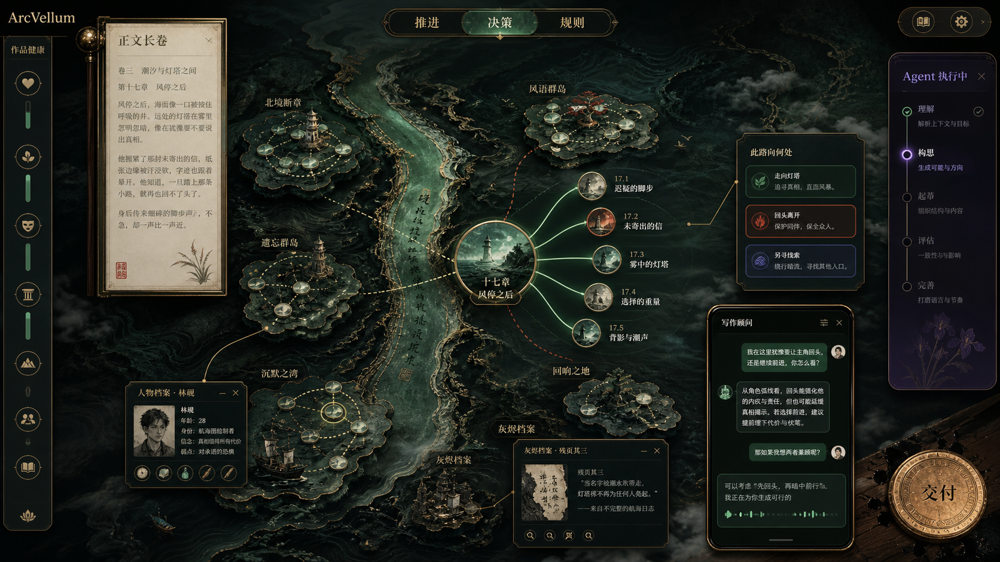

# ArcVellum v0.9 空间星仪与创作可观测性开发计划

> 状态：基于 v0.8.0 实际代码与页面的正式 review，供下一阶段实施与验收使用。
>
> 本轮目标不是给现有仪表盘换皮，而是把叙事星仪升级为 ArcVellum 的主要工作空间：用户在一个可平移、缩放、聚焦的叙事场景中阅读作品结构、观察 Agent 工作、处理创作决定并进入正文。CLI 状态机仍是后端唯一正式流程，前端只是更强的投影、控制和解释层。

> **2026-07-22 交互校准（覆盖此前 Three.js 方案）**：用户要的不是可旋转的真实三维节点世界，而是可全向平移、缩放和聚焦的**多平面伪 3D 叙事场域**。纵深来自分层视差、遮挡、投影阴影、画面构图和状态驱动的二维动效，而不是三维网格、自由轨道相机或地形。此前的 Three.js 技术样机仅保留为一次失败的验证，不作为 v0.9 正式路线。

## 1. 实际审查范围

本计划依据以下现有实现，而非依据旧讨论推测：

- 星图与沉浸模式：`StoryTrace.vue`、`OverviewView.vue`、`ImmersiveConsole.vue`、`ImmersiveInstrumentWindow.vue`、`v08.css`。
- 顾问：`AdvisorDock.vue`、`advisor.py`、`advisor_inbox.py`、`opencode_runtime_pool.py`。
- 叙事投影：`narrative_projection.py`，当前协议为 `arcvellum/narrative-projection/v2`。
- 人工决策：`project_interaction.py`、`core_read_models.py`、`/workflow/current-choice`、`/workflow/human-choice`。
- 节奏与字数：`rhythm_plan.py`、`narrative_rhythm.py`、`RhythmCurveEditor.vue`、`word_budget.py`。
- 上下文：`context_packet.py`、`asset_context.py`、对应压缩测试。
- Agent 执行：`runtimes/opencode.py`、`opencode_runtime_pool.py`、`execution_coordinator.py`、`autopilot.py`。

基线验证：叙事投影、节奏曲线、上下文压缩和 OpenCode Runtime Pool 共 11 项 Python 测试通过；沉浸窗口、Markdown 安全渲染和星仪偏好共 9 项前端测试通过。

## 2. 总体判断

### 2.1 应保留的核心

后端方向适合本项目，不需要推倒重来：

1. CLI 状态机负责正式任务、门禁、候选、审查、晋升与写回，这正是长篇工程避免 Agent 走捷径所需要的约束。
2. Studio 通过受控 Worker、临时工作区、预检和写回管理 Agent，而不是让 Agent 自由编辑正式项目。
3. Narrative Projection 把项目文件转换为稳定读模型，前端不直接解析全部工程文件。
4. OpenCode 服务已经按 `worker / advisor / steward` 隔离并常驻，具备进程复用、健康检查、退避重启和空闲回收。
5. 顾问已有流式输出、会话记忆、人格、主动提醒和受控操作入口。

### 2.2 必须重构的边界

无需重构文学内核，但需要重构“空间投影和产品外壳”：

- `StoryTrace.vue` 当前是固定 `1400×700` SVG。主链使用正弦曲线，卫星节点使用黄金角并被夹在固定边界中。节点增多时拥挤是算法必然，不是调 CSS 能解决的问题。
- 当前缩放只对 SVG 内部 `<g>` 做中心缩放，没有相机、指针中心缩放、全向平移、惯性、内容适配和层级细节。
- 详情只有一个固定 Inspector；不能多开、不能锚定节点、不能随相机重定位。
- `ImmersiveConsole` 仍把完整功能页面塞入四边窗口。它实现了“能打开”，但没有形成围绕星仪的空间化仪器体系。
- API 服务约 1400 行、`task_registry.py` 约 4882 行、两份主要 CSS 合计约 1492 行。继续横向叠加会提高回归风险；v0.9 应拆投影服务、窗口状态和视觉 token，不能再扩一个更大的单文件。

结论：**保留 CLI/Agent/文学工程核心，重做 Narrative Projection v3、空间场景、窗口管理和用户信息架构。**

## 3. 设计主张

### 3.1 重新定义问题

ArcVellum 不是“带星图的文学仪表盘”，也不应是“把文学名词换进科幻 HUD”。它的视觉任务是让用户同时感到两件事：这是一部长篇作品的可进入结构；这又是一套能精确工作数小时的编辑工具。

因此，星仪应从“叙事天体仪”进一步修正为 **Living Narrative Stage / 活体叙事场域**。它不是一张从上方观看的地图，也不是把二维节点加上透视阴影，而是一座可进入、可环顾、拥有体积与纵深的 2.5D 叙事舞台。作品结构可以表现成脊柱、织带、层室、回环、漂移簇、裂隙、回声层或记忆沉积；系统不能把所有作品都强制解释为河流、岛屿和地理景观。不同作品可以采用不同空间构型，而交互语义保持稳定。

### 3.2 对第一版视觉计划的批判

第一版方向有辨识度，但仍有七个风险：

1. 深绿、黄铜、纸纤维、发光轨迹很容易收敛成常见的“高预算奇幻地图”，并没有自动等于文学性。
2. “有机仪器”没有定义有机从何而来，若只加墨迹、雾和材质，会变成装饰性纹理。
3. 强调真实 3D 容易让技术先于体验，最后得到能旋转的背景，而不是更好理解的故事结构。
4. 四周摆放仪表如果缺少视觉重力，仍会形成传统中心画布加四边工具栏，只是更华丽。
5. 主题切换若直接换背景、面板色和材质，会使同一状态在不同主题下失去一致含义。
6. 过多光晕、弹簧、呼吸动画会让作品长期处于“展示模式”，削弱阅读和编辑的沉静。
7. “河流、群岛、地形”若主要依靠俯视平面排布，最终仍只是一张华丽地图，无法产生用户所期待的进入感、尺度感与空间记忆。

修正原则是：**作品结构决定空间，创作状态决定运动，产品语义决定颜色，用户任务决定窗口形态。** 装饰不能独立决定任何一层。

### 3.3 修正后的视觉锚点

视觉方向改为“当代文学观测室中的可进入叙事舞台”。它不是古典书房，不是未来飞船，也不是游戏关卡；它是一件难以归入现成 UI 模板、能够随作品生长的叙事器具。

唯一需要被记住的动作称为 **叙事潮汐 / Narrative Tide**：当用户聚焦一个节点时，相机向其所在的空间层缓慢俯冲，主叙事脊柱像受到引力一样弯曲；直接子节点从地层、廊桥或光场后方升起并展开；其他节点沿深度轴退向远景但保持可见；与节点有关的窗口从节点附近的空间缝隙中展开。这个动作同时解释聚焦、层级、因果和窗口来源，是整个产品唯一允许明显华丽的动效。

界面分为三种视觉平面：

- 作品世界面：叙事构型、主链、角色轨迹、分支、承诺和档案构件。它占据至少 68% 的视觉注意力。
- 编辑仪器面：推进、决策、规则、健康、任务和交付。它与作品节点有明确锚线，但保持清楚、精确和低噪声。
- 阅读面：正文与长文本。它应最安静、对比稳定、几乎无环境动画，允许用户暂时忘记星仪。

### 3.4 空间构图语法

星仪不是无边黑幕上随机撒点。每一帧应形成可读构图：

- 主叙事脊柱以 18–32 度的缓斜线或宽弧穿过画面，避免水平流程图和中心放射图成为默认答案。
- 当前焦点位于视觉黄金区而非绝对中心，给子节点、决策窗和后续方向留下空间。
- 档案构件围绕相关叙事结构分布，采用不同尺度和深度形成前景、中景、远景，而不是两列卡片；它们不必长成岛屿。
- 画面必须具有明确的近景遮挡、中景工作面和远景叙事结构；不允许所有节点落在同一个平面上。
- 时间主要沿场景纵深推进，层级主要由海拔和空间层表达，分支通过廊桥、裂隙或悬浮路径表达，不能退化为流程图连线。
- 真实场景地点不必被写实复刻。空间首先表达作品结构、因果和阅读压力，再由题材皮肤赋予材质与气候，避免变成游戏小地图。
- 顶部主操作保持一条短而稳定的水平基准，用来抵消世界层的自由形态。
- 左侧健康栏和右下交付信标形成两枚固定视觉铆钉，让用户在自由平移后仍知道应用边界。
- 打开的自由窗口不得把中心围成一圈。窗口管理器应保留至少一个连续、无覆盖的“叙事视廊”，宽度不低于视口的 38%。

### 3.5 色彩、明度与材质系统

颜色系统不再以“绿色主题”为起点，而采用稳定语义色与可替换环境皮肤的双层结构。

| 层级 | 名称 | 建议色值 | 作用 |
|---|---|---:|---|
| 环境 | Narrative Night | `#091713` | 最深处空间，不使用纯黑 |
| 环境 | Mineral Depth | `#18312C` | 空间构件、近景和深色仪器 |
| 表面 | Celadon Surface | `#CADBD2` | 浅色编辑窗口，避免突兀白块 |
| 表面 | Carbon Ink | `#14201C` | 主要文字和深色边界 |
| 事实 | Jade Current | `#4DA98C` | 当前因果、聚焦、推进 |
| 正式 | Brass Memory | `#C2A35A` | 已晋升正文、Canon、交付 |
| 决定 | Cinnabar Decision | `#D9644D` | 阻塞和真正需要用户处理的决定 |
| Agent | Iris Agent | `#8C7BB7` | Agent 会话、任务与建议，不代表作品事实 |

任何主题都必须保留后四种语义色。主题只允许替换环境明度、表面色温、纹理和背景资源。例如悬疑作品可以形成冷灰层室，历史作品可以形成墨色时间带，科幻作品可以形成清透结构场；但“决策”永远不能因主题变成绿色，“正式正文”也不能失去黄铜记忆色。

材质只服务层级：

- 世界层允许纸纤维、矿物颗粒、墨扩散和浅景深。
- 编辑窗口只允许极轻的矿物噪声，不能使用厚木框、羊皮纸卷边或大量玻璃反射。
- 正文阅读面接近无纹理，保证长时间阅读。
- 阴影表达高度，描边表达状态，光晕只表达实时变化；三者不可同时滥用。

### 3.6 字体与几何

- 作品标题与章节名使用有现代字面控制的宋体或明朝体，作为文学身份；不使用书法字体。
- 长正文使用屏幕优化的宋体，控制每行长度和行高。
- 控件、数字、状态使用人文无衬线；任务耗时和计数可使用窄体数字，但不把等宽字体当作“技术感”。
- 卡片圆角不超过 6px。节点可圆，工具窗口不应全部变成圆角胶囊。
- 标题层级依靠字号、留白和位置，不依靠大写英文 eyebrow 装饰。英文只用于真实品牌或必要术语。

### 3.7 动效编舞

动效被限制为五种有语义的行为：

1. 生长：新场景、人物或承诺从关联节点旁生成，持续 320–480ms。
2. 分叉：分支沿因果方向展开，未采用分支退到较深空间，不消失。
3. 锚定：Canon 或正式正文写回时，轨迹短暂收紧并变为黄铜，不播放庆典动画。
4. 潮汐：节点聚焦引发相机、空间构型、子节点和窗口的统一运动，持续 520–760ms。
5. 沉静：用户打开正文或长文本时，环境运动在 300ms 内降到 15%，降低视觉疲劳。

不得为普通 hover、每个图标、每个数字都添加循环动画。常态画面必须能够安静停留；只有当前任务、等待决策和真实状态变化允许持续运动。

### 3.8 概念图与自我审查



这张概念图只用于验证第一轮空间层级，不是逐像素实现稿，也不再代表最终镜头语言。

值得保留：

- 中央视觉流和两侧档案构件成功让星仪成为世界，而不是背景组件。
- 聚焦节点与子节点扇形展开清楚表达了当前叙事局部。
- 正文、决策、人物档案、Agent 任务和顾问拥有不同轮廓，没有完全退化为卡片网格。
- 左侧健康、顶部主操作、右下交付形成稳定边界。

必须修正：

- 古典木框、卷轴、塔楼和黄铜装饰过重，会把所有作品强制解释为东方历史幻想。
- 岛屿和河流过于具象，容易把抽象叙事关系误读成地理关系；正式产品必须支持多种空间构型，不能将这套造型设为默认骨架。
- 右侧 Agent 任务条仍像游戏 HUD；正式实现应更接近编辑进度轨道。
- 顾问窗和部分档案窗遮挡过多，需使用视廊、锚定和碰撞避让。
- 概念图中的文字只作气氛示意，正式界面必须使用真实数据、正确中文和可访问 DOM。
- 当前镜头仍偏高、地层仍偏平，第一眼依然可能被理解为俯视地图。后续概念稿必须使用约 30–45 度的受控低俯角，明确展示前景遮挡、中景可操作节点、远景章节结构和真实视差。
- 当前图中的平面轮廓应升级为具有侧壁、厚度、断面和局部光照的抽象叙事构件；构件可以是层室、织带、悬浮片层或弧面，不必模拟土地。

### 3.9 设计验收的反模板检查

每轮截图审查必须回答：

1. 去掉节点和作品内容后，这个界面是否会立刻变成普通 AI Dashboard？若是，设计失败。
2. 星仪是否至少获得第一眼 68% 的注意力？若窗口更抢眼，设计失败。
3. 当前画面是否能解释“为什么这些节点在这里”？若只能解释为好看，布局失败。
4. 是否存在大片无意义空白或密集到无法呼吸的区域？二者都视为构图失败。
5. 同时打开三个窗口后，是否仍保留连续叙事视廊并能找到焦点？否则窗口系统失败。
6. 静止十秒后是否仍适合阅读和工作，而不是像循环播放的产品演示？否则动效失败。
7. 换成悬疑、现实主义、科幻作品后，产品骨架是否仍成立？若只能承载古典题材，视觉系统失败。
8. 截图静止时是否仍像一张俯视地图或节点连线图？若看不出前中远景、海拔差、遮挡和透视缩放，2.5D 设计失败。

## 4. 空间星仪架构

### 4.1 多平面伪 3D 场域，而不是实际 3D 场景

正式实现采用 **PixiJS + pixi-viewport 的二维 GPU 世界层**。它是一台无限画布相机，不是三维游戏相机：画面所有语义位置都由确定性的二维坐标保存；多个前、中、远景容器以不同的视差倍率响应同一相机变换，构造进入感和纵深错觉。

```text
PixiJS Parallax Stage
  - Far: 主题背景、远景章节带、低对比故事痕迹（0.18x 相机位移）
  - Mid: 主叙事脊柱、分支织带、角色/承诺轨迹（0.48x 相机位移）
  - Near: 当前焦点的构件、施工光、档案投影和遮挡片（0.82x 相机位移）
  - 所有厚度由二维侧影、投影、错切和光带完成；不创建三维网格

DOM Interaction Layer
  - 可访问节点、清晰中文标签、命中区、键盘等价列表
  - 仅投影当前视口与焦点邻域，按 LOD 限制标签密度

Vue Instrument Layer
  - 节点详情、任务、规则、正文、决定、顾问
  - 采用专属窗口规格；健康状态固定为左侧窄轨，而非普通弹窗
```

`pixi-viewport` 负责拖拽、指针锚定缩放、触控、惯性、边界、聚焦动画和可见范围计算。PixiJS 只承担高性能二维绘制与合成；状态动画只使用少量缓存纹理、位移或模糊，不让滤镜成为常态背景噪声。节点与正文继续以 DOM 渲染，保留中文排版、键盘操作、Markdown 安全净化和多窗口性能。

2.5D 空间语法固定如下：

- **因果与时间**：沿主叙事走向和远近景带展开。较晚章节不只是排在右侧，也应处于更远的画面层与更低的对比度中。
- **层级**：卷、章、场景使用不同前后景、尺度、侧影和遮挡；层级变化必须从构图包裹关系上可见。
- **分支**：使用离开主结构的织带、悬浮路径、分层弧面或裂隙，不以简单折线树作为主要视觉。
- **Canon**：表现为稳定的锚点、框架或底层结构；变更候选只照亮相关区域，不直接改变稳定结构。
- **人物与承诺**：人物弧线可以成为穿行于不同景别的光带；Promise/Payoff 可以成为跨越远距离的弦、拱或回声，不与主时间线争夺层级。
- **任务状态**：Agent 活动通过局部施工光、轨迹脉冲和节点生长表现，不把每个任务做成漂浮状态牌。
- **题材差异**：只替换材质、雾、局部构筑语汇和环境光，不替换上述空间语义。

为避免伪 3D 场域沦为昂贵背景，所有视觉实体必须至少服务一种可读语义。纯装饰构件应限制在可见实体的 15% 以内；不能解释“为什么存在”的物件不进入正式场景。

### 4.2 二维相机与叙事潮汐

新增单一 `OrreryCameraState`：

```ts
interface OrreryCameraState {
  x: number;
  y: number;
  scale: number;
  focusNodeId: string | null;
  mode: "free" | "focus" | "fit";
}
```

必须支持：

- 鼠标/触控全向拖动画布，使用 Pointer Capture。
- 滚轮以指针锚定缩放，而非固定中心缩放。
- 惯性减速、边界弹性、`fit all / fit chapter / fit selection`；无自由旋转、无 yaw/pitch，保证可读性和二维位置稳定。
- 双击节点或点击“聚焦”时，用 520–760ms 的二维相机飞行、前中远景差速移动、局部遮挡片滑入和焦点放大实现 Narrative Tide。
- 聚焦后节点放大，直接子节点以分层延迟展开；无关节点退到远景层、降低对比度，但绝不删除。
- 用户一旦手动拖动，自动聚焦停止，避免与用户抢控制权。
- `prefers-reduced-motion` 下改为 150ms 淡入淡出和直接定位。

### 4.3 三级 LOD

节点密集问题不能只靠更大的画布解决，必须使用层级细节：

1. 远景：卷、章、主要人物弧和全书承诺簇；场景折叠为星团，不显示长标签。
2. 中景：当前章的场景主链、关键人物、分支和读者问题。
3. 近景：当前场景的角色、审查、Canon patch、节奏、任务和子节点。

屏幕外节点进行可见性裁剪；远景边合并为 bundle；标签按重要性和碰撞结果显示。目标是在 1000 场项目中仍只渲染当前视口所需元素。

### 4.4 可适配作品的空间构型

2.5D 只规定“有深度的交互场景”，不规定作品必须长成地图。Projection v3 应提供一组结构构型，而不是一套按题材换皮的固定坐标：

| 构型 | 适合的叙事结构 | 主要空间语言 |
|---|---|---|
| Spine / 脊柱 | 单主线、成长、冒险、编年 | 前后推进的主轴，章节成为不同深度的段落 |
| Braid / 编织 | 群像、多视角、关系驱动 | 多条人物带交错、靠近、分离并在事件处打结 |
| Strata / 层室 | 历史、回忆嵌套、秘密逐层揭示 | 不同时间层上下叠合，通过剖面和开合进入 |
| Constellation / 星簇 | 碎片化、调查、多线索 | 主题簇和证据簇围绕当前问题形成局部引力 |
| Loop / 回环 | 循环、宿命、重复变奏 | 相似事件在不同高度回返，差异通过偏移显现 |
| Stage / 舞台 | 强场景、有限空间、戏剧结构 | 若干可切换的空间层室承载人物、冲突和余波 |

构型由结构事实选择，而不是由“历史题材就用古地图”这类表面联想选择。系统可根据主线数量、时间层数、角色交汇密度、分支数量和回返模式给出推荐；用户可以切换、锁定或在项目级混用一主一辅两种构型。切换构型只改变空间组织，不改变节点身份、正式状态或用户窗口。

构型必须遵守三条稳定契约：

1. 同一节点在不同构型中保持相同语义色、状态、可操作性和可追溯来源。
2. 同一 revision、构型和 seed 得到相同坐标；切换后可以返回原构型且恢复原视角。
3. 没有合适构型时退化为层次清晰的抽象空间场，不退化为地理地图，也不让 Agent 自由绘制不可复现的场景。

### 4.5 稳定的语义布局

现有黄金角卫星算法应替换为“语义约束 + 确定性布局器”：

- 主线场景形成因果脊柱，横向或缓弧前进。
- 人物节点位于其参与场景形成的角色轨道侧。
- 世界观和 Canon 位于脊柱后方，像稳定重力锚。
- Reader Question / Promise 成对形成未闭合和已兑现弧线。
- 分支从决策场景向外分叉，采用方向与未采用方向保持可见但降级。
- Review 与 Agent Task 位于作品结构上方，明确它们是“工作状态”，不是故事事实。
- 正文、人物、世界、场景等档案可作为锚定相关结构的可进入档案构件，但项目切换器不能混入作品内部图谱。

布局必须稳定：同一 revision、同一 seed 得到相同坐标；新增节点只做局部松弛，不能让整张图重新洗牌。

## 5. Agent 创意布局扩展口

Agent 可以参与构图，但不能直接决定像素坐标。直接让模型输出 `x/y` 会产生漂移、碰撞、不可复现和主题不一致。

建议新增 `orrery-layout-intent/v1`：

```json
{
  "spatial_grammar": "braid",
  "narrative_axis": "linear_with_memory_orbits",
  "clusters": [
    {"id": "family-secret", "members": ["scene:21", "promise:21"], "gravity": 0.8}
  ],
  "relationships": [
    {"source": "character:lin", "target": "scene:24", "closeness": "near", "reason": "该选择改变人物弧"}
  ],
  "emphasis": [{"node_id": "scene:24", "weight": 0.9}],
  "separations": [{"a": "branch:a", "b": "branch:b", "minimum_band": 2}]
}
```

固定机制：

1. Agent 只读取投影摘要和作品事实，输出构型建议、cluster、亲疏、强调、分离和叙事方向。
2. JSON Schema 校验后由确定性布局器转换为坐标。
3. 布局器执行碰撞、边交叉、密度、稳定性和视口检查。
4. 未通过时回退到纯确定性布局，不阻塞作品流程。
5. 用户可锁定节点；锁定坐标永远高于 Agent 建议。
6. 布局建议属于展示偏好，不写入 Canon，不进入文学审查门禁。

这为未来“不同作品拥有不同星系构图”留出创意空间，同时不会让 Agent 控制 UI 稳定性。

## 6. 节点与多窗口系统

### 6.1 节点交互

- 单击：选中并显示轻量信息环。
- 双击或“聚焦”：相机飞向节点，展开一层子节点。
- `Shift + 单击`：追加到比较选择。
- 右键/长按：固定、隐藏弱关系、打开对应正文、加入比较。
- 搜索结果：相机沿最短路径飞行到目标，而不是直接闪现。

### 6.2 节点窗口

当前单一 `.orrery-inspector` 改为 `SpatialWindowManager`：

- 每个节点可打开独立窗口，同一时段允许多开。
- 默认出现在节点右上或左上 20–28px 处；碰到视口边界或其他窗口时自动换侧。
- 窗口在未拖动时锚定节点，随相机移动；拖动后变为自由窗口，并显示一条淡化锚线。
- 支持置顶、最小化、关闭、重新锚定，不默认提供任意缩放，减少失控布局。
- 打开动画使用 shared-origin：节点光环扩张，窗口从节点方向以 180–240ms 弹出。
- 聚焦节点时，已打开窗口保持状态并随坐标重排，不被强制关闭。
- 窗口主体固定 `min-height: 0; overflow: auto`，标题栏与操作栏不参与滚动。

节点窗口内容不只显示摘要，应按类型展示：

- 场景：目标、角色、节奏、字数、桥接、正式正文入口、Review 状态。
- 人物：背景故事、当前欲望/恐惧、关系、最近状态变化、影响创作的关键点。
- 分支：候选、评分依据、采用状态、代价与后续影响。
- Canon：规则、来源、影响场景、写回状态。
- Agent Task：任务阶段、读取范围、预期产物、实时事件、验证与重试。

### 6.3 星仪功能窗口必须按任务重新设计

当前 `ImmersiveConsole.vue` 的主要问题不在于是否支持拖动，而在于每种功能都套进同一类边缘窗口，并把原有页面原样嵌入。这样会造成两种体验损失：星仪被窗口压扁，窗口又没有充分利用“正在看着这部作品”的空间上下文。

v0.9 应引入 `InstrumentWindowSpec`，让每个模块声明自己的默认锚点、尺寸、密度、最小化形式、是否可多开及打开动画。窗口共享外壳、层级、拖动、焦点和无障碍能力，但绝不共享一套内容布局。

| 模块 | 默认位置与形态 | 内容与操作重点 | 关闭/最小化后的状态 |
|---|---|---|---|
| 推进 | 顶部中央下方，横向任务轨道 | 当前任务、阶段脉冲、Agent 会话、预计下一步、暂停/继续 | 收成一条“当前任务”状态带，继续显示进度 |
| 决策 | 右上方，与触发分支节点用细线关联 | 候选方向、关键差异、后果、推荐理由、选择按钮 | 收成带计数的红色决策签，未处理不会消失 |
| 规则 | 右侧中部，窄而深的规则抽屉 | 文风、标点、Lint 阈值、节奏、字数与详略；显示哪些规则影响当前节点 | 收成“规则生效”状态条，可直接回到当前场景规则 |
| 健康 | 左侧固定窄栏，不作为普通窗口 | 路线门禁、阻塞、审查覆盖、Canon/节奏/字数风险 | 常驻，只在悬停或键盘聚焦时扩展解释 |
| 正文长卷 | 左上方，纵向窄长阅读窗 | 已晋升正文、章节目录、当前字数、正在生成的微弱标记 | 收成书脊，显示当前章与滚动位置 |
| 档案 | 锚定相关叙事结构的档案窗口，可随构型分布 | 人物、场景、世界、分支、Review；突出“影响创作的关键点” | 可钉在场景边，成为轻量档案标签 |
| 交付 | 右下角黄铜封印，不使用常驻普通窗口 | 交付准备度、缺失项、格式、正式导出动作 | 不可交付时是熄灭封印；可交付时呼吸点亮 |
| 作品切换 | 顶部独立动态带 | 当前作品、最近作品、新建入口、切换前后状态 | 自动收回，保留当前选中作品名 |

#### 统一窗口交互规则

1. 默认窗口不遮住所关联节点和顶部主操作；布局器先占据语义锚点，再做视口避让。
2. 同类档案和节点详情允许多开；推进、规则、健康、正文、交付各只允许一个主实例，防止重复信息噪声。
3. 拖动后的窗口成为自由窗口，但保持固定宽高、独立滚动区、可见的“回到锚点”按钮；不能因设置 `top` 而保留 `bottom` 导致窗口拉伸。
4. 最小化不是关闭。每种窗口都有具辨识度的缩略状态，用户能随时看到推进、未决、阅读位置和交付状态。
5. 窗口打开必须从真实来源出现：节点详情从节点展开、决策从分支脉冲弹出、正文从书脊展开、交付从封印解锁。不得用无来源的普通淡入。
6. 窗口使用标题区、内容区、操作区三段结构；内容区始终 `min-height: 0` 且独立滚动，禁止把长文本撑高整个窗口。
7. 允许键盘在已开窗口之间切换、关闭、最小化、复位；小屏设备改为底部 sheet，不使用自由拖动。

#### 窗口视觉语言

- 推进窗口像一段正在移动的叙事轨道：阶段是连续路径，当前阶段发出克制脉冲，不能伪造百分比。
- 决策窗口像叠开的分支页签：候选并排，差异和代价优先于长说明；推荐不是替用户下结论，而是显示证据权重。
- 规则窗口像有标尺的编辑台：阈值用滑杆、开关和标签，不暴露 JSON 或工程字段；某条规则生效时用与当前节点同色的细导线提示关联。
- 正文窗口是唯一允许高阅读密度的窗口：窄列、舒适行距、清晰章分隔、进度书签、无多余仪表装饰。
- 档案窗口像可展开的索引卡，但不做复古纸张拟物；用矿物浅表面、黄铜编号和低对比度关系线表明它属于同一套星仪。
- 健康栏保持最安静：用状态、数量和短语表达风险，只有用户主动展开时才显示具体 gate。

#### 新组件边界

```text
SpatialWindowManager.vue      窗口登记、层级、锚定、碰撞、快捷键
InstrumentWindowFrame.vue    共用外壳、标题、最小化、拖动、无障碍
ProgressInstrument.vue       推进轨道与 Agent 任务概览
DecisionInstrument.vue       正式 Decision Projection 卡片与选择
RuleInstrument.vue           文风 / Lint / 节奏 / 字数控制
HealthRail.vue               常驻健康窄栏
ManuscriptInstrument.vue     纵向正文阅读器
ArchiveInstrument.vue        档案构件与节点资料
DeliveryBeacon.vue           交付封印与准备度
ProjectSwitchBand.vue        顶部作品切换带
```

现有 `ImmersiveConsole.vue` 应退化为编排层，不能继续承担所有具体内容和窗口策略；`ImmersiveInstrumentWindow.vue` 演化为 `InstrumentWindowFrame.vue`，保留其拖动与 z-index 能力，但加入固定尺寸、锚定、最小化和状态恢复。

## 7. 页面信息架构重排

### 7.1 常驻布局

```text
┌ 健康窄栏 ┬ 正文长卷   [推进] [决策] [规则]   [作品切换] [设置] ┐
│          │                                                  │
│ 路线     │             沉浸叙事星仪世界                     │
│ 门禁     │      主链 / 角色轨道 / 档案构件 / Agent任务       │
│ 风险     │                                                  │
│          │   [+ 建立作品]                     [交付信标]      │
└──────────┴──────────────────────────────────────────────────┘
```

- 健康：左侧 56–72px 常备窄栏，展示可扫描状态，悬停/点击才展开说明。
- 推进、决策、规则：顶部中央三项主操作；决策有真实数量和紧急度。
- 正文长卷：左上方明显入口，打开为 360–460px 宽、接近视口高度的纵向阅读窗。
- 设置：右上角紧凑按钮，导航到独立设置页面；帮助、详情、协议作为设置页内部标签，不继续占星仪边栏。
- 交付：右下角单一信标。不可交付时低亮且能解释缺失条件；可交付时变为黄铜高亮，但不得自动发布。
- 建立作品：左下或右下安静的加号入口，只在无作品或用户主动展开时成为主按钮。
- 更改作品：顶部弹出作品带，保留当前场景的空间记忆；选择后做 300–450ms 场景退远、换轨、重新进入动画。

### 7.2 作品档案

人物、世界、场景、分支和 Review 档案可以成为锚定相关节点的空间档案构件。它们随当前构型分布，不固定为主链两侧的岛屿。这里必须做区分：

- 当前作品内部档案适合进入星仪空间。
- 多个不同作品不应同时变成叙事节点，否则会混淆“作品事实”和“应用项目管理”。多作品只放在顶部切换带。

### 7.3 项目总体进度

总体进度不能只取字数，也不能让准备工作掩盖正文缺失。采用三段式展示和一个加权值：

```text
准备完善度 30%：创作方向、Canon、人物、风格、全书规划、字数预算、节奏计划
正文完成度 60%：已晋升正文汉字及标点字符 / 目标汉字及标点字符
交付完整度 10%：审查闭环、状态写回、长篇审计、可交付门禁
```

总体值为 `0.30 * preparation + 0.60 * manuscript + 0.10 * integrity`。同时必须显示三个分量，防止单一百分比误导。项目尚未建立可靠目标字数时，总体进度标记为“待校准”，不能伪造精确百分比。

视觉上使用“长卷生长刻度”：准备工作让卷轴轮廓形成，正文增长让纸面延伸，交付完整度让黄铜封印逐步闭合，而不是普通横向进度条。

## 8. 可视化 Agent 任务面板

### 8.1 用户应看到什么

动态公开的是任务状态，不是模型隐性推理：

- 活跃角色：Worker、顾问、Steward。
- 当前路线、任务名、目标场景、阶段、已用时间。
- 当前在“读取资料 / 生成候选 / 调用工具 / 验证 / 修订 / 等待选择 / 写回”。
- OpenCode 服务是否复用、模型、首个可见事件耗时、首段文本耗时、重试次数。
- 允许读取的资料类别和预期产物，不展示密钥或内部思维链。
- 已完成、失败、取消和等待审批的会话历史。

### 8.2 数据层

现有 `runtime_events.py`、`live_events.py`、JobStore 和 Autopilot event 已能提供基础事件。新增聚合读模型：

```text
AgentObservabilityProjection
  sessions[]
  active_tasks[]
  task_stage
  runtime_health
  first_event_ms / first_text_ms
  validation_attempts
  user_waiting_reason
```

前端使用 SSE 增量更新，不轮询整张 dashboard。多 Agent 并发时按项目和角色分泳道；文学正文仍只有主 Worker 可写，顾问和 Steward 不能伪装成正文作者。

## 9. 决策面板问题

现有前端确实有决策卡代码：`OverviewView.vue` 和沉浸窗口都读取 `/workflow/current-choice`。因此“面板似乎没出现任务卡”不应简单归因于未实现。

当前缺陷是：

1. 决策面板只显示 `current-choice` 产出的正式人工选择，不显示普通待执行 Agent Task；用户口中的“任务卡”与后端的“human choice”语义不同。
2. 没有把 `waiting_user / approval / revision direction / branch choice` 统一投影成前端 Decision Card。
3. 空状态没有说明“当前有任务，但没有需要你决定的事项”，容易被理解为数据丢失。
4. 选择数据只在挂载与提交后刷新；实时产生新选择时没有独立 SSE 订阅。

修复方案：新增 `DecisionProjection`，合并正式 choices、审批等待、Autopilot 暂停原因和写回确认；保留普通 Agent Task 在任务面板，不混进决策面板。决策 SSE 到达时顶部按钮和对应叙事节点同时亮起。

## 10. 全文节奏、详略和字数配置

### 10.1 已实现

- 后端已有场景级 `pace`、`rhythm_role`、`scene_function`、`entry/peak/exit` 张力曲线。
- 已有连续同速、持续高压、峰值扁平和相邻张力跳变检测。
- 节奏契约已进入场景组合、生成和审查链路。
- 前端已有按章编辑器，可调节场景节奏角色、速度、功能和三点张力。
- 字数预算与场景目标在正式文学内核中存在。

### 10.2 尚不完整

当前 UI 主要是“按章看场景曲线”，还不是能决定全文叙事设计的控制台：

- 缺少卷级/全书级张力曲线和类型模板。
- 缺少详写、均衡、略写、过场等 detail level。
- 缺少字数预算与节奏曲线的同屏联动。
- 缺少场景桥接、承诺/兑现、章节结尾类型在曲线上的可视化。
- 前端保存节奏计划后会触发重新审查语义，但用户看不到受影响候选范围。

### 10.3 v0.9 方案

规则模块增加“全书叙事编排”页：

- 三级视图：全书 → 卷/章 → 场景。
- 每个单元同时显示目标字数、详略等级、节奏角色、张力和兑现点。
- 拖动曲线只修改规划候选；保存前显示受影响场景和重新审查成本。
- 支持类型起点模板，但模板只能创建初稿，不能覆盖已有作品事实。
- 增加 `detail_level: summary | lean | standard | expanded | set_piece`，并进入 word-budget、compose、generation 和 review 正式链路。
- 增加卷/章预算守恒校验：子场景目标总和必须与父级预算处于允许误差内。

## 11. Markdown 渲染策略

当前只有顾问回答使用 `renderSafeMarkdown()`；“所有文本显示区域都支持 Markdown”尚未完成。

不应在任意字段上直接 `v-html`。应新增统一组件 `SafeMarkdown.vue`：

- 内部复用 Markdown-it + DOMPurify。
- 禁止远程图片、脚本、危险链接和内联样式。
- 支持段落、标题、列表、引用、表格、行内代码和代码块。
- 提供 `compact / document / chat / evidence` 四种排版模式。
- 所有富文本摘要、Agent 输出、Review、背景故事、Canon 说明和窗口详情通过该组件显示。
- 作品正式正文默认采用阅读器排版，而不是把普通小说标点误当 Markdown；只有确认来源为 Markdown 时才解析结构标记。

## 12. 顾问手机窗修复与重设计

### 12.1 已定位的拖动缺陷

`.advisor-dock` 同时设置了 `top: 18px` 和 `bottom: 18px`。拖动后内联样式只覆盖 `left/top/right/bottom` 中的 `left/top/right`，没有清除 `bottom`，因此窗口会从新 top 一直拉到 bottom，表现为拖动后变长、失去固定滑动区。

修复原则：拖动状态必须显式设置固定 `width/height` 和 `bottom: auto`；线程区域保持 `min-height: 0; overflow-y: auto`。

### 12.2 手机聊天形态

- 桌面目标尺寸约 `390 × min(760px, calc(100vh - 32px))`，宽高比接近手机。
- 顶部只有头像、人格名称、状态和收起；人格编辑、提醒设置进入二级抽屉。
- 用户与顾问均采用清晰聊天气泡，证据和操作折叠在消息下方。
- 输入区固定底部，消息区独立滚动；流式回答只追加当前气泡，不推动窗口尺寸。
- 悬浮球与顾问窗使用同一层级管理，不被星仪窗口挤出；拖动位置持久化并在分辨率变化后校正。

## 13. 上下文长度优化完成度

结论：**阶段性完成，未彻底完成。**

已经具备：

- 当前章与相邻章选择，不再全量载入长篇大纲。
- 主要角色常驻，次要/路人角色按场景参与者选择。
- 软记忆检索与来源 trace。
- 情节上下文 16000 字符上限。
- Asset 任务排除大型 workflow 和预算产物。
- 顾问拥有会话摘要、固定偏好和快照级远端会话复用。

仍需补足：

- 目前主要使用字符截断，不是按模型 tokenizer 和任务类型动态分配预算。
- Canon、人物、风格、前情、检索结果之间没有统一配额和优先级压缩器。
- 简单截断可能从结构中间断开，缺少段落/条目级裁剪。
- Worker 每个正式任务新建远端会话，这有利于隔离，但无法利用跨任务 prompt cache；应评估 provider 缓存和稳定前缀，而不是盲目复用写作会话。
- 缺少上下文命中率、输入 token、被裁剪材料和回答引用率的可观测指标。

v0.9 只补“Context Budget Report”和结构化裁剪，不在视觉重构阶段引入新的向量数据库或重写检索系统。

## 14. 后端、Agent 与 CLI 架构的诚实评价

### 14.1 适合的部分

- 文学长篇需要确定性状态机，CLI 不是过度设计，而是项目可靠性的主要来源。
- 任务包、Expected Outputs、预检、Review、Promote 和状态写回构成了有价值的闭环。
- 一项目一写入所有者的 `ProjectExecutionCoordinator` 能防止多个 Agent 同时污染正式项目。
- Runtime Pool 减少重复启动 OpenCode 服务；按角色隔离权限和模型合理。
- 顾问保持只读快照、用受控动作发指令，边界正确。

### 14.2 设计不足

- Worker 虽复用服务，但每个任务创建新 Session；对长篇场景连续性主要依赖 task package，而不是模型会话。逻辑安全，但会增加首轮上下文和延迟。
- 项目级写入锁意味着同一作品的正式写入串行。符合一致性要求，但 UI 必须解释“正在排队”，不能看起来像卡死。
- 读模型、事件流和 UI 状态仍分散：Dashboard、Narrative Projection、Autopilot Event、Current Choice 各自刷新，缺少统一 revision/sequence。
- `api_server.py` 与 `task_registry.py` 已偏大，继续加接口和任务分支会降低可维护性。
- CLI 对应用用户仍不应暴露。Studio 应通过应用服务调用它，界面只显示创作语义和证据。

### 14.3 重构结论

不做全栈重构。采用“核心冻结、边界拆分”：

1. 冻结正式 CLI 状态机和项目文件协议，除节奏 detail level 等必要契约外不重写。
2. 把 Narrative Projection、Decision Projection、Agent Observability Projection、Project Progress Projection 拆为独立读模型服务。
3. 给所有投影增加统一 `revision / sequence / generated_at / source_revisions`。
4. API Server 只负责路由与依赖装配，业务聚合迁出。
5. 前端建立 camera、spatial layout、window manager、live projections 四个独立 store，不把它们继续塞进 `OverviewView.vue`。

## 15. 分阶段实施

### Phase 0：视觉原型与技术验证

- 第一张空间星仪概念图已经生成并完成批判性标注；它降级为“布局关系参考”，不再作为最终空间目标，因为镜头过高、结构过平、地图感仍然明显。
- 下一组概念图必须采用 30–45 度受控低俯角，并至少分别验证 Braid 与 Strata 两种非地理构型；画面需清楚呈现前景遮挡、中景操作层、远景章节带、体积侧壁、局部光照和节点投影。若静态图仍像地图，则不得进入开发。
- 后续再用同一功能布局生成两张反方向概念：冷峻现实主义观测室、清透现代文学制图台，用于确认产品骨架不依赖历史幻想题材。
- 原型只用于确定环境、构图、光线和视觉重力，不直接当 UI 截图照抄；每张图都要附“保留 / 拒绝 / 代码可实现性”评审。
- 建立 100、500、1000 场的合成投影数据。
- 用 PixiJS + pixi-viewport 验证多平面视差、二维遮挡、轻量光晕、DOM 节点投影、指针锚定缩放、平移和 500 节点视口性能。
- 输出交互样机并完成至少两轮设计删减；第一轮删装饰，第二轮删循环动效，确保华丽集中在叙事潮汐。

### Phase 1：Projection v3

- 新增 spatial grammar、语义 cluster、importance、parent、time band、layout hints、detail level、Agent task 状态。
- 新增 Project Progress、Decision 和 Agent Observability 投影。
- 保持 v2 endpoint 一段时间，前端切换后再废弃。
- 为 1000 场聚合、delta、稳定坐标 seed 和事件序列补测试。

### Phase 2：空间引擎

- 新增 PixiJS 多平面场景、二维相机 state、屏幕锚点投影和输入控制。
- 实现 pointer-centered zoom、工作面平移、惯性、fit、focus 和 reduced motion；不实现 pitch/yaw。
- 实现层级缩放、遮挡、视差、景深错觉、局部光晕和 Narrative Tide 的场景联合编舞。
- 实现对象池、二维视口裁剪、场景分块 LOD、远景抽象形体、DOM 按需挂载和标签碰撞。
- 使用 canvas 像素检查确认场景非空、运动存在且主题资源加载成功。

### Phase 3：语义布局器

- 建立 Spine、Braid、Strata、Constellation、Loop、Stage 六种确定性构型，以及其中的角色轨道、Canon 锚、分支、Promise/Payoff 布局。
- 接入增量布局、节点锁定、局部松弛和布局持久化。
- 实现可选 `orrery-layout-intent/v1`，Agent 只输出语义约束。
- 加入重叠率、边交叉、布局漂移和非法建议回退测试。

### Phase 4：多窗口与节点体验

- 实现 SpatialWindowManager、锚定、多开、碰撞换侧、层级和拖动。
- 重做所有节点详情内容和 shared-origin 动画。
- 按“推进、决策、规则、健康、正文、档案、交付”分别实现功能窗口，不复用完整业务页面作为浮窗内容。
- 实现窗口最小化语义、锚定/自由状态切换、状态恢复与小屏 bottom sheet 降级。
- 把 SafeMarkdown 接入详情、Review、Canon、人物与 Agent 输出。
- 修复顾问拖动高度，完成手机比例聊天窗。

### Phase 5：星仪信息架构

- 落地左侧健康窄栏、顶部推进/决策/规则、右上设置、左上正文、角落建作品和交付信标。
- 项目切换改为顶部动态带；项目建立改为独立流程。
- 设置页内收纳帮助、详情、协议。
- 当前作品档案成为随空间构型锚定的档案构件。

### Phase 6：任务、决策与进度

- 实现 Agent 可视化任务面板和 SSE 聚合。
- 实现 Decision Projection，修复“有等待但无卡片”的语义空洞。
- 实现三段式总体进度与长卷生长动画。
- 明确任务排队、会话启动、首段输出、验证、修订和等待用户状态。

### Phase 7：全书节奏与字数编排

- 扩展全书/卷/章/场景曲线。
- 增加 detail level、字数预算联动、桥接和兑现点。
- 将新契约正式接入 compose/generate/review，而不是只做前端偏好。
- 显示保存后需要重新审查的场景范围。

### Phase 8：主题、动效与无障碍

- 完成“稳定语义色 + 可替换环境皮肤”双层 token，不允许题材主题造成状态色失真。
- 实现生长、分叉、锚定、潮汐、沉静五种动效语法；其余交互使用短促反馈或无动画。
- 为正文阅读状态增加环境降噪，打开长文本时自动降低场景运动、亮度变化和粒子密度。
- 完成键盘漫游、列表等价视图、焦点管理、对比度和 reduced motion。
- 所有按钮使用 Lucide 图标和明确 tooltip。

### Phase 9：验收与发布

- 视觉：1280×720、1440×900、1920×1080、2560×1440、移动窄屏截图回归。
- 构图：星仪保持主要视觉重力，三个窗口同时打开后仍保留至少 38% 宽的连续叙事视廊。
- 反模板：使用现实主义、历史、科幻三类样例作品验收，界面骨架不得依赖单一题材材质。
- 适配性：使用单主线、群像、回忆嵌套、调查碎片和循环叙事样例验收；不得把五类作品都强制排成同一幅地图。
- 空间：平移、缩放、聚焦、多窗口、主题切换均无重排跳变。
- 2.5D：静态截图具备明确前中远景、海拔、侧壁和遮挡；相机移动时具备可验证视差；聚焦时其他节点沿深度重排而非淡出伪装。
- 性能：500 个可见候选中只渲染视口实体；桌面连续平移目标 55–60 FPS，低配降级不少于 30 FPS。
- 数据：新投影与 CLI route gate 结果一致，不出现前端“可交付”而后端拒绝。
- 长篇：1000 场项目远景聚合可用，聚焦章/场不超过目标可见节点预算。
- 安全：Markdown XSS、远程资源、路径泄漏、密钥和内部推理均不得进入 UI。
- 桌面：Tauri 安装包冷启动、断线恢复、OpenCode 未配置、任务排队和更新流程完整验收。

## 16. 必须避免的方案

- 不在固定 SVG 上继续叠加更多缩放按钮和随机半径。
- 不让 Agent 直接输出节点像素位置。
- 不把每个完整业务页面原样塞进浮窗。
- 不把所有主题做成单色滤镜。
- 不让所有 Markdown 字段直接 `v-html`。
- 不为了并发速度绕过项目级写入锁。
- 不把模型思维链当“任务可视化”。
- 不在这轮顺便更换文学状态机、工作流框架或项目格式。

## 17. 交付定义

v0.9 只有同时满足以下条件才算完成：

1. 星仪是一座真正有体积、海拔、遮挡、视差、光照和受控相机运动的 2.5D 叙事场景，而不是带透视阴影的二维地图；它可无限感知地平移、指针锚定缩放、平滑聚焦，并在长篇节点密度下保持可读。
2. 节点窗口可锚定、多开、拖动、滚动，并展示真实作品与任务信息。
3. 推进、决策、规则、健康、正文、档案、交付均拥有针对自身任务重新设计的窗口或常驻形态，不存在“把普通页面缩进浮窗”的降级实现。
4. 星仪场景成为主界面，健康、推进、决策、规则、正文、设置与交付都有明确且不抢戏的位置。
5. 用户能看到 Agent 当前在做什么、卡在哪里、是否在等待自己，不暴露内部推理。
6. 决策卡从正式后端状态产生并实时出现。
7. 全书节奏、详略和字数规划能够被用户管理，并真正进入正式创作链路。
8. 顾问保持流式、可拖动、手机聊天比例，拖动后不会失去固定高度和滚动区。
9. Markdown 经过统一安全组件渲染。
10. CLI/Agent 文学内核不被前端重构削弱，所有正式操作仍经过原有门禁。
11. 性能、视觉、无障碍、安装版和断线恢复均通过自动与人工验收。
