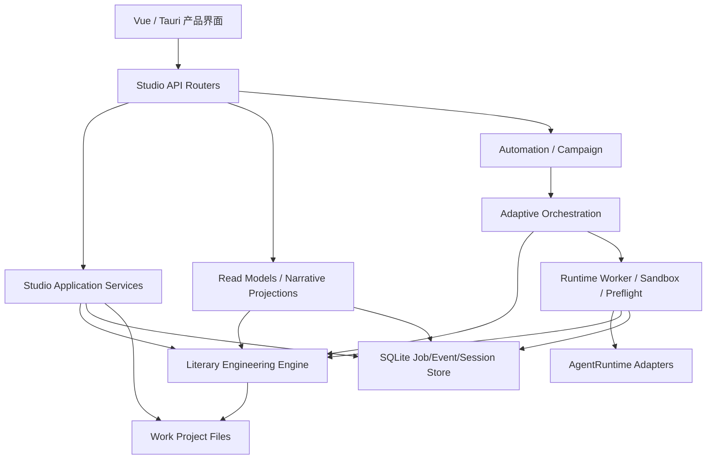
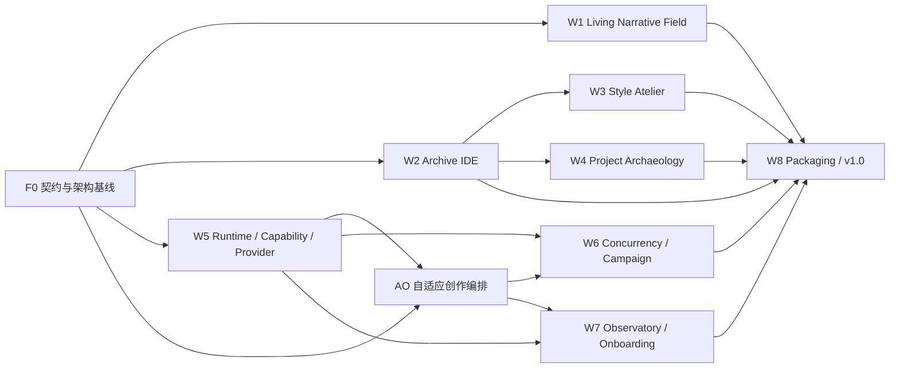

# ArcVellum v0.96 - v1.0 统一工程实施方案

> 文档状态：模块级、架构级、代码级强指导性实施基线  
> 基线版本：ArcVellum v0.95.3  
> 更新日期：2026-07-25  
> 适用仓库：`o-1717986918/arcvellum`  
> 目标：把长期产品路线、自适应创作编排、运行时升级和独立研究成果收束为一条可执行、可验收且不重复建设的工程路线  
> 非目标：在一个版本内同时铺开全部能力，重写 Literary Engineering Engine，建立第二套状态机，或把 ArcVellum 改造成通用 Agent IDE

## 0. 文档体系与解释顺序

本文件是 v0.96 - v1.0 的**统一工程实施主方案**。其他文档各自只负责一个层级：

| 文档 | 唯一职责 |
| --- | --- |
| [长期产品与 Runtime 路线图](arcvellum-post-v0.95.3-long-horizon-product-and-runtime-roadmap.md) | 说明为什么做、用户最终得到什么、版本目标和产品验收 |
| 本文 | 说明模块归属、代码位置、接口、数据迁移、施工顺序和跨模块依赖 |
| [自适应创作编排系统实施方案](arcvellum-adaptive-creative-orchestration-implementation-plan.md) | 说明 `CreativeExecutionPlan`、Plan Compiler、Plan Lint、动态重规划和受控任务 DAG 的内部设计 |
| [Denova 与 ArcVellum 架构对比审阅](../research/denova-comparative-architecture-review.md) | 记录外部研究结论、适用边界和独立实现要求，不作为代码规格 |
| [模块边界与渐进拆分准则](../architecture/module-boundaries.md) | 规定现有 Engine、Studio、Client 的依赖方向和兼容 facade 纪律 |

出现冲突时按以下顺序处理：

1. 已发布项目格式、Engine 正式 Gate、任务包契约和安全边界优先。
2. `module-boundaries.md` 的依赖方向优先于目录美化建议。
3. 本文负责工程实现取舍。
4. 子系统文档只能细化本文，不得建立平行真相源。
5. 产品路线图负责目标，不直接覆盖代码事实。

外部项目只用于识别问题、风险和抽象边界。任何代码、Prompt、Schema、配置、测试、文档、算法表达、视觉资源和 UI 组件均由 ArcVellum 独立设计与实现，不复制、翻译移植或改写外部实现。

## 1. 实际代码基线

### 1.1 已有能力，禁止从零重建

| 能力 | 当前代码证据 | 状态 | 本阶段动作 |
| --- | --- | --- | --- |
| 正式任务状态机 | Engine `tasking/`、`routes/`、`workflow/` | 已实现 | 保持唯一正式任务真相源 |
| 双工作区沙箱与预检 | Studio `runtime/sandbox.py`、`preflight/` | 已实现 | 只扩展能力声明和变更收据 |
| Agent Runtime 抽象 | `runtimes/base.py::AgentRuntime` | 已实现 | 收敛契约，不再另建 SPI |
| OpenCode Runtime | `runtimes/opencode.py`、`integrations/opencode/` | 已实现 | 作为基准适配器保留行为 |
| Claude Code / Codex CLI 适配器 | `runtimes/claude_code.py`、`codex_cli.py` | 已实现 | 继续作为可选外部适配器 |
| Autopilot 三模式 | `automation/policy.py`、`controller.py` | 已实现 | 扩展为 Campaign，不重写委托政策 |
| Agent 会话投影与 SSE | `observability/agent_observability.py`、automation router | 已实现 | 升级为可解释 Observatory |
| 星仪 v3 投影与 SSE | `api/routers/narrative.py` | 已实现 | 在 v3 上增量扩展，非必要不新开 v4 |
| 章节聚焦和人物轨道 | `chapterFocus.ts`、`CharacterThreadRail.vue` | 部分实现 | 补齐整章作用域和跨视图一致性 |
| 正文阅读器 | `ManuscriptReader.vue` 及多个入口 | 已实现 | 改善星仪窗口状态和长文性能 |
| 文风 Engine | Engine `literary/style/` 与 style-lab router | 已实现 | 迁入正式 Studio 任务闭环 |
| source-ingest 正式路线 | Engine `projects/source_ingest.py`、`routes/source_ingest/` | 已实现 | 扩展格式、证据和全书聚合 |
| 项目档案只读投影 | `projections/library/`、`LibraryView.vue` | 已实现 | 在其上建立独立写模型，不让投影承担写入 |
| 全局新手引导 | `OnboardingTour.vue` | 已实现 | 拆成状态化模块引导 |

### 1.2 当前真实缺口

1. 星仪能展示大量信息，但焦点作用域、关系 LOD、人物引用和窗口状态仍未形成稳定契约。
2. 档案界面主要是只读投影，没有作者事务、版本冲突、影响分析、回收站和手动晋升闭环。
3. Studio style-lab 只暴露文风库、挂载和挂载列表，Engine 内的创建、导入、编译、评测和构建尚未通过正式 Runtime 产品化。
4. source-ingest 具备基础任务链，但缺 DOCX 结构化读取、语义分段、别名消歧、时间线冲突和完整项目重建。
5. `AgentRuntime` 已存在，但能力、上下文窗口、结构化输出、工具权限和本地模型适配尚未形成统一任务适配模型。
6. 当前 Autopilot 按固定 `ROUTE_ORDER` 串行推进；没有受约束的 Agent 计划、依赖图并发和动态重规划。
7. 会话投影能显示状态和事件，但缺 Context Ledger、Mutation Receipt、资源占用和任务因果链。
8. `full_auto` 能委托路线和决策，但仍可能在恢复、版本冲突、授权更新和无进度循环上停下。
9. 项目已有很多 facade 和兼容入口，若直接横向新增服务，容易形成第二个巨型 API Server、第二套调度器和第二套资产真相。

### 1.3 不把“部分实现”误报为“完成”

下列产品目标已有底座，但必须以真实闭环验收：

- 星仪存在章节聚焦，不等于整章所有场景、人物和关系都进入同一焦点作用域。
- 存在 Style Engine，不等于用户可从 Studio 创建、评测、审查、挂载并让正文消费同一版本。
- 存在 `full_auto`，不等于可以无人工值守完成整章且在重启后恢复。
- 存在 Runtime 基类，不等于所有适配器具有同一能力语义。
- 存在档案投影，不等于用户可以安全编辑正式资产。
- 存在 source-ingest，不等于完整作品能可靠反推为可续写项目。

## 2. 统一目标架构



### 2.1 唯一真相分区

| 真相 | 唯一所有者 | 其他层的权限 |
| --- | --- | --- |
| 正式 route、task package、Gate、promotion | Literary Engineering Engine | Studio 调用、投影和验收，不复制规则 |
| Agent 进程、沙箱、expected outputs、preflight | Studio Runtime | Engine 不感知桌面进程和凭证 |
| 自适应创作计划 | Studio `orchestration/` | 编译为 Engine 可执行任务，不直接写项目 |
| 自动推进授权与恢复 | Studio `automation/` | 使用编排与 Worker，不创建正式任务格式 |
| 项目正式资产 | Work Project + Engine schema | Studio 必须经资产事务或 Engine promotion 写入 |
| 只读档案、正文、星仪 | Studio `projections/` | 不直接修改项目 |
| 用户会话和运行事件 | Studio SQLite | 只保留安全投影，不保存隐藏思维链 |
| 模型凭证 | OpenCode/系统凭证存储 | 项目配置和日志不得持有明文 |

### 2.2 稳定依赖方向

```text
Client feature
  -> Studio API router
    -> Application service / Read model / Automation facade
      -> Orchestration or Runtime domain
        -> CoreBridge / Engine formal contract
```

禁止：

- Engine import Studio。
- 前端解析 sidecar Markdown 判断正式状态。
- API router 直接操作文件、SQLite 或运行 Agent。
- `orchestration/` 直接写正式项目资产。
- `automation/` 复制 route gate。
- `runtime/` 决定文学创作策略。
- `projections/` 执行 promotion 或 owner override。
- 新代码通过包根 compatibility facade 反向依赖旧实现。

### 2.3 目录收敛方案

现有 `runtime/` 与 `runtimes/` 不能合并：

- `runtime/`：任务执行、沙箱、预检、写回、资源协调。
- `runtimes/`：OpenCode、Pi、Claude Code、Codex CLI 等 Agent Runner 适配器。
- `integrations/`：外部进程、协议、模型提供商和凭证连接。

建议增量形成：

```text
src/literary_engineering_studio/
  application/
    assets/
    style/
    archaeology/
  orchestration/
    contracts.py
    defaults.py
    normalizer.py
    compiler.py
    lint.py
    simulator.py
    replanner.py
    scheduler.py
    progress.py
    context_broker.py
    bundles.py
    rolling_horizon.py
    risk.py
  runtime/
    capabilities/
      contracts.py
      broker.py
      audit.py
    resources/
      claims.py
      conflicts.py
    worker.py
    sandbox.py
    writeback.py
    bundle_executor.py
    context_cache.py
    output_repair.py
  runtimes/
    base.py
    opencode.py
    pi_rpc.py
    claude_code.py
    codex_cli.py
  integrations/
    opencode/
    pi/
    providers/
      ollama.py
  automation/
    campaign/
      contracts.py
      controller.py
      recovery.py
      checkpoints.py
    policy.py
  observability/
    context_ledger.py
    mutation_receipts.py
    session_projection.py
    throughput_metrics.py
  projections/
    narrative/
    archive/

src/literary_engineering_studio_engine/
  literary/
    style/
    ingest/
  routes/
    source_ingest/
    style_engineering/
  tasking/
  workflow/

client/src/features/
  orrery/
  archive/
  style-atelier/
  archaeology/
  strategy/
  agent-observatory/
  onboarding/
```

迁移时旧模块保留轻量 facade；新实现直接 import 目标包。任何目录新增都必须有明确所有者、公开 API 和退出条件，不能以“未来可能用到”为理由创建空框架。

## 3. 横切契约目录

### 3.1 契约归属

不建立一个囊括所有 DTO 的巨型 `contracts.py`。Python 模型由领域所有者维护；JSON Schema 作为发布和跨语言校验产物；TypeScript 使用显式镜像并由契约测试防漂移。

| 契约 | Python 所有者 | 消费者 |
| --- | --- | --- |
| `NarrativeFocusScope` | `projections/narrative/contracts.py` | Narrative API、Orrery |
| `RelationVisibilityProfile` | `projections/narrative/contracts.py` | 投影、Canvas、图例 |
| `CharacterReference` | `projections/narrative/characters.py` | source-ingest、星仪、Archive |
| `AssetViewDefinition` | `application/assets/contracts.py` | Archive API、前端 Registry |
| `OwnerOverrideTransaction` | `application/assets/contracts.py` | Archive commit、审计 |
| `CreativeExecutionPlan` | `orchestration/contracts.py` | Planner、Compiler、前端策略页 |
| `CompiledTaskGraph` | `orchestration/contracts.py` | Scheduler、Campaign、Observatory |
| `ExecutionBundle` | `orchestration/bundles.py` | Bundle Compiler、Worker、吞吐投影 |
| `RollingHorizonWindow` | `orchestration/rolling_horizon.py` | Planner、Scheduler、Campaign |
| `SceneRiskProfile` | `orchestration/risk.py` | Plan Lint、Bundle Compiler、前端策略页 |
| `CapabilityManifest` | `runtime/capabilities/contracts.py` | Worker、Runner、Plan Lint |
| `ResourceClaim` | `runtime/resources/claims.py` | Scheduler、项目锁 |
| `AgentRunnerCapabilities` | `runtimes/base.py` | 模型分配、设置、任务适配；扩展现有类，不另建同义契约 |
| `ContextLedger` | `observability/context_ledger.py` | Observatory、压缩、审计 |
| `MutationReceipt` | `observability/mutation_receipts.py` | Archive、Worker、Plan progress |
| `OutputRepairRequest` | `runtime/output_repair.py` | Preflight、Worker、恢复阶梯 |
| `StyleProfileVersion` | Engine `literary/style/` | Studio Style Service、生成链 |
| `SourceEvidenceRef` | Engine `literary/ingest/` | Archaeology、候选资产 |
| `UnattendedCampaignPolicy` | `automation/campaign/contracts.py` | Controller、设置、Observatory |

### 3.2 任务依赖图只保留一种

长期路线图中的 `TaskDependencyGraph` 不另建一套模型。它由自适应编排的 `CompiledTaskGraph` 承担：

```python
@dataclass(frozen=True)
class CompiledTaskNode:
    node_id: str
    route: str
    task_kind: str
    depends_on: tuple[str, ...]
    reads: tuple[str, ...]
    writes: tuple[str, ...]
    barrier: str
    parallel_class: str
    mandatory_gates: tuple[str, ...]
```

`ResourceClaim` 从该节点派生；Scheduler 只调度，Engine 仍负责生成正式任务包和判断 Gate。这样不会出现“编排图”和“并发图”两个互相漂移的真相。

### 3.3 兼容和版本策略

1. 新字段优先以 additive 方式进入现有 narrative v3、library、observability v2。
2. 只有字段语义不可兼容时才提升主版本。
3. 每个持久化契约必须包含 `schema`、`version`、稳定 ID、`created_at` 和来源。
4. 前端不得依赖 Python 枚举的显示字符串；API 同时返回稳定值与本地化标签。
5. 枚举值集中在领域契约，不在 Router、Vue 和测试中各写一份字符串集合。
6. 数据迁移必须幂等、可重跑、可回滚，并覆盖旧 v0.95.x 项目。

## 4. 跨工作流依赖



允许并行：

- F0 完成后，星仪正确性与 Archive 事务底座可由不同开发流并行。
- Style Engine 适配和 source-ingest 解析器可并行，但都应复用 Archive 候选、版本和晋升框架。
- 自适应编排 AO-0 至 AO-3 可与 Style/Archaeology 后端并行。

不得提前：

- 未建立资源声明前不得开放同项目并发写。
- 未建立版本和影响分析前不得开放用户直接编辑正式资产。
- 未建立 Context Ledger 和任务适配等级前不得把本地小模型自动分配给高风险正文任务。
- 未完成 Progress Contract 和恢复阶梯前不得宣传“全自动完成整部作品”。

## 5. F0：契约、测量与架构基线

### 5.1 目标

在功能开发前固定真相源、性能基线和跨语言契约，防止后续每个模块各自定义“章节”“人物”“版本”“会话”和“任务”。

### 5.2 代码任务

1. 为第 3 节契约建立最小 dataclass/TypedDict，不提前加入业务逻辑。
2. 新增 `tests/contracts/`：
   - JSON round-trip。
   - 枚举稳定性。
   - Python/TypeScript fixture 对齐。
   - 旧 payload 向前兼容。
3. 扩展 `tests/test_module_dependency_direction.py`：
   - Engine 不得 import Studio。
   - `projections/` 不得 import writeback/promotion。
   - `orchestration/` 不得 import API router。
   - `automation/` 不得 import Engine route 实现。
4. 新增架构审计脚本：
   - 文件行数和函数复杂度预算。
   - 环依赖扫描。
   - compatibility facade 新依赖扫描。
   - API route 重复注册扫描。
5. 保存性能基线：
   - 100、300、1000 节点投影时间。
   - narrative SSE payload 大小。
   - task-open 到 Agent 首事件延迟。
   - preflight 和 writeback 时间。
   - 50 轮 Autopilot 的进度指纹。
   - 每个晋升场景的模型轮次、重复上下文、repair/retry 和首次 review 通过率。

### 5.3 退出条件

- 所有新契约有唯一所有者和兼容测试。
- 没有创建第二套 route、task lifecycle、Runtime SPI 或并发图。
- 当前测试、客户端构建和桌面打包基线保持通过。
- 架构审计可在 CI 独立运行，失败信息能定位到模块和依赖边。

## 6. W1：Living Narrative Field

### 6.1 模块职责

该工作流只负责把 Engine 和 Studio Read Models 中的作品事实投影成可探索空间，不修改 Canon、剧情、人物状态或正式正文。

后端建议从现有 `projections/narrative_projection.py` 渐进提取：

```text
projections/narrative/
  contracts.py       焦点、节点、边、关系族和 LOD 契约
  focus.py           book/chapter/scene/character 作用域解析
  relations.py       关系归一、聚合、证据和伏笔边
  characters.py      稳定人物 ID、别名和参与场景解析
  layout_hints.py    只读布局提示，不写回项目
  service.py         组合 v3 projection
```

旧 `narrative_projection.py` 暂保留 facade。`api/routers/narrative.py` 只做参数校验、缓存、SSE 和 HTTP 投影，不加入布局算法。

前端维持现有 `features/orrery/`，按职责收敛：

```text
orrery/
  model/
    focus.ts
    relations.ts
    characters.ts
    lod.ts
  layout/
    layoutEngine.ts
    chapterClusters.ts
    contourGrammar.ts
  rendering/
    parallaxRenderer.ts
    edgeRenderer.ts
    glyphRenderer.ts
  windows/
    ManuscriptWindow.vue
    NodeInspectorWindow.vue
  lenses/
    SemanticLensBar.vue
    RelationLegend.vue
  OrreryWorkbench.vue
```

`OrreryWorkbench.vue` 只编排状态和组件；不能继续吸收投影解析、布局公式和窗口内容。

### 6.2 焦点契约

```python
@dataclass(frozen=True)
class NarrativeFocusScope:
    level: Literal["book", "chapter", "scene", "character"]
    focus_id: str
    chapter_ids: tuple[str, ...]
    scene_ids: tuple[str, ...]
    character_ids: tuple[str, ...]
    anchor_node_ids: tuple[str, ...]
    context_node_ids: tuple[str, ...]
```

规则：

1. 章节焦点必须包含该章全部场景，不得以首场景代表章节。
2. 场景焦点仍保留所属章节锚点和相邻场景，避免成为孤岛。
3. 人物焦点不删除其他节点，只调整关系可见性和布局权重。
4. book/chapter/scene 视图都表示全书；差异是节点粒度和聚焦范围，不是切掉未选章节。
5. 底部目录始终是全书章节目录，点击后在当前粒度定位到对应章节簇。

### 6.3 关系恢复与 LOD

`RelationVisibilityProfile` 必须区分：

- narrative spine。
- chapter-to-scene。
- scene-to-branch。
- scene-to-review。
- scene-to-reader-question。
- scene-to-promise/payoff。
- character-to-scene。
- evidence-to-claim。
- canon/state impact。

远景不删除关系，而是聚合：

1. 以章节内场景重心为锚点表达章节关系。
2. 人物全景线保留，但根据参与章节聚合为连续曲线。
3. 证据、伏笔和承诺在远景以计数和强度显示，近景恢复单条边。
4. 聚焦章节时主脊线降权，该章内部关系族高亮。
5. 完成章节使用亮度、饱和度和脉冲状态区别；未完成节点不能完全消失。

Glyph 和 Label 分离：

- glyph 只在明确过滤、性能降级或语义不可达时隐藏。
- label 可按缩放级别隐藏、缩写或延迟显示。
- 镜头距离不能把节点从语义层删除。
- 用户悬停、键盘聚焦或搜索结果强制恢复 label。

### 6.4 布局与交互

布局输入只使用稳定语义：

- 章节顺序和时间跨度。
- 场景所属章节。
- 节奏强度和张力。
- 人物参与度。
- 分支、伏笔和承诺密度。
- 可选 `LayoutHint`。

布局输出包含：

```ts
interface LayoutPoint {
  nodeId: string;
  x: number;
  y: number;
  depth: number;
  clusterId: string;
  semanticScale: number;
}
```

数学与视觉要求：

- 章节主曲线使用连续样条或分段 Hermite 曲线，切向连续。
- 时间跨度控制章节间基础距离，节奏强度只做有界扰动。
- 同章场景以簇为单位展开，先保证簇间分离，再优化簇内节点。
- 任何构图都设置最小簇间距、最小节点间距和边束密度预算。
- 动画使用稳定 node ID 插值，切换焦点不重新随机布局。
- reduced motion 使用瞬时或低位移过渡，功能完整。

交互增量：

- 语义透镜：人物、承诺、证据、审查、节奏。
- 关系族独显和图例。
- 时间游标与叙事路径回放。
- 搜索、框选、小地图、视图书签和键盘导航。
- `LayoutHintProvider` 只作为未来 Agent 创意布局入口；提示必须经过边界、碰撞和稳定性校验。

### 6.5 正文长卷窗口

正文窗口使用统一三态，不再让拖动前后尺寸变化：

| 状态 | 目的 |
| --- | --- |
| `peek` | 显示标题、晋升状态和首段，不遮挡主场景 |
| `reading` | 固定窄长阅读器，内部滚动，支持目录和当前位置 |
| `immersive` | 完整阅读页，保留返回星仪的位置 |

实现要求：

- 使用同一个状态模型和尺寸约束，不用拖动事件临时改 class。
- 长正文虚拟化或按章节分段渲染。
- 已晋升正文按正式顺序自动拼接，未晋升文本明确区分。
- Markdown 渲染必须使用安全白名单，不执行 HTML 和脚本。
- 阅读位置、字体、行宽和主题持久化在用户状态，不写入作品 Canon。

### 6.6 API 与状态

优先向 `/narrative/projection/v3` 增加可选字段：

- `focus_scope`。
- `relation_profiles`。
- `character_references`。
- `layout_hints`。
- `completion_state`。
- `projection_revision`。

旧字段保持不变。前端通过 `projection_revision` 判断是否需要重排；不因 SSE 心跳重新计算布局。

### 6.7 测试与验收

- 单元：整章焦点、人物别名、远景聚合、LOD、曲线切向连续、最小间距。
- 组件：人物轨道、图例、透镜、三态正文窗口。
- Playwright：全书、章节、场景、人物焦点切换；底部目录定位；多窗口共存。
- 视觉回归：四主题、四焦点、100/300/1000 节点。
- Canvas pixel check：节点、主曲线和关系边非空，聚焦后不丢全书背景。
- 性能：1000 节点平移缩放仍可操作；SSE 更新不触发全量 DOM 重建。

退出条件不是“界面更漂亮”，而是大项目中关系可达、整章完整、人物不丢、窗口可读且交互稳定。

## 7. W2：Narrative Archive IDE 与作者权威

### 7.1 模块边界

Archive 分成三个层次：

1. `projections/archive/`：只读资产树、摘要、引用、历史和影响投影。
2. `application/assets/`：校验、版本、作者事务、晋升、归档和恢复。
3. Engine：正式资产 schema、候选审查、promotion 和项目 Gate。

`LibraryView.vue` 不直接变成巨型 IDE。新增 `features/archive/`，旧 Library 继续承担亲用户浏览和正文入口。

### 7.2 后端文件

```text
application/assets/
  contracts.py
  registry.py
  loader.py
  validation.py
  revisions.py
  impact.py
  owner_transactions.py
  promotion.py
  recycle_bin.py

projections/archive/
  tree.py
  detail.py
  history.py
  impact.py
  service.py

persistence/
  asset_transactions.py
  asset_revisions.py
```

职责：

- `registry.py`：资产类型、schema、编辑器、显示名和允许操作。
- `loader.py`：在项目根边界内按稳定 ID 读取，不接受任意绝对路径。
- `validation.py`：UTF-8、schema、ID、引用、路径和格式校验。
- `revisions.py`：base revision、内容 hash、diff 和历史。
- `impact.py`：受影响 context、composition、review、promotion 和计划节点。
- `owner_transactions.py`：原子提交和审计。
- `promotion.py`：调用 Engine 正式候选流程，不复制 promotion 规则。
- `recycle_bin.py`：逻辑归档、恢复和最终清理政策。

### 7.3 AssetViewRegistry

```python
@dataclass(frozen=True)
class AssetViewDefinition:
    asset_type: str
    schema_id: str
    id_field: str
    title_field: str
    editor_kind: Literal["form", "markdown", "table", "yaml-advanced"]
    candidate_route: str
    writable_fields: tuple[str, ...]
    reference_fields: tuple[str, ...]
    supports_promotion: bool
    supports_archive: bool
```

第一批只支持高价值资产：

- character。
- location。
- organization。
- world rule。
- chapter。
- scene。
- style mount。
- promise/payoff 和 reader question。

不要一开始为所有内部 sidecar 建编辑器。任务包、completion marker、review evidence 和 promotion manifest 只读展示，不允许用户伪造。

### 7.4 OwnerOverrideTransaction

作者最高权威实现为事务，不是任意文件写入：

```python
@dataclass(frozen=True)
class OwnerOverrideTransaction:
    transaction_id: str
    project_id: str
    asset_id: str
    asset_type: str
    base_revision: str
    patch: tuple[dict[str, object], ...]
    authority: Literal["owner"]
    semantic_review: Literal["required", "waived"]
    reason: str
    expected_impacts: tuple[str, ...]
```

提交顺序：

1. 加载 base revision。
2. 检查 optimistic lock。
3. 应用 patch 到内存候选。
4. 做结构、路径、引用和编码校验。
5. 生成影响分析。
6. 用户确认语义覆盖和影响范围。
7. 原子写入临时文件并替换。
8. 记录 revision、transaction 和 Mutation Receipt。
9. 标记相关 context/composition/review/promotion/plan node 为 stale。
10. 推送安全 SSE 事件。

作者可以豁免语义审查结论，但不能豁免：

- schema。
- 路径边界。
- ID 唯一性。
- 引用完整性。
- 版本冲突。
- 原子写入。
- 审计记录。

不自动改写已经发布的正文；只标记受影响范围并生成修订建议。

### 7.5 API

建议新增 router `api/routers/archive.py`，路由只委托 Application Service：

```text
GET  /archive/tree
GET  /archive/assets/{asset_id}
GET  /archive/assets/{asset_id}/history
POST /archive/assets/{asset_id}/validate
POST /archive/assets/{asset_id}/impact
POST /archive/assets/{asset_id}/commit
POST /archive/assets/{asset_id}/archive
POST /archive/assets/{asset_id}/restore
POST /archive/candidates/{candidate_id}/promote
```

写 API 必须接收稳定 asset ID 和 base revision，不接收客户端提供的项目内任意路径。

### 7.6 前端

```text
features/archive/
  ArchiveView.vue
  components/
    AssetTree.vue
    AssetTabs.vue
    StructuredAssetEditor.vue
    MarkdownAssetEditor.vue
    AdvancedYamlEditor.vue
    AssetImpactPanel.vue
    RevisionTimeline.vue
    CandidatePromotionPanel.vue
    RecycleBinPanel.vue
  registry/
    assetViews.ts
  stores/
    archive.ts
```

交互要求：

- 深色 IDE 风格只用于 Archive 工作面，不污染阅读器。
- 默认结构化编辑；原始 YAML 是专家模式并显示结构风险。
- 保存前展示变更摘要和影响，不暴露绝对路径。
- 候选与正式资产视觉明确区分。
- 用户修改优先级最高，但任何 override 都带作者标记和版本。
- 未保存标签页、冲突、恢复和撤销行为可预测。

### 7.7 持久化与测试

SQLite 仅存事务索引、revision hash、影响摘要和回收站记录；项目文件仍是正式内容源。大文本 diff 可压缩或按文件引用，不能无限复制正文。

测试：

- 版本冲突。
- 结构错误。
- 引用断裂。
- 写入中断回滚。
- stale propagation。
- 候选晋升。
- 回收和恢复。
- 非法路径和软链接越界。
- 客户端离线后基于旧 revision 保存。

退出条件：作者能完成创建、编辑、影响确认、提交、晋升、归档和恢复闭环，同时正式 Gate 和项目引用仍可信。

## 8. W3：文风工程与 Style Atelier

### 8.1 所有权

Engine `literary/style/` 保持文风规则、编译、评测、Prompt 和挂载格式的唯一领域实现。Studio 不复制算法，只增加：

- 应用服务。
- 正式任务编排。
- 版本投影。
- 用户工作台。
- Runtime 和前端 API。

### 8.2 Studio 模块

```text
application/style/
  contracts.py
  service.py
  task_service.py
  version_service.py
  mount_service.py
  evaluation_projection.py
```

- `service.py`：作者项目、作品和来源的应用用例。
- `task_service.py`：通过 Engine style-engineering route 创建正式 task package。
- `version_service.py`：编译物、来源 hash、评测和 review 状态。
- `mount_service.py`：只挂载通过 Gate 的明确版本。
- `evaluation_projection.py`：返回用户可理解的指标，不泄露隐藏推理。

现有 Studio `api/routers/style_lab.py` 从“挂载路由”扩展为完整应用入口，但 handler 仍由依赖注入，不能直接 import Engine 私有函数。

### 8.3 StyleProfileVersion

每份可挂载文风版本至少包含：

- 稳定 style ID 和 version。
- 作者/风格项目 ID。
- 来源作品 hash 和权利声明。
- 500 - 2500 个汉字及中文标点的有效约束正文。
- 生成阶段硬约束。
- 审查阶段判据。
- 正例、反例和适用范围。
- 文风证据摘要。
- 禁止复刻具体句段的边界。
- 与全局、项目和场景约束的优先级。
- 编译器版本、review 状态和内容 hash。

字数计算统一使用文风领域中的“汉字与中文标点”计量函数，不使用非空白字符数。

### 8.4 正式闭环

```text
建立作者项目
  -> 建立作品子项目
  -> 导入来源与权利声明
  -> 分块与证据抽取任务
  -> 平台 Agent 生成文风候选
  -> 编译和静态校验
  -> 保留集评测 / 回译 / 大纲扩写 / 盲评
  -> 文风语义审查
  -> 构建 StyleProfileVersion
  -> 挂载到项目
  -> compose / generate / revise / review 读取同一 hash
```

不得：

- 由 Studio 直接 HTTP 调外部 LLM 绕过 Worker。
- 以 `pending_platform_agent` 当作完成状态。
- 编译后未经评测和 review 直接挂载。
- 生成使用一个版本、审查读取另一个版本。

### 8.5 前端 Style Atelier

```text
features/style-atelier/
  StyleAtelierView.vue
  AuthorProjectRail.vue
  SourceWorkbench.vue
  ConstraintEditor.vue
  EvaluationWorkbench.vue
  VersionHistory.vue
  MountManager.vue
  stores/styleAtelier.ts
```

核心页面：

- 来源与权利。
- 证据和抽象 craft。
- 文风约束编辑。
- 评测对比。
- 版本历史。
- 项目挂载和优先级。

原文与生成结果只能显示必要短片段；评测保留集与训练上下文隔离。前端明确区分“风格相似度”“原文泄漏风险”“可挂载状态”。

### 8.6 API 与测试

API 用例：

```text
GET/POST /style-lab/authors
GET/POST /style-lab/works
POST     /style-lab/sources
POST     /style-lab/compile
POST     /style-lab/evaluate
POST     /style-lab/review
POST     /style-lab/build
GET      /style-lab/versions
POST     /style-lab/mount
```

写操作返回 task/run ID；长任务通过现有 Agent observability 和 SSE 展示，不在 HTTP 请求内阻塞到模型完成。

测试覆盖：

- 500/2500 汉字边界。
- source hash 和 rights。
- 评测隔离。
- 泄漏检测与风格质量分离。
- review 失败不能挂载。
- mount hash 在 compose、generate、revise、review 一致。
- 文风版本升级使依赖任务 stale。

## 9. W4：Project Archaeology

### 9.1 目标与边界

Project Archaeology 把已有完整作品转换为**带证据、置信度和冲突记录的候选项目**，用于续写、改写、改编和分析。它不宣称从文本中恢复唯一真实设定，也不绕过 source-ingest 正式 Gate。

### 9.2 Engine 拆分

现有 `projects/source_ingest.py` 保留 facade，新增实现逐步归入：

```text
literary/ingest/
  contracts.py
  readers/
    text.py
    markdown.py
    docx.py
    pdf.py
  segmentation.py
  evidence.py
  entities.py
  aliases.py
  timeline.py
  conflicts.py
  reconstruction.py
```

职责：

- readers 只负责可靠提取和位置映射。
- segmentation 负责卷、章、场景和段落候选，不生成项目事实。
- evidence 为每个结论提供来源范围和 hash。
- entities/aliases 生成候选人物、地点、组织与别名集合。
- timeline 生成事件和不确定时间约束。
- conflicts 保留互相矛盾的解释。
- reconstruction 只组装候选项目，不直接晋升正式资产。

### 9.3 输入契约

第一阶段支持：

- TXT。
- Markdown。
- DOCX 正文、标题层级、脚注和段落样式。

PDF 只有在文本层和页码映射可靠时进入正式提取；扫描 PDF 必须提示 OCR 不确定性，不能静默猜测。

每个 source 必须记录：

```python
@dataclass(frozen=True)
class SourceDocument:
    source_id: str
    title: str
    media_type: str
    content_hash: str
    rights_declaration: str
    extraction_method: str
    bounds: tuple["SourceRange", ...]
```

`SourceEvidenceRef` 至少包含 source ID、段落/页/字符范围、内容 hash、提取器版本和 confidence。路径仅在内部保存，用户投影不暴露绝对路径。

### 9.4 多轮提取

1. 确定性读取与分段。
2. 平台 Agent 对块内实体、事件、关系和设定生成候选。
3. 全书聚合别名和共指。
4. 时间线与因果冲突检测。
5. 人物、世界、情节、文风和承诺分领域复核。
6. 构建候选项目。
7. 用户或正式 Agent review。
8. 通过 Archive 候选晋升框架进入项目。

大作品必须按稳定 source chunk 并行提取，但全书实体解析和时间线合并是 fan-in barrier。任何无法确定的信息保留多个候选，不通过“多数表述”强行选一个。

### 9.5 Studio 应用层

```text
application/archaeology/
  contracts.py
  import_service.py
  extraction_service.py
  aggregation_service.py
  reconstruction_service.py
  promotion_service.py
```

这些 Service 只编排 Engine source-ingest route、Runtime task 和 Archive promotion，不直接执行 LLM 调用。

运行模式：

- `continuation`：强调 Canon、未结承诺、人物状态和未来空间。
- `rewrite`：强调结构问题、可替换事件和保留项。
- `adaptation`：强调媒介转换、场景化和角色合并候选。
- `analysis`：只生成分析项目，不创建可写回正式资产。

### 9.6 前端

```text
features/archaeology/
  ArchaeologyView.vue
  SourceImportPanel.vue
  SegmentationTimeline.vue
  EntityResolutionBoard.vue
  ConflictWorkbench.vue
  ReconstructionPreview.vue
  PromotionQueue.vue
  stores/archaeology.ts
```

用户必须能看到：

- 导入范围和解析质量。
- 当前 Agent 提取任务。
- 实体别名合并候选。
- 时间线冲突。
- 每个候选事实的证据和置信度。
- 即将写入项目的资产列表。

### 9.7 验收

- DOCX 标题与正文顺序稳定。
- 同名不同人和一人多名不会被简单字符串匹配合并。
- 候选事实可追到原文范围。
- 冲突不会被静默覆盖。
- 反推结果能通过 source-ingest Gate，并进入 longform planning。
- 输入源不被改写，项目生成可中断恢复。

## 10. W5：Runtime、能力与模型提供商

### 10.1 不重建 AgentRuntime

`runtimes/base.py::AgentRuntime` 已经是正式适配器基类。v0.99 的任务应改为：

1. 稳定和版本化现有契约。
2. 把共同能力从描述字段变成任务适配检查。
3. 让所有适配器经过同一沙箱、preflight、writeback 和 event normalization。
4. 继续保持 Adapter 只执行任务，不理解文学 route。

`AgentRunnerCapabilities` 可扩展：

```python
@dataclass(frozen=True)
class AgentRunnerCapabilities:
    runner_id: str
    protocol_version: str
    context_window: int | None
    structured_output: bool
    streaming_events: bool
    tool_calls: bool
    model_selection: bool
    resume: bool
    cancellation: bool
    local_execution: bool
    capability_ids: tuple[str, ...]
```

兼容旧字段时提供投影转换，不一次性破坏设置页和 observability。

### 10.2 Capability Broker

声明式能力不等于给 Agent 任意 Shell。第一批能力：

- `project.query`。
- `schema.inspect`。
- `text.statistics`。
- `citation.lookup`。
- `reference.search`。
- `research.web`。
- `asset.diff`。

代码结构：

```text
runtime/capabilities/
  contracts.py
  registry.py
  broker.py
  policy.py
  audit.py
  handlers/
```

能力调用流程：

```text
Agent request
  -> Capability Broker
  -> task/role/policy allow-list
  -> 参数 schema
  -> project/path/network boundary
  -> handler
  -> result size/redaction
  -> Context Ledger + audit event
```

规则：

- 能力由当前 task package 和 Agent role 共同授权。
- Web 结果只形成 research candidate，不能直接写 Canon。
- 所有调用记录参数摘要、结果 hash、耗时和错误，不保存敏感正文全文。
- 结果超限时产生可引用摘要和 artifact，不把大文本塞回会话。
- 未授权能力必须确定性拒绝。

### 10.3 Pi RPC

Pi 是可选 Runtime，不是项目核心依赖：

```text
runtimes/pi_rpc.py
integrations/pi/
  protocol.py
  process.py
  discovery.py
  versioning.py
```

实现要求：

- JSONL 或等价结构化 RPC。
- 固定受支持版本和 checksum。
- 与 OpenCode 使用同一 task workspace。
- 输出仍只进入 expected outputs。
- 相同 deterministic preflight。
- 超时、取消、崩溃和孤儿进程清理。
- 不开放通用 coding tools。
- 安装包中是否捆绑取决于许可证和体积审计；不满足时做可选组件。

### 10.4 Ollama

Ollama 是模型提供商，不是新的 Agent 状态机。优先通过现有 OpenCode provider 通道接入，增加一等产品能力：

```text
integrations/providers/ollama.py
```

能力：

- 探测服务。
- 列出本地模型。
- 读取 context window、工具调用和 JSON 能力。
- 测试最小结构化任务。
- 为 worker/advisor/steward/planner/reviewer 分配模型。
- 给出内存/显存和上下文风险提示。
- 支持用户配置远程 Ollama 地址。
- 连接失败时按政策回退，不静默改回默认模型。

模型选择持久化必须以角色为键，只有用户主动修改或模型失效才变更。启动时发现 Provider 不应覆盖已有选择。

任务适配分级：

| 等级 | 任务 |
| --- | --- |
| `deterministic` | lint、统计、schema，不调用模型 |
| `small-model-safe` | 摘要、分类、机械 JSON |
| `review-capable` | 语义审查、文风评估、候选合并 |
| `creative-primary` | 正文、复杂 RP、分支和重写 |

本地模型未通过对应探测时，不得被自动分配给该等级。

### 10.5 资源声明

每个编译任务节点派生：

```python
@dataclass(frozen=True)
class ResourceClaim:
    task_node_id: str
    project_id: str
    reads: tuple[str, ...]
    writes: tuple[str, ...]
    runtime_slot: str
    model_slot: str
    network: Literal["none", "allowlisted"]
    exclusive_barriers: tuple[str, ...]
```

读写冲突计算由 `runtime/resources/` 负责；任务依赖和顺序仍由 `orchestration/` 负责；持久化锁继续复用 `JobStore` 的连接和租约协议。

### 10.6 测试

- 所有 Runtime 共享 contract test。
- 相同任务由 OpenCode 和 Pi 生成的产物都经相同 preflight。
- Runtime 取消后无孤儿进程。
- 模型选择重启后保持。
- Ollama 不可达、模型被删除、上下文不足和结构化输出失败时可解释。
- 能力未授权、越界路径、超大结果和网络域名不在 allow-list 时拒绝。

## 11. W6：自适应编排、并发与无人值守

### 11.1 子系统关系

具体 `CreativeExecutionPlan`、Normalizer、Plan Lint、Compiler、Simulator、Freedom Budget、Progress Contract、Plan Patch 和 Planner Agent 的设计以[自适应创作编排实施方案](arcvellum-adaptive-creative-orchestration-implementation-plan.md)为准。

本方案只规定它与产品路线其他模块的接口：

- Style Atelier 输出 `StyleProfileVersion`，Context Broker 注入已挂载 hash。
- Archaeology 输出候选资产，不能直接成为计划事实。
- Archive owner transaction 触发相关 plan node stale。
- Agent Observatory 投影计划、节点、资源和收据。
- Campaign 选择继续、恢复或重规划，但不能修改 mandatory gates。
- Orrery 可展示策略阶段和创作状态，不读取 Planner 原始 Prompt。

### 11.2 并发模型

同项目并发建立在 `CompiledTaskGraph + ResourceClaim` 上：

第一批可并发：

- 资料研究。
- source chunk 提取。
- 文风证据分析。
- 不同候选资产 review。
- 对同一不可变正文的多维审查。

保持串行：

- 连续正文主创。
- 同一场景的修订。
- Canon/state apply。
- promotion。
- owner transaction。
- export/release。

Scheduler 流程：

1. 选择依赖已完成的节点。
2. 对比 base revision。
3. 检查读写集和 barrier。
4. 申请项目资源租约。
5. 调用 Worker。
6. preflight。
7. fan-in 合并或正式提交。
8. 写 Mutation Receipt 和 Progress Contract。

正文并发只作为 v1.0 后实验项。若未来开放，必须增加 Continuity Merge Gate，且不能把相邻场景分给多个主创后机械拼接。

### 11.3 Unattended Campaign

现有 `DelegationPolicy` 保留授权真相，新增 Campaign 负责长期执行：

```text
automation/campaign/
  contracts.py
  controller.py
  recovery.py
  checkpoints.py
  notifications.py
```

`UnattendedCampaignPolicy` 组合而不复制：

- DelegationPolicy。
- Creative plan profile。
- provider fallback。
- chapter checkpoint。
- stop conditions。
- notification policy。

恢复阶梯：

1. 重新读取最新 task package。
2. 修复可确定的输出格式。
3. 同模型重试。
4. 重新建立 Agent 会话。
5. 切换允许的模型或 Runtime。
6. 生成 Plan Patch。
7. 回退到最近章节 checkpoint。
8. 安全停止并通知用户。

任何一层都受任务、时间、成本、失败和修订上限约束。

### 11.4 空转与恢复

`ProgressFingerprint` 至少包含：

- 当前 route/work item/task。
- 正式资产 revision。
- 已晋升正文字数。
- 完成 Gate 集合。
- 未解决决定。
- 失败类别。

连续循环指纹不变即视为无进度，不以 Agent 输出更多文本误判为推进。

章节 checkpoint 包含：

- 项目 revision。
- 已完成 scene IDs。
- 计划版本。
- 挂载文风 hash。
- Canon/state ledger hash。
- 未决承诺和读者问题摘要。

进程重启后从 SQLite run state、项目正式文件和 checkpoint 三方重建，不能只信内存状态。

### 11.5 创作吞吐优化的架构原则

当前低效不是单纯由模型速度造成，而是由多种控制面成本叠加：

- `automation/controller.py` 仍按固定 `ROUTE_ORDER` 串行扫描。
- `runtime/worker.py` 对每个细粒度任务分别执行 task-next、task-open、sandbox、Agent、preflight 和 writeback。
- `ProjectExecutionCoordinator` 对同一项目保持单执行者。
- OpenCode Runtime Pool 已能复用服务，但大量任务仍形成独立模型轮次和重复上下文。
- 许多格式或资料错误在 Agent 完成后才由 preflight 发现，导致整轮返工。

吞吐优化遵循：

> 正式产物和文学 Gate 保持细粒度，Agent 会话、上下文装载和确定性控制操作可以合并。

禁止用“效率”作为以下行为的理由：

- 跳过 RP、分支、AgentReview、promotion、state/canon/continuity 写回。
- 让 Writer 自审并直接晋升。
- 并发生成因果连续的正式正文。
- 给 Agent 任意项目写入或 Shell。
- 用一个超大 Prompt 一次生成整章所有产物。
- 把缺少必要产物的快速路径标记为正式完成。

### 11.6 Execution Bundle

`ExecutionBundle` 是已编译任务节点的受控执行优化，不是新的 task lifecycle。

```python
@dataclass(frozen=True)
class ExecutionBundle:
    bundle_id: str
    plan_id: str
    template_id: str
    scope_kind: Literal["chapter", "scene"]
    scope_key: str
    step_node_ids: tuple[str, ...]
    agent_role: str
    expected_outputs: tuple[str, ...]
    base_revision: str
    context_snapshot_hash: str
    atomic_writeback_group: str
    stop_before: tuple[str, ...]
```

约束：

1. Bundle 只能由确定性 `BundleCompiler` 根据白名单模板生成，Planner 不能自由声明任意融合。
2. 每个内部 step 仍绑定原 task kind、expected outputs、validator 和 mandatory gates。
3. 一个 Bundle 只能使用一个 Agent role；Writer 与 Reviewer 永远分开。
4. 遇到人类决策、版本变化、角色变化、正式写回或高风险 Gate 时必须切断 Bundle。
5. Agent 只看到当前 Bundle 的合并资料包，不获得整个 DAG。
6. Bundle 失败不做部分正式写回；通过的 sandbox 产物可用于局部修复。

第一批模板：

| 模板 | 可合并工作 | 必须停止的位置 |
| --- | --- | --- |
| `chapter-planning` | 字数分配、节奏曲线、场景库存、场景桥 | 章节计划 review |
| `scene-analysis` | Context 增量、RP、分支候选、分支评分 | 人类或 Steward 分支决定 |
| `scene-authoring` | 已选分支的 composition 与正文候选 | deterministic lint 和独立 review |
| `scene-quality` | 多维只读审查的资料装载与 fan-out | 任何修订或 promotion |
| `scene-state-extraction` | state/canon/continuity 候选 delta | semantic review 和 apply |

`scene-authoring` 必须由正式主创 Agent 执行。`scene-quality` 不得复用 Writer session。

### 11.7 Rolling Horizon

不采用“先推演全书所有场景，再一次性生成全部正文”。后续场景依赖前文实际形成的语气、细节、人物状态和 Canon 变化，过早深度推演会产生大量 stale 结果。

```python
@dataclass(frozen=True)
class RollingHorizonWindow:
    chapter_id: str
    planned_scene_ids: tuple[str, ...]
    deep_scene_ids: tuple[str, ...]
    active_scene_id: str
    horizon_size: int
    base_project_revision: str
    rebase_after: tuple[str, ...]
```

正式策略：

1. 全书层固定卷、章节、目标字数和宏观节奏。
2. 章节层一次规划场景功能、桥接、详略和 Reader Question/Promise。
3. 只对未来 2 - 4 个场景做深度 RP 和分支推演。
4. 完成当前场景正文、review、promotion 和状态写回。
5. 重新计算下一窗口的 Context 和风险。
6. 远期场景保留功能和义务，不保留容易过期的精细行动方案。

窗口大小由策略和风险决定，不能由 Agent 为减少工作量无限缩小。

### 11.8 SceneRiskProfile

所有场景仍需正式 AgentReview；风险只影响推演、分支和审查深度。

```python
@dataclass(frozen=True)
class SceneRiskProfile:
    scene_id: str
    level: Literal["compact", "standard", "deep"]
    canon_change: int
    character_state_change: int
    new_asset_risk: int
    branch_ambiguity: int
    climax_weight: int
    continuity_debt: int
    style_novelty: int
    reasons: tuple[str, ...]
```

机器根据正式资产、scene contract 和计划生成最低等级；Planner 可以建议升高，不能低于机器下限。

| 等级 | 推演 | 分支 | Review |
| --- | --- | --- | --- |
| `compact` | 紧凑但不可缺失的因果推演 | 少量明确候选 | 正式独立 Review |
| `standard` | 完整角色/世界推演 | 标准分支与评分 | 标准多维 Review |
| `deep` | 多角色压力、反事实和代价推演 | 更多分支与合并策略 | 可并行多维审查和复核 |

高潮、新角色、重大 Canon/状态变化、分支评分接近和连续性债务高时自动升级。

### 11.9 上下文缓存与局部修复

新增：

```text
orchestration/
  bundles.py
  rolling_horizon.py
  risk.py

runtime/
  bundle_executor.py
  context_cache.py
  output_repair.py

observability/
  throughput_metrics.py
```

`ContextCacheKey` 至少包含：

- project revision。
- scene/chapter ID。
- Canon digest。
- character state digest。
- style mount hash。
- word-budget revision。
- rhythm/bridge contract hash。
- task role 和 task kind。

缓存只保存可重建的 Studio 运行资料，不成为项目正式事实。Canon、人物状态、文风、字数预算或场景契约变化时必须失效。

`context_cache.py` 只消费 Context Broker 提供的 hash，不自行扫描项目决定文学依赖；Runtime 只发出 typed throughput events，`observability/throughput_metrics.py` 订阅并聚合，避免 Runtime 反向依赖展示层。

局部修复契约：

```python
@dataclass(frozen=True)
class OutputRepairRequest:
    task_id: str
    bundle_id: str
    invalid_outputs: tuple[str, ...]
    preserved_outputs: tuple[str, ...]
    preflight_issue_ids: tuple[str, ...]
    attempt: int
```

规则：

- 只修复缺失或结构无效的 expected outputs。
- 已通过产物在 repair sandbox 中只读。
- 同一任务局部修复次数受限。
- 语义不合格不能伪装成格式 repair，必须进入正式 revision。
- 修复后重新运行完整 deterministic preflight。

### 11.10 会话复用与角色隔离

OpenCode 服务复用不等于创作上下文复用。Runtime Pool 增加明确 session lease：

- `planner`：章节滚动规划。
- `writer`：当前正文主创。
- `reviewer`：独立审查。
- `state-analyst`：状态和连续性候选。
- `advisor/steward`：用户交互和有界决策。

复用条件：

- role、project、model 和 style hash 一致。
- Context Ledger 未发生 incompatible invalidation。
- 上一任务已完成或明确取消。
- session 未超过 token、时间和失败预算。

Writer session 不能转为 Reviewer；Reviewer 也不能沿用 Writer 的隐藏上下文。切换章节、文风或重大 Canon 后建立新 Writer session，避免过期上下文累积。

### 11.11 吞吐指标

优化前先建立基线，每个已晋升场景记录：

- task 和 Bundle 数。
- Agent 模型轮次。
- 排队、上下文装载、模型、preflight、writeback 和等待决策耗时。
- 输入/输出 token 估计。
- Context cache hit ratio。
- 局部 repair 和整轮 retry 次数。
- 首次 preflight 通过率。
- 首次 AgentReview 通过率。
- promotion 前修订次数。
- 因 stale 被丢弃的产物数。

`ThroughputProjection` 只展示聚合数据，不展示 Prompt 或隐藏推理。性能目标在取得真实基线后设定；不得通过减少必要 Gate 获得虚假的速度提升。

### 11.12 分阶段启用

1. `measure-only`：仅记录阶段耗时和模型轮次。
2. `cache-only`：启用依赖 hash 缓存，不改变任务顺序。
3. `session-reuse`：同角色、同上下文复用会话。
4. `bundle-shadow`：编译 Bundle，但仍按原任务执行，对比结果。
5. `bundle-execute`：只开放 `scene-analysis` 和 `chapter-planning`。
6. `rolling-horizon`：章节计划加 2 - 4 场景窗口。
7. `adaptive-depth`：启用 SceneRiskProfile。
8. `parallel-review`：在 ResourceClaim 保护下并行只读审查。

任一阶段可退回固定路线。默认不得直接启用全部优化。

### 11.13 验收

- 两类安全任务真实并发，写冲突任务必定串行。
- 无人工操作完成一章的规划、推演、正文、review、promotion、state/canon 写回和审计。
- Provider 故障、进程崩溃、授权到期和版本冲突均进入正确恢复层。
- 无重复 task complete、重复 promotion 或无限重试。
- 全自动无法恢复时明确说明阻断事实和最后安全状态。
- Bundle 开启前后正式产物、Gate 和 promotion 结论等价。
- 同一章节的 Agent 模型轮次和重复上下文量相对基线下降。
- Context 失效后不会复用旧 Canon、人物状态或文风。
- 局部格式修复不会改变已通过正文或绕过语义 revision。
- compact 场景仍有 RP、分支依据和正式独立 Review。

## 12. W7：Agent Observatory 与状态化引导

### 12.1 安全可观测模型

`AgentSessionProjection v3` 由现有 v2 增量升级：

- session ID、角色、Runtime、Provider、模型。
- 当前 plan/task/route。
- 开始时间、持续时间、重试和资源占用。
- task package 允许读取的资料清单。
- 已实际读取的 Context Ledger 条目。
- 能力调用摘要。
- expected outputs 进度。
- preflight、writeback 和 Mutation Receipt。
- 最近用户可见消息和错误。

不展示：

- 隐藏思维链。
- 明文凭证。
- 用户不需要知道的绝对路径。
- 完整大段受保护来源文本。

### 12.2 后端

```text
observability/
  agent_observability.py
  session_projection.py
  context_ledger.py
  mutation_receipts.py
  event_projection.py
  redaction.py
```

长会话压缩：

- 保留计划决定、作品事实引用、未决问题和失败结论。
- 丢弃重复日志、已完成机械步骤和可重建的工具回显。
- 压缩前后记录 hash、token 估计和保留条目。
- 压缩摘要不是 Canon，不进入项目正式资产。

### 12.3 前端

```text
features/agent-observatory/
  AgentObservatoryView.vue
  SessionLampRail.vue
  SessionDetailPanel.vue
  TaskTimeline.vue
  ContextInventory.vue
  ToolActivity.vue
  OutputProgress.vue
  MutationReceiptView.vue
  ThroughputPanel.vue
  stores/agentObservatory.ts
```

星仪中的 Agent 面板只显示紧凑灯卡和当前任务；完整会话、上下文和工具信息进入独立 Observatory，避免主场景被日志淹没。

支持：

- 停止。
- 重试。
- 改用允许的 Runtime。
- 跳到对应任务或产物。
- 查看失败分类和恢复步骤。
- 查看当前 Bundle、滚动窗口、缓存命中、模型轮次与耗时分布。

不允许从 Observatory 绕过 preflight 或直接批准正式写回。

### 12.4 模块化新手引导

```text
features/onboarding/
  contracts.ts
  registry.ts
  OnboardingHost.vue
  tours/
    projects.ts
    orrery.ts
    archive.ts
    styleAtelier.ts
    archaeology.ts
    observatory.ts
```

三层引导：

1. 首次启动：创建/选择项目、连接模型、开始创作。
2. 模块导览：只解释当前模块的用户目标。
3. 状态帮助：根据真实 Gate 解释按钮为何不可用和下一步。

每个目标元素使用稳定 `data-tour-id`。引导状态按用户和模块保存，不跨项目反复打扰。设置中可重播，新手/进阶/专家控制信息密度。

### 12.5 验收

- SSE 断线自动恢复且不重复事件。
- 长任务能看到进度，不把模型无输出误报为空闲。
- 同时存在多个会话时显示各自状态和资源，不混为一个“Agent 正在工作”。
- 引导选择器在组件改版后由测试及时报错。
- 所有错误文案面向用户目的，不暴露内部 JSON 和绝对路径。

## 13. W8：桌面发布、迁移与 v1.0 硬化

### 13.1 安装与进程

桌面发布必须覆盖：

- Studio sidecar 存在性和 checksum。
- OpenCode 可选内置二进制的安装、升级和占用处理。
- Pi 可选组件的许可证、版本和失败回退。
- 终端窗口隐藏和子进程生命周期。
- 应用退出后的 OpenCode/Pi/Worker 孤儿进程清理。
- Windows 长路径、中文路径和非当前用户目录。
- 自动更新失败回滚。

安装包不得引用开发机绝对路径。生产构建在干净 staging 目录完成，安装清单只读取 staging manifest，不扫描本地 `build/` 残留。

### 13.2 数据迁移

迁移对象：

- SQLite schema。
- 旧 model role selection。
- narrative v3 additive fields。
- 旧 style mount。
- Archive revision index。
- Campaign run state。
- Creative plan 文件。

每个迁移具备：

- 版本前置检查。
- 幂等标记。
- 事务。
- 失败回滚。
- 迁移后 invariant audit。
- 旧项目 fixture。

### 13.3 性能预算

| 链路 | 预算目标 |
| --- | --- |
| 应用冷启动 | 不因 Provider catalog 阻塞正式页面 |
| 任务领取到首 Agent 事件 | 可观测且有阶段反馈 |
| narrative v3 1000 节点投影 | 后端与前端分别记录预算 |
| 星仪交互 | 常用设备保持可操作，不因标签全量 DOM 卡死 |
| Archive 打开大资产 | 分段/虚拟化，不冻结主线程 |
| SSE | 增量 payload，不重复发送完整大档案 |
| 长会话 | Context Ledger 和压缩后保持有界 |

具体阈值由 F0 基线确定，并在 CI 的性能任务中监测趋势；不能凭空写一个不适合用户硬件的绝对帧率作为唯一标准。

### 13.4 安全与隐私

- 凭证只进入允许的凭证存储。
- API、日志、Mutation Receipt 和崩溃报告统一脱敏。
- 用户导入作品默认只在本地项目和已选择的 Provider 范围内使用。
- 本地模型模式明确网络行为。
- Archive 原始模式仍受项目根、软链接和扩展名限制。
- Capability Broker 的网络访问有域名 allow-list 和超时。
- 发布前执行密钥扫描、依赖许可证清单和 SBOM。

## 14. 分版本实施路线

### 14.1 v0.96.0：星仪正确性与 F0

必须完成：

- F0 契约和架构审计。
- `NarrativeFocusScope`。
- 整章所有场景进入焦点。
- 关系族和远景聚合。
- glyph/label LOD。
- 人物引用和人物轨道。
- 正文窗口三态。
- 大规模投影 fixture。
- 创作吞吐 `measure-only` 基线：每场景模型轮次、阶段耗时、重试和首次通过率。

不包含：

- Archive 写入。
- 并发。
- Pi。
- 自适应 Planner 正式控制执行。

### 14.2 v0.96.5：星仪交互与可解释性

- 语义透镜。
- 时间游标和路径回放。
- 图例、搜索、小地图和视图书签。
- 叙事热力。
- LayoutHint 只读接口。
- Agent Observatory 紧凑星仪投影。

### 14.3 v0.97.0：Archive IDE

- AssetViewRegistry。
- 结构化/Markdown/高级编辑。
- OwnerOverrideTransaction。
- revision/diff/impact/stale。
- 候选手动晋升。
- 回收站和恢复。
- Archive 模块引导。

AO-0 至 AO-2 可在该阶段以 shadow 模式同步开发，但不改变默认任务顺序。

该阶段同步建立 `ContextCacheKey` 和 output repair contract，只做测试与 shadow，不改变正式结果。

### 14.4 v0.98.0：Style Atelier 与 Project Archaeology

- Studio Style Application Service。
- 正式文风任务、评测、review、版本和挂载。
- source-ingest DOCX、语义分段、证据和实体消歧。
- Archaeology 聚合、冲突和候选项目。
- 与 Archive promotion 联动。
- 启用依赖 hash 上下文缓存。
- 建立章节规划与 2 - 4 场景 Rolling Horizon 的 shadow 对比。

AO-3 至 AO-5 可逐步开放给受控测试项目。

### 14.5 v0.99.0：Runtime 契约收敛与可观测性

- 扩展现有 `AgentRuntime`，不新建 SPI。
- Capability Broker。
- Ollama 一等 Provider。
- Pi RPC 实验适配器。
- Context Ledger、Mutation Receipt。
- Agent Observatory 完整工作台。
- AO Planner/Reviewer 会话和事件投影。
- 同角色 session lease 和明确失效规则。
- `ExecutionBundle` 白名单模板、Bundle Compiler 与 shadow execution。
- ThroughputProjection 和缓存命中率投影。

### 14.6 v0.99.5：有限并发与 Unattended Campaign

- `CompiledTaskGraph + ResourceClaim`。
- 安全 fan-out/fan-in。
- Progress Contract。
- 恢复阶梯和章节 checkpoint。
- 全书级 Plan Patch。
- 无人值守整章闭环。
- `chapter-planning`、`scene-analysis` Execution Bundle 正式执行。
- SceneRiskProfile 和自适应推演深度。
- 局部格式 repair。
- 只读多维 Review 并行。

### 14.7 v1.0：产品硬化

- 数据迁移和旧项目兼容。
- Windows 安装、更新和可选组件。
- 性能、可访问性、安全、国际化和隐私审计。
- 三类真实项目验收。
- Bundle 开关前后的正式产物和 Gate 等价性验收。
- 基于 v0.96 基线验证模型轮次、重复上下文和无效返工确有下降。
- Release candidate、升级和回滚演练。

## 15. 代码级施工清单

### 15.1 必须修改的现有入口

| 文件/目录 | 改动方式 |
| --- | --- |
| `src/literary_engineering_studio/api_server.py` | 只注册新 router dependencies，不加入业务实现 |
| `src/literary_engineering_studio/api/models.py` | 仅保留 HTTP DTO；领域模型从所属包导入 |
| `src/literary_engineering_studio/projections/narrative_projection.py` | 渐进变为 `projections/narrative/service.py` facade |
| `src/literary_engineering_studio/runtimes/base.py` | 版本化现有能力契约并保留兼容投影 |
| `src/literary_engineering_studio/runtime/worker.py` | 支持 Bundle binding、局部 repair 和阶段耗时事件；仍不解释文学策略 |
| `src/literary_engineering_studio/runtime/task_program.py` | 为 Bundle 输出当前 step、共享上下文和 expected outputs，不展示全 DAG |
| `src/literary_engineering_studio/preflight/` | 返回稳定 issue ID 和可局部修复范围；完整 Gate 顺序保持不变 |
| `src/literary_engineering_studio/integrations/opencode/opencode_runtime_pool.py` | 增加按 role/project/model/context hash 的 session lease 与失效，不允许跨角色复用 |
| `src/literary_engineering_studio/automation/controller.py` | 在 feature flag 下消费 Scheduler/Campaign/Bundle，不一次性重写 |
| `src/literary_engineering_studio/automation/policy.py` | 保留 DelegationPolicy；不吸收 Creative Plan |
| `src/literary_engineering_studio/persistence/job_store.py` | 继续持有连接/迁移/锁；领域表实现放 persistence mixin |
| `src/literary_engineering_studio/api/routers/style_lab.py` | 扩展 Application Service 用例，禁止直接调模型 |
| `src/literary_engineering_studio_engine/projects/source_ingest.py` | 保留 facade，解析实现迁入 `literary/ingest/` |
| `client/src/stores/app.ts` | 不继续吸收全部新状态；新功能使用 feature store |
| `client/src/features/orrery/OrreryWorkbench.vue` | 只保留协调职责，算法和窗口迁出 |
| `client/src/features/library/LibraryView.vue` | 保持浏览入口，新增 Archive 路由而非塞入写 IDE |

### 15.2 新 API router

- `api/routers/archive.py`。
- `api/routers/archaeology.py`。
- `api/routers/orchestration.py`。
- `api/routers/observatory.py`，稳定后可从 automation router 迁出 observability endpoint。

Style 保留原 router；Ollama/provider 保留 runners router 的模型连接职责，避免路由碎片化。

### 15.3 新持久化职责

在现有 JobStore 迁移体系下按领域拆分：

- `asset_transactions`。
- `asset_revisions`。
- `creative_plans`。
- `plan_events`。
- `context_ledgers`。
- `mutation_receipts`。
- `campaign_runs`。

吞吐原始事件继续复用 event ledger；只在需要长期趋势查询时建立按 run/scene 聚合的 `throughput_summaries`，不保存 Prompt 或正文副本。不为每种节点、关系或工具事件单独建表。大图投影由项目事实派生，只有需要查询、恢复或约束唯一性的状态才建表。

### 15.4 Feature flag

建议：

- `orrery_focus_scope_v2`。
- `archive_write_enabled`。
- `adaptive_orchestration_shadow`。
- `adaptive_orchestration_execute`。
- `capability_broker_enabled`。
- `pi_runtime_experimental`。
- `unattended_campaign_enabled`。
- `throughput_metrics_enabled`。
- `context_cache_enabled`。
- `execution_bundle_shadow`。
- `execution_bundle_enabled`。
- `rolling_horizon_enabled`。
- `adaptive_scene_depth_enabled`。

Feature flag 必须有默认值、删除版本和测试；不能永久堆积。

## 16. API、事件与错误规范

### 16.1 写操作

长任务 API 返回：

```json
{
  "ok": true,
  "operation_id": "stable-id",
  "task_id": "formal-task-id",
  "status": "queued",
  "next": "通过任务观测台查看进度"
}
```

不在 HTTP 请求内等待长 Agent 调用。

### 16.2 事件

统一事件族：

- `plan.*`。
- `task.*`。
- `runner.*`。
- `capability.*`。
- `preflight.*`。
- `writeback.*`。
- `asset.*`。
- `campaign.*`。
- `projection.*`。

事件名、状态和角色必须枚举化。用户可见文案在投影层生成，不用事件字符串本身充当 UI 文案。

### 16.3 错误分类

所有后台模块映射为稳定错误：

- `validation`。
- `authorization`。
- `version_conflict`。
- `runtime_unavailable`。
- `provider_stream`。
- `preflight_failed`。
- `write_conflict`。
- `no_progress`。
- `manual_decision_required`。
- `unrecoverable_project_state`。

错误携带：

- 用户可理解摘要。
- 当前影响。
- 是否自动恢复。
- 可执行建议。
- 关联 operation/task/session ID。

不得把 CLI usage、堆栈、绝对路径和原始 JSON 直接展示为主错误。

## 17. 测试与验收总矩阵

### 17.1 测试金字塔

1. 纯领域单元测试：契约、算法、lint、冲突和状态转换。
2. Contract test：API、Runtime、Python/TS、旧 payload。
3. Integration：Engine task package、Worker sandbox、preflight、writeback。
4. Component：Vue feature。
5. Playwright：完整用户行为。
6. Desktop smoke：安装、启动、更新、退出和进程清理。
7. 真实项目验收：小型、现有长篇、大规模合成。

### 17.2 必测闭环

- 章节聚焦显示该章所有场景及关系。
- Archive 修改人物并标记相关任务 stale。
- 文风从来源到挂载并被正文生成与 review 同版本消费。
- DOCX 反推到候选项目并进入规划。
- OpenCode/Pi 运行相同受控任务。
- Ollama 模型选择重启后保持且能力不足时拒绝高风险任务。
- 两个安全 review 并发，Canon/state 写回串行。
- 全自动完成一章，进程重启后继续。
- 固定路线与 Bundle 路线生成相同正式产物集合并通过相同 Gate。
- Context cache 在 Canon、人物状态、文风或预算变化后确定性失效。
- 局部 repair 只改变被 preflight 标记的无效产物。
- Rolling Horizon 在当前场景写回后重新基准化后续 2 - 4 个场景。
- compact/standard/deep 三档均保留 RP、分支依据和正式 Review。
- Observatory 看到 Context Ledger 和 Mutation Receipt，不泄露凭证。
- Windows 安装和自动更新不引用开发机文件。

### 17.3 视觉验收

使用真实项目“你好新世界”和大规模 fixture：

- 四主题。
- 书/章/场景/人物焦点。
- 100、300、1000 节点。
- 完成/未完成状态。
- 多窗口、正文长卷、顾问悬浮窗和 Agent 灯卡。
- reduced motion。
- 1366×768、1920×1080 和高 DPI。

验收必须查看实际截图和交互，不以 snapshot 测试替代视觉判断。

## 18. Architecture Quality Gate

### 18.1 体积和职责预算

- Vue 页面协调组件建议不超过 500 行；超过前必须拆 composable、store 或纯渲染组件。
- Python 服务模块建议不超过 500 行；单函数建议不超过 80 行。
- Router handler 不含领域决策。
- 每个新增 package 在 `__init__.py` 只公开稳定接口，不 re-export 内部全部符号。
- 一个 Application Service 不同时负责文件写入、Agent 调用、版本、投影和 HTTP。

超出预算不是自动失败，但 PR 必须说明无法拆分的内聚理由。

### 18.2 防止第二套系统

每次实现检查：

- 新任务是否仍由 Engine task lifecycle 创建。
- 新 Gate 是否进入 Engine 正式审计或 Studio deterministic preflight 的既有入口。
- 新并发是否使用 `CompiledTaskGraph`。
- 新 Runtime 是否继承现有 `AgentRuntime`。
- 新 Bundle 是否来自白名单模板、保持单一 Agent role，并在决策/审查/正式写回边界切断。
- 新资产写入是否使用 OwnerOverrideTransaction 或 Engine promotion。
- 新事件是否进入现有 Job/Event ledger。
- 新只读页面是否消费 read model，而不是扫描文件。

任一答案为“否”时暂停开发并做 Architecture Review。

Execution Bundle 不能成长为第二个 God Workflow：Bundle Compiler 只做允许融合判断，Bundle Executor 只做顺序执行与会话复用，业务 Gate 继续由原 task validator 拥有，吞吐指标继续由 Observability 计算。

### 18.3 耦合与性能

- 领域包不得出现循环 import。
- frontend feature 不跨目录读取另一 feature 的内部 store。
- API read model 使用缓存和 revision，不在每个 SSE tick 重扫全项目。
- Context Ledger、plan event 和 mutation receipt 设置保留策略。
- 并发调度先测资源冲突正确性，再测吞吐。
- 不因漂亮动效牺牲键盘、reduced motion 和低配置可用性。

### 18.4 外部研究独立实现审计

每个受外部研究启发的 PR 必须说明：

- ArcVellum 自身的问题。
- 独立设计的接口和命名。
- 未引入外部代码、Prompt、Schema、测试、文档、资源或内部依赖。
- 为什么符合现有 Engine/Studio 边界。

## 19. 实施节奏与提交策略

每个工作包按以下顺序：

1. characterization test。
2. 领域契约。
3. 纯实现。
4. compatibility facade。
5. API/read model。
6. frontend。
7. E2E。
8. 删除已到期 feature flag/facade。

提交建议保持单一目的：

- `contracts:`。
- `engine:`。
- `runtime:`。
- `api:`。
- `client:`。
- `tests:`。
- `docs:`。

目录迁移和行为修改不得混在同一巨大提交。数据库 migration、API schema、前端消费和回滚测试应在同一功能分支完整交付。

## 20. 最终完成定义

只有同时满足下列条件，v1.0 路线才算完成：

1. 星仪对大项目保持完整语义、可读布局和流畅交互。
2. 作者可安全编辑、版本化、晋升、归档和恢复作品资产。
3. 文风创建、评测、review、版本、挂载和生成消费是同一正式闭环。
4. 完整作品可证据化反推为候选项目。
5. OpenCode、Pi 和 Ollama 在明确能力范围内工作，并经过同一任务安全边界。
6. 自适应编排能改变创作策略，但不能删除文学工程 Gate。
7. 安全任务可以并发，因果写回保持串行。
8. 无人值守模式能完成整章，在不可恢复风险前安全停止。
9. 用户能理解 Agent 正在做什么、读取了什么、交付了什么，而不暴露隐藏推理和敏感信息。
10. 新手可以通过状态化引导使用主要模块。
11. Windows 安装、更新、退出和恢复可重复验证。
12. 架构依赖、复杂度、事件增长和兼容债务没有因功能扩张而失控。
13. 在不减少正式产物和 Gate 的前提下，真实项目的模型轮次、重复上下文和无效整轮返工相对 v0.96 基线显著下降。

最终目标不是“模块齐全”，而是形成一个可长期维护的系统：文学工程内核保持严格，Studio 产品层保持可理解，Agent 获得受控自由，作者始终拥有最终权威。
